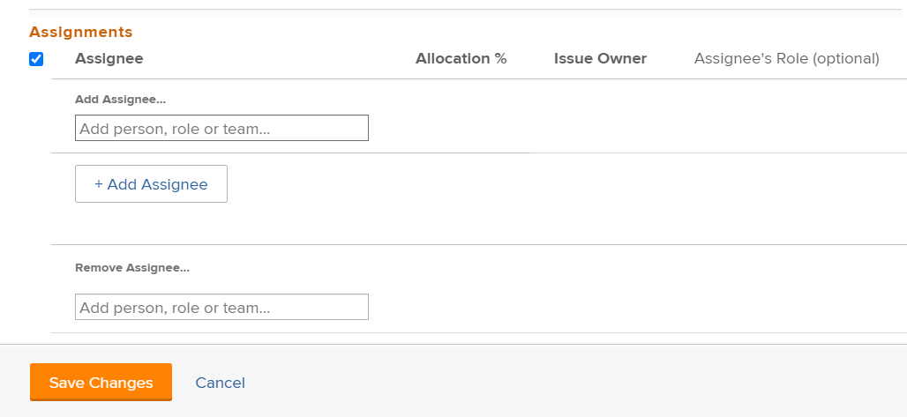

# Modificar asignaciones de usuarios para varios problemas en una lista

<!--Audited: 07/2024-->
<!--

(NOTE: similar article exists for tasks)

-->

Puede modificar simultáneamente las asignaciones de usuarios a varios problemas. Para obtener información sobre cómo editar problemas o asignarlos de uno en uno, consulte los siguientes artículos:

* [Editar problemas](../../../manage-work/issues/manage-issues/edit-issues.md)
* [Asignar problemas](../../../manage-work/issues/manage-issues/assign-issues.md)

Para obtener información general sobre la asignación de problemas, consulte [Información general sobre la modificación de asignaciones de problemas](../../../manage-work/issues/manage-issues/modify-issue-assignments-overview.md).

>[!NOTE]
>
>Debe tener al menos permisos de aportación para resolver un problema y poder realizar asignaciones al mismo.

## Requisitos de acceso

+++ Expanda para ver los requisitos de acceso para la funcionalidad en este artículo. 

<table style="table-layout:auto"> 
 <col> 
 <col> 
 <tbody> 
  <tr> 
   <td>paquete de Adobe Workfront</td> 
   <td> 
Cualquiera
 </td> 
  </tr> 
  <tr> 
   <td>Licencia de Adobe Workfront</td> 
   <td> 
Estándar

   
Solicitud o superior
 </td> 
  </tr> 
  <tr> 
   <td>Configuraciones de nivel de acceso</td> 
   <td> 
Editar acceso a Problemas
 
Acceso de visualización o superior a proyectos y tareas para asignar un problema
 </td> 
  </tr> 
  <tr> 
   <td>Permisos de objeto</td> 
   <td> 
Permisos de administración para el problema
 
Permisos de contribución o superiores para el proyecto o la tarea donde se encuentra el problema, al asignar varios problemas.
  </td> 
  </tr> 
 </tbody> 
</table>

Para obtener más información, consulte [Requisitos de acceso en la documentación de Workfront](/help/quicksilver/administration-and-setup/add-users/access-levels-and-object-permissions/access-level-requirements-in-documentation.md).

+++

<!--

<h2>When to modify user assignments on issues</h2>

(NOTE:  drafted and moved to the overview article: Modify issue assignments overview)

You might want to modify the user assignments for multiple issues for a variety of  reasons, including the following:

<ul>
<li>Users join or leave  your team</li>
<li>A user takes a vacation that extends beyond the issue  due dates</li>
<li>A specific role or user is set as the assignee for multiple issues and you want to quickly modify all items to be assigned to a different user or role</li>
</ul>

-->

## Modificar asignaciones para varios problemas

1. Vaya a la lista de problemas que contiene los problemas cuyas asignaciones desea modificar.
1. (Opcional) Cree un filtro para mostrar solo los problemas asignados al usuario asignado que desee modificar.

   Por ejemplo, puede crear un filtro para mostrar solo los problemas con una función específica como usuario asignado.  A continuación, puede reemplazar la función por un usuario específico. Haga lo siguiente:

   1. Haga clic en la lista desplegable **Filtros** y luego haga clic en **Nuevo filtro**.

   1. En el primer campo, empiece a escribir **Roles de asignación** y elija **Roles de asignación: Nombre** en la lista.
   1. Seleccione **Es cualquiera de** en el menú desplegable de modificadores y, a continuación, empiece a escribir el nombre de un rol y selecciónelo cuando se muestre en la lista. Puede escribir varias funciones.

      >[!TIP]
      >
      >No use **Asignado a** porque este campo hace referencia solamente al Propietario del problema y no a todas las personas asignadas.

      La lista de problemas filtra automáticamente los criterios de filtro.
   1. (Opcional) Haga clic en **Guardar como nuevo** y después en **Guardar**.

1. Seleccione los problemas para los que desea modificar las asignaciones y, a continuación, haga clic en el icono **Editar** .

   Se muestra la opción **Editar problemas**. El número de elementos seleccionados se muestra en la esquina superior izquierda de la página.

1. (Condicional) En el entorno Producción, haga lo siguiente:

   1. Vaya a la sección **Asignaciones** y, a continuación, seleccione **Usuario asignado**.

      

   1. Realice una de las siguientes acciones:

      1. Para añadir un nuevo usuario asignado:

         1. Empiece a escribir el nombre de un usuario, función o equipo y, a continuación, selecciónelo cuando aparezca en la lista. La asignación se añade y no sustituye a las asignaciones actuales en los problemas seleccionados.

         >[!TIP]
         >
         >Puede asignar varios usuarios, funciones o equipos. Solo puede asignar usuarios, funciones y equipos activos.
         >
         >Si se asignó un usuario, una función o un equipo antes de desactivarlos, permanecen asignados al elemento de trabajo. En este caso, se recomienda lo siguiente:
         >
         >* Reasignar el elemento de trabajo a los recursos activos.
         >* Asocie los usuarios de un equipo desactivado a un equipo activo y reasigne el elemento de trabajo al equipo activo.

         Se muestra la información común a todos los problemas seleccionados. Por ejemplo, si se asigna el mismo usuario a todos los problemas, ese usuario se muestra en la columna **Usuario asignado**. Si la información no es común a los problemas seleccionados, no se muestra ninguna información.

      1. Para quitar usuarios asignados individuales:

         1. Haga clic en el **icono X** junto al nombre del usuario asignado que desee eliminar si este aparece en la lista Asignaciones.

            O

            Si el usuario asignado que desea eliminar no aparece en la sección Asignaciones porque el usuario asignado solo está asignado a algunos de los problemas que ha seleccionado, haga clic en **Quitar usuario asignado** y empiece a escribir el nombre del usuario asignado que desea eliminar; a continuación, haga clic en el nombre cuando aparezca en la lista desplegable.

         1. Vuelva a hacer clic en **Quitar usuario asignado** para agregar otro usuario asignado que eliminar.

      1. Para quitar todos los usuarios asignados existentes:

         1. Haga clic en **Quitar todos los usuarios asignados existentes** y, a continuación, en **Sí, eliminar todos los usuarios asignados**.

            Esto elimina no solo los usuarios asignados comunes (los usuarios asignados que se muestran en el cuadro de diálogo de edición), sino también todos los usuarios asignados de todos los problemas seleccionados.

         1. (Opcional) Modifique cualquiera de las siguientes opciones para los usuarios asignados que ha seleccionado para asociar a los problemas:

            * **Propietario del problema:** Seleccione el botón de opción para indicar qué usuario asignado está designado como Propietario del problema. Si se deja sin seleccionar, Adobe Workfront designa como propietario de problemas al primer usuario asignado. Esto no está disponible para asignaciones de equipo.
            * **Función de usuario asignado**: seleccione una función de la lista desplegable. Si se deja sin seleccionar, Workfront selecciona automáticamente la función principal del usuario.

      1. Haga clic en **Guardar cambios**.

1. En el entorno de vista previa, haga lo siguiente:

   1. Haga clic en **Asignaciones** en el panel izquierdo y, a continuación, haga clic en el icono **x** junto al usuario asignado que desee eliminar. 

      >[!TIP]
      >
      >Solo se muestran las personas asignadas a todos los problemas seleccionados en el área de **Asignaciones**. 

      

   1. Empiece a escribir el nombre de un usuario, rol o equipo para agregar usuarios asignados a todos los problemas seleccionados. 

      >[!TIP]
      >
      >Puede asignar varios usuarios, funciones o equipos. Solo puede asignar usuarios, funciones y equipos activos.
      >
      >Si se asignó un usuario, una función o un equipo antes de desactivarlos, permanecen asignados al elemento de trabajo. En este caso, se recomienda lo siguiente:
      >
      >* Reasignar el elemento de trabajo a los recursos activos.
      >* Asocie los usuarios de un equipo desactivado a un equipo activo y reasigne el elemento de trabajo al equipo activo.

      Los usuarios asignados agregados se agregan a los existentes. No reemplazan a los existentes para cada problema seleccionado. 
   1. (Opcional) Haga clic en **Asignármelo** para asignarse todos los problemas.
   1. Haga clic en **Guardar**. 

