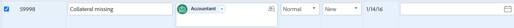

# Editar problemas en una lista

Puede editar un problema individual o editar problemas en una lista de problemas o en un informe. Este artículo describe cómo editar problemas en listas.

Para obtener información sobre cómo editar un problema concreto, consulte [Editar problemas](../../../manage-work/issues/manage-issues/edit-issues.md).

## Requisitos de acceso

Debe tener el siguiente acceso para realizar las acciones de este artículo:

<table style="table-layout:auto"> 
 <col> 
 <col> 
 <tbody> 
  <tr> 
   <td role="rowheader">plan de Adobe Workfront*</td> 
   <td> 
Cualquiera
 </td> 
  </tr> 
  <tr> 
   <td role="rowheader">Licencia de Adobe Workfront*</td> 
   <td> 
Solicitud o superior
 
Revise o obtenga una licencia superior para editar problemas en la sección Problemas de un proyecto.
 </td> 
  </tr> 
  <tr> 
   <td role="rowheader">Configuraciones de nivel de acceso*</td> 
   <td> 
Editar acceso a Problemas
 
Si todavía no tiene acceso, pregunte a su administrador de Workfront si establece restricciones adicionales en su nivel de acceso. Para obtener información sobre cómo un administrador de Workfront puede modificar su nivel de acceso, consulte <a href="../../../administration-and-setup/add-users/configure-and-grant-access/create-modify-access-levels.md" class="MCXref xref">Crear o modificar niveles de acceso personalizados</a>.
 </td> 
  </tr> 
  <tr> 
   <td role="rowheader">Permisos de objeto</td> 
   <td> 
Contribute o permisos superiores para el problema
 
 Para obtener información sobre la concesión de permisos a problemas, consulte <a href="../../../workfront-basics/grant-and-request-access-to-objects/share-an-issue.md" class="MCXref xref">Compartir un problema </a>
 
Para obtener información sobre la solicitud de permisos adicionales, consulte <a href="../../../workfront-basics/grant-and-request-access-to-objects/request-access.md" class="MCXref xref">Solicitar acceso a objetos </a>.
 </td> 
  </tr> 
 </tbody> 
</table>

&#42;Para saber qué plan, tipo de licencia o acceso tiene, póngase en contacto con el administrador de Workfront.

## Problemas de edición en línea

Puede editar la información del problema en una lista de problemas editando los campos en línea que se muestran en la vista de la lista.

Tenga en cuenta lo siguiente al editar problemas en una lista:

* Puede editar cualquier campo de problema que aparezca en la lista y que tenga permisos para actualizar.
* Puede editar un problema en las listas siguientes:

   * La sección Problemas de un proyecto o de una tarea
   * Informe de problemas

Para editar un problema en línea:

1. Vaya a la lista de problemas de un proyecto o una tarea.
1. Haga clic dentro de cualquier campo para el que tenga permisos de actualización manual. El campo se puede editar y puede realizar cambios.

   

1. Pulse Intro cuando desee aceptar los cambios. Los cambios se guardan inmediatamente.

   Para obtener información sobre la edición de objetos en línea, consulte [Editar elementos en línea en una lista en Adobe Workfront](../../../workfront-basics/navigate-workfront/use-lists/inline-edit-objects.md).

## Editar problemas en una lista

1. Vaya a la lista de problemas de un proyecto o una tarea.
1. Realice una de las siguientes acciones

   * Seleccione el problema en la lista y haga clic en el icono Editar  en la barra de herramientas.
   * Haga clic en el **Más menú**  a la derecha del nombre del problema y haga clic en **Abrir en una pestaña nueva**. Esto abre la página de problemas en una nueva pestaña. Haga clic en **Más** > **Editar** de la página de problemas.
   * Haga clic en el **Más menú**  a la derecha del nombre del problema y haga clic en **Editar**.

      Cualquiera de estas acciones abre el cuadro Editar problema .

      Para obtener información sobre problemas de edición en el cuadro Editar problema, consulte [Editar problemas](../../../manage-work/issues/manage-issues/edit-issues.md).

## Editar problemas mediante el Resumen

Puede editar un problema en una lista mediante el Resumen.

1. Vaya al proyecto cuyos problemas desee editar.
1. Haga clic en **Problemas** en el panel izquierdo.

   Se muestra la lista de problemas del proyecto.

1. Seleccione un problema que desee editar y luego haga clic en el botón **Abrir resumen** icono  en la esquina superior derecha de la lista de problemas.

   La variable **Resumen** se abre.

1. (Opcional) Empiece a escribir una actualización para el problema en la **Actualizaciones** .
1. Haga clic en cualquiera de los siguientes iconos o áreas para ir al problema y editar la información a nivel del problema:

   | Documentos | Haga clic en **Haga clic aquí para agregar** para agregar documentos al problema. |
   |---|---|
   | Detalles | Haga clic en para actualizar la información sobre el problema. |
   | Horas | Haga clic en para registrar las horas. |
   | Rutas de aprobación | Haga clic en para añadir aprobaciones de problemas. |

1. (Opcional) Haga clic en el **Abrir resumen** de nuevo, o **Icono X** en la parte superior derecha del resumen para cerrar el panel y editar el problema en línea.

## Editar problemas de forma masiva

Puede editar problemas de forma masiva y actualizar toda su información al mismo tiempo.

Para editar problemas de forma masiva:

1. Vaya a la **Menú principal**.
1. Haga clic en **Proyectos**.
1. Haga clic en un nombre de proyecto para acceder al proyecto.
1. Haga clic en **Problemas** en el panel izquierdo.
1. Seleccione varios problemas en la lista.
1. Haga clic en el **Editar** icono .

   La variable **Editar problemas** se abre.

1. Especifique la información sobre todos los problemas seleccionados.

   Editar la información sobre todos los problemas es idéntico a editar información sobre un problema al editar las siguientes áreas:

   * Información general
   * Configuración
   * Asignaciones
   * Comentario

   Para obtener más información sobre cómo editar un problema, consulte [Editar problemas](../../../manage-work/issues/manage-issues/edit-issues.md).

   >[!NOTE]
   >
   >La información que está cambiando sobre todos los problemas seleccionados anulará la información existente sobre problemas individuales, excepto para el **Asignaciones** campo . Al agregar un nuevo usuario asignado en edición masiva, se agregará ese usuario asignado a todos los problemas seleccionados. Si se asignan otros usuarios asignados a los problemas seleccionados, se seguirán asignando además del añadido mediante la edición masiva.

1. Haga clic en **Forms personalizado** para editar los formularios personalizados adjuntos a todos los problemas seleccionados.

   Si los problemas seleccionados no tienen formularios personalizados comunes, no se muestra ningún formulario en esta sección.

   Solo se pueden editar los campos de los formularios adjuntos a todos los problemas seleccionados y que tiene permisos para editar.

1. (Opcional) En la **Forms personalizado** seleccione el **Volver a calcular expresiones personalizadas** para asegurarse de que todos los campos personalizados calculados que se encuentran en la Forms personalizada y que están adjuntos a los problemas seleccionados estén actualizados.

   >[!IMPORTANT]
   >
   >Se recomienda no seleccionar más de 500 problemas al mismo tiempo que se vuelven a calcular las expresiones personalizadas.

1. Haga clic en **Guardar cambios**.

   Todos los cambios que ha realizado ahora están visibles en todos los problemas seleccionados.
