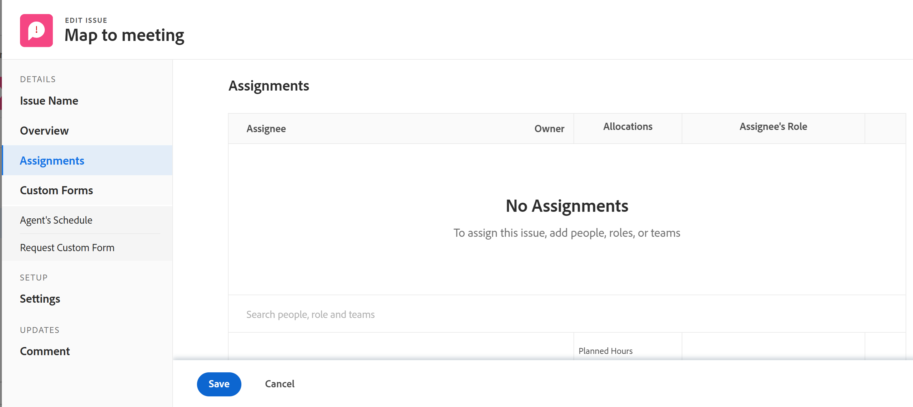

# Editar problemas

Puede editar información sobre problemas que haya creado o que otros usuarios hayan creado si compartieron los problemas con usted.

Puede editar un solo problema o editar problemas en una lista. Para obtener información sobre la edición de problemas en una lista, consulte [Editar problemas en una lista](../../../manage-work/issues/manage-issues/edit-issues-in-a-list.md).

## Requisitos de acceso

Debe tener el siguiente acceso para realizar los pasos de este artículo:

<table style="table-layout:auto"> 
 <col> 
 <col> 
 <tbody> 
  <tr> 
   <td role="rowheader">plan de Adobe Workfront*</td> 
   <td> 
Cualquiera 
 </td> 
  </tr> 
  <tr> 
   <td role="rowheader">Licencia de Adobe Workfront*</td> 
   <td> 
Solicitud o superior
 
Revisar o conceder una licencia superior para editar problemas en la sección Problemas de una tarea o un proyecto
 </td> 
  </tr> 
  <tr> 
   <td role="rowheader">Nivel de acceso*</td> 
   <td> 
Editar acceso a Problemas
 
<b>NOTA</b>

Si todavía no tiene acceso, pregunte a su administrador de Workfront si establece restricciones adicionales en su nivel de acceso. Para obtener información sobre el acceso a los problemas en el nivel de acceso, consulte <a href="../../../administration-and-setup/add-users/configure-and-grant-access/grant-access-issues.md" class="MCXref xref">Concesión de acceso a problemas</a>. Para obtener información sobre cómo un administrador de Workfront puede cambiar su nivel de acceso, consulte <a href="../../../administration-and-setup/add-users/configure-and-grant-access/create-modify-access-levels.md" class="MCXref xref">Crear o modificar niveles de acceso personalizados</a>. 
 </td>
</tr> 
  <tr> 
   <td role="rowheader">Permisos de objeto</td> 
   <td> 
Contribuya con permisos para un problema para editarlo en el área Detalles del problema 
 
Administrar permisos para un problema para editarlo en el cuadro Editar problema
 
 Para obtener información sobre la concesión de permisos a problemas, consulte <a href="../../../workfront-basics/grant-and-request-access-to-objects/share-an-issue.md" class="MCXref xref">Compartir un problema </a>
 
Para obtener información sobre la solicitud de permisos adicionales, consulte <a href="../../../workfront-basics/grant-and-request-access-to-objects/request-access.md" class="MCXref xref">Solicitar acceso a objetos </a>.
 </td> 
  </tr> 
 </tbody> 
</table>

&#42;Para saber qué plan, tipo de licencia o acceso tiene, póngase en contacto con el administrador de Workfront.

## Limitaciones al editar problemas

Existen algunas limitaciones que pueden impedir que edite problemas.

* Los problemas que se encuentran en un proceso de aprobación no se pueden editar. Solo puede registrar la hora o actualizar el estado en un problema que esté en Pendiente de aprobación.
* Puede editar y agregar documentos a problemas en un proyecto que tenga el estado Finalizado, Finalizado o Pendiente de aprobación solo cuando el administrador de Workfront o un administrador de grupo habilitaron esta funcionalidad en el área Preferencias del proyecto. Para obtener información sobre cómo definir las preferencias del proyecto, consulte [Configurar las preferencias de proyecto de todo el sistema](../../../administration-and-setup/set-up-workfront/configure-system-defaults/set-project-preferences.md).

## Editar un solo problema

Puede editar un problema utilizando las áreas Editar problema o Detalles del problema . Los siguientes pasos describen la edición de un problema en el cuadro Editar problema .

1. Vaya a la **Menú principal**.
1. Haga clic en **Proyectos** y, a continuación, haga clic en el nombre de un proyecto para abrirlo.
1. (Opcional) Haga clic en **Tareas** y, a continuación, haga clic en el nombre de una tarea para abrirla.
1. Haga clic en **Problemas** en el panel izquierdo.

   

1. (Opcional) Para editar información limitada sobre un problema, haga clic en **Detalles del problema** en el panel izquierdo.

   

   >[!NOTE]
   >
   >Según la forma en que el administrador de Workfront o el administrador de grupo hayan modificado la plantilla de diseño, los campos del área Detalles del problema podrían reorganizarse o no mostrarse. Para obtener más información, consulte [Personalización de la vista Detalles mediante una plantilla de diseño](../../../administration-and-setup/customize-workfront/use-layout-templates/customize-details-view-layout-template.md).

   Para editar la información de la sección Detalles , haga lo siguiente:

   1. (Opcional) Haga clic en el **Contraer todo** en la esquina superior derecha para contraer todas las áreas.
   1. (Opcional y condicional) Cuando un área esté contraída, haga clic en el botón **flecha hacia la derecha**  junto a cada área para expandir el área que desea editar.
   1. (Opcional) Para adjuntar un formulario personalizado, empiece a escribir el nombre de un formulario en el **Agregar formulario personalizado** , selecciónelo cuando aparezca en la lista y haga clic en **Guardar cambios**.
   1. (Opcional) Haga clic en el **Exportar** icono  para exportar la información general y de formularios personalizados a un archivo PDF, haga clic en **Exportar**. Seleccione una de las siguientes opciones:

      * Seleccionar todo (solo se muestra cuando hay al menos un formulario personalizado adjunto)
      * Información general
      * El nombre de uno o varios formularios personalizados

      El archivo del PDF se descarga a su equipo.

      

      Para obtener más información, consulte [Exportar formularios personalizados y detalles de objetos](../../../workfront-basics/work-with-custom-forms/export-custom-forms-details.md).
   Para obtener información sobre los campos visibles en la sección Detalles del problema , continúe editando el problema en el cuadro Editar problema como se describe a continuación.

1. Para editar toda la información sobre un problema, seleccione un problema en una lista y haga clic en **Editar** en la parte superior de la lista

   O

   Haga clic en el nombre de un problema de una lista y, a continuación, haga clic en el **Más** al lado del nombre del problema y, a continuación, **Editar.**

   La variable **Editar problema** se abre.

   >[!IMPORTANT]
   >
   >Debe tener permisos de administración para ver el vínculo Editar .

   Todos los campos de problema están disponibles en el cuadro Editar problema y se agrupan por las áreas que aparecen en el panel izquierdo.

1. Considere la posibilidad de especificar información en cualquiera de las secciones siguientes:

   * [Nombre de problema](#issue-name)
   * [Información general](#overview)
   * [Asignaciones](#assignments)
   * [Formularios personalizados](#Custom%C2%A0F)
   * [Configuración](#settings)

   >[!NOTE]
   >
   >Según la configuración de la plantilla de diseño que configure el administrador de Workfront, los campos del cuadro Editar problema pueden ser diferentes en el entorno. Para obtener más información, consulte [Personalización de la vista Detalles mediante una plantilla de diseño](../../../administration-and-setup/customize-workfront/use-layout-templates/customize-details-view-layout-template.md).

### Nombre de problema {#issue-name}

1. Comience a editar un problema como se describe anteriormente.
1. Haga clic en **Nombre del problema**.

   

1. Actualice el **Nombre del problema** campo .
1. Haga clic en **Guardar** o continúe editando las secciones siguientes.

### Información general {#overview}

1. Comience a editar un problema como se describe anteriormente.
1. Haga clic en **Información general**.

   

1. Actualice o revise cualquiera de los campos de la siguiente tabla:

   <table style="table-layout:auto"> 
    <col> 
    <col> 
    <tbody> 
     <tr> 
      <td role="rowheader">Descripción</td> 
      <td> 
Agregue información adicional sobre el problema.
 </td> 
     </tr> 
     <tr> 
      <td colspan="2" role="rowheader">Sección de información básica</td> 
     </tr> 
     <tr> 
      <td role="rowheader">Estado</td> 
      <td> 
Seleccione el estado del problema. Para obtener más información sobre los estados de problemas, consulte <a href="../../../administration-and-setup/customize-workfront/creating-custom-status-and-priority-labels/issue-statuses.md" class="MCXref xref">Acceda a la lista de estados de problemas del sistema</a>. 
 </td> 
     </tr> 
     <tr> 
      <td role="rowheader">Prioridad</td> 
      <td> 
Se trata de un indicador visual que le permite priorizar los problemas.
 
Seleccione entre las siguientes opciones:
 
       <ul> 
        <li> 
<strong>Ninguno</strong> 
 </li> 
        <li> 
<strong>Bajo</strong> 
 </li> 
        <li> 
<strong>Normal</strong> 
 </li> 
        <li> 
<strong>Alto</strong> 
 </li> 
        <li> 
<strong>Urgente</strong> 
 </li> 
       </ul> 
Según las preferencias de proyecto seleccionadas por el administrador de Workfront, los nombres de las prioridades pueden ser diferentes para usted. Para obtener más información sobre las prioridades de edición, consulte <a href="../../../administration-and-setup/customize-workfront/creating-custom-status-and-priority-labels/create-customize-priorities.md" class="MCXref xref">Crear y personalizar prioridades</a>.
 </td> 
     </tr> 
     <tr> 
      <td role="rowheader">Gravedad</td> 
      <td> 
Este es un indicador visual que indica la gravedad del problema descrito en el problema. Las gravedad son específicas de los problemas. Seleccione entre las siguientes opciones:
 
       <ul> 
        <li> 
Cosmético
 </li> 
        <li> 
Causa confusión
 </li> 
        <li> 
Error con solución
 </li> 
        <li> 
Error sin solución
 </li> 
        <li> 
Error fatal
 </li> 
       </ul> 
Según las Preferencias de proyecto seleccionadas por el administrador de Workfront, los nombres de gravedad pueden ser diferentes para usted. Para obtener más información sobre la edición de gravámenes, consulte <a href="../../../administration-and-setup/customize-workfront/creating-custom-status-and-priority-labels/create-customize-issue-severities.md" class="MCXref xref">Crear o personalizar grupos de problemas</a>.
 </td> 
     </tr> 
     <tr> 
      <td role="rowheader">Dirección URL</td> 
      <td> 
Escriba un vínculo web relacionado con la información sobre el problema.
 </td> 
     </tr> 
     <tr> 
      <td role="rowheader">Tipo</td> 
      <td> 
Según las Propiedades de cola seleccionadas por el administrador de proyectos en el área Detalles de cola del proyecto, es posible que pueda especificar el tipo de problema. Seleccione entre las siguientes opciones en la sección <b>Tipo</b> menú desplegable: 
 
       <ul> 
        <li> 
<strong>Informe de errores</strong> 
 </li> 
        <li> 
<strong>Solicitud de cambio</strong> 
 </li> 
        <li> 
<strong>Problema</strong> 
 </li> 
        <li> 
<strong>Solicitud</strong> 
 </li> 
       </ul> 
Según las Preferencias de proyecto seleccionadas por el administrador de Workfront, los nombres de los tipos de problemas pueden ser diferentes para usted.
 </td> 
     </tr> 
     <tr> 
      <td role="rowheader">Contacto primario</td> 
      <td>De forma predeterminada, el contacto principal es el creador del problema. Para modificarlo, empiece a escribir el nombre de cualquier usuario activo en Workfront y, a continuación, selecciónelo en la lista. Un problema solo puede tener un contacto principal.  Si cambia el contacto principal, el contacto principal original seguirá teniendo acceso de administrador al problema. Debe eliminar manualmente este acceso del cuadro Acceso a problemas al compartir un problema.

   <b>SUGERENCIA</b>

   Al agregar un usuario de Contacto principal, observe el avatar, la función principal del usuario y su dirección de correo electrónico para distinguir entre usuarios con nombres idénticos. Los usuarios deben estar asociados con al menos una función de trabajo para verla a medida que los agrega.

   </td> 
     </tr> 
     <tr> 
      <td role="rowheader">Fecha y hora de confirmación</td> 
      <td> 
Esta es la fecha en que el cesionario de la emisión estima que la emisión se completará. Solo las personas asignadas pueden editar este campo.
 </td> 
     </tr> 
     <tr> 
      <td role="rowheader">Fecha de inicio planeada</td> 
      <td>De forma predeterminada, la Fecha de inicio planeada es la fecha y la hora en que se creó el problema. Puede actualizar el <strong>Fecha de inicio planeada</strong> de la cuestión. </td> 
     </tr> 
     <tr> 
      <td role="rowheader">Fecha y hora de finalización planificadas</td> 
      <td> De forma predeterminada, la fecha de finalización planeada es de 24 horas a partir de la fecha de inicio planificada predeterminada. De forma predeterminada, los problemas tienen una duración de 1 día. Puede actualizar el <strong>Fecha de finalización planeada</strong> de la cuestión.</td> 
     </tr> 
     <tr> 
      <td role="rowheader">Fecha y hora de inicio reales</td> 
      <td>La fecha de inicio real se rellena automáticamente al cambiar el estado del problema a <strong>En curso</strong>. Puede actualizar el <strong>Fecha de inicio real</strong> de la cuestión. Si es necesario, puede actualizar manualmente la fecha. </td> 
     </tr> 
     <tr> 
      <td role="rowheader">Fecha y hora de finalización real</td> 
      <td>La fecha de finalización real se rellena automáticamente al cambiar el estado del problema a <strong>Cerrado</strong> o<strong>Resuelto</strong>. Puede actualizar el <strong>Fecha de finalización real</strong> para el problema. Si es necesario, puede actualizar manualmente la fecha.</td> 
     </tr> 
     <tr> 
      <td role="rowheader">Resuelto por</td> 
      <td> 
Esto muestra si el problema se ha resuelto con otro objeto. Puede seleccionar si este problema se resuelve mediante una tarea, un proyecto u otro problema en el menú desplegable y, a continuación, empezar a escribir el nombre de la tarea, el proyecto o el problema que resuelva el problema. Selecciónela cuando aparezca en la lista.

   <b>NOTA</b>

   Cuando se selecciona un objeto para resolver un problema, el estado del problema se vincula al estado del objeto resuelto y no se puede cambiar en el problema. Para obtener más información sobre la resolución de objetos, consulte <a href="../../../manage-work/issues/convert-issues/resolving-and-resolvable-objects.md" class="MCXref xref">Información general sobre la resolución y resolución de objetos </a>.

   <b>SUGERENCIA</b>

   Cuando el administrador del sistema o del grupo agrega el campo &quot;Resuelto por&quot; a un problema en el encabezado personalizado, el campo cambia a &quot;Resolver problema&quot;, &quot;Resolver tarea&quot; o &quot;Resolver proyecto&quot; cuando hay un objeto de resolución asociado al problema.

   No puede editar este campo cuando se muestra en el encabezado del problema. Para obtener más información sobre la personalización de encabezados de problemas, consulte <a href="../../../administration-and-setup/customize-workfront/use-layout-templates/customize-object-headers.md">Personalización de encabezados de objeto mediante una plantilla de diseño </a>
   </td> 
     </tr>

   <tr> 
      <td role="rowheader">Resolución de problemas, resolución de tareas o resolución de proyectos</td> 
      <td>Nombre vinculado del problema, tarea o problema que resuelve el problema.  </td> 
     </tr> 
      <tr> 
      <td role="rowheader">Esto resuelve</td> 
      <td>El nombre vinculado del problema que se completa cuando se resuelve el problema al que accede.  </td> 
     </tr>

   </tbody> 
   </table>

1. Haga clic en **Guardar** o continúe editando las secciones siguientes.

#### Asignaciones {#assignments}

1. Comience a editar el problema como se describe más arriba.
1. Haga clic en **Asignaciones** en el panel izquierdo.

   

1. Haga clic en **Buscar personas, roles y equipos** y empiece a escribir el nombre de un usuario, función o equipo que desee asignar a la tarea. A continuación, haga clic en él o pulse Intro cuando aparezca en la lista.

   <!--
   
(NOTE: ensure this is still called this; asked Anna to change it to "roles" and add a comma)

   -->

   >[!NOTE]
   >
   >Si el nombre del usuario contiene un carácter especial, debe incluir el carácter especial en el campo de búsqueda.

   >[!TIP]
   >
   >Puede asignar varios usuarios, funciones de trabajo o equipos. Solo puede asignar usuarios activos, funciones de trabajo y equipos.
   >
   >
   >Si se asignó a un usuario, función de trabajo o equipo antes de desactivarlos, se le seguirá asignando el elemento de trabajo. En este caso, se recomienda lo siguiente:
   >
   >* Reasigne el elemento de trabajo a los recursos activos.
   >* Asocie a los usuarios de un equipo desactivado con un equipo activo y reasigne el elemento de trabajo al equipo activo.

1. (Opcional) Indique si un cesionario es el cesionario principal en la cuestión, pasando el puntero sobre el nombre del cesionario y haciendo clic en **Convertir en principal**. Un equipo no puede ser el principal responsable de asignación de un problema.
1. Actualice los campos siguientes:

   <table style="table-layout:auto"> 
    <col> 
    </col> 
    <col> 
    </col> 
    <tbody> 
     <tr> 
      <td role="rowheader">Horas planificadas</td> 
      <td> 
Este es el tiempo real que tardarían los cesionarios en completarlo. Escriba el número de horas planificadas para el problema. 
 
Nota: Cambiar las horas planificadas del problema no cambiará el problema Fecha de finalización planificada. 
 </td> 
     </tr> 
     <tr data-mc-conditions=""> 
      <td role="rowheader">Rol de asignado</td> 
      <td> 
Seleccione una función de la <strong>Función del usuario asignado</strong> menú desplegable cuando seleccionó a una persona como usuario asignado. Esta es la función que el usuario asignado puede desempeñar en esta cuestión. 
 
<b>SUGERENCIA</b>

   En el menú desplegable solo aparecen las funciones de trabajo asociadas a cada usuario asignado de su perfil.
 </td>
   </tr> 
    </tbody> 
   </table>

1. Haga clic en **Guardar** o continúe editando las secciones siguientes.

### Forms personalizado

1. Comience a editar un problema como se describe anteriormente.
1. Haga clic en **Forms personalizado**.

   

1. En el **Agregar formulario personalizado** , seleccione el formulario personalizado o los formularios que desee asociar al problema. Debe crear los formularios personalizados antes de que estén disponibles para seleccionarlos en este campo. En la lista solo aparecen los formularios personalizados activos. Para obtener más información sobre la creación de formularios personalizados, consulte [Crear o editar un formulario personalizado](../../../administration-and-setup/customize-workfront/create-manage-custom-forms/create-or-edit-a-custom-form.md). Se pueden agregar hasta diez formularios personalizados a un problema.

1. (Condicional) Si adjuntó un formulario personalizado al problema, edite los campos del formulario. Debe especificar todos los campos obligatorios para poder guardar el problema.

   >[!NOTE]
   >
   >Según la forma en que el administrador de Workfront establezca los permisos para las secciones del formulario personalizado, no todos pueden ver o editar los mismos campos en un formulario personalizado determinado. Los permisos para editar campos dentro de una sección de un formulario personalizado dependen de los permisos que tenga sobre el problema en sí. Para obtener información sobre la configuración de permisos en secciones de un formulario personalizado, consulte [Crear o editar un formulario personalizado](../../../administration-and-setup/customize-workfront/create-manage-custom-forms/create-or-edit-a-custom-form.md). Para obtener información sobre la configuración de permisos de problemas, consulte [Compartir un problema](../../../workfront-basics/grant-and-request-access-to-objects/share-an-issue.md).

1. Haga clic en **Guardar** o continúe editando la siguiente sección.

### Configuración {#settings}

1. Comience a editar un problema como se describe anteriormente.
1. Haga clic en **Configuración**.

   

   Actualice la siguiente información:

   <table style="table-layout:auto"> 
    <col> 
    </col> 
    <col> 
    </col> 
    <tbody> 
     <tr> 
      <td role="rowheader">Proceso de aprobación</td> 
      <td> 
       
 
       
Seleccione un proceso de aprobación que desee asociar al problema. El administrador de Workfront debe definir los procesos de aprobación a nivel de sistema para poder asociarlos a los problemas. Usuarios con acceso administrativo a procesos de aprobación  también puede crear procesos de aprobación específicos del grupo.Para obtener más información sobre la creación de procesos de aprobación, consulte <a href="../../../administration-and-setup/customize-workfront/configure-approval-milestone-processes/create-approval-processes.md" class="MCXref xref">Creación de un proceso de aprobación para elementos de trabajo</a>. 
 
       
Tenga en cuenta lo siguiente al agregar procesos de aprobación: 
 
       <ul> 
       <li>En la lista solo se muestran los procesos de aprobación activos. </li> 
       <li> 
En la lista se muestran los procesos de aprobación de todo el sistema y de grupos específicos. Un proceso de aprobación asociado a un grupo que no sea el del proyecto no se muestra en la lista.
 
Importante: Si el grupo del proyecto cambia, el proceso de aprobación específico del grupo se convierte en un proceso de aprobación de un solo uso. Para obtener más información sobre cómo los cambios en el grupo del proyecto o en el proceso de aprobación afectan a la configuración de aprobación, consulte <a href="../../../administration-and-setup/customize-workfront/configure-approval-milestone-processes/how-changes-affect-group-approvals.md" class="MCXref xref">Efecto de los cambios en el grupo y el proceso de aprobación en los procesos de aprobación asignados</a>. 
 </li> 
       <li> 
Puede definir los procesos de aprobación predeterminados para que se adjunten automáticamente a los problemas al crear colas de solicitud o temas de cola. Para obtener información sobre cómo actualizar los detalles de la cola, consulte <a href="../../../manage-work/requests/create-and-manage-request-queues/create-request-queue.md" class="MCXref xref">Crear una cola de solicitud</a>. Para obtener información sobre la creación de temas de cola, consulte <a href="../../../manage-work/requests/create-and-manage-request-queues/create-queue-topics.md" class="MCXref xref">Crear temas de cola</a>. 
 </li> 
       <li>Cuando hay problemas de edición masiva, existen los siguientes escenarios: 
       <ul> 
       <li>
Cuando se seleccionan varios problemas del mismo grupo, en este campo se muestran tanto los procesos de aprobación de nivel de sistema como los específicos del grupo.
</li> 
       <li>
Cuando se seleccionan varios problemas de diferentes grupos, solo se muestran en este campo los procesos de aprobación a nivel de sistema.
</li> 
       <li>
Cuando alguno de los problemas tiene un proceso de aprobación de un solo uso adjunto, se reemplaza por el proceso de aprobación de nivel de sistema o de grupo que seleccione. 
</li> 
       </ul></li> 
       </ul> 
       
 </td> 
     </tr> 
     <tr> 
      <td role="rowheader">Notificaciones de recordatorio</td> 
      <td> 
Seleccione la casilla de verificación para la que desea adjuntar Notificaciones de recordatorio a este problema. Se muestran todas las notificaciones de recordatorio de problemas. El administrador de Workfront debe configurar las notificaciones de recordatorio para poder seleccionarlas en un problema. Para obtener más información sobre la configuración de las notificaciones de recordatorio, consulte <a href="../../../administration-and-setup/manage-workfront/emails/set-up-reminder-notifications.md" class="MCXref xref">Configuración de notificaciones de recordatorio</a>
 </td> 
     </tr> 
    </tbody> 
   </table>

1. Haga clic en **Guardar.**

## Editar un problema en el encabezado del problema (limitado)

Puede editar una cantidad limitada de información en el encabezado del problema.

El administrador del sistema o del grupo puede personalizar los campos que se ven en el encabezado del problema. Para obtener más información, consulte [Personalización de encabezados de objeto mediante una plantilla de diseño](../../../administration-and-setup/customize-workfront/use-layout-templates/customize-object-headers.md).

De forma predeterminada, los campos siguientes se incluyen en el encabezado del problema:

* Nombre del problema
* Porcentaje completado
* Asignaciones
* Fecha y hora de finalización planificadas
* Estado
* Tome decisiones de aprobación si está configurado como aprobador en un proceso de aprobación actual
