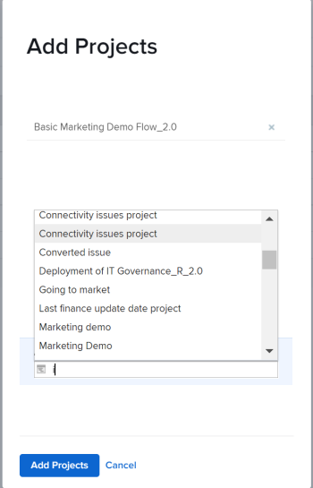

# Agregar proyectos a un portafolio

<!--Audited: 7/2024-->

Le recomendamos que agregue proyectos a portafolios cuando los inicie. Sin embargo, puede agregarlos a un portafolio en cualquier momento durante su vida útil.

Tenga en cuenta lo siguiente al agregar proyectos a portafolios:

* Aunque un portafolio puede contener un número ilimitado de proyectos, solo puede asociar un portafolio con un proyecto.
* Un proyecto permanece en un portafolio hasta que se elimina o se asocia con otro portafolio.

## Requisitos de acceso

+++ Expanda para ver los requisitos de acceso para la funcionalidad en este artículo.

<table style="table-layout:auto"> 
 <col> 
 <col> 
 <tbody> 
  <tr> 
   <td role="rowheader">[!DNL Adobe Workfront] plan*</td> 
   <td> 
Nuevo: Cualquiera

   
Actual:[!UICONTROL Empresa] o superior
</td> 
  </tr> 
  <tr> 
   <td role="rowheader">[!DNL Adobe Workfront] licencia*</td> 
   <td>
Nuevo: estándar
 
   
Actual:[!UICONTROL plan] 
 </td> 
  </tr> 
  <tr> 
   <td role="rowheader">Nivel de acceso</td> 
   <td> 
Portfolio de acceso de [!UICONTROL Edit]
 
Acceso de [!UICONTROL Edit] a proyectos
 </td> 
  </tr> 
  <tr> 
   <td role="rowheader">Permisos de objeto</td> 
   <td> 
Permisos de [!UICONTROL Manage] para el portafolio
 
Permisos de [!UICONTROL Manage] para los proyectos
  </td> 
  </tr> 
 </tbody> 
</table>

*Para obtener más información, consulte [Requisitos de acceso en la documentación de Workfront](/help/quicksilver/administration-and-setup/add-users/access-levels-and-object-permissions/access-level-requirements-in-documentation.md).

+++

## Agregar un proyecto a un portafolio

1. Vaya a un portafolio y, a continuación, haga clic en **[!UICONTROL Proyectos]** en el panel izquierdo.

   

1. Haga clic en **[!UICONTROL Nuevo proyecto]** y seleccione un método para agregar un proyecto.

   >[!TIP]
   >
   >No se puede agregar un proyecto al ver la lista de proyectos en la vista [!UICONTROL Hito].

   Seleccione entre las siguientes opciones:

   <table style="table-layout:auto"> 
    <col> 
    <col> 
    <tbody> 
     <tr> 
      <td role="rowheader">[!UICONTROL Proyecto existente]</td> 
      <td> 
Añada un proyecto que ya se haya creado.
 </td> 
     </tr> 
     <tr> 
      <td role="rowheader">[!UICONTROL Nuevo proyecto]</td> 
      <td> 
Añada un nuevo proyecto. 
 
Para obtener más información sobre cómo crear un nuevo proyecto, vea <a href="../../../manage-work/projects/create-projects/create-project.md" class="MCXref xref">Crear un proyecto</a>. 
 </td> 
     </tr> 
     <tr> 
      <td role="rowheader">[!UICONTROL Importar un proyecto desde [!DNL MS Project]] </td> 
      <td> 
Agregue un proyecto que previamente exportó de [!DNL MS Project] y que guardó en el equipo. 
 
Para obtener más información sobre cómo crear un nuevo proyecto importándolo desde [!DNL Microsoft Project], vea <a href="../../../manage-work/projects/create-projects/import-project-from-ms-project.md" class="MCXref xref">Importar un proyecto desde [!DNL Microsoft Project]</a>.
 </td> 
     </tr> 
     <tr> 
      <td role="rowheader">[!UICONTROL Solicitar proyecto]</td> 
      <td> 
Solicitar la aprobación de un proyecto.
 
Para obtener información sobre cómo solicitar proyectos, vea <a href="../../../manage-work/projects/create-projects/request-project.md">Solicitar un proyecto</a>. 
 </td> 
     </tr> 
     <tr> 
      <td role="rowheader">[!UICONTROL Nuevo a partir de plantilla]</td> 
      <td> 
Añada un nuevo proyecto con una plantilla existente. 
 
Para obtener más información sobre cómo crear un proyecto a partir de una plantilla, vea <a href="../../../manage-work/projects/create-projects/create-project-from-template.md" class="MCXref xref">Crear un proyecto mediante una plantilla</a>.
 </td> 
     </tr> 
    </tbody> 
   </table>

   

1. (Condicional) Si seleccionó agregar un proyecto existente, empiece a escribir el nombre de un proyecto en el cuadro **[!UICONTROL Agregar proyectos]** y, a continuación, haga clic en ellos cuando aparezcan en la lista. Puede agregar varios proyectos a la vez.

   

1. Haga clic en **[!UICONTROL Agregar proyectos]**.

   El proyecto o proyectos que seleccionó ahora están asociados al portafolio.
