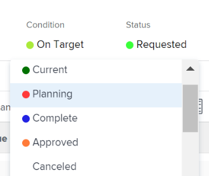

# Revisar proyectos solicitados

Cuando se presentan varias solicitudes de proyectos para su examen, la oficina de gestión de proyectos o el comité de cartera pueden reunirse para examinar las solicitudes presentadas y determinar las aprobaciones de las solicitudes de proyectos. Las solicitudes de proyecto se muestran como proyectos con un estado de [!UICONTROL Solicitado] en [!DNL Adobe Workfront].

Puede enviar una solicitud de revisión de proyecto realizando una de las siguientes acciones:

* Cambiar el estado del proyecto a **[!UICONTROL Solicitado]**.
* Complete el [!UICONTROL Caso empresarial] del proyecto y presentarlo para su aprobación.\
   Para obtener más información sobre cómo completar un caso práctico para un proyecto, consulte [Creación de un caso empresarial para un proyecto](../../../manage-work/projects/define-a-business-case/create-business-case.md).

Puede revisar los proyectos solicitados en las siguientes áreas de [!DNL Adobe Workfront]:

* En un informe de proyecto
* Dentro de un portafolio

## Requisitos de acceso

Debe tener el siguiente acceso para realizar los pasos de este artículo:

<table style="table-layout:auto"> 
 <col> 
 <col> 
 <tbody> 
  <tr> 
   <td role="rowheader">[!DNL Adobe Workfront] plan*</td> 
   <td> 
[!UICONTROL Business] o superior
 </td> 
  </tr> 
  <tr> 
   <td role="rowheader">[!DNL Adobe Workfront] licencia*</td> 
   <td> 
[!UICONTROL Plan] 
 </td> 
  </tr> 
  <tr> 
   <td role="rowheader">Configuraciones de nivel de acceso*</td> 
   <td> 
Acceso de [!UICONTROL View] o superior a Portfolio
 
Acceso de [!UICONTROL Edit] a Proyectos
 
Nota: Si todavía no tiene acceso, pregunte a su [!DNL Workfront] administrador si establecen restricciones adicionales en su nivel de acceso. Para obtener información sobre cómo se [!DNL Workfront] administrador puede cambiar el nivel de acceso, consulte <a href="../../../administration-and-setup/add-users/configure-and-grant-access/create-modify-access-levels.md" class="MCXref xref">Crear o modificar niveles de acceso personalizados</a>.
 </td> 
  </tr> 
  <tr> 
   <td role="rowheader">Permisos de objeto</td> 
   <td> 
Permisos de [!UICONTROL View] o superiores en el portafolio
 
Permisos de [!UICONTROL Administrar] en los proyectos para actualizar su estado
 
Para obtener información sobre la solicitud de acceso adicional, consulte <a href="../../../workfront-basics/grant-and-request-access-to-objects/request-access.md" class="MCXref xref">Solicitar acceso a objetos </a>.
 </td> 
  </tr> 
 </tbody> 
</table>

&#42;Para saber qué plan, tipo de licencia o acceso tiene, póngase en contacto con su [!DNL Workfront] administrador.

## Revisar proyectos solicitados en un informe de proyecto

Puede crear un informe para los proyectos para ver qué proyectos tienen un estado de [!UICONTROL Solicitado].

Para obtener más información sobre la aprobación de solicitudes de proyecto mediante la creación de un informe de proyecto, consulte la [[!UICONTROL Aprobación del caso empresarial mediante la creación de un informe de proyecto]](../../../manage-work/projects/define-a-business-case/approve-business-case.md#build-a-report) en [Aprobar un caso empresarial](../../../manage-work/projects/define-a-business-case/approve-business-case.md). 

## Revisar proyectos solicitados dentro de un portafolio

1. Vaya al portafolio cuyos proyectos solicitados desee revisar.
1. Haga clic en &#x200B;**[!UICONTROL Proyectos]** en el panel izquierdo
1. En el **[!UICONTROL Filtro]** menú desplegable, seleccione **[!UICONTROL Solicitado]**.

   Solo proyectos con estado de **[!UICONTROL Solicitado]** en la lista.

   >[!TIP]
   >
   > Además de tener un estado de **[!UICONTROL Solicitado]**, los proyectos deben estar asociados con el Portfolio seleccionado para que se muestre en esta lista.

1. Haga clic en el nombre de un proyecto de la lista para abrirlo.
1. Haga clic en **[!UICONTROL Detalles del proyecto]** en el panel izquierdo.
1. Realice una de las siguientes acciones:

   * Haga clic en **[!UICONTROL Caso empresarial]** y haga clic en **[!UICONTROL Aprobar]** o **[!UICONTROL Rechazar]** en el [!UICONTROL Resumen de caso empresarial] para aprobar o rechazar el caso empresarial.

      

      El estado del proyecto se cambia a **[!UICONTROL Aprobado]** si se aprueba el caso empresarial.

      El estado del proyecto se cambia a **[!UICONTROL Rechazado]** si se rechaza el caso Business.

      >[!NOTE]
      No hay notificaciones que avisen al usuario que presentó la aprobación del caso empresarial si su solicitud de proyecto se aprobó o rechazó. 

      O

   * Cambie el estado del proyecto a cualquier otro estado en la **[!UICONTROL Estado]** menú desplegable.

      
 

 
