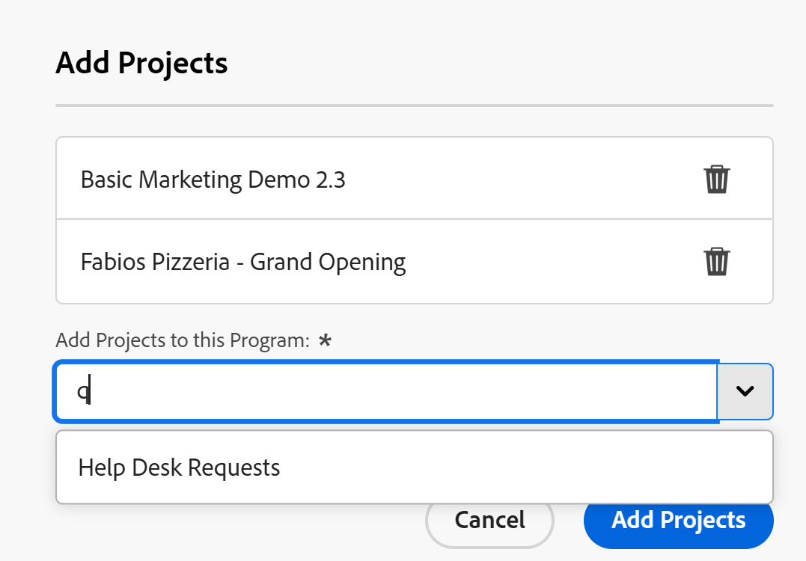

# Añadir un proyecto a un programa

<!--Audited: 5/2025-->

La información resaltada en esta página hace referencia a una funcionalidad que aún no está disponible de forma general. Solo está disponible en el entorno de vista previa para todos los clientes. Las mismas funciones también estarán disponibles en el entorno de producción para todos los clientes una semana después de la versión de vista previa. 

Para obtener más información, vea [Modernización de la interfaz](/help/quicksilver/product-announcements/product-releases/interface-modernization/interface-modernization.md). 

Puede organizar los proyectos añadiéndolos a programas dentro de portafolios. Puede tener varios proyectos dentro de un programa, pero solo puede asociar un programa a un proyecto.

Debe crear un portafolio y un programa dentro de este portafolio para poder añadir un proyecto a un programa.

Al agregar un proyecto a un programa, se agrega automáticamente al portafolio del programa al mismo tiempo.

Para obtener información sobre cómo crear portafolios, consulte [Crear un portafolio](../../../manage-work/portfolios/create-and-manage-portfolios/create-portfolios.md).

Para obtener información sobre cómo crear programas, consulte [Crear un programa](../../../manage-work/portfolios/create-and-manage-programs/create-program.md).

## Requisitos de acceso

+++ Expanda para ver los requisitos de acceso para la funcionalidad en este artículo.

<table style="table-layout:auto"> 
 <col> 
 <col> 
 <tbody> 
  <tr> 
   <td role="rowheader">[!DNL Adobe Workfront] plan</td> 
   <td> 
Cualquiera
 </td> 
  </tr> 
  <tr> 
   <td role="rowheader">[!DNL Adobe Workfront] licencia*</td> 
   <td>
Nuevo: estándar
 
   
Actual: [!UICONTROL Plan] 
 </td> 
  </tr> 
  <tr> 
   <td role="rowheader">Nivel de acceso</td> 
   <td> 
Acceso [!UICONTROL Edit] a programas o superior
 
Acceso [!UICONTROL Edit] a proyectos
 </td> 
  </tr> 
  <tr> 
   <td role="rowheader">Permisos de objeto</td> 
   <td> 
Permisos [!UICONTROL Manage] para el programa
 
Permisos de [!UICONTROL Manage] a los proyectos
 </td> 
  </tr> 
 </tbody> 
</table>

*Para obtener información, consulte [Requisitos de acceso en la documentación de Workfront](/help/quicksilver/administration-and-setup/add-users/access-levels-and-object-permissions/access-level-requirements-in-documentation.md).

+++

## Añadir un proyecto a un programa existente

1. Acceda a un programa.

   Haga clic en **[!UICONTROL Proyectos]** en el panel izquierdo.

1. Haga clic en **[!UICONTROL Nuevo proyecto]** y seleccione un método para añadir el proyecto.

   >[!TIP]
   >
   >No se puede agregar un proyecto al ver la lista de proyectos en la vista [!UICONTROL Hito].

   Seleccione entre las siguientes opciones:

   <table style="table-layout:auto"> 
    <col> 
    <col> 
    <tbody> 
     <tr> 
      <td role="rowheader">[!UICONTROL Existing Project]</td> 
      <td> 
Añada un proyecto que ya se haya creado.
 </td> 
     </tr> 
     <tr> 
      <td role="rowheader">[!UICONTROL New Project]</td> 
      <td> 
Añada un nuevo proyecto desde cero. 
 
Para obtener más información sobre cómo crear un proyecto desde cero, consulte <a href="../../../manage-work/projects/create-projects/create-project.md" class="MCXref xref">Crear un proyecto</a>. 
 </td> 
     </tr> 
     <tr> 
      <td role="rowheader">[!UICONTROL Import a Project from [!DNL MS Project]] </td> 
      <td> 
Añada un proyecto que previamente exportó desde [!DNL MS Project] y que ha guardado en su equipo. 
 
Para obtener más información sobre la creación de un nuevo proyecto importándolo desde [!DNL Microsoft Project], consulte <a href="../../../manage-work/projects/create-projects/import-project-from-ms-project.md" class="MCXref xref">Importar un proyecto desde [!DNL Microsoft Project]</a>.
 </td> 
     </tr> 
     <tr> 
      <td role="rowheader">[!UICONTROL Request Project]</td> 
      <td> 
Solicite la aprobación del nuevo proyecto para poder empezar a trabajar en él.
 
Para obtener información sobre cómo solicitar proyectos, vea <a href="../../../manage-work/projects/create-projects/request-project.md">Solicitud de un proyecto</a>. 
 </td> 
     </tr> 
     <tr> 
      <td role="rowheader">[!UICONTROL New from Template]</td> 
      <td> 
Añada un nuevo proyecto con una plantilla existente. 
 
Para obtener más información sobre la creación de un proyecto a partir de una plantilla, consulte <a href="../../../manage-work/projects/create-projects/create-project-from-template.md" class="MCXref xref">Crear un proyecto mediante una plantilla</a>.
 </td> 
     </tr> 
    </tbody> 
   </table>

1. (Condicional) Si seleccionó **[!UICONTROL Proyecto existente]**, se abrirá la casilla **Agregar proyectos**. <!--check at unshimming-->

   <!--check at unshimming-->

1. Haga lo siguiente:

   1. En el cuadro **[!UICONTROL Agregar proyectos]**, escriba el nombre de un proyecto en el campo **Agregar proyectos a este programa** y, a continuación, selecciónelo cuando se muestre en la lista. <!--check casing on links and buttons-->

      Puede agregar más de un proyecto.
   1. (Opcional) Haga clic en el icono **Eliminar**  junto al nombre de un proyecto si decide no agregarlo al programa.

   1. Haga clic en **[!UICONTROL Agregar proyectos]**. <!--check at unshimming-->

      El proyecto aparece en la ficha **[!UICONTROL Proyectos]** del programa y ahora está asociado con el programa y el portafolio respectivo del programa.
