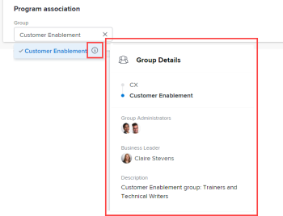

# Crear un programa

<!-- Audited: 1/2024 -->

<!--The highlighted information on this page refers to functionality not yet generally available. It is available only in the Preview environment for all customers. After the monthly releases to Production, the same features are also available in the Production environment for customers who enabled fast releases.    

For information about fast releases, see [Enable or disable fast releases for your organization](/help/quicksilver/administration-and-setup/set-up-workfront/configure-system-defaults/enable-fast-release-process.md). -->

Un programa representa una colección de proyectos que comparten una estrategia, objetivo o meta común que trasciende los límites de los proyectos.
Los programas son una subdivisión de portafolios y no pueden existir fuera de un portafolio. Los programas suelen compartir los mismos recursos que otros programas dentro del mismo portafolio.

Puede crear programas para organizar sus portafolios cuando sean demasiado grandes.

Por ejemplo, puede tener un portafolio del año fiscal de marketing 2024 que contenga todos los proyectos de su división de marketing. Podría considerar organizar aún más sus proyectos en trimestres fiscales y añadir programas del Trimestre fiscal de marketing 1-4 de 2024 dentro del Portafolio del año fiscal de marketing 2024.

## Requisitos de acceso

+++ Expanda para ver los requisitos de acceso para la funcionalidad en este artículo.

Debe tener el siguiente acceso para realizar los pasos de este artículo:

<table style="table-layout:auto"> 
 <col> 
 <col> 
 <tbody> 
  <tr> 
   <td role="rowheader">[!DNL Adobe Workfront] plan</td>

<td> 
Cualquiera
 </td> 
  </tr> 
  <tr> 
   <td role="rowheader">[!DNL Adobe Workfront] licencia</td> 
   <td> 
Nuevo: [!UICONTROL Standard] 

O 

Actual: [!UICONTROL Plan] 
 </td> 
  </tr> 
  <tr> 
   <td role="rowheader">Configuraciones de nivel de acceso</td> 
   <td> 
Acceso de [!UICONTROL Edit] a portafolio y programas 
  </td> 
  </tr> 
  <tr> 
   <td role="rowheader">Permisos de objeto</td> 
   <td> 
Permisos de [!UICONTROL Manage] al portafolio
 
Después de crear un programa, tiene permisos de [!UICONTROL Manage] de forma predeterminada.
  </td> 
  </tr> 
 </tbody> 
</table>

Para obtener más información sobre el contenido de esta tabla, consulte [Requisitos de acceso en la documentación de Workfront](/help/quicksilver/administration-and-setup/add-users/access-levels-and-object-permissions/access-level-requirements-in-documentation.md).

+++

## Formas de crear programas

Puede crear un programa en Workfront mediante uno de los métodos siguientes:

* Cree un programa desde cero empezando por el área Programas del menú principal o en la sección Programas de un portafolio. Este artículo describe cómo crear un programa desde cero.

* Importar un programa mediante kick-starts.

  Como administrador de Workfront, puede importar programas mediante una &quot;kick-start&quot;.

  Para obtener información acerca de cómo importar datos mediante kick-starts en Workfront, consulte [Importar datos en Adobe Workfront a través de una plantilla de Kick-Start](/help/quicksilver/administration-and-setup/manage-workfront/using-kick-starts/import-data-via-kickstarts.md).

* Agregue programas a medida que los conecte desde un tipo de registro en Workfront Planning.

  Debe tener un paquete de Workfront Planning adicional.

  Para obtener información sobre el acceso a Workfront Planning, consulte [Información general sobre el acceso a Adobe Workfront Planning](/help/quicksilver/planning/access/access-overview.md).

  Para obtener información acerca de cómo crear portafolios agregándolos a registros, vea la sección &quot;Crear registros al conectarlos&quot; en el artículo [Crear registros](/help/quicksilver/planning/records/create-records.md).

## Crear un programa

1. Haga clic en el icono **[!UICONTROL Menú principal]**  en la esquina superior derecha de Adobe Workfront, o (si está disponible), haga clic en el icono **[!UICONTROL Menú principal]**  en la esquina superior izquierda.

1. Realice una de las siguientes acciones.

   * Cree un programa desde el área de [!UICONTROL Programas]:

      1. Haga clic en **[!UICONTROL Programas]** en el Menú principal.
      1. Haga clic en **[!UICONTROL Nuevo programa]**.
      1. En el cuadro que se muestra, escriba el nombre de un portafolio existente en el campo **[!UICONTROL Seleccionar portafolio]**.
      1. Escriba el nombre del nuevo programa en el campo **[!UICONTROL Nombre]**.
      1. Haga clic en **[!UICONTROL Guardar]**.
   * Cree un programa desde el área [!UICONTROL Portafolio]:

      1. Haga clic en **[!UICONTROL Portafolios]** en el [!UICONTROL Menú principal], luego abre un portafolio.
      1. En el panel de navegación izquierdo, haga clic en **[!UICONTROL Programas]**.
      1. Haga clic en el menú desplegable **[!UICONTROL Nuevo programa]** y luego en **[!UICONTROL Nuevo programa]**.

1. (Condicional) Si has creado el programa desde un portafolio, especifica el nombre del Programa en el campo **[!UICONTROL Programa sin título]**.

   El nombre puede contener hasta 255 caracteres.

1. (Opcional) Haga clic en **[!UICONTROL Administrador de programas]** en el encabezado del programa para actualizarlo.

   >[!TIP]
   >
   >Como creador del programa, se le asigna el rol de Administrador de programas de forma predeterminada.

1. Haga clic en **[!UICONTROL Detalles del Programa]** en el panel izquierdo.
1. Haga doble clic en cualquier campo para actualizar la información en el área de **[!UICONTROL Información general]**.

Puede especificar la siguiente información:

<table style="table-layout:auto"> 
    <col> 
    <col> 
    <thead> 
     <tr> 
      <th>Campo</th> 
      <th>Descripción</th> 
     </tr> 
    </thead> 
    <tbody> 
     <tr> 
      <td role="rowheader">[!UICONTROL Description]</td> 
      <td> 
Especifique una descripción para el programa.
 
La descripción se muestra en la página de aterrizaje del programa.
 </td> 
     </tr> 
     <tr> 
      <td role="rowheader">[!UICONTROL Program Manager]</td> 
      <td> 
Empieza a escribir el nombre del usuario que deseas que actúe como el Gestor del Programa, luego haga clic en el nombre del usuario cuando aparezca en la lista desplegable. Es igual que el [!UICONTROL Program Owner]. 
 
Sugerencia: También puede actualizar el Administrador de programas en el encabezado del programa. 
 </td> 
     </tr> 
     <tr data-mc-conditions=""> 
      <td role="rowheader">[!UICONTROL Group] </td> 
      <td> 
Añada el nombre de un solo grupo si el grupo es propietario del programa o tiene la responsabilidad de completarlo. 
 
Puedes asegurarte de que estás seleccionando el grupo correcto pasando el cursor sobre él y haciendo clic en el icono de [!UICONTROL information]  que aparece junto a él. Esta acción muestra la ayuda contextual con información sobre el grupo, como la jerarquía de los grupos que tiene por encima y sus administradores.
 
       
 
         
       
 </td> 
     </tr> 
    </tbody> 
   </table>

1. (Opcional y condicional) Haga clic dentro del cuadro **[!UICONTROL Añadir formulario personalizado]** para seleccionar un formulario personalizado para el portafolio y actualizar los campos personalizados.

   >[!TIP]
   >
   >Debe tener formularios personalizados de programa ya creados para poder adjuntarlos a los programas.

1. (Opcional y condicional) Si va a añadir un formulario personalizado, haga clic en cualquier campo del formulario personalizado para actualizar la información de ese campo.
1. Haga clic en **[!UICONTROL Guardar cambios]**.
1. Haga clic en **[!UICONTROL Proyectos]** en el panel de navegación izquierdo, luego en **[!UICONTROL Añadir proyectos]** para añadir proyectos al programa.

   Para obtener información acerca de cómo añadir proyectos a los programas, consulte [Añadir un proyecto a un programa](../../../manage-work/portfolios/create-and-manage-programs/add-project-to-program.md).

1. Haga clic en **[!UICONTROL Guardar cambios]**.
1. (Opcional) Haga clic en el **[!UICONTROL menú Más]**  junto al nombre del programa y haga clic en **[!UICONTROL Desactivar programa]**.

   Cuando se desactiva un programa, este deja de aparecer en una lista de programas cuando los usuarios intentan añadirlo a un proyecto. Aún puede acceder al programa desde el área de [!UICONTROL Programas].

## Resumen del encabezado del programa

Puede encontrar información sobre el programa en su encabezado.

La siguiente información se muestra en el encabezado de un programa:

<table style="table-layout:auto"> 
 <col> 
 <col> 
 <tbody> 
  <tr> 
   <td role="rowheader">Información de encabezado</td> 
   <td> <strong>Notas</strong> </td> 
  </tr> 
  <tr> 
   <td role="rowheader">Ruta con el nombre del portafolio</td> 
   <td>Puede acceder al portafolio al que pertenece el programa desde el encabezado del programa. </td> 
  </tr> 
  <tr> 
   <td role="rowheader">Nombre del programa</td> 
   <td>Puede editar el nombre del programa en el encabezado.</td> 
  </tr> 
  <tr> 
   <td role="rowheader">Nombre del tipo de objeto y estado de activación</td> 
   <td>La palabra “Programa” se muestra con un icono naranja cuando se ve un programa. La palabra “[!UICONTROL Deactivated]” se muestra junto a él y el contorno es gris si el programa no está marcado como [!UICONTROL Active]. </td> 
  </tr> 
  <tr> 
   <td role="rowheader">Área de actuación del programa </td> 
   <td> 
Haga clic en cualquiera de las siguientes opciones para acceder a más información o a las opciones de edición del programa:
 
    <ul> 
     <li>El icono de estrella para añadir el programa a su lista de Favoritos.</li> 
     <li> 
El menú [!UICONTROL More]  para realizar una de las siguientes acciones: 
 
      <ul> 
       <li>Editar el programa</li> 
       <li>Desactivar. Cuando se desactiva un programa, ya no puede asociarlo a proyectos en el nivel de proyecto. </li> 
       <li> 
Elimínelo. Al eliminar el programa no se eliminan los proyectos del programa. Esto elimina la asociación de los proyectos con el programa. 
 </li> 
       <li>Compártalo con otros usuarios</li> 
      </ul> </li> 
    </ul> </td> 
  </tr> 
  <tr> 
   <td role="rowheader">[!UICONTROL Percent Complete]</td> 
   <td> 
No puede editar el [!UICONTROL Percent Complete] del programa en el encabezado. Esta información se actualiza desde los proyectos del programa. De forma predeterminada, el porcentaje completado del programa es una media de los valores de porcentaje completado de los proyectos en un estado [!UICONTROL Current] o [!UICONTROL Approved] que pertenecen al programa.
 </td> 
  </tr> 
  <tr> 
   <td role="rowheader">[!UICONTROL Program Manager]</td> 
   <td> 
Puede editar el Administrador de programas en el encabezado. Es igual que el [!UICONTROL Program Owner]. 
 </td> 
  </tr> 
  <tr> 
   <td role="rowheader">[!UICONTROL Planned Completion Date]</td> 
   <td>No se puede editar la Fecha planificada de finalización del programa en la cabecera. Esta información se actualiza desde los proyectos del programa. La fecha planificada de finalización del último proyecto del programa se convierte en la fecha planificada de finalización del programa.  </td> 
  </tr> 
  <tr> 
   <td role="rowheader">[!UICONTROL Active Projects Condition]</td> 
   <td>Esto es un cálculo del porcentaje de proyectos en el programa que tienen el [!UICONTROL Condition] configurado como [!UICONTROL On Target], [!UICONTROL At Risk] o [!UICONTROL In Trouble]. Los proyectos representados aquí son proyectos con un estado de [!UICONTROL Current] y [!UICONTROL Approved]. </td> 
  </tr> 
 </tbody> 
</table>

## Mover un programa

Puede añadir programas existentes a un portafolio. Como los programas no pueden existir en dos portafolios diferentes, al añadir un programa existente se mueve permanentemente de un portafolio a otro.

Para obtener más información, consulte [Añadir un programa existente a un portafolio](../../../manage-work/portfolios/create-and-manage-programs/move-program.md).
