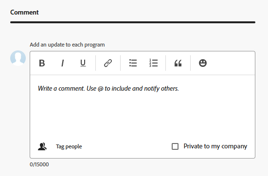

# Editar programas

Puede editar información sobre los programas que ha creado o que otros usuarios han creado si los han compartido con usted.

Puede editar un programa en la página del programa o editar uno o varios programas de forma masiva en una lista.

## Requisitos de acceso

+++ Expanda para ver los requisitos de acceso para la funcionalidad en este artículo.

<table style="table-layout:auto"> 
 <col> 
 <col> 
 <tbody> 
  <tr> 
   <td role="rowheader">[!DNL Adobe Workfront] paquete</td> 
   <td> 
Cualquiera
 </td> 
  </tr> 
  <tr> 
   <td role="rowheader">[!DNL Adobe Workfront] licencia</td> 
   <td> 
[!UICONTROL Standard]

   
[!UICONTROL Plan]
 </td> 
  </tr> 
  <tr> 
   <td role="rowheader">Configuraciones de nivel de acceso</td> 
   <td> 
Acceso de [!UICONTROL Edit] a programas
  </td> 
  </tr> 
  <tr> 
   <td role="rowheader">Permisos de objeto</td> 
   <td> 
Permisos de [!UICONTROL Manage] a un programa
  </td> 
  </tr> 
 </tbody> 
</table>

Para obtener más información, consulte [Requisitos de acceso en la documentación de Workfront](/help/quicksilver/administration-and-setup/add-users/access-levels-and-object-permissions/access-level-requirements-in-documentation.md).

+++

## Editar programas

1. Vaya al **[!UICONTROL Menú principal]**.
1. Haga clic en **[!UICONTROL Programas]** y, a continuación, haga clic en el nombre de un programa para abrirlo.

   >[!TIP]
   >
   >Para tener acceso a un programa del portafolio con el que está asociado, vaya primero al portafolio y, a continuación, haga clic en **[!UICONTROL Programas]** en el panel izquierdo. Para obtener más información, consulte [Crear un programa](../../../manage-work/portfolios/create-and-manage-programs/create-program.md).

1. (Opcional) Para editar información limitada sobre el programa, haga clic en **[!UICONTROL Detalles del programa]** en el panel izquierdo.

   >[!TIP]
   >
   >Si desea editar toda la información sobre el programa, vaya al paso 4.

   

   >[!NOTE]
   >
   >En función de la manera en que su administrador de o administrador de grupos de [!DNL Workfront] haya modificado la plantilla de diseño, los campos del área [!UICONTROL Detalles del programa] podrán reorganizarse o no mostrarse. Para obtener más información, consulte [Personalizar la vista [!UICONTROL Detalles] utilizando una plantilla de diseño](../../../administration-and-setup/customize-workfront/use-layout-templates/customize-details-view-layout-template.md).

   <!--
   
(NOTE: the above note will also come to the Edit Program box)

   -->

   Para editar información en la sección [!UICONTROL Detalles], haga lo siguiente:

   1. (Opcional) Haga clic en el icono **[!UICONTROL Contraer todo]** en la esquina superior derecha para contraer todas las áreas.
   1. (Opcional y condicional) Cuando un área esté contraída, haga clic en la **flecha hacia la derecha**  junto a cada área para expandir el área que desea editar.
   1. Para obtener información sobre los campos visibles en la sección [!UICONTROL Detalles del programa], continúe editando el programa en el cuadro [!UICONTROL Editar programa] como tal se describe a continuación.
   1. (Opcional) Si no hay formularios personalizados adjuntos al programa, empiece a escribir el nombre de un formulario en el campo **[!UICONTROL Agregar formulario personalizado]**, selecciónelo cuando se muestre en la lista y, a continuación, haga clic en **[!UICONTROL Guardar cambios]**.
   1. (Opcional) Haga clic en el icono **[!UICONTROL Exportar]**  para exportar la [!UICONTROL Información general] y la información de formularios personalizados a un archivo de PDF y, a continuación, haga clic en **[!UICONTROL Exportar]**. Seleccione entre las siguientes opciones:

      * Seleccionar todo (solo se muestra cuando hay al menos un formulario personalizado adjunto)
      * [!UICONTROL Información general]
      * El nombre de uno o varios formularios personalizados

      El archivo PDF se descarga en el equipo.

      

      Para obtener más información, consulte [Exportar formularios personalizados y detalles de objetos](../../../workfront-basics/work-with-custom-forms/export-custom-forms-details.md).

1. Para editar toda la información sobre uno o más programas, realice una de las siguientes acciones:

   * Haga clic en el menú **[!UICONTROL Más]**  junto al nombre del programa y, a continuación, en **[!UICONTROL Editar].**
   * Vaya a una lista de programas y seleccione uno o más programas que desee editar. A continuación, haga clic en el icono **[!UICONTROL Editar]**  que se encuentra en la parte superior de la lista.

     Se muestra el cuadro **[!UICONTROL Editar programa]**.

     

     Todos los campos de programa están disponibles en el cuadro [!UICONTROL Editar programa] y se agrupan por las áreas enumeradas en el panel izquierdo.

1. Considere la posibilidad de especificar información en cualquiera de las siguientes secciones:

   * [[!UICONTROL Información general]](#overview)
   * [[!UICONTROL Formularios personalizados]](#Custom%C2%A0F)
   * [[!UICONTROL Comment]](#comment)

   >[!TIP]
   >
   >Para volver a calcular los campos personalizados de varios programas a la vez, seleccione varios programas en una lista y haga clic en el menú **Más**  en la parte superior de la lista; a continuación, seleccione **Volver a calcular expresiones**.

### [!UICONTROL Overview] {#overview}

1. Empiece a editar un programa como se ha descrito anteriormente.
1. Haga clic en **[!UICONTROL Overview]** y especifique los campos siguientes:

   <!--
   
(NOTE:&nbsp;note below drafted for now)

   -->

   <!--
   <note type="note">
   Depending on how your Workfront administrator or Group administrator sets up our Layout Template, the fields in the Edit Program box might be rearranged or not display. For information, see
   <a href="../../../administration-and-setup/customize-workfront/use-layout-templates/customize-details-view-layout-template.md" class="MCXref xref">Customize the Details view using a layout template</a>.
   </note>
   -->

   <table style="table-layout:auto"> 
    <col> 
    <col> 
    <tbody> 
     <tr> 
      <td role="rowheader">[!UICONTROL Name]</td> 
      <td> 
Actualice el nombre del programa. 
 
<b>Sugerencia</b>

Esto no está disponible si ha seleccionado más de un programa.
 </td> 
     </tr> 
     <tr> 
      <td role="rowheader">[!UICONTROL Description]</td> 
      <td> 
Escriba una descripción para el portafolio para indicar qué tiene de único. 
 </td> 
     </tr> 
     <tr> 
      <td role="rowheader">[!UICONTROL Program Manager]</td> 
      <td> 
Comience a escribir el nombre de un usuario que desee indicar como administrador del programa y, a continuación, selecciónelo cuando aparezca en la lista. Es la persona que puede supervisar el trabajo definido en los proyectos del programa. 
 
<b>
IMPORTANTE</b>
 
Cuando se designa a alguien como administrador del programa, obtiene automáticamente permisos de [!UICONTROL Manage] para el programa y los proyectos del programa. 
 
<b>Sugerencia</b>
 
Puede actualizar rápidamente el administrador del programa en el encabezado del programa. 
 </td> 
     </tr> 
     <tr> 
      <td role="rowheader">[!UICONTROL Group]</td> 
      <td> 
Añada el nombre de un solo grupo si este está asociado al programa o si tiene la responsabilidad de completarlo. 
 
<b>Sugerencia</b>
  
Al acceder al campo [!UICONTROL Group] desde la página Detalles del programa [!UICONTROL], haga lo siguiente para asegurarse de que está seleccionando el grupo correcto: 
 
Pase el ratón sobre el nombre del grupo y haga clic en el icono de [!UICONTROL information]  que hay junto a él. Esta acción muestra la ayuda contextual con información sobre el grupo, como la jerarquía de los grupos que tiene por encima y sus administradores.
 
  
 
Esta opción no está disponible en el cuadro [!UICONTROL Edit Program]. 
 
 </td> 
     </tr> 
    </tbody> 
   </table>

   <!--this was removed from the unshimmed version - asking on the epic:
   <tr> 
      <td role="rowheader">[!UICONTROL Is Active]</td> 
      <td> 
 Select this checkbox if you want the program to be active. Other users can find active programs and attach them to projects or add them to portfolios. Inactive programs cannot be attached to projects or portfolios. This is enabled by default.
 </td> 
     </tr> -->

1. Haga clic en **[!UICONTROL Guardar]** o continúe editando las secciones siguientes.

### [!UICONTROL Formularios personalizados]

1. Empiece a editar el programa como se ha descrito anteriormente.
1. Haga clic en el menú desplegable **[!UICONTROL Add Forms]** para seleccionar formularios personalizados y añadirlos al programa.

   Debe crear formularios personalizados de programa antes de que estén disponibles para añadirlos.

   >[!NOTE]
   >
   >Según la forma en que el administrador de [!DNL Workfront] haya establecido los permisos para las secciones del formulario personalizado, no todos podrán ver o editar los mismos campos en un formulario personalizado determinado. Los permisos para editar campos dentro de una sección de un formulario personalizado dependen de los permisos que tenga en el propio programa. Para obtener información sobre cómo establecer permisos en secciones de un formulario personalizado, consulte [Crear un formulario personalizado](/help/quicksilver/administration-and-setup/customize-workfront/create-manage-custom-forms/form-designer/design-a-form/design-a-form.md).

1. Actualice los campos de los formularios personalizados y, a continuación, haga clic en **[!UICONTROL Guardar]** o continúe con la siguiente sección.

### [!UICONTROL Comment] {#comment}

1. Empiece a editar un programa como se ha descrito anteriormente.
1. Haga clic en **[!UICONTROL Aceptar]**.

   

1. Agregue un comentario en el campo **[!UICONTROL Agregar una actualización a cada programa]**.
1. (Opcional) Haga clic en el icono **[!UICONTROL Personas]** para añadir un usuario o equipo al comentario.
1. (Opcional) Seleccione [!UICONTROL **Privado para mi empresa**] para bloquear el comentario y hacerlo privado solo para los usuarios de su empresa.

   >[!TIP]
   >
   >La configuración de **Privado para mi compañía** solo está disponible cuando su perfil de Workfront está asociado con una compañía.

   Después de guardar los cambios, el comentario que añada se mostrará en la ficha [!UICONTROL Actualizaciones] del programa y enviará un correo electrónico a los usuarios incluidos en él.
1. Haga clic en **[!UICONTROL Guardar]**

## Edición de programas por lotes

Cuando edita programas de forma masiva, toda la información que actualiza se aplica a todos los programas seleccionados, anulando la información original de cada programa.

1. Vaya a una lista de programas y seleccione varios.
1. Haga clic en el icono **Editar**  en la parte superior de la lista.

   Se abre el cuadro **Editar programas**.
1. Actualice la información en las secciones siguientes:

   * Información general
   * Formularios personalizados
   * Comentario

   Para obtener más información, consulte la sección [Editar programas](#edit-programs-1) de este artículo, que comienza con el paso 4. <!--ensure this stays accurate-->

