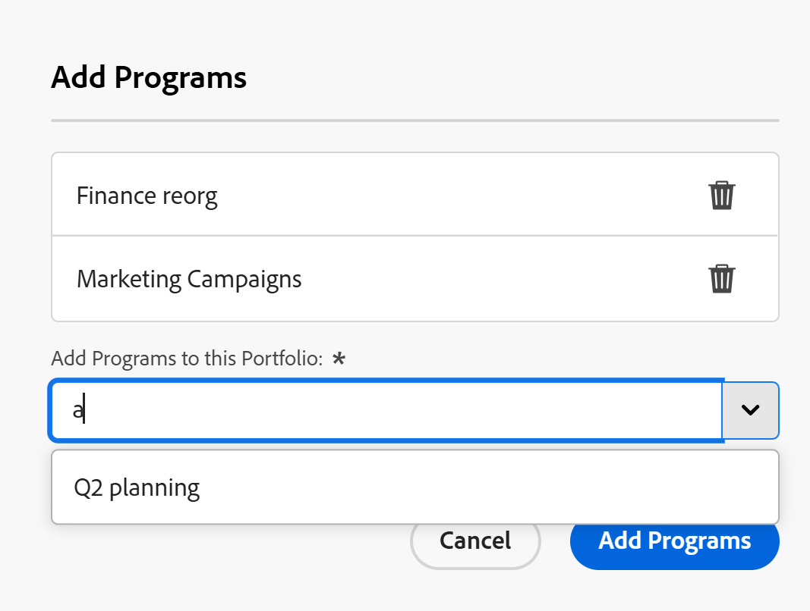

# Añadir un programa existente a un portafolio

<!--Audited: 5/2025-->

<!--The highlighted information on this page refers to functionality not yet generally available. It is available only in the Preview environment for all customers. The same features will also be available in the Production environment for all customers after a week from the Preview release.    

For more information, see [Interface modernization](/help/quicksilver/product-announcements/product-releases/interface-modernization/interface-modernization.md). -->

Puede añadir programas existentes a un portafolio. Como los programas no pueden existir en dos portafolios diferentes, al añadir un programa existente se mueve permanentemente de un portafolio a otro.

## Requisitos de acceso

+++ Expanda para ver los requisitos de acceso para la funcionalidad en este artículo.

Debe tener el siguiente acceso para realizar los pasos de este artículo:

<table style="table-layout:auto"> 
 <col> 
 <col> 
 <tbody> 
  <tr> 
   <td role="rowheader">[!DNL Adobe Workfront] plan</td> 
   <td> 
Cualquiera
 </td> 
  </tr> 
  <tr> 
   <td role="rowheader">[!DNL Adobe Workfront] licencia*</td> 
   <td> 
Nuevo: [!UICONTROL Standard] 

O 

Actual: [!UICONTROL Plan] 
 </td> 
  </tr> 
  <tr> 
   <td role="rowheader">Configuraciones de nivel de acceso</td> 
   <td> 
Acceso de [!UICONTROL Edit] a portafolio y programas 
 </td> 
  </tr> 
  <tr> 
   <td role="rowheader">Permisos de objeto</td> 
   <td> 
[!UICONTROL Manage] permisos para el portafolio y el programa
 </td> 
  </tr> 
 </tbody> 
</table>

*Para obtener información, consulte [Requisitos de acceso en la documentación de Workfront](/help/quicksilver/administration-and-setup/add-users/access-levels-and-object-permissions/access-level-requirements-in-documentation.md).

+++

## Añadir un programa existente a un portafolio

1. Vaya a un portafolio y, a continuación, haga clic en **[!UICONTROL Programas]** en el panel izquierdo.
1. Haga clic en **[!UICONTROL Nuevo programa]**.
1. Haga clic en **[!UICONTROL Existing Program]**.

   Se abre el cuadro **Agregar programas**. <!--check screen shot - I logged changes for this casing-->

   

   >[!IMPORTANT]
   >
   >Añadir un programa existente implica llevar todos los proyectos asociados con ese programa al portafolio. Tenga cuidado de no mover proyectos de esta manera sin querer.

1. En el campo **[!UICONTROL Agregar programas a este Portfolio]**, escriba el nombre de un programa y selecciónelo cuando se muestre en la lista. <!--see the name of this field, I suggested changes here-->

   Puede agregar varios programas.

1. (Opcional) Si decide no agregarlo al portafolio, haga clic en el icono **Eliminar**  que está junto al nombre de un programa.

1. Haga clic en **[!UICONTROL Agregar programas]**. <!--check this button in the UI after they implemented the changes??-->

   El programa se muestra en la ficha **[!UICONTROL Programas]** del portafolio que seleccionó.
