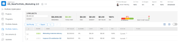

# Buscar el [!UICONTROL Optimizador de portafolios]

Encontrará el [!UICONTROL Optimizador de portafolios] al acceder a un portafolio.

## Requisitos de acceso

+++ Expanda para ver los requisitos de acceso para la funcionalidad en este artículo. 

<table style="table-layout:auto"> 
 <col> 
 <col> 
 <tbody> 
  <tr> 
   <td role="rowheader">[!DNL Adobe Workfront] paquete</td> 
   <td> 
Workfront Prime o superior

      
Flujo de trabajo Prime o superior

    </td> 
  </tr> 
  <tr> 
   <td role="rowheader">[!DNL Adobe Workfront] licencia</td> 
   <td> 
[!UICONTROL Standard]

   
[!UICONTROL Plan]
 </td> 
  </tr> 
  <tr> 
   <td role="rowheader">Configuraciones de nivel de acceso</td> 
   <td> 
Acceso de [!UICONTROL Edit] a [!UICONTROL Portfolios] y [!UICONTROL Proyectos]
  </td>
</tr> 
  <tr> 
   <td role="rowheader">Permisos de objeto</td> 
   <td> 
Permisos de [!UICONTROL Manage] al portafolio
  </td> 
  </tr> 
 </tbody> 
</table>

*Para obtener información, consulte [Requisitos de acceso en la documentación de Workfront](/help/quicksilver/administration-and-setup/add-users/access-levels-and-object-permissions/access-level-requirements-in-documentation.md).

+++

<!--Old:
<table style="table-layout:auto"> 
 <col> 
 <col> 
 <tbody> 
  <tr> 
   <td role="rowheader">[!DNL Adobe Workfront] plan</td> 
   <td> 
Any
 </td> 
  </tr> 
  <tr> 
   <td role="rowheader">[!DNL Adobe Workfront] license*</td> 
   <td> 
New: Standard

   
Current: [!UICONTROL Plan] 
 </td> 
  </tr> 
  <tr> 
   <td role="rowheader">Access level configurations*</td> 
   <td> 
[!UICONTROL Edit] access to Portfolios and Projects
  </td>
</tr> 
  <tr> 
   <td role="rowheader">Object permissions</td> 
   <td> 
[!UICONTROL Manage] permissions to the portfolio
  </td> 
  </tr> 
 </tbody> 
</table>-->

## Buscar el [!UICONTROL Optimizador de portafolios]

1. En el **[!UICONTROL Menú principal]**, haga clic en **[!UICONTROL Portafolios]**.

   Los portafolios que se posean se mostrarán de forma predeterminada.

1. (Opcional) En el menú desplegable **[!UICONTROL Filtro]**, seleccione para ver un conjunto diferente de portafolios.
1. Haga clic en el nombre de un portafolio para acceder a este.
1. Haga clic en **[!UICONTROL Optimización del portafolio]** en el panel de la izquierda.

   Se mostrará el [!UICONTROL Optimizador de portafolios].

   
