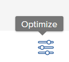

# Resumen de [!UICONTROL Portfolio Optimizer]

<!-- Audited: 01/2024 -->

[!UICONTROL Portfolio Optimizer] es la herramienta que se usa para comparar y evaluar proyectos. El proceso de revisar y comparar los valores de [!UICONTROL Caso comercial] de los proyectos asignados a un portafolio es el modo en que un administrador de portafolios puede priorizar los proyectos y generar el mayor valor para una organización.

El propósito de [!UICONTROL optimizador de portafolios] es proporcionar una interfaz a través de la cual un administrador de portafolios, un comité directivo o una oficina de administración de productos puedan ver información resumida sobre el caso comercial de cada proyecto. Los proyectos se pueden priorizar según los valores estratégicos y los objetivos, o según su puntuación general.

[!UICONTROL Portfolio Optimizer] solo puede ayudarle si ha completado los siguientes requisitos previos:

* Se han completado [!UICONTROL casos empresariales] en los proyectos. Para obtener más información, vea los artículos de [Definir un caso comercial: índice de artículos](../../projects/define-a-business-case/define-business-case.md).
* Un portafolio se define en el área Información general del proyecto de la sección Detalles del proyecto para los proyectos que desea revisar.
* Ha indicado el presupuesto del proyecto y el beneficio planificado de los proyectos que desea revisar. Costo fijo e ingresos fijos son opcionales pero agregan valor adicional. Para obtener más información, consulte [Campos de finanzas del proyecto](../../projects/project-finances/project-finances-overview-1.md).

Para obtener información sobre cómo encontrar [!UICONTROL Portfolio Optimizer], consulte [Localizar [!UICONTROL Portfolio Optimizer]](../../../manage-work/portfolios/portfolio-optimizer/locate-portfolio-optimizer.md).

## Finanzas en [!UICONTROL Portfolio Optimizer]

Puede ver el estado financiero de su portafolio en cualquier momento durante la duración de sus proyectos al usar [!UICONTROL Portfolio Optimizer].

Tenga en cuenta lo siguiente al trabajar con finanzas en [!UICONTROL Portfolio Optimizer]:

* A cada proyecto se le asigna una puntuación cuando se completan sus [!UICONTROL casos empresariales] según los criterios con los que coincidan en [!UICONTROL Portfolio Optimizer]. Por ejemplo, los proyectos de bajo coste o de alta alineación reciben una puntuación más alta.

  Para obtener más información sobre cómo calcular la puntuación del optimizador de portafolios de un proyecto, consulte [Información general sobre la puntuación de [!UICONTROL Portfolio Optimizer]](../../../manage-work/portfolios/portfolio-optimizer/portfolio-optimizer-score.md).

* Los cálculos financieros de [!UICONTROL Portfolio Optimizer] usan el [!UICONTROL costo presupuestado] en el [!UICONTROL caso comercial] del proyecto.
* Puede priorizar manualmente sus proyectos en [!UICONTROL Portfolio Optimizer], teniendo en cuenta toda la información sobre ellos. Esto incluye datos financieros, alineación en sus cuadros de resultados y ROI, por ejemplo.

### Las áreas financieras en [!UICONTROL Portfolio Optimizer] {#the-financial-areas-in-the-portfolio-optimizer}

Puede ver información financiera en las siguientes áreas de [!UICONTROL Portfolio Optimizer]:

* **[!UICONTROL Encabezado de Portfolio]**: Esta área muestra información financiera recopilada de todos los proyectos del portafolio. Se muestra en todas las pestañas del objeto Portfolio.
* **[!UICONTROL Finanzas de Portfolio para proyectos seleccionados]**: Esta área muestra información financiera recopilada de los proyectos seleccionados en [!UICONTROL Portfolio Optimizer]. Puede agregar o eliminar proyectos y comprender cómo afectará esto a las finanzas del portafolio consultando la información de esta área.
* **[!UICONTROL Finanzas de proyectos]**: esta área muestra la información financiera de cada proyecto enumerado en [!UICONTROL Portfolio Optimizer].

### Los campos financieros en [!UICONTROL Portfolio Optimizer] {#the-financial-fields-in-the-portfolio-optimizer}

Los siguientes campos financieros se muestran en [!UICONTROL Portfolio Optimizer]:

* [encabezado del Portfolio](#portfolio-header)
* [Finanzas de Portfolio para proyectos seleccionados](#portfolio-finances-for-selected-projects)

#### encabezado del Portfolio {#portfolio-header}

[!DNL Adobe Workfront] calcula los campos financieros en el encabezado del portafolio usando información de proyectos con estados que solo equivalen a [!UICONTROL Aprobado] o [!UICONTROL Actual].

<table style="table-layout:auto"> 
 <col> 
 <col> 
 <thead> 
  <tr> 
   <th><strong>Nombre de campo</strong> </th> 
   <th><strong>Descripción</strong> </th> 
  </tr> 
 </thead> 
 <tbody> 
  <tr> 
   <td>[!UICONTROL On Time]</td> 
   <td> 
Porcentaje de proyectos del portafolio que se consideran [!UICONTROL a tiempo]. Esto es visible desde cualquier pestaña dentro de un portafolio.
 
Un proyecto se considera [!UICONTROL a tiempo] cuando el proyecto <strong>[!UICONTROL condición]</strong> es <strong>[!UICONTROL en destino]</strong>.  Para obtener más información acerca de [!UICONTROL Condiciones del proyecto], vea el artículo <a href="../../../manage-work/projects/manage-projects/project-condition-and-condition-type.md" class="MCXref xref">Información general sobre la condición del proyecto y el tipo de condición</a>.
 
El porcentaje <strong>[!UICONTROL A tiempo]</strong> se calcula con la siguiente fórmula:
 
<em>[!UICONTROL Porcentaje de Portfolio a tiempo activado] = Número de proyectos [!UICONTROL a tiempo]/ Número total de proyectos en un estado [!UICONTROL actual] o [!UICONTROL aprobado]</em> 
 </td> 
  </tr> 
  <tr> 
   <td>[!UICONTROL Según Presupuesto]</td> 
   <td> 
Porcentaje de proyectos del portafolio que se consideran [!UICONTROL según el presupuesto]. Esto es visible desde cualquier ficha dentro de un portafolio de [!UICONTROL].
 
Los proyectos son <strong>[!UICONTROL según el presupuesto]</strong> cuando no han excedido su presupuesto predefinido.  Para obtener más información acerca del presupuesto de un proyecto, vea el artículo <a href="../../../manage-work/projects/project-finances/manage-project-finance-area.md" class="MCXref xref">[!UICONTROL Manage] en el área de finanzas del proyecto</a>.
 
El porcentaje [!UICONTROL On Budget] se calcula mediante la siguiente fórmula:
 
<em>[!UICONTROL Porcentaje de Portfolio de presupuesto] = Número de proyectos [!UICONTROL de presupuesto]/ Número total de proyectos </em><em>en un estado [!UICONTROL actual] o [!UICONTROL aprobado]</em> 
 </td> 
  </tr> 
  <tr> 
   <td>ROI (para portafolios)</td> 
   <td> 
El [!UICONTROL Retorno de la inversión] (ROI) del portafolio se calcula teniendo en cuenta el [!UICONTROL Beneficio] total del [!UICONTROL Portfolio] y el total de los [!UICONTROL Costos presupuestados] de los proyectos. Esto es visible desde cualquier pestaña dentro de un portafolio.
 
El valor de ROI del Portfolio se calcula mediante la siguiente fórmula:
 
<em>ROI del Portfolio = ([!UICONTROL Beneficio total] - [!UICONTROL Costo total presupuestado])/ [!UICONTROL Costo total] * 100</em> 
 
Para obtener más información acerca de cómo se calcula el ROI de un proyecto, consulte el artículo <a href="../../../manage-work/projects/project-finances/calculate-roi.md" class="MCXref xref">Calcular el retorno de la inversión (ROI)</a>.
 </td> 
  </tr> 
  <tr> 
   <td>[!UICONTROL alineado] o [!UICONTROL puntuación de alineación] </td> 
   <td> 
Promedio de todos los valores de [!UICONTROL Puntuación de alineación del proyecto], que se calculan después de completar el informe de valoración de [!UICONTROL] en el [!UICONTROL Caso comercial] del proyecto. La puntuación de alineación de cada proyecto se muestra en la columna [!UICONTROL Alignment] de [!UICONTROL Portfolio Optimizer]. Esto es visible desde cualquier pestaña dentro de un portafolio.
 
Para obtener más información acerca de cómo generar una puntuación de alineación para un proyecto, vea el artículo <a href="../../../manage-work/projects/define-a-business-case/apply-scorecard-to-project-to-generate-alignment-score.md" class="MCXref xref">Aplicar una puntuación a un proyecto y generar una puntuación de alineación</a>.
 </td> 
  </tr> 
  <tr> 
   <td>[!UICONTROL Valor neto]</td> 
   <td> 
Suma de todos los [!UICONTROL Valores de red] de todos los proyectos del portafolio. Esto es visible desde cualquier pestaña dentro de un portafolio.
 
Para obtener más información acerca de cómo se calcula [!UICONTROL Valor neto] para un proyecto, vea el artículo <a href="../../../manage-work/projects/project-finances/calculate-net-value.md" class="MCXref xref">Calcular valor neto</a>.
 </td> 
  </tr> 
 </tbody> 
</table>

#### Finanzas de Portfolio para proyectos seleccionados {#portfolio-finances-for-selected-projects}

<table style="table-layout:auto"> 
 <col> 
 <col> 
 <thead> 
  <tr> 
   <th><strong>Nombre de campo</strong> </th> 
   <th><strong>Descripción</strong></th> 
  </tr> 
 </thead> 
 <tbody> 
  <tr> 
   <td>[!UICONTROL Número de proyectos]</td> 
   <td> 
Número total de proyectos activos en el portafolio. Los proyectos que se consideran activos en un portafolio pueden estar en cualquiera de los siguientes estados:
 
    <ul> 
     <li>[!UICONTROL Actual]</li> 
     <li>[!UICONTROL Planificación]</li> 
     <li>[!UICONTROL Aprobado]</li> 
    </ul> </td> 
  </tr> 
  <tr> 
   <td>[!UICONTROL Presupuesto]</td> 
   <td>Puede actualizar manualmente este campo para indicar cuál es el presupuesto total para todo el portafolio. Este presupuesto se utiliza para todos los proyectos dentro del portafolio. </td> 
  </tr> 
  <tr> 
   <td>[!UICONTROL Restante]</td> 
   <td> 
El presupuesto restante después de que todos los [!UICONTROL Costos presupuestados] de todos los proyectos dentro del portafolio se hayan restado del Presupuesto del portafolio.
 
El [!UICONTROL Presupuesto de Portfolio restante] se calcula mediante la siguiente fórmula:
 
<em>[!UICONTROL Presupuesto de Portfolio restante] = [!UICONTROL Presupuesto de Portfolio total] - Total [!UICONTROL Costo presupuestado] de todos los proyectos de Portfolio</em> 
 
El [!UICONTROL Costo presupuestado] general de todos los proyectos del portafolio se representa en la barra de indicadores debajo del campo Presupuesto. 
 
Para obtener más información sobre el seguimiento de los costos de un proyecto, vea <a href="../../../manage-work/projects/project-finances/track-costs.md" class="MCXref xref">Seguimiento de costos</a>.
 </td> 
  </tr> 
  <tr> 
   <td>[!UICONTROL Costo total]</td> 
   <td> 
Suma de los costos de todos los proyectos mostrados en [!UICONTROL Portfolio Optimizer]. El costo de cada proyecto es el mismo que el [!UICONTROL Costo presupuestado] del proyecto, tal como se muestra en el [!UICONTROL Resumen de caso comercial]. 
 
Para obtener más información acerca de los campos financieros de los proyectos en [!UICONTROL Business Case], vea la sección "Explicación de los campos financieros en el caso comercial" en el artículo <a href="../../../manage-work/projects/define-a-business-case/create-business-case.md" class="MCXref xref">Crear un caso comercial para un proyecto</a>.
 </td> 
  </tr> 
  <tr> 
   <td>[!UICONTROL Riesgo] </td> 
   <td> 
Suma de todos los [!UICONTROL Costos de riesgo potencial] de todos los proyectos del portafolio. El [!UICONTROL Costo de riesgo potencial] de cada proyecto se muestra en la columna [!UICONTROL Riesgo] de [!UICONTROL Portfolio Optimizer]. 
 
Para obtener más información acerca del cálculo de riesgos para los proyectos, vea el artículo <a href="../../../manage-work/projects/project-finances/potential-risk-cost.md" class="MCXref xref">Calcular el costo de riesgo potencial</a>.
 </td> 
  </tr> 
  <tr> 
   <td>[!UICONTROL Beneficio]</td> 
   <td> 
Suma de todos los valores de [!UICONTROL Beneficio planificado] de todos los proyectos del portafolio. El valor de Beneficio planificado de cada proyecto se muestra en la columna [!UICONTROL Beneficio] de [!UICONTROL Portfolio Optimizer]. 
 
Para obtener más información acerca del [!UICONTROL Beneficio planificado] de un proyecto, consulte el artículo <a href="../../../manage-work/projects/project-finances/project-planned-benefit.md" class="MCXref xref">Información general sobre el beneficio planificado del proyecto</a>.
 </td> 
  </tr> 
  <tr> 
   <td>Indicador de [!UICONTROL Riesgo de valor neto]</td> 
   <td> 
Mide el valor de [!UICONTROL Riesgo potencial], teniendo en cuenta el [!UICONTROL Valor neto] proporcionado por todos los proyectos del portafolio. Para lograr la máxima eficiencia dentro del portafolio, desea ver que el indicador de [!UICONTROL Riesgo] es bajo y el indicador de [!UICONTROL Valor neto] es alto. 
 
Para obtener más información acerca del cálculo del riesgo para el valor neto de [!UICONTROL], vea el artículo <a href="../../../manage-work/portfolios/portfolio-optimizer/calculate-risk-to-net-value-in-portfolio.md" class="MCXref xref">Calcular el riesgo para el valor neto en un portafolio</a>.
 </td> 
  </tr> 
 </tbody> 
</table>

## Personalizar [!UICONTROL Portfolio Optimizer]

Solo puede personalizar el área de la lista de proyectos de [!UICONTROL Portfolio Optimizer] mediante la configuración para cambiar la información de la lista.

Los iconos y las opciones siguientes están disponibles para [!UICONTROL Portfolio Optimizer]:

<table style="table-layout:auto"> 
 <col> 
 <col> 
 <col> 
 <tbody> 
  <tr> 
   <td><strong>Icono en Portfolio Optimizer</strong></td> 
   <td><strong>Nombre</strong></td> 
   <td><strong>Función</strong></td> 
  </tr> 
  <tr> 
   <td>  </td> 
   <td>[!UICONTROL Establecer prioridad de proyecto]</td> 
   <td>
Utilice este icono cuando desee guardar el orden del proyecto, según su prioridad.

   
Debe tener permisos de administración en todos los proyectos de la lista para poder usar <b>Establecer prioridad de proyecto</b>
.
    </td> 
  </tr> 
  <tr> 
   <td>  </td> 
   <td>[!UICONTROL Optimizar portafolio]</td> 
   <td>Utilice este icono para optimizar el portafolio en función de los siguientes valores financieros de los proyectos:
    <ul>
     <li>[!UICONTROL Costo]</li>
     <li>[!UICONTROL Alineación]</li>
     <li>[!UICONTROL Valor]</li>
     <li>[!UICONTROL Riesgo de beneficio]</li>
     <li>[!UICONTROL ROI]</li>
    </ul>
Para obtener más información acerca de cómo optimizar su portafolio, vea el artículo <a href="../../../manage-work/portfolios/portfolio-optimizer/optimize-projects-in-portfolio-optimizer.md" class="MCXref xref">Optimizar proyectos en [!UICONTROL Portfolio Optimizer]</a>.
</td> 
  </tr> 
  <tr> 
   <td>  </td> 
   <td>Iconos de [!UICONTROL Deshacer]/ [!UICONTROL Rehacer]</td> 
   <td>Utilice estos iconos para cancelar o rehacer los cambios realizados en [!UICONTROL Portfolio Optimizer] antes de guardar.</td> 
  </tr> 
  <tr> 
   <td>  </td> 
   <td>[!UICONTROL Mostrar]/[!UICONTROL Ocultar] proyectos sin marcar</td> 
   <td>Utilice estos iconos para mostrar u ocultar los proyectos del portafolio que haya desmarcado.</td> 
  </tr> 
  <tr> 
   <td>  </td> 
   <td>[!UICONTROL Export] </td> 
   <td> 
Utilice este icono para exportar los datos del área de [!UICONTROL Project Prioritization] de [!UICONTROL Portfolio Optimizer]. Se puede exportar a los siguientes formatos:
 
    <ul> 
     <li>PDF</li> 
     <li>[!DNL Excel]</li> 
     <li>Delimitado por [!UICONTROL Tab]</li> 
    </ul> </td> 
  </tr> 
  <tr> 
   <td>  </td> 
   <td>[!UICONTROL Preferencias]</td> 
   <td> 
Utilice este icono para modificar los campos de proyecto mostrados en las columnas de [!UICONTROL Portfolio Optimizer] o para modificar los proyectos que se muestran en [!UICONTROL Optimizer] según sus estados. 
 
Sugerencia:  
     <ul> 
      <li> 
No todos los [!DNL Workfront] campos estándar están disponibles para agregar en las columnas. 
 </li> 
     </ul> 
     <ul> 
      <li> 
Solo puede agregar los campos personalizados que tengan un valor distinto de cero en cualquiera de los proyectos del portafolio.
 </li> 
     </ul> 
 </td> 
  </tr> 
 </tbody> 
</table>
