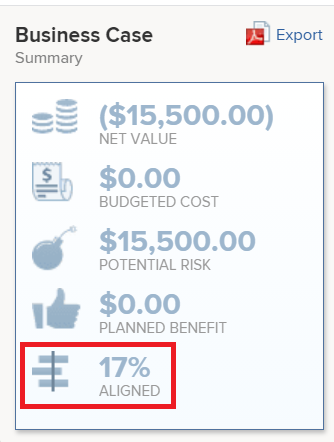

# Información general sobre la puntuación de [!UICONTROL Portfolio Optimizer]

<!--Audited: 01/2025-->

Puede encontrar la puntuación de [!UICONTROL Portfolio Optimizer] en [!UICONTROL Portfolio Optimizer]. Se muestra en la columna **[!UICONTROL Puntuación]** para cada proyecto. Esto representa una puntuación para cada proyecto del portafolio.

Para obtener información sobre cómo encontrar [!UICONTROL Portfolio Optimizer], consulte el artículo [[!UICONTROL Información general de Portfolio Optimizer]](../../../manage-work/portfolios/portfolio-optimizer/portfolio-optimizer-overview.md).

Para obtener información sobre cómo [!DNL Adobe Workfront] usa la puntuación del proyecto y otra información del proyecto para optimizar proyectos en [!UICONTROL Portfolio Optimizer], consulte [Optimizar proyectos en Portfolio Optimizer](../../../manage-work/portfolios/portfolio-optimizer/optimize-projects-in-portfolio-optimizer.md).

## Diferencia entre la puntuación de alineación [!UICONTROL 1&rbrace; y la puntuación de Portfolio Optimizer [!UICONTROL 3&rbrace;]]

Hay una diferencia entre la puntuación de alineación y la puntuación del Optimizador de portafolios de un proyecto.

La puntuación de alineación de un proyecto se calcula según los puntos obtenidos tras completar el cuadro de resultados. A continuación, esta puntuación se utiliza para determinar la puntuación de alineación del portafolios. La puntuación de alineación se muestra como un porcentaje.

La puntuación de alineación de un proyecto se muestra en la columna **[!UICONTROL Alignment]** de [!UICONTROL Portfolio Optimizer] o en el campo [!UICONTROL Alignment] de [!UICONTROL Business Case Summary].




Para obtener más información acerca de cómo generar la puntuación de alineación de un proyecto, vea el artículo [Aplicar un cuadro de mandos a un proyecto y generar una puntuación de alineación](../../../manage-work/projects/define-a-business-case/apply-scorecard-to-project-to-generate-alignment-score.md).

La puntuación de [!UICONTROL portfolio optimizer] es una clasificación calculada automáticamente en [!UICONTROL Portfolio Optimizer] mediante la cual se pueden priorizar los proyectos. La puntuación del optimizador de portafolios se muestra como un icono indicador acompañado de un número y se muestra en la columna **[!UICONTROL Puntuación]** de [!UICONTROL Portfolio Optimizer].

>[!NOTE]
>
>Un proyecto se puede puntuar en [!UICONTROL Portfolio Optimizer] solo si se ha completado su caso empresarial. Para obtener más información acerca de cómo completar un caso empresarial, vea el artículo [[!UICONTROL Crear un caso empresarial] para un proyecto](../../../manage-work/projects/define-a-business-case/create-business-case.md).


La puntuación de cada proyecto se calcula según la importancia de las siguientes categorías:

* [!UICONTROL Coste]
* [!UICONTROL Alineación]
* [!UICONTROL Valor neto]
* [!UICONTROL Riesgo de beneficio]
* [!UICONTROL ROI]

## Calcular la puntuación de [!UICONTROL Portfolio Optimizer]

<!--
<p data-mc-conditions="QuicksilverOrClassic.Draft mode">(NOTE: This was edited based on this issue, per Anna: https://hub.workfront.com/issue/603d0c58000095ea0bc00ce5e2110693/overview)</p>
-->

[!DNL Workfront] genera una puntuación utilizando [!UICONTROL Portfolio Optimizer], que es una clasificación que ayuda a priorizar los proyectos. Los valores del portafolio se basan en los valores introducidos en los casos comerciales de los proyectos y se utilizan para calcular una puntuación para el proyecto. Los proyectos con una puntuación más alta podrían considerarse de mayor importancia y se les podría dar prioridad para que se completen primero.

Para averiguar la clasificación de un proyecto, haga lo siguiente:

1. Vaya a [!UICONTROL Portfolio Optimizer].
1. Pase el ratón sobre el icono de clasificación para ver la puntuación del optimizador de portafolio de un proyecto.


El algoritmo para calcular las puntuaciones tiene en cuenta los valores descritos en los casos comerciales de los proyectos y las ponderaciones que llevan. Otorga a cada proyecto del optimizador una puntuación y normaliza esa puntuación para que siempre haya un proyecto con una puntuación de 100. Esto otorga una puntuación alta al mejor proyecto.

>[!BEGINSHADEBOX]

**EJEMPLO**

Por ejemplo, si hace que [!UICONTROL mayor alineación] sea el único factor a considerar, el proyecto con la alineación más alta obtiene la puntuación de 100.

>[!ENDSHADEBOX]

Los siguientes son criterios por los que puede puntuar un proyecto:

* [!UICONTROL Coste]
* [!UICONTROL Alineación]
* [!UICONTROL Valor]
* [!UICONTROL Riesgo de beneficio]
* [!UICONTROL ROI]


Para obtener información sobre cómo optimizar proyectos en el portafolio, consulte [Optimizar proyectos en [!UICONTROL Portfolio Optimizer]](../../../manage-work/portfolios/portfolio-optimizer/optimize-projects-in-portfolio-optimizer.md).

Cada criterio del panel de configuración ([!UICONTROL Costo], [!UICONTROL Alineación], [!UICONTROL ROI], [!UICONTROL Valor neto], [!UICONTROL Riesgo de beneficio]) recibe sus ponderaciones en el rango de 0 a 100 según lo que haya seleccionado.

Para cada proyecto con un caso empresarial completo, se genera una puntuación por criterio utilizando la siguiente fórmula:

```
Score Per Criteria = (Project Value For The Criteria - AVG(all the project values for this criteria)) / Standard Deviation of that value for that project
```

**Ejemplo:** Para la [!UICONTROL puntuación de alineación] para el proyecto A, tendrá lo siguiente:

```
Alignment Score = (Project A Alignment Score - AVG (of all the project Alignments)) / Standard Deviation of alignment score for that project
```

Una vez que haya calculado todos los [!UICONTROL criterios de puntuación por], puede agregarlos teniendo en cuenta sus consideraciones para obtener la puntuación completa por proyecto. La puntuación del proyecto se calcula mediante la fórmula siguiente:

```
Score = Cost Score * Cost Weight + Alignment Score * Alignment Weight + ROI Score * ROI Weight + Net Value Score * Net Value Weight + Risk Score * Risk Weight
```

Para el costo del proyecto y [!UICONTROL riesgo], la lógica funciona a la inversa de la forma en que funcionan los otros criterios: si desea que [!UICONTROL Costo bajo] sea importante para usted, no va a aumentar sino reducir la puntuación general del proyecto en `Cost Score * Cost Weight`.

Una vez que haya calculado las puntuaciones de cada proyecto, la [!UICONTROL puntuación de optimización] se define de la siguiente manera para los proyectos:

1. Se definen las puntuaciones [!UICONTROL Mínimo] y [!UICONTROL Máximo].
1. Se calcula el intervalo entre esos valores.
1. Para cada proyecto, la [!UICONTROL puntuación de optimización] se calcula mediante la siguiente fórmula:

   ```
   Optimization Score = Rounded ((Score - Minimum / Range)*100)
   ```
