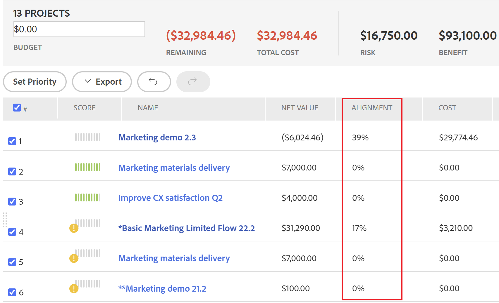
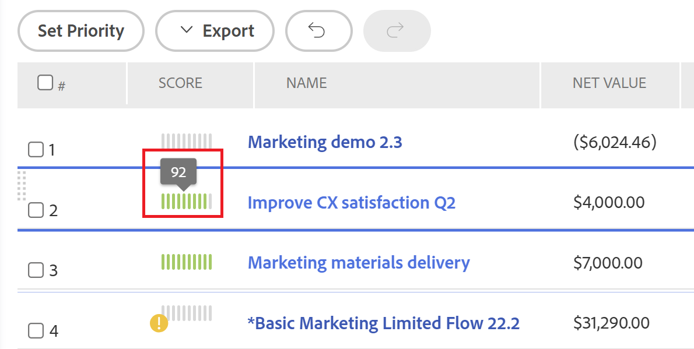

# Información general sobre [!UICONTROL Optimizador de Portfolio] Puntuación

Puede encontrar la variable [!UICONTROL Optimizador de Portfolio] en la variable [!UICONTROL Optimizador de Portfolio]. Se muestra en la variable **[!UICONTROL Puntuación]** para cada proyecto. Esto representa una puntuación para cada proyecto del portafolio.

Para obtener información sobre cómo localizar la variable [!UICONTROL Optimizador de Portfolio], consulte el artículo [[!UICONTROL Optimizador de Portfolio] información general](../../../manage-work/portfolios/portfolio-optimizer/portfolio-optimizer-overview.md).

Para obtener información sobre cómo [!DNL Adobe Workfront] utiliza la puntuación del proyecto y otra información del proyecto para optimizar los proyectos en la variable [!UICONTROL Optimizador de Portfolio], consulte [Optimización de proyectos en Portfolio Optimizer](../../../manage-work/portfolios/portfolio-optimizer/optimize-projects-in-portfolio-optimizer.md).

## Diferencia entre [!UICONTROL Puntuación de alineación] y [!UICONTROL Puntuación del optimizador del Portfolio]

Existe una diferencia entre la puntuación de alineación y la puntuación del optimizador de portafolios de un proyecto.

La puntuación de alineación de un proyecto se calcula en función de los puntos obtenidos tras completar el informe de valoración. A continuación, esta puntuación se utiliza para determinar la puntuación de alineación del portafolio. La puntuación de alineación se muestra como un porcentaje.\
La puntuación de alineación de un proyecto se muestra en la variable **[!UICONTROL Alineación]** de [!UICONTROL Optimizador de Portfolio] o en el [!UICONTROL Alineación] del campo [!UICONTROL Resumen de caso empresarial].




Para obtener más información sobre la generación de la puntuación de alineación de un proyecto, consulte el artículo [Aplicar un informe de valoración a un proyecto y generar una puntuación de alineación](../../../manage-work/projects/define-a-business-case/apply-scorecard-to-project-to-generate-alignment-score.md).

La variable [!UICONTROL optimizador de portafolio] puntuación es una clasificación calculada automáticamente en la variable [!UICONTROL Optimizador de Portfolio] por el cual se puede priorizar a los proyectos. La puntuación del optimizador de portafolio se muestra como un icono de indicador acompañado de un número y se muestra en la variable **[!UICONTROL Puntuación]** de [!UICONTROL Optimizador de Portfolio].

>[!NOTE]
>
>Un proyecto se puede clasificar en la variable [!UICONTROL Optimizador de Portfolio] solo si se ha completado su caso empresarial. Para obtener más información sobre cómo completar un caso de negocio, consulte el artículo [[!UICONTROL Crear un caso empresarial] para un proyecto](../../../manage-work/projects/define-a-business-case/create-business-case.md).


La puntuación de cada proyecto se calcula según la importancia de las siguientes categorías:

* [!UICONTROL Costo]
* [!UICONTROL Alineación]
* [!UICONTROL Valor neto]
* [!UICONTROL Riesgo para beneficio]
* [!UICONTROL Retorno de la inversión]

## Calcular el [!UICONTROL Optimizador de Portfolio] Puntuación

<!--
<p data-mc-conditions="QuicksilverOrClassic.Draft mode">(NOTE: This was edited based on this issue, per Anna: https://hub.workfront.com/issue/603d0c58000095ea0bc00ce5e2110693/overview)</p>
-->

[!DNL Workfront] genera una puntuación utilizando la variable [!UICONTROL Optimizador de Portfolio] que es una clasificación para ayudar a priorizar los proyectos. Los valores del portafolio se basan en valores introducidos en los casos comerciales de los proyectos y se utilizan para calcular una puntuación para el proyecto. Los proyectos con una puntuación más alta podrían considerarse de buena importancia y podrían ser priorizados para completarse primero.

Para averiguar la clasificación de un proyecto, haga lo siguiente:

1. Vaya a la [!UICONTROL Optimizador de Portfolio].
1. Pase el ratón sobre el icono de clasificación para ver la puntuación del optimizador de portafolios para un proyecto.



El algoritmo para calcular las puntuaciones tiene en cuenta los valores descritos en los Casos de negocio de los proyectos y las ponderaciones que llevan. Proporciona a cada proyecto del optimizador una puntuación y la normaliza, de modo que siempre hay un proyecto con una puntuación de 100. Esto proporciona una puntuación alta al mejor proyecto.

**Ejemplo:** Por ejemplo, si realiza [!UICONTROL alineación superior] el único factor a considerar, el proyecto con la alineación más alta obtiene la puntuación de 100.

A continuación se indican los criterios por los que se puede puntuar un proyecto:

* [!UICONTROL Costo]
* [!UICONTROL Alineación]
* [!UICONTROL Valor]
* [!UICONTROL Riesgo para beneficio]
* [!UICONTROL Retorno de la inversión]


Para obtener información sobre cómo optimizar proyectos en el portafolio, consulte [Optimizar proyectos en la variable [!UICONTROL Optimizador de Portfolio]](../../../manage-work/portfolios/portfolio-optimizer/optimize-projects-in-portfolio-optimizer.md).

Cada criterio del panel de configuración ([!UICONTROL Costo], [!UICONTROL Alineación], [!UICONTROL ROI], [!UICONTROL Valor neto], [!UICONTROL Riesgo para beneficio]) tienen sus pesos en el rango 0-100 según lo que haya seleccionado.

Para cada proyecto con un caso empresarial completo, se genera una puntuación por criterio mediante la fórmula siguiente:

```
Score Per Criteria = (Project Value For The Criteria - AVG(all the project values for this criteria)) / Standard Deviation of that value for that project
```

**Ejemplo:** Para la variable [!UICONTROL Puntuación de alineación] para el proyecto A, tendrá lo siguiente:

```
Alignment Score = (Project A Alignment Score - AVG (of all the project Alignments)) / Standard Deviation of alignment score for that project
```

Una vez que tenga todas las [!UICONTROL Puntuación por criterio] calculadas, puede agregarlas teniendo en cuenta sus consideraciones para obtener la puntuación completa por proyecto. La puntuación del proyecto se calcula mediante la fórmula siguiente:

```
Score = Cost Score * Cost Weight + Alignment Score * Alignment Weight + ROI Score * ROI Weight + Net Value Score * Net Value Weight + Risk Score * Risk Weight
```

Para el coste del proyecto y [!UICONTROL riesgo] la lógica funciona al revés de la forma en que funcionan los otros criterios: si desea que la variable [!UICONTROL Costo bajo] para que sea importante para usted, no va a aumentar sino reducir la puntuación general del proyecto de `Cost Score * Cost Weight`.

Una vez que haya calculado las puntuaciones de cada proyecto, la variable [!UICONTROL Puntuación de optimización] se define para los proyectos de la siguiente manera:

1. [!UICONTROL Mínimo] y [!UICONTROL Máximo] se definen.
1. Se calcula el intervalo entre esos valores.
1. Para cada proyecto, la variable [!UICONTROL Puntuación de optimización] se calcula mediante la fórmula siguiente:

   ```
   Optimization Score = Rounded ((Score - Minimum / Range)*100)
   ```
