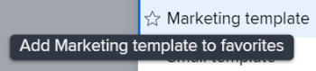

# Adjuntar una plantilla a un proyecto

Puede adjuntar una plantilla a un proyecto durante la fase de creación inicial del proyecto o después de crearlo.

Para obtener más información sobre cómo crear un proyecto con una plantilla, consulte [Creación de un proyecto con una plantilla](../../../manage-work/projects/create-projects/create-project-from-template.md).

## Requisitos de acceso

Debe tener lo siguiente para realizar los pasos descritos en este artículo:

<table style="table-layout:auto"> 
 <col> 
 <col> 
 <tbody> 
  <tr> 
   <td role="rowheader">plan Adobe Workfront*</td> 
   <td> 
Cualquiera 
 </td> 
  </tr> 
  <tr> 
   <td role="rowheader">Licencia de Adobe Workfront*</td> 
   <td> 
Plan 
 </td> 
  </tr> 
  <tr> 
   <td role="rowheader">Configuraciones de nivel de acceso*</td> 
   <td> 
Editar acceso a Proyectos 
 
Para obtener información sobre el acceso al proyecto, consulte <a href="../../../administration-and-setup/add-users/configure-and-grant-access/grant-access-projects.md" class="MCXref xref">Concesión de acceso a proyectos</a>.
 
Ver acceso a las plantillas
 
Para obtener información sobre los permisos de plantillas, consulte <a href="../../../workfront-basics/grant-and-request-access-to-objects/share-a-template.md" class="MCXref xref">Compartir una plantilla</a>. 
 
Para obtener información sobre el acceso a plantillas, consulte <a href="../../../administration-and-setup/add-users/configure-and-grant-access/grant-access-templates.md" class="MCXref xref">Concesión de acceso a las plantillas</a>.
 
Nota: Si sigue sin tener acceso, pregunte al administrador de Workfront si ha establecido restricciones adicionales en su nivel de acceso. Para obtener información sobre cómo un administrador de Workfront puede modificar su nivel de acceso, consulte <a href="../../../administration-and-setup/add-users/configure-and-grant-access/create-modify-access-levels.md" class="MCXref xref">Crear o modificar niveles de acceso personalizados</a>.
 </td> 
  </tr> 
  <tr> 
   <td role="rowheader">Permisos de objeto</td> 
   <td> 
Administración de permisos del proyecto
 
Para obtener información sobre los permisos del proyecto, consulte <a href="../../../workfront-basics/grant-and-request-access-to-objects/share-a-project.md" class="MCXref xref">Uso compartido de un proyecto en Adobe Workfront</a>. 
 
Ver permisos o superiores a la plantilla
 
Para obtener información sobre cómo solicitar acceso adicional, consulte <a href="../../../workfront-basics/grant-and-request-access-to-objects/request-access.md" class="MCXref xref">Solicitud de acceso a objetos </a>.
 </td> 
  </tr> 
 </tbody> 
</table>

&#42;Para saber qué plan, tipo de licencia o acceso tiene, póngase en contacto con su administrador de Workfront.

<!--

<h2>Considerations when adding templates to projects</h2>

(NOTE: moved this to an Overview article of its own) 

Consider the following when adding templates to projects:

<ul>
<li> 
You can attach only active templates to projects. 
 </li>
<li> 
You can attach a template to a project when the project is in a status of Complete, Dead, or in Pending Approval, only when your Adobe Workfront administrator or a group administrator has enabled this functionality in the Project&nbsp;Preferences area. For information about setting project preferences, see <a href="../../../administration-and-setup/set-up-workfront/configure-system-defaults/set-project-preferences.md" class="MCXref xref">Configure system-wide project preferences</a>. 
 </li>
<li> 
Unless you exclude specific template tasks from being added in the attachment process, all template tasks are added to the existing project. 
 </li>
<li> 
Most template settings are added to the project. 
 </li>
<li> 
Some settings from the template automatically transfer to the project, unless you specifically mark them to be excluded. 

Example: </b>">
<b>Example: </b>

For example, these settings are added to the project:

<ul>
<li>Start&nbsp;From field</li>
<li>Custom forms and the information on them</li>
<li>Queue Details </li>
<li>Financial settings </li>
</ul>

 </li>
</ul>

-->

## Adjuntar una plantilla a un proyecto existente {#attach-a-template-to-an-existing-project}

Puede adjuntar una plantilla a un proyecto en Workfront desde la página del proyecto o desde una lista de proyectos o un informe.

1. Vaya al proyecto donde desea adjuntar una plantilla y haga clic en el **Más** icono  a la derecha del nombre del proyecto

   

   O

   Vaya a una lista de proyectos o a un informe y seleccione un proyecto. A continuación, haga clic en **Más** icono  al principio de la lista.

   

1. Clic **Adjuntar plantilla**.

   Aparece el cuadro Adjuntar plantilla.

1. Empiece a escribir el nombre de la plantilla que desea adjuntar en el **Buscar plantillas** y, a continuación, haga clic en él cuando se muestre en la lista.

   O

   Haga clic en el nombre de una plantilla en la **Otras plantillas** área.

   A la derecha se muestra una vista previa de la plantilla, que contiene la siguiente información sobre la plantilla:

   * Duración
   * Propietario
   * El número de tareas de nivel superior (incluye una lista de las tres primeras tareas de nivel superior)
   * Número total de tareas
   * Nombres de los formularios personalizados adjuntos

   

1. (Opcional) Haga clic en **Favoritos** icono  a la izquierda del nombre de la plantilla para marcarla como favorita. Esto mueve la plantilla a la lista Favoritos.

   

1. (Opcional) Haga clic en **Favoritos** icono  para quitarlo de nuevo de la lista Favoritos.
1. Clic **Personalizar y adjuntar**.

   

1. Actualice la información de las secciones siguientes antes de adjuntar la plantilla (o haga clic en **Adjuntar plantilla** en cualquier momento):

   <table style="table-layout:auto"> 
    <col> 
    <col> 
    <tbody> 
     <tr> 
      <td role="rowheader" colspan="2"> 
Sección Tareas
 
  
 </td> 
     </tr> 
     <tr> 
      <td role="rowheader">Las tareas de plantilla seleccionadas a continuación se importan al proyecto. Anule la selección de los que desee excluir. </td> 
      <td>Anule la selección de cualquier tarea que desee excluir de la plantilla antes de adjuntarla al proyecto.</td> 
     </tr> 
     <tr> 
      <td role="rowheader">Seleccione el proyecto que desee como predecesor para las tareas de esta plantilla.</td> 
      <td> 
Haga clic en el campo para mostrar una lista de tareas del proyecto. Seleccione qué tarea de proyecto desea finalizar antes de que puedan iniciarse las tareas de plantilla. También puede omitir este paso y configurar relaciones dentro del proyecto después de adjuntar la plantilla. 
 
 Seleccione el <strong>Tipo de dependencia</strong>, <strong>Retardo</strong> y si desea que el predecesor sea <strong>Forzado</strong> o no. 
 </td> 
     </tr> 
     <tr> 
      <td role="rowheader">Seleccione el proyecto que desea que sea el principal de las tareas de esta plantilla.</td> 
      <td> Seleccione qué tarea de proyecto desea designar como tarea principal para todas las tareas de plantilla. Si no realiza ninguna selección, todas las tareas de plantilla aparecerán al final de las tareas del proyecto actual. Puede omitir este paso y mover las tareas en el proyecto después de adjuntar la plantilla.</td> 
     </tr> 
     <tr> 
      <td role="rowheader" colspan="2"> 
Sección Opciones
 
  
 </td> 
     </tr> 
     <tr> 
      <td role="rowheader">Los elementos seleccionados a continuación se transfieren al proyecto. Anule la selección de los que desee excluir.</td> 
      <td> 
Anule la selección de las casillas de verificación situadas junto a la información que desee borrar de la plantilla antes de adjuntarla al proyecto. Esta información no se transfiere de la plantilla al proyecto. Para obtener más información sobre cada campo, consulte <a href="../../../manage-work/projects/create-and-manage-templates/attach-template-to-project-overview.md" class="MCXref xref">Información general sobre cómo adjuntar una plantilla a un proyecto</a>. 
 
Importante: Si marca la <strong>Configuración de propiedades y problemas de cola</strong> , los Detalles de cola de la plantilla sobrescribirán los del proyecto. En este caso, las reglas de enrutamiento, los temas de cola y los grupos de temas de la plantilla se agregan a los del proyecto.  Si el proyecto está configurado como cola de solicitudes y la plantilla adjunta al proyecto no está configurada como cola de solicitudes, la información de cola del proyecto se quita si se abandona el proyecto <strong>Configuración de problemas y propiedades de cola</strong> casilla activada.  Si anula la selección de <strong>Propiedades de cola y configuración de problemas</strong> , se conservarán todos los valores de configuración de la cola del proyecto y no se adjuntará ningún valor de configuración de la cola de la plantilla. 
 </td> 
     </tr> 
     <tr> 
      <td role="rowheader" colspan="2"> 
Sección de Forms personalizado
 
  
 </td> 
     </tr> 
     <tr> 
      <td role="rowheader">Forms personalizado</td> 
      <td> 
Cuando se adjuntan formularios personalizados a la plantilla, sus nombres se muestran en el panel izquierdo. 
 </td> 
     </tr> 
    </tbody> 
   </table>

1. (Opcional) Actualice la información en los formularios personalizados. Esta información se transfiere al proyecto.

   >[!TIP]
   >
   >* Este paso es obligatorio cuando los formularios personalizados de la plantilla contienen campos obligatorios vacíos.
   >* Si los campos de la plantilla de formularios personalizados ya existen en el proyecto y contienen información, conservan la información que ya existe en el proyecto. No puede editarlos al adjuntar la plantilla.

1. Clic **Adjuntar plantilla.**
1. Clic **Cancelar adjunto** para dejar de adjuntar la plantilla.

   O

   Permita que el archivo adjunto termine de agregar la plantilla al proyecto.

   Después de adjuntar la plantilla, puede editar el proyecto y ajustar cualquier tarea, información o configuración según sea necesario.

1. (Opcional) Haga clic en **Detalles del proyecto**, entonces **Información general** para ver el nombre de la plantilla adjunta en el **Relaciones del proyecto** área.

   >[!TIP]
   >
   >Si adjunta más de una plantilla al proyecto, solo se mostrará en este campo la plantilla que adjuntó primero. Para obtener más información, consulte [Adjuntar varias plantillas a un proyecto existente y ver la información de las plantillas](#attach-multiple-templates-to-an-existing-project-and-view-template-information) de este artículo.

1. (Opcional) Quite la información de la plantilla del proyecto donde la adjuntó. Para obtener más información, consulte [Quitar información de plantilla de un proyecto](../../../manage-work/projects/create-and-manage-templates/remove-template-from-project.md).

## Adjuntar varias plantillas a un proyecto existente y ver la información de las plantillas {#attach-multiple-templates-to-an-existing-project-and-view-template-information}

Puede adjuntar varias plantillas (una a la vez) al mismo proyecto, siguiendo los pasos descritos en la sección [Adjuntar una plantilla a un proyecto existente](#attach-a-template-to-an-existing-project) en este artículo. Esto agrega al proyecto las tareas y otra información de cada plantilla.

>[!TIP]
>
>Cuando se adjuntan varias plantillas a un proyecto, sólo aparece la que se adjuntó en primer lugar en el área Detalles del proyecto.

Para comprender qué plantilla se aplica a un proyecto:

1. Vaya a un proyecto que tenga una plantilla adjunta.
1. Clic **Detalles del proyecto** en el panel izquierdo.
1. Busque el nombre de la plantilla adjunta al proyecto en la **Plantilla** en la parte inferior del campo **Información general** sección debajo de **Relaciones del proyecto** .

   

