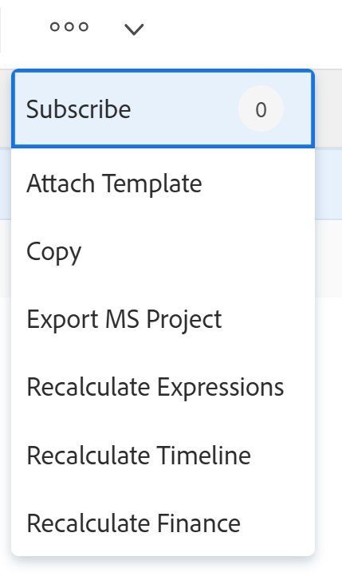
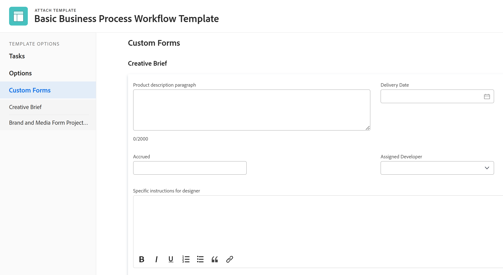

# Adjuntar una plantilla a un proyecto

<!-- Audited: 10/2025 -->

Puede adjuntar una plantilla a un proyecto durante la fase de creación inicial del proyecto o después de crearlo.

Para obtener más información sobre cómo crear un proyecto con una plantilla, consulte [Crear un proyecto mediante una plantilla](../../../manage-work/projects/create-projects/create-project-from-template.md).

## Requisitos de acceso

+++ Expanda para ver los requisitos de acceso para la funcionalidad en este artículo.

<table style="table-layout:auto"> 
 <col> 
 <col> 
 <tbody> 
  <tr> 
   <td role="rowheader">paquete de Adobe Workfront</td> 
   <td> 
Cualquiera
 </td> 
  </tr> 
  <tr> 
   <td role="rowheader">Licencia de Adobe Workfront</td> 
   <td> 
Estándar

    
Plan

    
 </td> 
  </tr> 
  <tr> 
   <td role="rowheader">Configuraciones de nivel de acceso</td> 
   <td> 
Acceso de edición a proyectos 
 
Ver acceso a las plantillas
</td> 
  </tr> 
  <tr> 
   <td role="rowheader">Permisos de objeto</td> 
   <td> 
Administrar permisos del proyecto
 
Permisos de visualización o superiores de la plantilla
 </td> 
  </tr> 
 </tbody> 
</table>

Para obtener más información sobre el contenido de esta tabla, consulte [Requisitos de acceso en la documentación de Workfront](/help/quicksilver/administration-and-setup/add-users/access-levels-and-object-permissions/access-level-requirements-in-documentation.md).

+++

<!--Old:
 
 <table style="table-layout:auto"> 
 <col> 
 <col> 
 <tbody> 
  <tr> 
   <td role="rowheader">Adobe Workfront plan</td> 
   <td> 
Any 
 </td> 
  </tr> 
  <tr> 
   <td role="rowheader">Adobe Workfront license</td> 
   <td> 
New: Standard

   
Or

   
Current: Plan

    
 </td> 
  </tr> 
  <tr> 
   <td role="rowheader">Access level configurations</td> 
   <td> 
Edit access to Projects 
 
For information about project access, see <a href="../../../administration-and-setup/add-users/configure-and-grant-access/grant-access-projects.md" class="MCXref xref">Grant access to projects</a>.
 
View access to&nbsp;Templates
 
For information about template permissions, see <a href="../../../workfront-basics/grant-and-request-access-to-objects/share-a-template.md" class="MCXref xref">Share a template</a>. 
 
For information about template access, see <a href="../../../administration-and-setup/add-users/configure-and-grant-access/grant-access-templates.md" class="MCXref xref">Grant access to templates</a>.
 
Note: If you still don't have access, ask your Workfront administrator if they set additional restrictions in your access level. For information on how a Workfront administrator can modify your access level, see <a href="../../../administration-and-setup/add-users/configure-and-grant-access/create-modify-access-levels.md" class="MCXref xref">Create and modify custom access levels</a>.
 </td> 
  </tr> 
  <tr> 
   <td role="rowheader">Object permissions</td> 
   <td> 
Manage permissions to the project
 
For information about project permissions, see <a href="../../../workfront-basics/grant-and-request-access-to-objects/share-a-project.md" class="MCXref xref">Share a project in Adobe Workfront</a>. 
 
View permissions or higher to the template
 
For information on requesting additional access, see <a href="../../../workfront-basics/grant-and-request-access-to-objects/request-access.md" class="MCXref xref">Request access to objects </a>.
 </td> 
  </tr> 
 </tbody> 
</table>-->

<!--

<h2>Considerations when adding templates to projects</h2>

(NOTE: moved this to an Overview article of its own) 

Consider the following when adding templates to projects:

<ul>
<li> 
You can attach only active templates to projects. 
 </li>
<li> 
You can attach a template to a project when the project is in a status of Complete, Dead, or in Pending Approval, only when your Adobe Workfront administrator or a group administrator has enabled this functionality in the Project&nbsp;Preferences area. For information about setting project preferences, see <a href="../../../administration-and-setup/set-up-workfront/configure-system-defaults/set-project-preferences.md" class="MCXref xref">Configure system-wide project preferences</a>. 
 </li>
<li> 
Unless you exclude specific template tasks from being added in the attachment process, all template tasks are added to the existing project. 
 </li>
<li> 
Most template settings are added to the project. 
 </li>
<li> 
Some settings from the template automatically transfer to the project, unless you specifically mark them to be excluded. 

Example: </b>">
<b>Example: </b>

For example, these settings are added to the project:

<ul>
<li>Start&nbsp;From field</li>
<li>Custom forms and the information on them</li>
<li>Queue Details </li>
<li>Financial settings </li>
</ul>

 </li>
</ul>

-->

## Adjuntar una plantilla a un proyecto existente {#attach-a-template-to-an-existing-project}

Puede adjuntar una plantilla a un proyecto desde la página del proyecto o desde una lista de proyectos o un informe.

{{step1-to-projects}}

1. En la página **Proyectos**, seleccione el proyecto al que desee adjuntar una plantilla.

1. Haga clic en el icono **Más**  a la derecha del nombre del proyecto.

   

   O

   Vaya a una lista de proyectos o a un informe y seleccione un proyecto. Luego, haga clic en el icono **Más**  que se encuentra en la parte superior de la lista.

   

1. Haga clic en **Adjuntar plantilla**. Se muestra el cuadro **Adjuntar plantilla**.

1. Empiece a escribir el nombre de la plantilla que desea adjuntar en el campo **Buscar plantillas** y, a continuación, haga clic en ella cuando se muestre en la lista.

   O

   Haga clic en el nombre de una plantilla en el área **Otras plantillas**.

   A la derecha se muestra una vista previa de la plantilla, que contiene la siguiente información sobre la plantilla:

   * Duración
   * Propietario
   * El número de tareas de nivel superior (incluye una lista de las tres primeras tareas de nivel superior)
   * Número total de tareas
   * Nombres de los formularios personalizados adjuntos

   

1. (Opcional) Haga clic en el icono de **Favoritos**  a la derecha del nombre de la plantilla para marcarla como favorita y moverla a la lista de **Favoritos**.

1. (Opcional) Vuelva a hacer clic en el icono **Favoritos**  para quitarlo de la lista **Favoritos**.
1. Haga clic en **Personalizar y adjuntar**. Se abre el panel lateral **Adjuntar plantilla**.

1. (Opcional) Actualice la información en las siguientes secciones:

   <table style="table-layout:auto"> 
    <col> 
    <col> 
    <tbody> 
     <tr> 
      <td role="rowheader" colspan="2"> 
Sección Tareas
 
  
 </td> 
     </tr> 
     <tr> 
      <td role="rowheader">Las siguientes tareas de plantilla seleccionadas se importan al proyecto. Anule la selección de aquellas que quiera excluir. </td> 
      <td>Anule la selección de cualquier tarea que desee excluir de la plantilla antes de adjuntarla al proyecto.</td> 
     </tr> 
     <tr> 
      <td role="rowheader">Seleccione la tarea del proyecto que desee como predecesora para las tareas de esta plantilla.</td> 
      <td> 
Haga clic en el campo para mostrar una lista de tareas de proyecto y, a continuación, seleccione qué tarea debe finalizar antes de que puedan comenzar las tareas de plantilla. De forma alternativa, puede omitir este paso y configurar relaciones dentro del proyecto después de adjuntar la plantilla. 
 
 Seleccione la información de <strong>Tipo de dependencia</strong>, <strong>Tiempo de retardo</strong> y, si desea que se aplique el predecesor, marque la casilla de verificación <strong>Aplicar predecesor</strong>. 
 </td> 
     </tr> 
     <tr> 
      <td role="rowheader">Seleccione la tarea del proyecto que desee como principal de las tareas de esta plantilla.</td> 
      <td> Seleccione qué tarea del proyecto desea designar como tarea principal para todas las tareas de la plantilla. Si no realiza ninguna selección, todas las tareas de plantilla aparecerán al final de las tareas del proyecto actual. Puede omitir este paso y mover las tareas en el proyecto después de adjuntar la plantilla.</td> 
     </tr> 
     <tr> 
      <td role="rowheader" colspan="2"> 
Sección Opciones
 
  
 </td> 
     </tr> 
     <tr> 
      <td role="rowheader">Los siguientes elementos seleccionados se transfieren al proyecto. Anule la selección de aquellos que quiera excluir.</td> 
      <td> 
Anule la selección de las casillas de verificación de la información que desee excluir de la plantilla antes de adjuntarla al proyecto. Para obtener más información sobre cada campo, consulte <a href="../../../manage-work/projects/create-and-manage-templates/attach-template-to-project-overview.md" class="MCXref xref">Información general sobre cómo adjuntar una plantilla a un proyecto</a>. 
 
Importante: Si marca la casilla <strong>Propiedades de cola y configuración de problema</strong>, los detalles de cola de la plantilla sobrescribirán los del proyecto. En este caso, las reglas de enrutamiento, los temas de cola y los grupos de temas de la plantilla se añaden a los del proyecto.  Si el proyecto está configurado como cola de solicitudes y la plantilla adjunta al proyecto no está configurada como cola de solicitudes, la información de la cola del proyecto se quita si deja activada la casilla <strong>Propiedades de cola y configuración de problemas</strong>.  Si anula la selección del cuadro <strong>Propiedades de cola y configuración de problema</strong>, se conservará la configuración de la configuración de cola del proyecto y no se adjuntará ninguna configuración de la configuración de cola de la plantilla. 
 </td> 
     </tr> 
     <tr> 
      <td role="rowheader" colspan="2"> 
Información general sobre formularios personalizados
 
  
 </td> 
     </tr> 
     <tr> 
      <td role="rowheader">Formularios personalizados</td> 
      <td> 
Cuando se adjuntan formularios personalizados a la plantilla, sus nombres se muestran en el panel izquierdo. 
 </td> 
     </tr> 
    </tbody> 
   </table>

1. (Opcional) Actualice la información de los formularios personalizados. Esta información se transfiere al proyecto.

   >[!TIP]
   >
   >* Este paso es obligatorio cuando los formularios personalizados de la plantilla contienen campos obligatorios que están vacíos.
   >* Si los campos de los formularios personalizados de la plantilla ya existen en el proyecto y contienen información, conservan la información que ya existe en el proyecto. No se pueden editar al adjuntar la plantilla.

1. Haga clic en **Adjuntar plantilla.**
1. Haga clic en **Cancelar archivo adjunto** para dejar de adjuntar la plantilla.

   O

   Permita que el archivo adjunto termine de añadir la plantilla al proyecto.

   Después de adjuntar la plantilla, puede editar el proyecto y ajustar cualquier tarea, información o configuración según sea necesario.

1. (Opcional) En el panel izquierdo, haga clic en **Detalles del proyecto** y, a continuación, en **Información general** para ver el nombre de la plantilla que adjuntó en el área **Relaciones entre proyectos**.

   >[!TIP]
   >
   >Si adjunta más de una plantilla al proyecto, solo se mostrará en este campo la plantilla que adjuntó primero. Para obtener más información, consulte la sección [Adjuntar varias plantillas a un proyecto existente y ver la información de las plantillas](#attach-multiple-templates-to-an-existing-project-and-view-template-information) en este artículo.

1. (Opcional) Quite la información de la plantilla del proyecto donde la adjuntó. Para obtener más información, consulte [Quitar la información de plantilla de un proyecto](../../../manage-work/projects/create-and-manage-templates/remove-template-from-project.md).

## Adjuntar varias plantillas a un proyecto existente y ver la información de las plantillas {#attach-multiple-templates-to-an-existing-project-and-view-template-information}

Puede adjuntar varias plantillas (una a la vez) al mismo proyecto siguiendo los pasos descritos en la sección [Adjuntar una plantilla a un proyecto existente](#attach-a-template-to-an-existing-project) en este artículo. Esto añade al proyecto las tareas y otra información de cada plantilla.

>[!TIP]
>
>Al adjuntar varias plantillas a un proyecto, sólo la plantilla que adjuntó primero se mostrará en el área Detalles del proyecto.

Para ver qué plantilla se aplica a un proyecto:

{{step1-to-projects}}

1. En la página **Proyectos**, seleccione el proyecto que tenga una plantilla adjunta.

1. Haga clic en **Detalles del proyecto** en el panel de navegación izquierdo.

1. Busque el nombre de la plantilla adjunta al proyecto en el campo **Plantilla** en la parte inferior de la sección **Información general** en **Relaciones entre proyectos**.

   

