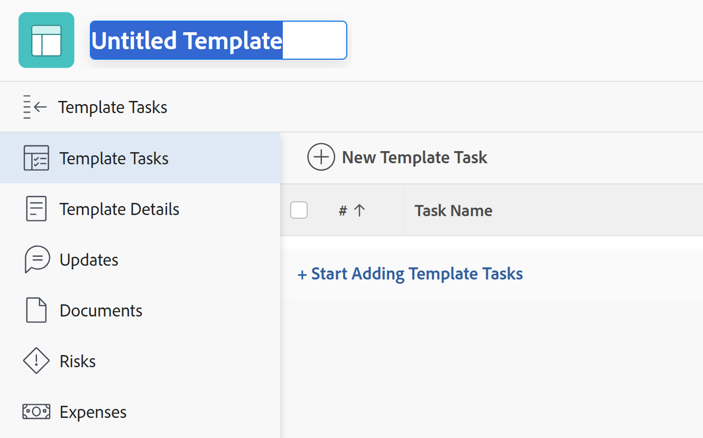
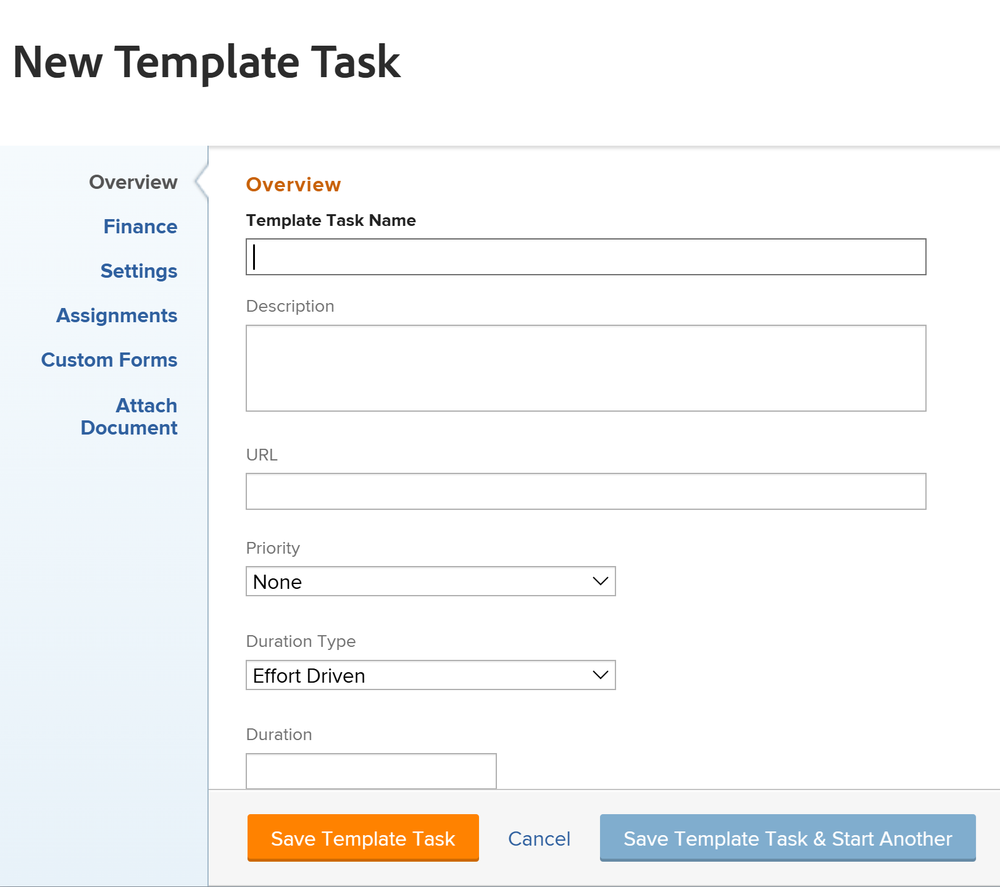

# Crear una plantilla de proyecto

<!-- Audited: 10/2025 -->

<!--remove all instances of new/ old experience and redo the steps when the toggle is removed-->

<!--

 

The highlighted information on this page refers to functionality not yet generally available. It is available only in the Preview environment for all customers. The same features will also be available in the Production environment for all customers starting with a week from the Preview release.      

For more information, see [Interface modernization](/help/quicksilver/product-announcements/product-releases/interface-modernization/interface-modernization.md).  

-->

Puede crear y eliminar plantillas desde el área Plantillas. Al crear una plantilla nueva, puede introducir la información de todas las tareas y de la configuración futura del proyecto. Esta información se transferirá a cualquier proyecto que cree a partir de la plantilla.

>[!NOTE]
>
>Una plantilla y sus tareas no tienen fechas reales, sino una indicación de qué día (a partir de cuándo podría comenzar el proyecto futuro) podría comenzar una tarea y en qué día debería haberse completado la tarea. Cuando se utilizan plantillas para crear proyectos futuros, los proyectos recibirán fechas reales. Para obtener más información, consulte [Crear un proyecto](../create-projects/create-project.md).

Puede crear una nueva plantilla de las siguientes maneras:

* Desde cero, como se describe en este artículo.
* Desde proyectos existentes, guardando un proyecto como plantilla.

  Para obtener más información sobre cómo crear plantillas a partir de proyectos existentes, consulte [Guardar un proyecto como plantilla](../../../manage-work/projects/manage-projects/save-project-as-template.md).

* Copiándolo desde otra plantilla.

  Para obtener más información sobre cómo copiar una plantilla existente, consulte [Copiar una plantilla de proyecto](../../../manage-work/projects/create-and-manage-templates/copy-template.md).

* Mediante la importación de modelos. Debe ser administrador de Workfront para importar modelos. Para obtener más información, consulte [Configurar un modelo](../../../administration-and-setup/blueprints/configure-template-package.md).

## Requisitos de acceso

+++ Expanda para ver los requisitos de acceso para la funcionalidad en este artículo.

<table style="table-layout:auto"> 
 <col> 
 <col> 
 <tbody> 
  <tr> 
   <td role="rowheader">Paquete de Adobe Workfront</td> 
   <td> 
Cualquiera
 </td> 
  </tr> 
  <tr> 
   <td role="rowheader">Licencia de Adobe Workfront</td> 
   <td> 
Estándar 

Plan
 
Debe ser administrador del sistema para importar plantillas de modelos
 </td> 
  </tr> 
  <tr> 
   <td role="rowheader">Configuraciones de nivel de acceso</td> 
   <td> 
Acceso de edición a las plantillas
 </td> 
  </tr> 
  <tr> 
   <td role="rowheader">Permisos de objeto</td> 
   <td> 
De forma predeterminada, tiene permisos de administración para las plantillas que crea
  </td> 
  </tr> 
 </tbody> 
</table>

Para obtener más información sobre esta tabla, consulte [Requisitos de acceso en la documentación de Workfront](/help/quicksilver/administration-and-setup/add-users/access-levels-and-object-permissions/access-level-requirements-in-documentation.md).

+++

<!--
Old:
<table style="table-layout:auto"> 
 <col> 
 <col> 
 <tbody> 
  <tr> 
   <td role="rowheader">Adobe Workfront plan</td> 
   <td> 
Any
 </td> 
  </tr> 
  <tr> 
   <td role="rowheader">Adobe Workfront license</td> 
   <td> 
New: Standard 

Or 

Current: Plan 
 
You must be a system administrator to import templates from Blueprints
 </td> 
  </tr> 
  <tr> 
   <td role="rowheader">Access level configurations*</td> 
   <td> 
Edit access to Templates
 </td> 
  </tr> 
  <tr> 
   <td role="rowheader">Object permissions</td> 
   <td> 
You have Manage permissions to the templates you create, by default
  </td> 
  </tr> 
 </tbody> 
</table>
-->

## Creación de una plantilla

{{step1-to-templates}}

1. Haga clic en **Nueva plantilla**.

1. (Condicional) Según el almacenamiento de documentos que utilice su organización, haga clic en una de las siguientes opciones:

   * **Nueva plantilla**, cuando el administrador de Workfront elige **Adobe Enterprise** o **Workfront heredado**, y seleccionó o no la configuración **Permitir que el usuario seleccione el proveedor de almacenamiento**.
   * **Nueva plantilla (almacenamiento heredado)**, cuando el administrador de Workfront elige **Adobe Enterprise** o **Workfront heredado**, y también seleccionó la configuración **Permitir al usuario seleccionar el proveedor de almacenamiento**.

     Esta opción solo se muestra cuando la opción **Permitir que el usuario seleccione el proveedor de almacenamiento** está seleccionada en el área de configuración.

     Para obtener más información, consulte [Habilitar el almacenamiento empresarial de Adobe para su organización](/help/quicksilver/administration-and-setup/set-up-workfront/configure-system-defaults/enable-esm.md).

     Se crea una plantilla y su nombre predeterminado sigue los siguientes patrones, según el almacenamiento que utilice Workfront para los documentos:

      * **Plantilla sin título** para una plantilla de almacenamiento de Workfront.

        Una plantilla de almacenamiento de Workfront muestra el icono **Almacenamiento de Workfront heredado**  junto a su nombre.

      * **Plantilla sin título: &lt; día del mes, año, hora.minuto.segundo >** para una plantilla de almacenamiento de Adobe

        >[!IMPORTANT]
        >
        >Las plantillas que utilizan el almacenamiento de Adobe deben tener nombres únicos.

   

1. Especifique un nombre para la nueva plantilla en el encabezado de la plantilla y, a continuación, presione **Intro.**
1. Haga clic en la sección **Tareas de plantilla** en el panel izquierdo.
1. Haga clic en **Comenzar a agregar tareas de plantilla** para agregar tareas en línea

   O

   Haga clic en **Nueva tarea de plantilla** para empezar a agregar tareas a su plantilla en el cuadro **Nueva tarea de plantilla**.

   El cuadro **Crear tarea de plantilla** se abrirá en la nueva experiencia al hacer clic en **Nueva tarea de plantilla**.

   

1. (Condicional) Con la nueva experiencia, actualice la información en las siguientes áreas del cuadro **Crear tarea de plantilla**:

   * Nombre de tarea de plantilla
   * Información general
   * Asignaciones
   * Finanzas
   * Formularios personalizados
   * Documentos
   * Configuración

1. Haga clic en **Crear tarea de plantilla**

   O

   Haga clic en **Volver a la experiencia anterior** en la parte inferior del cuadro **Crear tarea de plantilla**.

   La **nueva tarea de plantilla** se abre en la experiencia antigua.

   

   >[!TIP]
   >
   >En Producción, la experiencia antigua se abre de forma predeterminada.

1. Actualice la información en las áreas siguientes del cuadro **Nueva tarea de plantilla**:

   * Información general
   * Finanzas
   * Configuración
   * Asignaciones
   * Formularios personalizados
   * Adjuntar documento

     Actualizar la información de una tarea de plantilla es similar a editar tareas de un proyecto. Para obtener más información, consulte [Editar tareas](/help/quicksilver/manage-work/tasks/manage-tasks/edit-tasks.md). <!--should this be relinked at preview/ prod release to say it's the same as Edit template tasks??-->

   >[!NOTE]
   >
   >No puede añadir tareas recurrentes a una plantilla.

1. Haga clic en una de las siguientes opciones:

   * **Guardar tarea de plantilla** para guardar la tarea de plantilla actual y cierra el cuadro Nueva tarea de plantilla.
   * **Guardar tarea de plantilla e iniciar otra** para guardar la tarea de plantilla actual y abrir otro cuadro **Nueva tarea de plantilla** para agregar otra tarea.
   * **Cancelar** para cerrar el cuadro sin guardar la tarea de plantilla.
1. (Opcional) Después de agregar las tareas de plantilla, en la sección Tareas de plantilla, haga clic en el icono **Diagrama de Gantt** en la esquina superior derecha de la Lista de tareas para ver una representación visual de la lista de tareas de la plantilla.

   >[!TIP]
   >
   >No puede editar tareas directamente desde este gráfico Gantt.

1. Para agregar información a la nueva plantilla, haga clic en el **icono Más** del menú  a la izquierda del nombre de la plantilla en el encabezado y, a continuación, haga clic en **Editar**.

   Para obtener información sobre cómo editar una plantilla, consulte [Editar plantillas de proyecto](../../../manage-work/projects/create-and-manage-templates/edit-templates.md).

   >[!NOTE]
   >
   >   La asociación de una plantilla de proyecto con un grupo (o la falta de un grupo) afecta a la forma en que las preferencias de proyecto, tarea y problema determinan ciertas configuraciones en la plantilla.
   >
   >Para obtener más información, vea la sección &quot;Cómo se aplican las preferencias a las plantillas y tareas de plantilla&quot; en el artículo [Crear y modificar las plantillas de proyecto de un grupo](../../../administration-and-setup/manage-groups/work-with-group-objects/create-and-modify-a-groups-templates.md).

1. Haga clic en **Guardar**.
1. (Opcional) Agregue los siguientes elementos a la plantilla

   * Documentos
   * Riesgos
   * Procesos de aprobación
   * Tarifas de facturación
   * Gastos
   * Detalles de la cola
   * Grupos de temas y temas de la cola

1. (Opcional) Agregue los siguientes elementos a las tareas de la plantilla:

   * Documentos
   * Gastos
   * Aprobaciones

   Para obtener más información, consulte la sección &quot;Agregar más elementos a una plantilla&quot; en el artículo [Editar plantillas de proyecto](../../../manage-work/projects/create-and-manage-templates/edit-templates.md).

