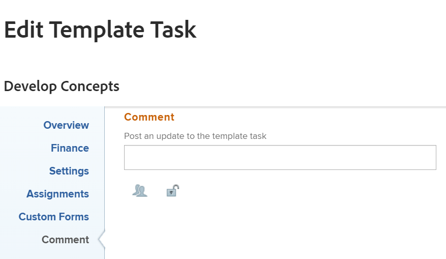

# Editar tareas de plantilla

<!--Audited: 11/2025-->

<!--take out production and preview references and new/ old experiences at release-->

La información resaltada en esta página hace referencia a funcionalidades que aún no están disponibles de forma general. Solo está disponible en el entorno de vista previa para todos los clientes. Las mismas funciones también estarán disponibles en el entorno de producción para todos los clientes a partir de una semana desde la versión de vista previa.

Para obtener más información, vea [Modernización de la interfaz](/help/quicksilver/product-announcements/product-releases/interface-modernization/interface-modernization.md).

Después de crear una plantilla, puede editar la información de las tareas de plantilla. La información que actualiza en una tarea de plantilla se asocia a tareas de proyecto después de utilizar la plantilla para crear un proyecto o de adjuntar la plantilla a un proyecto.

Para obtener información acerca de cómo crear una plantilla, consulte [Crear una plantilla de proyecto](../../../manage-work/projects/create-and-manage-templates/create-template.md).

Puede editar las tareas de plantilla de una en una, o puede editar las tareas de plantilla de forma masiva.

>[!NOTE]
>
>No podrá editar de forma masiva tareas de plantilla que pertenezcan a distintas plantillas. Solo puede editar las tareas de plantilla que pertenezcan a la misma plantilla

## Requisitos de acceso

+++ Expanda para ver los requisitos de acceso para la funcionalidad en este artículo.

<table style="table-layout:auto"> 
 <col> 
 <col> 
 <tbody> 
  <tr> 
   <td role="rowheader">paquete de Adobe Workfront</td> 
   <td> 
Cualquiera
 </td> 
  </tr> 
  <tr> 
   <td role="rowheader">Licencia de Adobe Workfront</td> 
   <td> 
Estándar

   
Plan 
</td> 
  </tr> 
  <tr> 
   <td role="rowheader">Configuración de nivel de acceso</td> 
   <td> 
Acceso de edición a las plantillas
  </td> 
  </tr> 
  <tr> 
   <td role="rowheader">Permisos de objeto </td> 
   <td> 
Administrar permisos para una plantilla. 
 
No puede compartir una tarea de plantilla. 
 </td> 
  </tr> 
 </tbody> 
</table>

Para obtener más información, consulte [Requisitos de acceso en la documentación de Workfront](/help/quicksilver/administration-and-setup/add-users/access-levels-and-object-permissions/access-level-requirements-in-documentation.md).

+++

<!--Old:

<table style="table-layout:auto"> 
 <col> 
 <col> 
 <tbody> 
  <tr> 
   <td role="rowheader">Adobe Workfront plan</td> 
   <td> 
Any
 </td> 
  </tr> 
  <tr> 
   <td role="rowheader">Adobe Workfront license*</td> 
   <td> 
Standard 

   
Plan 
 </td> 
  </tr> 
  <tr> 
   <td role="rowheader">Access level</td> 
   <td> 
Edit access to Templates
  </td> 
  </tr> 
  <tr> 
   <td role="rowheader">Object permissions </td> 
   <td> 
Manage permissions for a template. 
 
You cannot share a template task. 
 </td> 
  </tr> 
 </tbody> 
</table>-->

## Requisitos previos

Antes de empezar, debe

* Creación de una plantilla.

  Para obtener información acerca de cómo crear una plantilla, consulte [Crear una plantilla de proyecto](../../../manage-work/projects/create-and-manage-templates/create-template.md).

## Editar tareas de plantilla

Puede editar una tarea de plantilla mediante las áreas Editar tarea de plantilla o Detalles de tarea de plantilla.

{{step1-to-templates}}

1. Seleccione el nombre de una plantilla para abrirla.
1. Haga clic en **Tareas de plantilla** en el panel de la izquierda.
1. Haga clic en el nombre de una tarea de plantilla en la lista para abrirla.
1. Para editar información limitada sobre la tarea de plantilla, haga lo siguiente:
   1. (Opcional) Haga clic en **Actualizaciones** en el panel izquierdo para agregar actualizaciones a la tarea de plantilla. Las actualizaciones de tareas de plantilla no se transfieren a tareas de proyecto cuando la plantilla se utiliza para crear un proyecto.
   1. (Opcional) Haga clic en **Documentos** en el panel izquierdo para agregar documentos a la tarea de plantilla. Los documentos se transferirán a las tareas del proyecto cuando utilice la plantilla para crear el proyecto.
   1. (Condicional) Para editar información limitada sobre una tarea de plantilla, haga clic en **Detalles de la tarea de plantilla** en el panel izquierdo y, a continuación, vaya a las áreas de la sección Detalles para editar la información de cada área.
   1. (Opcional) Realice una de las siguientes acciones:
      * Haga clic en el icono **Contraer todo**  para contraer todas las áreas.
      * Haga clic en el icono **Editar**  y, a continuación, seleccione una de las áreas siguientes o haga clic en **Editar todo** para editar la información de todas las áreas:

         * Información general
         * Forms personalizado
Los nombres de los formularios personalizados solo se muestran si hay formularios personalizados adjuntos a la tarea de plantilla.
         * Finanzas

        >[!TIP]
        >
        >Para obtener información acerca de todos los campos que se muestran en el área Detalles, continúe editando todos los campos mediante el cuadro Editar tarea de plantilla, como se describe a continuación.

   1. (Opcional) Haga clic en la sección **Subtareas** del panel izquierdo para agregar tareas secundarias a la tarea de plantilla. Agregar subtareas para tareas de plantilla es similar a agregar subtareas de tareas de proyecto. Para obtener más información, vea la sección &quot;Crear subtareas a partir de la sección Subtareas de tareas&quot; en el artículo [Crear subtareas](/help/quicksilver/manage-work/tasks/create-tasks/create-subtasks.md).
   1. (Opcional) Haga clic en **Gastos** en el panel izquierdo y agregue gastos a las tareas de la plantilla. Los gastos de las tareas de plantilla se transfieren a tareas de proyecto futuras cuando la plantilla se utiliza para crear un proyecto.
   1. (Opcional) Haga clic en **Aprobaciones** en el panel izquierdo para crear aprobaciones o adjuntar aprobaciones globales o de nivel de grupo a las tareas de plantilla. Las aprobaciones se transfieren a tareas de proyecto futuras.
   1. (Opcional) Haga clic en la sección **Predecesoras** del panel izquierdo para agregar predecesoras para las tareas de plantilla. Agregar predecesoras de tareas de plantilla es similar a agregar predecesoras de tareas de proyecto. Para obtener más información, vea [Crear una relación de predecesoras mediante el área Predecesoras](/help/quicksilver/manage-work/tasks/use-prdcssrs/create-predecessors-in-predecessors-area.md).

1. (Opcional) Para editar varias tareas de plantilla de forma masiva, seleccione varias tareas de plantilla y luego haga clic en **Editar** en la parte superior de la lista de plantillas.
1. (Condicional) Para editar toda la información sobre la tarea de plantilla o sobre varias tareas al mismo tiempo, haga clic para seleccionarlas en una lista y, a continuación, haga clic en el icono **Editar**  en la parte superior de la lista.

   Se muestra el cuadro **Editar tarea de plantilla**.

   >[!TIP]
   >
   >También puede seleccionar una tarea de plantilla en una lista, luego hacer clic en **Editar** a la derecha del nombre de la tarea de plantilla en el encabezado para abrir el cuadro **Editar tarea de plantilla**.

   

1. (Condicional) En el entorno Producción, considere la posibilidad de especificar información en cualquiera de las siguientes secciones:

   * [Información general](#overview)
   * [Finanzas](#finance)
   * [Configuración](#settings)
   * [Asignaciones](#assignments)
   * [Formularios personalizados](#custom-forms)
   * [Comentario](#comment)

1. Continúe editando la tarea de plantilla como se describe en la sección [Editar una tarea de plantilla usando la experiencia antigua](#edit-a-template-task-using-the-old-experience) de este artículo.

1. (Condicional) En el entorno de vista previa, el cuadro Editar tarea de plantilla se abre en la nueva experiencia. Continúe editando la tarea de plantilla como se describe en la sección [Editar una tarea de plantilla con la nueva experiencia](#edit-a-template-task-using-the-new-experience) de este artículo.
1. (Opcional) Haga clic en **Volver a la experiencia anterior** en la parte inferior del cuadro **Editar tarea de plantilla** para abrir el cuadro **Editar tarea de plantilla** en la experiencia anterior. Continúe editando la tarea de plantilla como se describe en la sección [Editar una tarea de plantilla usando la experiencia antigua](#edit-a-template-task-using-the-old-experience) de este artículo.

### Editar una tarea de plantilla utilizando la experiencia antigua

#### Información general {#overview}

1. Comience a editar una tarea de plantilla como se ha descrito anteriormente.
1. Haga clic en **Información general**.

   

1. Actualice cualquiera de las siguientes opciones:

   <table style="table-layout:auto"> 
    <col> 
    <col> 
    <tbody> 
     <tr> 
      <td role="rowheader"><strong>Nombre</strong> </td> 
      <td>Especifique un nombre para la tarea de plantilla. Este campo no se muestra al editar tareas de plantilla de forma masiva.</td> 
     </tr> 
     <tr> 
      <td role="rowheader"><strong>Descripción</strong> </td> 
      <td>Añada información adicional sobre la tarea de plantilla.</td> 
     </tr> 
     <tr> 
      <td role="rowheader"><strong>URL</strong> </td> 
      <td>Especifique un vínculo web relacionado con la información sobre la tarea de plantilla.</td> 
     </tr> 
     <tr> 
      <td role="rowheader"><strong>Prioridad</strong> </td> 
      <td> 
Se trata de un indicador visual que le permite priorizar las tareas de plantilla. 
 
Seleccione entre las siguientes opciones:
 
       <ul> 
        <li> 
<strong>Ninguno</strong> 
 </li> 
        <li> 
<strong>Bajo</strong> 
 </li> 
        <li> 
 <b>Normal</b>
 </li> 
        <li> 
<b>Alto</b> 
 </li> 
        <li> 
<b>Urgente</b> 
 </li> 
       </ul> 
Según las Preferencias del proyecto seleccionadas por el administrador de Workfront, los nombres de las prioridades pueden ser diferentes para usted. Para obtener más información acerca de cómo editar prioridades, consulte <a href="../../../administration-and-setup/customize-workfront/creating-custom-status-and-priority-labels/create-customize-priorities.md" class="MCXref xref">Crear y personalizar prioridades</a>.
 </td> 
     </tr> 
     <tr> 
      <td role="rowheader"><strong>Tipo de duración</strong> </td> 
      <td> 
La tarea futura creada a partir de esta plantilla tendrá este tipo de duración.  El tipo de duración identifica la relación entre lo siguiente:
 
- número de recursos asignados a una tarea
 
- el esfuerzo total necesario para completar la tarea
 
- la duración total de la tarea. 
 
Los tipos de duración permiten establecer asignaciones de recursos coherentes según las necesidades de la tarea. Para obtener más información acerca del tipo de duración de una tarea, consulte <a href="../../../manage-work/tasks/taskdurtn/task-duration-and-duration-type.md" class="MCXref xref">Información general sobre la duración de la tarea y el tipo de duración</a>.
 
Seleccione entre las siguientes opciones:
 
       <ul> 
        <li> 
Asignación calculada 
 </li> 
        <li> 
Trabajo calculado 
 </li> 
        <li> 
Condicionada por el esfuerzo 
 </li> 
        <li> 
Sencilla  
 </li> 
       </ul> </td> 
     </tr> 
     <tr> 
      <td role="rowheader"><strong>Duración</strong> </td> 
      <td> 
Especifique la duración de las tareas futuras, en minutos, horas, días, semanas o meses. La futura tarea creada a partir de esta plantilla tendrá la duración especificada aquí.
 
De forma predeterminada, Workfront mide la duración en días. Cantidad de tiempo que se permite para que la tarea permanezca incompleta antes de que deba completarse. No podrá especificar la duración de una tarea cuando el <strong>tipo de duración</strong> de la tarea sea <strong>Simple</strong> o cuando la <strong>restricción de tarea</strong> sea <strong>Fechas fijas</strong>.
 
<b>IMPORTANTE</b>
 
La duración suele ser la cantidad de tiempo entre las fechas planificadas de inicio y finalización de una tarea de plantilla y, por este motivo, afecta a la cronología de la plantilla. Esto determina la cronología del futuro proyecto creado a partir de la plantilla. 
 </td> 
     </tr> 
     <tr> 
      <td role="rowheader"><strong>Horas planificadas</strong> </td> 
      <td> 
Especifique el número de horas planificadas para la futura tarea del proyecto creado con esta plantilla. Es la cantidad de tiempo real que tardarían los usuarios asignados de la tarea en completarla. Solo puede especificar el número de horas planificadas para una tarea cuando el <strong>tipo de duración</strong> esté establecido en <strong>Asignación calculada</strong>. 
 </td> 
     </tr>

   <tr> 
      <td role="rowheader"><strong>Restricción de tarea</strong> </td> 
      <td> 
La tarea en el proyecto creado a partir de esta plantilla tendrá esta restricción. Las restricciones de tarea identifican cuándo se debe completar una tarea. 
 
Seleccione entre las siguientes opciones:
 
       <ul> 
        <li><strong>Fechas fijas</strong>. Especifique un <strong>inicio planificado</strong> y una <strong>fecha planificada de finalización.</strong></li> 
        <li><strong>Debe iniciarse el</strong>. Especifique una <strong>fecha de inicio planificada.</strong></li> 
        <li><strong>Debe finalizarse el</strong>. Especifique una <strong>Fecha planificada de finalización</strong>.</li> 
        <li><strong>Lo antes posible</strong> </li> 
        <li><strong>Lo más tarde posible</strong> </li> 
        <li style="font-weight: bold;"><strong>Lo más temprano disponible</strong> </li> 
        <li style="font-weight: bold;"><strong>Lo más tarde posible</strong> </li> 
        <li>No iniciar después del. Especifique una <strong>fecha de inicio planificada</strong>.</li> 
        <li><strong>No iniciar antes del</strong>. Especifique una <strong>fecha de inicio planificada</strong>.</li> 
        <li><strong>No terminar después de</strong>. Especifique una <strong>fecha planificada de finalización</strong>.</li> 
        <li><strong>No terminar antes de</strong>. Especifique una <strong>fecha planificada de finalización</strong>.</li> 
       </ul> 
Para obtener más información sobre la restricción de tarea, consulte <a href="../../../manage-work/tasks/task-constraints/task-constraint-overview.md" class="MCXref xref">Información general sobre la restricción de tarea</a>.
 </td> 
     </tr> 
     <tr> 
      <td role="rowheader">Día de inicio (opcional y condicional) </td> 
      <td> 
 Puede especificar el día de inicio de una tarea de plantilla solo cuando la restricción de tarea sea una de las siguientes:
 
       <ul> 
        <li>Debe iniciarse el</li> 
        <li>No iniciar antes del</li> 
        <li>No iniciar después del</li> 
        <li>Fechas fijas</li> 
       </ul> 
Esto corresponderá a la fecha dentro de la cronología del futuro proyecto en que comenzará la tarea. Para todas las demás delimitaciones, Workfront calcula el día de inicio en función de la dependencia de predecesoras entre las tareas. 
 </td> 
     </tr> 
     <tr> 
      <td role="rowheader"><strong>Día de finalización</strong> (opcional y condicional) </td> 
      <td> 
 Puede especificar el día de finalización de una tarea de plantilla solo cuando la restricción de tarea sea una de las siguientes:
 
       <ul style="list-style-type: circle;"> 
        <li>Debe finalizarse el</li> 
        <li>No terminar antes de</li> 
        <li>No terminar después de</li> 
        <li>Fechas fijas</li> 
       </ul> 
Esto corresponderá con la fecha dentro de la cronología del futuro proyecto en que se completará la tarea. Para todas las demás restricciones, Workfront calcula el día de finalización en función de la duración y la dependencia de la predecesora. 
 </td> 
     </tr> 
    </tbody> 
   </table>

1. (Opcional) Siga editando las secciones siguientes, según la información que desee modificar.

   O

   Haga clic en **Guardar cambios**.

#### Finanzas {#finance}

1. Comience a editar una tarea de plantilla como se ha descrito anteriormente.
1. Haga clic en **Finanzas**.

   

1. Actualice cualquiera de las siguientes opciones:

   <table style="table-layout:auto"> 
    <col> 
    <col> 
    <tbody> 
     <tr> 
      <td role="rowheader"><strong>Tipo de coste</strong> </td> 
      <td> 
Especifique el tipo de coste para la tarea futura. Esto determinará cómo se calcula el coste de la tarea, en función del número de horas de las tareas. 
 
Seleccione entre las siguientes opciones:
 
       <ul> 
        <li> 
Sin coste 
 </li> 
        <li> 
Fijo por hora 
 </li> 
        <li> 
Usuario por hora 
 </li> 
        <li> 
Función por hora 
 </li> 
       </ul> 
Para obtener más información sobre los costes de seguimiento, consulte <a href="../../../manage-work/projects/project-finances/track-costs.md" class="MCXref xref">Costes de seguimiento</a>.
 </td> 
     </tr> 
     <tr> 
      <td role="rowheader"><strong>Tipo de ingresos</strong> </td> 
      <td> 
Especifique el tipo de ingresos para la tarea futura. Esto determina cómo se calculan los ingresos de la tarea, en función del número de horas de las tareas.
 
Seleccione entre las siguientes opciones: 
 
       <ul> 
        <li> 
No facturable
 </li> 
        <li> 
Usuario por hora
 </li> 
        <li> 
Rol por hora
 </li> 
        <li> 
Fijo por hora
 </li> 
        <li> 
Usuario por hora sin límite
 </li> 
        <li> 
Rol por hora con límite
 </li> 
        <li> 
Usuario por hora más fijos
 </li> 
        <li> 
Rol por hora más fijos
 </li> 
        <li> 
Ingresos fijos
 </li> 
       </ul> 
Para obtener más información sobre el seguimiento de los ingresos, consulte <a href="../../../manage-work/projects/project-finances/billing-and-revenue-overview.md" class="MCXref xref">Información general sobre facturación e ingresos</a>.
 </td> 
     </tr> 
    </tbody> 
   </table>

1. (Opcional) Siga editando las secciones siguientes, según la información que desee modificar.

   O

   Haga clic en **Guardar cambios**.

#### Configuración {#settings}

1. Comience a editar una tarea de plantilla como se ha descrito anteriormente.
1. Haga clic en **Configuración**.

   

1. Actualice cualquiera de las siguientes opciones:

   <table style="table-layout:auto"> 
    <col> 
    <col> 
    <tbody> 
   <tr> 
      <td role="rowheader">
<b>Hito</b>
</strong> </td> 
      <td> 
Elija un hito para asociarlo a la tarea de plantilla seleccionada.

   
<b>IMPORTANTE</b>

   
Debe asociar una ruta del hito a una plantilla para que este campo se muestre. Para obtener más información, consulte <a href="../create-and-manage-templates/edit-templates.md">Editar plantillas de proyecto</a>.
 
   </td> 
     </tr>
     <tr> 
      <td role="rowheader"><strong>Modo de seguimiento</strong> </td> 
      <td> 
Especifique cómo se rastreará el estado de progreso de la tarea futura. 
 
Seleccione entre las siguientes opciones:
 
       <ul> 
        <li> 
<strong>El usuario debe actualizar</strong> 
 </li> 
        <li> 
<strong>Asumir a tiempo</strong> 
 </li> 
        <li> 
<strong>Ignorar advertencias tardías</strong> 
 </li> 
        <li> 
<strong>Autocompletar</strong> 
 </li> 
        <li> 
<strong>Predecesora</strong> 
 </li> 
       </ul> 
Para obtener más información sobre el modo de seguimiento de las tareas, consulte <a href="../../../manage-work/tasks/task-information/task-tracking-mode.md" class="MCXref xref">Información general sobre el modo de seguimiento de tareas</a>.
 </td> 
     </tr> 
     <tr> 
      <td role="rowheader"><strong>Proceso de aprobación</strong> </td> 
      <td> 
Seleccione el proceso de aprobación que desea asociar con la tarea de plantilla. El administrador de Workfront debe definir los procesos de aprobación de tareas en el nivel del sistema para poder asociarlos a tareas de plantilla. Un usuario con acceso administrativo a los procesos de aprobación también puede crear procesos de aprobación específicos del grupo. Para obtener más información acerca de cómo crear procesos de aprobación, consulte <a href="../../../administration-and-setup/customize-workfront/configure-approval-milestone-processes/create-approval-processes.md" class="MCXref xref">Crear un proceso de aprobación para elementos de trabajo</a>.
 
Tenga en cuenta lo siguiente a la hora de añadir procesos de aprobación: 
 
       <ul> 
       <li>En la lista solo se muestran los procesos de aprobación activos. </li> 
       <li> 
Los procesos de aprobación de todo el sistema y específicos del grupo se muestran en la lista. Los procesos de aprobación asociados a un grupo distinto al de la plantilla no se muestran en la lista.
 
Importante: si el grupo asociado a la plantilla cambia, el proceso de aprobación específico del grupo se convierte en un proceso de aprobación de un solo uso. Para obtener más información acerca de cómo afectan los cambios en el grupo del proyecto o los cambios en el proceso de aprobación a la configuración de aprobación, consulte <a href="../../../administration-and-setup/customize-workfront/configure-approval-milestone-processes/how-changes-affect-group-approvals.md" class="MCXref xref">Cómo afectan los cambios en el grupo y el proceso de aprobación a los procesos de aprobación asignados</a>. 
 </li> 
       <li> 
Si añadió un proceso de aprobación de un solo uso, se mostrará como “&lt;Custom&gt;" en este campo. Para obtener más información, consulte <a href="../../../review-and-approve-work/manage-approvals/associate-approval-with-work.md" class="MCXref xref">Asociar un proceso de aprobación nuevo o existente con el trabajo</a>. 
 <!--
(NOTE: this will be valid only for Classic when they edit the Edit Template box in NWE)
--> </li> 
       <li> 
Cuando se editan por lotes tareas de plantilla, se dan los siguientes escenarios:
 
       <ul> 
       <li> 
Al seleccionar tareas de plantilla del mismo grupo de plantillas, en este campo se muestran tanto los procesos de aprobación de nivel de sistema como de nivel de grupo.
 </li> 
       <li> 
Al seleccionar tareas de plantilla de diferentes grupos de plantillas, solo se muestran en este campo los procesos de aprobación de nivel de sistema.
 </li> 
       <li> 
Cuando cualquiera de las tareas de plantilla tiene un proceso de aprobación de un solo uso adjunto, se reemplaza por el proceso de aprobación de nivel de sistema  o de nivel de grupo  que seleccione. 
 </li> 
       </ul> </li> 
       </ul> </td> 
     </tr> 
     <tr> 
      <td role="rowheader"><strong>Notificaciones de recordatorio</strong> </td> 
      <td> 
Seleccione las notificaciones de recordatorio que desee adjuntar a la tarea de plantilla. Se adjuntarán a las tareas futuras del proyecto creadas a partir de esta plantilla. El administrador del sistema debe configurar las notificaciones de recordatorio para poder seleccionarlas en una tarea. Para obtener más información acerca de cómo configurar notificaciones de recordatorio, consulte <a href="../../../administration-and-setup/manage-workfront/emails/set-up-reminder-notifications.md" class="MCXref xref">Configurar notificaciones de recordatorio</a>.
 </td> 
     </tr> 
    </tbody> 
   </table>

1. (Opcional) Siga editando las secciones siguientes, según la información que desee modificar.

   O

   Haga clic en **Guardar cambios**.

#### Asignaciones {#assignments}

1. Comience a editar una tarea de plantilla como se ha descrito anteriormente.
1. Haga clic en **Asignaciones**.

   

1. Haga clic en **Añadir usuario asignado** para añadir un nuevo usuario asignado a la tarea de plantilla. Puede asignar usuarios, funciones o equipos a una tarea. Puede tener varios usuarios asignados a una tarea. Las tareas futuras tendrán los mismos recursos asignados cuando se creen a partir de esta tarea de plantilla.
1. (Opcional) Si tiene varios usuarios asignados, seleccione el botón de opción **Propietario** para indicar qué usuario o función se considera el propietario de la tarea o el usuario asignado principal. Workfront marca el primer usuario o función que asigna a una tarea de plantilla como Propietario o Usuario principal asignado.
1. (Condicional y opcional) Si la restricción de tarea es Trabajo calculado o Condicionado por el esfuerzo, especifique el **% de asignación** (porcentaje de asignación) de cada usuario asignado. Esta es la cantidad de tiempo de la programación del usuario asignado que puede dedicar a esta tarea. Si se cambia el porcentaje de asignación de un usuario asignado, se cambiarán las horas planificadas de una tarea.
1. (Condicional y opcional) Si la restricción de tarea es simple, especifique las **horas** de cada usuario asignado

   O

   Especifique el número total de **horas planificadas** para la tarea de plantilla. Esto distribuye el total de horas equitativamente entre todos los usuarios asignados.

1. (Condicional y opcional) Si la restricción de tarea es simple, especifique la **Duración** de la tarea de plantilla en días. Esta será la duración de la tarea creada a partir de esta plantilla.
1. (Opcional) Seleccione una función del menú desplegable **Función de usuario asignado**. Esta es la función que el usuario asignado puede desempeñar en esta tarea futura. En el menú desplegable solo aparecen los roles de trabajo asociados con cada usuario asignado en su perfil.
1. (Opcional) Siga editando las secciones siguientes, según la información que desee modificar.

   O

   Haga clic en **Guardar cambios**.

#### Formularios personalizados {#custom-forms}

Puede definir formularios personalizados para que se adjunten automáticamente de forma predeterminada a las tareas cuando estas se añadan a un proyecto. Para obtener información sobre cómo configurar el proyecto para que incluya formularios personalizados de tareas predeterminados, consulte la sección &quot;Tareas&quot; en el artículo [Editar proyectos](../../../manage-work/projects/manage-projects/edit-projects.md).

También puede agregar formularios personalizados a las tareas futuras de un proyecto cuando el proyecto se cree a partir de una plantilla, agregando los formularios personalizados a las tareas de plantilla.

1. Comience a editar una tarea de plantilla como se ha descrito anteriormente.
1. Haga clic en **Formularios personalizados**.

   

1. Seleccione el formulario o formularios personalizados que desee asociar a la tarea de plantilla.

   Debe crear los formularios personalizados antes de que estén disponibles para seleccionarlos en este campo.
En la lista solo se muestran los formularios personalizados activos.
Para obtener más información sobre la creación de formularios personalizados, consulte [Crear un formulario personalizado](/help/quicksilver/administration-and-setup/customize-workfront/create-manage-custom-forms/form-designer/design-a-form/design-a-form.md).
Puede agregar hasta diez formularios personalizados a una tarea de plantilla.
Los formularios se añaden automáticamente a las tareas creadas a partir de la plantilla.
1. (Condicional y opcional) Si adjuntó un formulario personalizado a la tarea de plantilla, edite los campos del formulario. Debe especificar todos los campos obligatorios antes de guardar la tarea de plantilla.

   >[!NOTE]
   >
   >Según la forma en que el administrador de Workfront haya establecido los permisos para las secciones del formulario personalizado, no todos podrán ver o editar los mismos campos en un formulario personalizado determinado. Los permisos para editar campos dentro de una sección de un formulario personalizado dependen de los permisos que tenga sobre la tarea de plantilla o la tarea futura.\
   >Para obtener información acerca de cómo establecer permisos en secciones de un formulario personalizado, consulte [Compartir un formulario personalizado](../../../administration-and-setup/customize-workfront/create-manage-custom-forms/share-access-to-a-custom-form.md).\
   >Para obtener información acerca de cómo establecer permisos para tareas, consulte [Compartir una tarea](../../../workfront-basics/grant-and-request-access-to-objects/share-a-task.md).\
   >Para obtener información acerca de cómo establecer permisos de plantilla, consulte [Compartir una plantilla](../../../workfront-basics/grant-and-request-access-to-objects/share-a-template.md).

1. (Opcional) Siga editando la sección siguiente, según la información que desee modificar.

   O

   Haga clic en **Guardar cambios**.

#### Comentario {#comment}

1. Comience a editar una tarea de plantilla como se ha descrito anteriormente.
1. Haga clic en **Aceptar**.

   

1. Especifique un comentario que desee mostrar en el flujo de actualizaciones de la tarea de plantilla en el campo disponible. Este comentario es visible para todos los que tengan acceso de Vista a la plantilla y a la tarea de plantilla y con acceso para visualizar Notas.
1. Haga clic en **Guardar cambios**.

   Cuando usted u otro usuario crea un proyecto a partir de esta plantilla, todos los ajustes aplicados a las tareas de plantilla se convierten en los ajustes de las tareas de proyecto.

### Editar una tarea de plantilla con la nueva experiencia

Después de abrir el cuadro **Editar tarea de plantilla** en la nueva experiencia, considere la posibilidad de especificar información en cualquiera de las siguientes secciones:

* [Nombre de tarea de plantilla](#template-task-name)
* [Información general](#overview-1)
* [Asignaciones](#assignments-1)
* [Finanzas](#finance-1)
* [Formularios personalizados](#custom-forms-1)
* [Configuración](#settings-1)
* [Comentario](#comment-1)

#### Nombre de tarea de plantilla

>[!TIP]
>
>La sección Nombre de tarea de plantilla no está disponible al editar tareas de plantilla de forma masiva.

1. Comience a editar una tarea de plantilla como se ha descrito anteriormente.
1. En el cuadro Editar tarea de plantilla, haga clic en **Nombre de tarea de plantilla** y agregue un nombre para la tarea de plantilla.

   Esta vista no está disponible al editar tareas de plantilla de forma masiva.

1. (Opcional) Siga editando las secciones siguientes, según la información que desee modificar.

   O

   Haga clic en **Guardar**.

#### Información general {#overview-1}

1. Comience a editar una tarea de plantilla como se ha descrito anteriormente.
1. En el cuadro **Editar tarea de plantilla**, haga clic en **Información general** en el panel izquierdo.

   

1. Actualice cualquiera de las siguientes opciones:

   <table style="table-layout:auto"> 
    <col> 
    <col> 
    <tbody> 
     <tr> 
      <td role="rowheader"><strong>Descripción</strong> </td> 
      <td>Añada información adicional sobre la tarea de plantilla.</td> 
     </tr> 
     <tr> 
      <td role="rowheader"><strong>Prioridad</strong> </td> 
      <td> 
Se trata de un indicador visual que le permite priorizar las tareas de plantilla. 
 
Seleccione entre las siguientes opciones:
 
       <ul> 
        <li> 
<strong>Ninguno</strong> 
 </li> 
        <li> 
<strong>Bajo</strong> 
 </li> 
        <li> 
 <b>Normal</b>
 </li> 
        <li> 
<b>Alto</b> 
 </li> 
        <li> 
<b>Urgente</b> 
 </li> 
       </ul> 
Según las Preferencias del proyecto seleccionadas por el administrador de Workfront, los nombres de las prioridades pueden ser diferentes para usted. Para obtener más información acerca de cómo editar prioridades, consulte <a href="../../../administration-and-setup/customize-workfront/creating-custom-status-and-priority-labels/create-customize-priorities.md" class="MCXref xref">Crear y personalizar prioridades</a>.
 </td> 
     </tr> 
     <tr> 
      <td role="rowheader"><strong>Restricción de tarea</strong> </td> 
      <td> 
La tarea en el proyecto creado a partir de esta plantilla tendrá esta restricción. Las restricciones de tarea identifican cuándo se debe completar una tarea. 
 
Seleccione entre las siguientes opciones:
 
       <ul> 
        <li><strong>Fechas fijas</strong>. Especifique un <strong>inicio planificado</strong> y una <strong>fecha planificada de finalización.</strong></li> 
        <li><strong>Debe iniciarse el</strong>. Especifique una <strong>fecha de inicio planificada.</strong></li> 
        <li><strong>Debe finalizarse el</strong>. Especifique una <strong>Fecha planificada de finalización</strong>.</li> 
        <li><strong>Lo antes posible</strong> </li> 
        <li><strong>Lo más tarde posible</strong> </li> 
        <li style="font-weight: bold;"><strong>Lo más temprano disponible</strong> </li> 
        <li style="font-weight: bold;"><strong>Lo más tarde posible</strong> </li> 
        <li>No iniciar después del. Especifique una <strong>fecha de inicio planificada</strong>.</li> 
        <li><strong>No iniciar antes del</strong>. Especifique una <strong>fecha de inicio planificada</strong>.</li> 
        <li><strong>No terminar después de</strong>. Especifique una <strong>fecha planificada de finalización</strong>.</li> 
        <li><strong>No terminar antes de</strong>. Especifique una <strong>fecha planificada de finalización</strong>.</li> 
       </ul> 
Para obtener más información sobre la restricción de tarea, consulte <a href="../../../manage-work/tasks/task-constraints/task-constraint-overview.md" class="MCXref xref">Información general sobre la restricción de tarea</a>.
 </td> 
     </tr> 
     <tr> 
      <td role="rowheader">Día de inicio (opcional y condicional) </td> 
      <td> 
 Puede especificar el día de inicio de una tarea de plantilla solo cuando la restricción de tarea sea una de las siguientes:
 
       <ul> 
        <li>Debe iniciarse el</li> 
        <li>No iniciar antes del</li> 
        <li>No iniciar después del</li> 
        <li>Fechas fijas</li> 
       </ul> 
Esto corresponderá a la fecha dentro de la cronología del futuro proyecto en que comenzará la tarea. Para todas las demás delimitaciones, Workfront calcula el día de inicio en función de la dependencia de predecesoras entre las tareas. 
 </td> 
     </tr> 
     <tr> 
      <td role="rowheader"><strong>Día de finalización</strong> (opcional y condicional) </td> 
      <td> 
 Puede especificar el día de finalización de una tarea de plantilla solo cuando la restricción de tarea sea una de las siguientes:
 
       <ul style="list-style-type: circle;"> 
        <li>Debe finalizarse el</li> 
        <li>No terminar antes de</li> 
        <li>No terminar después de</li> 
        <li>Fechas fijas</li> 
       </ul> 
Esto corresponderá con la fecha dentro de la cronología del futuro proyecto en que se completará la tarea. Para todas las demás restricciones, Workfront calcula el día de finalización en función de la duración y la dependencia de la predecesora. 
 </td> 
     </tr> 
     <tr> 
      <td role="rowheader"><strong>URL</strong> </td> 
      <td>Especifique un vínculo web relacionado con la información sobre la tarea de plantilla.</td> 
     </tr>

   <tr> 
      <td role="rowheader"><strong>Esfuerzo de trabajo</strong> </td> 
      <td>Elija entre las siguientes opciones:
      <ul><li>Pequeño</li>
      <li>Media</li>
      <li>Grande</li></ul>

   
<b>IMPORTANTE</b>

      
El campo Esfuerzo de trabajo se muestra al editar una tarea de plantilla solamente cuando selecciona la opción <b>Usar esfuerzo de trabajo para calcular automáticamente las horas planificadas para la tarea</b> al editar la plantilla.

   </td> 
     </tr> 
     </tbody> 
   </table>

1. (Opcional) Siga editando las secciones siguientes, según la información que desee modificar.

   O

   Haga clic en **Guardar**.

#### Asignaciones {#assignments-1}

1. Comience a editar una tarea de plantilla como se ha descrito anteriormente.
1. En el cuadro **Editar tarea de plantilla**, haga clic en **Asignaciones** en el panel izquierdo.

   

1. En el campo Buscar personas, funciones o equipos, empiece a escribir el nombre de un usuario asignado y, a continuación, selecciónelo cuando se muestre en la lista

   O

   Haga clic en **Asignármelo** para asignarse a sí mismo la tarea de plantilla.
1. Considere la posibilidad de actualizar la siguiente información:

<table style="table-layout:auto"> 
    <col> 
    <col> 
    <tbody>

<tr> 
      <td role="rowheader"><strong>Tipo de duración</strong> </td> 
      <td> 
La tarea futura creada a partir de esta plantilla tendrá este tipo de duración.  El tipo de duración identifica la relación entre lo siguiente:
 
      <ul>
      <li>
Número de recursos asignados a una tarea
 </li>
      <li>
El esfuerzo total necesario para completar la tarea
</li> 
      <li>
Duración total de la tarea 
</li></ul> 
Con los tipos de duración, puede establecer asignaciones de recursos coherentes en función de las necesidades de la tarea. Para obtener más información acerca del tipo de duración de una tarea, consulte <a href="../../../manage-work/tasks/taskdurtn/task-duration-and-duration-type.md" class="MCXref xref">Información general sobre la duración de la tarea y el tipo de duración</a>.
 
Seleccione entre las siguientes opciones:
 
       <ul> 
        <li> 
Asignación calculada 
 </li> 
        <li> 
Trabajo calculado 
 </li> 
        <li> 
Condicionada por el esfuerzo 
 </li> 
        <li> 
Sencilla  
 </li> 
       </ul> </td> 
     </tr> 
     <tr> 
      <td role="rowheader"><strong>Duración</strong> </td> 
      <td> 
Especifique la duración de las tareas futuras, en minutos, horas, días, semanas o meses. La futura tarea creada a partir de esta plantilla tendrá la duración especificada aquí.
 
De forma predeterminada, Workfront mide la duración en días. Cantidad de tiempo que se permite para que la tarea permanezca incompleta antes de que deba completarse. No podrá especificar la duración de una tarea cuando el <strong>tipo de duración</strong> de la tarea sea <strong>Simple</strong> o cuando la <strong>restricción de tarea</strong> sea <strong>Fechas fijas</strong>.
 
<b>IMPORTANTE</b>
 
La duración suele ser la cantidad de tiempo entre las fechas planificadas de inicio y finalización de una tarea de plantilla y, por este motivo, afecta a la cronología de la plantilla. Esto determina la cronología del futuro proyecto creado a partir de la plantilla. 
 </td> 
     </tr> 
     <tr> 
      <td role="rowheader"><strong>Horas planificadas</strong> </td> 
      <td> 
Especifique el número de horas planificadas para la futura tarea del proyecto creado con esta plantilla. Es la cantidad de tiempo real que tardarían los usuarios asignados de la tarea en completarla. Solo puede especificar el número de horas planificadas para una tarea cuando el <strong>tipo de duración</strong> esté establecido en <strong>Asignación calculada</strong>. 
 </td> 
     </tr> 
  </tbody> 
   </table>

1. (Opcional) Siga editando las secciones siguientes, según la información que desee modificar.

   O

   Haga clic en **Guardar**.

#### Finanzas {#finance-1}

1. Comience a editar una tarea de plantilla como se ha descrito anteriormente.
1. En el cuadro **Editar tarea de plantilla**, haga clic en **Finanzas** en el panel izquierdo.

   

1. Actualice cualquiera de las siguientes opciones:

   <table style="table-layout:auto"> 
    <col> 
    <col> 
    <tbody> 
     <tr> 
      <td role="rowheader"><strong>Tipo de coste</strong> </td> 
      <td> 
Especifique el tipo de coste para la tarea futura. Esto determinará cómo se calcula el coste de la tarea, en función del número de horas de las tareas. 
 
Seleccione entre las siguientes opciones:
 
       <ul> 
        <li> 
Sin coste 
 </li> 
        <li> 
Fijo por hora 
 </li> 
        <li> 
Usuario por hora 
 </li> 
        <li> 
Función por hora 
 </li> 
       </ul> 
Para obtener más información sobre los costes de seguimiento, consulte <a href="../../../manage-work/projects/project-finances/track-costs.md" class="MCXref xref">Costes de seguimiento</a>.
 </td> 
     </tr> 
     <tr> 
      <td role="rowheader"><strong>Tipo de ingresos</strong> </td> 
      <td> 
Especifique el tipo de ingresos para la tarea futura. Esto determina cómo se calculan los ingresos de la tarea, en función del número de horas de las tareas.
 
Seleccione entre las siguientes opciones: 
 
       <ul> 
        <li> 
No facturable
 </li> 
        <li> 
Usuario por hora
 </li> 
        <li> 
Rol por hora
 </li> 
        <li> 
Fijo por hora
 </li> 
        <li> 
Usuario por hora sin límite
 </li> 
        <li> 
Rol por hora con límite
 </li> 
        <li> 
Usuario por hora más fijos
 </li> 
        <li> 
Rol por hora más fijos
 </li> 
        <li> 
Ingresos fijos
 </li> 
       </ul> 
Para obtener más información sobre el seguimiento de los ingresos, consulte <a href="../../../manage-work/projects/project-finances/billing-and-revenue-overview.md" class="MCXref xref">Información general sobre facturación e ingresos</a>.
 </td> 
     </tr> 
    </tbody> 
   </table>

1. (Opcional) Siga editando las secciones siguientes, según la información que desee modificar.

   O

   Haga clic en **Guardar**.

#### Formularios personalizados {#custom-forms-1}

Puede definir formularios personalizados para que se adjunten automáticamente de forma predeterminada a las tareas cuando estas se añadan a un proyecto. Para obtener información sobre cómo configurar el proyecto para que incluya formularios personalizados de tareas predeterminados, consulte la sección &quot;Tareas&quot; en el artículo [Editar proyectos](../../../manage-work/projects/manage-projects/edit-projects.md).

También puede agregar formularios personalizados a las tareas futuras de un proyecto cuando el proyecto se cree a partir de una plantilla, agregando los formularios personalizados a las tareas de plantilla.

1. Comience a editar una tarea de plantilla como se ha descrito anteriormente.
1. En el cuadro **Editar tarea de plantilla**, haga clic en **Forms personalizado** en el panel izquierdo.

   

1. Seleccione el formulario o formularios personalizados que desee asociar a la tarea de plantilla.

   Debe crear los formularios personalizados antes de que estén disponibles para seleccionarlos en este campo.
En la lista solo se muestran los formularios personalizados activos.

   Para obtener más información sobre la creación de formularios personalizados, consulte [Crear un formulario personalizado](/help/quicksilver/administration-and-setup/customize-workfront/create-manage-custom-forms/form-designer/design-a-form/design-a-form.md).

   Puede agregar hasta diez formularios personalizados a una tarea de plantilla.
Los formularios se añaden automáticamente a las tareas creadas a partir de la plantilla.
1. (Condicional y opcional) Si adjuntó un formulario personalizado a la tarea de plantilla, edite los campos del formulario. Debe especificar todos los campos obligatorios antes de guardar la tarea de plantilla.

   >[!NOTE]
   >
   >Según la forma en que el administrador de Workfront haya establecido los permisos para las secciones del formulario personalizado, no todos podrán ver o editar los mismos campos en un formulario personalizado determinado. Los permisos para editar campos dentro de una sección de un formulario personalizado dependen de los permisos que tenga sobre la tarea de plantilla o la tarea futura.\
   >Para obtener información acerca de cómo establecer permisos en secciones de un formulario personalizado, consulte [Compartir un formulario personalizado](../../../administration-and-setup/customize-workfront/create-manage-custom-forms/share-access-to-a-custom-form.md).\
   >Para obtener información acerca de cómo establecer permisos para tareas, consulte [Compartir una tarea](../../../workfront-basics/grant-and-request-access-to-objects/share-a-task.md).\
   >Para obtener información acerca de cómo establecer permisos de plantilla, consulte [Compartir una plantilla](../../../workfront-basics/grant-and-request-access-to-objects/share-a-template.md).

1. (Opcional) Siga editando la sección siguiente, según la información que desee modificar.

   O

   Haga clic en **Guardar**.

#### Configuración {#settings-1}

1. Comience a editar una tarea de plantilla como se ha descrito anteriormente.
1. En el **Cuadro Editar tarea de plantilla**, haga clic en **Configuración** en el panel izquierdo.

   

1. Actualice cualquiera de las siguientes opciones:

   <table style="table-layout:auto"> 
    <col> 
    <col> 
    <tbody> 
   <tr> 
      <td role="rowheader">
<b>Hito</b>
</strong> </td> 
      <td> 
Elija un hito para asociarlo a la tarea de plantilla seleccionada.

   
<b>IMPORTANTE</b>

   
Debe asociar una ruta del hito a una plantilla para que este campo se muestre. Para obtener más información, consulte <a href="../create-and-manage-templates/edit-templates.md">Editar plantillas de proyecto</a>.
 
   </td> 
     </tr>
     <tr> 
      <td role="rowheader"><strong>Modo de seguimiento</strong> </td> 
      <td> 
Especifique cómo se rastreará el estado de progreso de la tarea futura. 
 
Seleccione entre las siguientes opciones:
 
       <ul> 
        <li> 
<strong>El usuario debe actualizar</strong> 
 </li> 
        <li> 
<strong>Asumir a tiempo</strong> 
 </li> 
        <li> 
<strong>Ignorar advertencias tardías</strong> 
 </li> 
        <li> 
<strong>Autocompletar</strong> 
 </li> 
        <li> 
<strong>Predecesora</strong> 
 </li> 
       </ul> 
Para obtener más información sobre el modo de seguimiento de las tareas, consulte <a href="../../../manage-work/tasks/task-information/task-tracking-mode.md" class="MCXref xref">Información general sobre el modo de seguimiento de tareas</a>.
 </td> 
     </tr> 
     <tr> 
      <td role="rowheader"><strong>Notificaciones de recordatorio</strong> </td> 
      <td> 
Seleccione las notificaciones de recordatorio que desee adjuntar a la tarea de plantilla. Se adjuntarán a las tareas futuras del proyecto creadas a partir de esta plantilla. El administrador del sistema debe configurar las notificaciones de recordatorio para poder seleccionarlas en una tarea. Para obtener más información acerca de cómo configurar notificaciones de recordatorio, consulte <a href="../../../administration-and-setup/manage-workfront/emails/set-up-reminder-notifications.md" class="MCXref xref">Configurar notificaciones de recordatorio</a>.
 </td> 
     </tr> 
     <tr> 
      <td role="rowheader"><strong>Proceso de aprobación</strong> </td> 
      <td> 
Seleccione el proceso de aprobación que desea asociar con la tarea de plantilla. El administrador de Workfront debe definir los procesos de aprobación de tareas en el nivel del sistema para poder asociarlos a tareas de plantilla. Un usuario con acceso administrativo a los procesos de aprobación también puede crear procesos de aprobación específicos del grupo. Para obtener más información acerca de cómo crear procesos de aprobación, consulte <a href="../../../administration-and-setup/customize-workfront/configure-approval-milestone-processes/create-approval-processes.md" class="MCXref xref">Crear un proceso de aprobación para elementos de trabajo</a>.
 
Tenga en cuenta lo siguiente a la hora de añadir procesos de aprobación: 
 
       <ul> 
       <li>En la lista solo se muestran los procesos de aprobación activos. </li> 
       <li> 
Los procesos de aprobación de todo el sistema y específicos del grupo se muestran en la lista. Los procesos de aprobación asociados a un grupo distinto al de la plantilla no se muestran en la lista.
 
Importante: si el grupo asociado a la plantilla cambia, el proceso de aprobación específico del grupo se convierte en un proceso de aprobación de un solo uso. Para obtener más información acerca de cómo afectan los cambios en el grupo del proyecto o los cambios en el proceso de aprobación a la configuración de aprobación, consulte <a href="../../../administration-and-setup/customize-workfront/configure-approval-milestone-processes/how-changes-affect-group-approvals.md" class="MCXref xref">Cómo afectan los cambios en el grupo y el proceso de aprobación a los procesos de aprobación asignados</a>. 
 </li> 
       <li> 
Si añadió un proceso de aprobación de un solo uso, se mostrará como “&lt;Custom&gt;" en este campo. Para obtener más información, consulte <a href="../../../review-and-approve-work/manage-approvals/associate-approval-with-work.md" class="MCXref xref">Asociar un proceso de aprobación nuevo o existente con el trabajo</a>. 
  </li> 
       <li> 
Cuando se editan por lotes tareas de plantilla, se dan los siguientes escenarios:
 
       <ul> 
       <li> 
Al seleccionar tareas de plantilla del mismo grupo de plantillas, en este campo se muestran tanto los procesos de aprobación de nivel de sistema como de nivel de grupo.
 </li> 
       <li> 
Al seleccionar tareas de plantilla de diferentes grupos de plantillas, solo se muestran en este campo los procesos de aprobación de nivel de sistema.
 </li> 
       <li> 
Cuando cualquiera de las tareas de plantilla tiene un proceso de aprobación de un solo uso adjunto, se reemplaza por el proceso de aprobación de nivel de sistema  o de nivel de grupo  que seleccione. 
 </li> 
       </ul> </li> 
       </ul> </td> 
     </tr>

   </tbody> 
   </table>

1. (Opcional) Siga editando las secciones siguientes, según la información que desee modificar.

   O

   Haga clic en **Guardar**.

#### Comentario {#comment-1}

1. Comience a editar una tarea de plantilla como se ha descrito anteriormente.
1. En el cuadro **Editar tarea de plantilla**, haga clic en **Comentario** en el panel izquierdo.

   

1. En el área **Agregar una actualización a la tarea de plantilla**, especifique un comentario que desee mostrar en el flujo de actualizaciones de la tarea de plantilla en el campo disponible. Este comentario es visible para todos los que tengan acceso de Vista a la plantilla y a la tarea de plantilla y con acceso para visualizar Notas.
1. Haga clic en **Guardar**.

   Cuando usted u otro usuario crea un proyecto a partir de esta plantilla, todos los ajustes aplicados a las tareas de plantilla se convierten en los ajustes de las tareas de proyecto.

