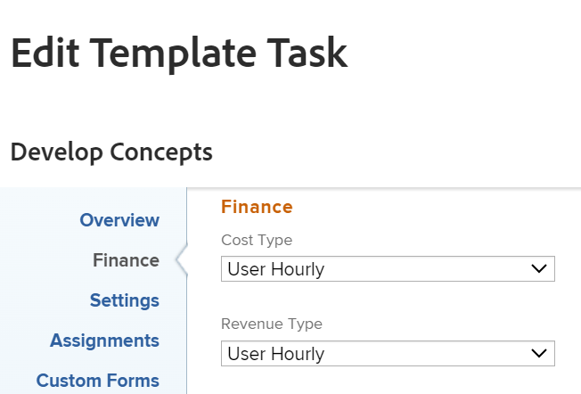

# Editar una tarea de plantilla

Después de crear una plantilla, puede editar información sobre las tareas de plantilla. La información que se actualiza sobre una tarea de plantilla está asociada a tareas de proyecto después de utilizar la plantilla para crear un proyecto o de adjuntar la plantilla a un proyecto.

Para obtener información sobre cómo crear una plantilla, consulte [Creación de una plantilla de proyecto](../../../manage-work/projects/create-and-manage-templates/create-template.md).

## Requisitos de acceso

Debe tener el siguiente acceso para realizar los pasos de este artículo:

<table style="table-layout:auto"> 
 <col> 
 <col> 
 <tbody> 
  <tr> 
   <td role="rowheader">plan de Adobe Workfront*</td> 
   <td> 
Cualquiera
 </td> 
  </tr> 
  <tr> 
   <td role="rowheader">Adobe Workfrontlicense*</td> 
   <td> 
Plan 
 </td> 
  </tr> 
  <tr> 
   <td role="rowheader">Nivel de acceso*</td> 
   <td> 
Editar acceso a Plantillas
 
Nota: Si tiene el acceso correcto pero aún así no puede editar una tarea de plantilla, pregunte a su administrador de Workfront si establece restricciones adicionales en su nivel de acceso. Para obtener información sobre cómo un administrador de Workfront puede cambiar su nivel de acceso, consulte <a href="../../../administration-and-setup/add-users/configure-and-grant-access/create-modify-access-levels.md" class="MCXref xref">Crear o modificar niveles de acceso personalizados</a>.
 </td> 
  </tr> 
  <tr> 
   <td role="rowheader"><strong>Permisos de objeto</strong> </td> 
   <td> 
Administre permisos para una plantilla. 
 
Contribute o permisos superiores para la tarea de plantilla.
 
Para obtener información sobre cómo solicitar acceso a objetos, consulte <a href="../../../workfront-basics/grant-and-request-access-to-objects/request-access.md" class="MCXref xref">Solicitar acceso a objetos </a>.
 </td> 
  </tr> 
 </tbody> 
</table>

&#42;Para saber qué plan, tipo de licencia o nivel de acceso tiene, póngase en contacto con el administrador de Workfront.

## Requisitos previos

Antes de empezar, debe

* Cree una plantilla.

   Para obtener información sobre cómo crear una plantilla, consulte [Creación de una plantilla de proyecto](../../../manage-work/projects/create-and-manage-templates/create-template.md).

## Editar tarea de plantilla

Puede editar una tarea de plantilla mediante las áreas Editar tarea de plantilla o Detalles de tarea de plantilla . Los siguientes pasos describen la edición de una tarea en el cuadro Editar tarea de plantilla.

1. Haga clic en el **Menú principal** icono  en la esquina superior derecha de Adobe Workfront.

1. Haga clic en **Plantillas**.
1. Haga clic en el nombre de una plantilla para abrirla.
1. Haga clic en **Tareas de plantilla** en el panel izquierdo.
1. Haga clic en el nombre de una tarea de plantilla en la lista para abrir la tarea de plantilla.
1. (Condicional) Para editar información limitada sobre la tarea de plantilla, haga clic en **Detalles de la tarea de plantilla** en el panel izquierdo, vaya a las áreas de la sección Detalles para editar la información de cada área.
1. (Opcional) Haga clic en el **Contraer todo** icono  para contraer todas las áreas.
1. Para editar la información de la sección Detalles , haga clic en el botón **Editar** icono y, a continuación, seleccione una de las áreas siguientes o haga clic en **Editar todo** para editar información en todas las áreas:

   * Información general
   * Formularios personalizados

      Los nombres de los formularios de aduanas solo se muestran si hay formularios personalizados adjuntos al objeto.

   * Finanzas
   >[!TIP]
   >
   >Para obtener información sobre todos los campos que se muestran en el área Detalles, continúe editando todos los campos con el cuadro Editar tarea de plantilla que aparece a continuación.

1. (Condicional) Para editar toda la información sobre la tarea de plantilla, haga clic en el **Más** menú  junto al nombre de la tarea de plantilla y, a continuación, haga clic en **Editar**.

   La variable **Editar tarea de plantilla** se muestra.

   >[!TIP]
   >
   >También puede seleccionar una tarea de plantilla en una lista y, a continuación, hacer clic en Editar para abrir el cuadro Editar tarea de plantilla.

   

1. Considere la posibilidad de especificar información en cualquiera de las secciones siguientes:

   * [Información general](#overview)
   * [Finanzas](#finance)
   * [Configuración](#settings)
   * [Asignaciones](#assignments)
   * [Formularios personalizados](#custom-forms)
   * [Comentario](#comment)

### Información general {#overview}

1. Comience a editar una tarea de plantilla como se ha descrito anteriormente.
1. Haga clic en **Información general**.

   

1. Actualice cualquiera de las siguientes opciones:

   <table style="table-layout:auto"> 
    <col> 
    <col> 
    <tbody> 
     <tr> 
      <td role="rowheader"><strong>Nombre</strong> </td> 
      <td>Especifique un nombre para la tarea de plantilla.</td> 
     </tr> 
     <tr> 
      <td role="rowheader"><strong>Descripción</strong> </td> 
      <td>Añada información adicional sobre la tarea de plantilla.</td> 
     </tr> 
     <tr> 
      <td role="rowheader"><strong>URL</strong> </td> 
      <td>Especifique un vínculo web relacionado con la información sobre la tarea de plantilla.</td> 
     </tr> 
     <tr> 
      <td role="rowheader"><strong>Prioridad</strong> </td> 
      <td> 
Se trata de un indicador visual que le permite priorizar las tareas de plantilla. 
 
Seleccione entre las siguientes opciones:
 
       <ul> 
        <li> 
<strong>Ninguno</strong> 
 </li> 
        <li> 
<strong>Bajo</strong> 
 </li> 
        <li> 
Normal 
 </li> 
        <li> 
Alto 
 </li> 
        <li> 
Urgente 
 </li> 
       </ul> 
Según las preferencias de proyecto seleccionadas por el administrador de Workfront, los nombres de las prioridades pueden ser diferentes para usted. Para obtener más información sobre las prioridades de edición, consulte <a href="../../../administration-and-setup/customize-workfront/creating-custom-status-and-priority-labels/create-customize-priorities.md" class="MCXref xref">Crear y personalizar prioridades</a>.
 </td> 
     </tr> 
     <tr> 
      <td role="rowheader"><strong>Tipo de duración</strong> </td> 
      <td> 
La tarea futura creada a partir de esta plantilla tendrá este tipo de duración.  Tipo de duración identifica la relación entre lo siguiente:
 
: número de recursos asignados a una tarea
 
- el esfuerzo total necesario para completar la tarea
 
: duración total de la tarea. 
 
Los tipos de duración permiten establecer asignaciones de recursos coherentes en función de las necesidades de la tarea. Para obtener más información sobre el tipo de duración de una tarea, consulte <a href="../../../manage-work/tasks/taskdurtn/task-duration-and-duration-type.md" class="MCXref xref">Información general sobre la duración y el tipo de duración de la tarea</a>.
 
Seleccione entre las siguientes opciones:
 
       <ul> 
        <li> 
Asignación calculada 
 </li> 
        <li> 
Trabajo calculado 
 </li> 
        <li> 
Condicionada por el esfuerzo 
 </li> 
        <li> 
Sencilla   
 </li> 
       </ul> </td> 
     </tr> 
     <tr> 
      <td role="rowheader"><strong>Duración</strong> </td> 
      <td> 
Especifique la Duración de las tareas futuras, en minutos, horas, días, semanas o meses. La tarea futura creada a partir de esta plantilla tendrá la duración especificada aquí.
 
De forma predeterminada, Workfront mide la duración en días. Es la cantidad de tiempo que permite que la tarea permanezca incompleta antes de que se complete. No se puede especificar la duración de una tarea cuando la variable <strong>Tipo de duración</strong> de la tarea es <strong>Sencilla</strong>o cuando la variable <strong>Restricción de tarea</strong> es <strong>Fechas fijas</strong>.
 
Importante: Duración es generalmente la cantidad de tiempo entre las fechas de inicio planeado y las fechas de finalización planeadas de una tarea de plantilla y, por este motivo, afecta a la cronología de la plantilla. Esto determina la cronología del proyecto futuro creado a partir de la plantilla. 
 </td> 
     </tr> 
     <tr> 
      <td role="rowheader"><strong>Horas planificadas</strong> </td> 
      <td> 
Especifique el número de horas planificadas para la tarea futura en el proyecto creado con esta plantilla. Este es el tiempo real que tardarían los asignadores de la tarea en completarla. Solo puede especificar el número de horas planificadas para una tarea cuando la variable<strong>Tipo de duración</strong> está configurado como <strong>Asignación calculada</strong>. 
 </td> 
     </tr> 
     <tr data-mc-conditions=""> 
      <td role="rowheader">Esfuerzo de trabajo </td> 
      <td> 
Cantidad de esfuerzo necesario para completar una tarea. El administrador de proyectos puede decidir utilizar este campo en lugar de Horario planificado para estimar el esfuerzo necesario para completar una tarea. Este campo solo está visible cuando se cumplen las siguientes condiciones: 
 
       <ul> 
        <li> 
La tarea de plantilla tiene un Tipo de duración simple. 
 
Sugerencia: Si actualiza el Tipo de duración de la tarea, este campo se oculta. 
 </li> 
        <li>El administrador de proyectos ha habilitado el campo Utilizar esfuerzo de trabajo para calcular las horas programadas en la plantilla. </li> 
       </ul> 
       
 
        
 Seleccione entre las siguientes opciones:
 
        <ul> 
         <li>Pequeño</li> 
         <li>Medio (este es el valor predeterminado para una nueva tarea)</li> 
         <li>Grande</li> 
        </ul> 
       
 
Para obtener información sobre el uso de Esfuerzo de Trabajo en lugar de Horas planificadas para estimar el esfuerzo de la tarea, consulte <a href="../../../manage-work/tasks/task-information/work-effort.md" class="MCXref xref">Información general sobre el esfuerzo de trabajo</a>.
 </td> 
     </tr> 
     <tr> 
      <td role="rowheader"><strong>Restricción de tarea</strong> </td> 
      <td> 
La tarea del proyecto creada a partir de esta plantilla tendrá esta restricción. Las restricciones de tareas identifican cuándo se debe completar una tarea. 
 
Seleccione entre las siguientes opciones:
 
       <ul> 
        <li><strong>Fechas fijas</strong>. Especifique un <strong>Inicio planificado</strong> y <strong>Fecha de finalización planeada.</strong></li> 
        <li><strong>Debe iniciarse el</strong>. Especifique un <strong>Fecha de inicio planeada.</strong></li> 
        <li><strong>Debe finalizarse el</strong>. Especifique un <strong>Fecha de finalización planeada</strong>.</li> 
        <li><strong>Tan pronto como sea posible</strong> </li> 
        <li><strong>Tan tarde como sea posible</strong> </li> 
        <li style="font-weight: bold;"><strong>Lo más temprano disponible</strong> </li> 
        <li style="font-weight: bold;"><strong>Lo más tarde posible</strong> </li> 
        <li>No iniciar después del. Especifique un <strong>Fecha de inicio planeada</strong>.</li> 
        <li><strong>No iniciar antes del</strong>. Especifique un <strong>Fecha de inicio planeada</strong>.</li> 
        <li><strong>No terminar después de</strong>. Especifique un <strong>Fecha de finalización planeada</strong>.</li> 
        <li><strong>No terminar antes de</strong>. Especifique un <strong>Fecha de finalización planeada</strong>.</li> 
       </ul> 
Para obtener más información sobre la restricción de tareas, consulte <a href="../../../manage-work/tasks/task-constraints/task-constraint-overview.md" class="MCXref xref">Información general sobre la restricción de tareas</a>.
 </td> 
     </tr> 
     <tr> 
      <td role="rowheader">Día de inicio(Opcional y condicional) </td> 
      <td> 
 Puede especificar el día de inicio de una tarea de plantilla solo cuando la Restricción de tarea sea una de las siguientes:
 
       <ul> 
        <li>Debe iniciarse el</li> 
        <li>Iniciar antes de</li> 
        <li>No iniciar después del</li> 
        <li>Fechas fijas</li> 
       </ul> 
Esto corresponde a la fecha dentro de la cronología del proyecto futuro en la que se iniciará la tarea. Para el resto de restricciones, Workfront calcula el día de inicio en función de la dependencia del predecesor entre las tareas. 
 </td> 
     </tr> 
     <tr> 
      <td role="rowheader"><strong>Día de finalización</strong> (Opcional y condicional) </td> 
      <td> 
 Puede especificar el día de finalización de una tarea de plantilla solo cuando la Restricción de tarea sea una de las siguientes:
 
       <ul style="list-style-type: circle;"> 
        <li>Debe finalizarse el</li> 
        <li>Finalizar no antes del</li> 
        <li>No terminar después de</li> 
        <li>Fechas fijas</li> 
       </ul> 
Esto corresponde a la fecha dentro de la cronología del proyecto futuro en que se completará la tarea. Para el resto de restricciones, Workfront calcula el día de finalización en función de la duración y la dependencia del predecesor. 
 </td> 
     </tr> 
    </tbody> 
   </table>

1. (Opcional) Continúe editando las secciones siguientes, según la información que desee modificar.

   O

   Haga clic en **Guardar cambios**.

### Finanzas {#finance}

1. Comience a editar una tarea como se ha descrito anteriormente.
1. Haga clic en **Finanzas**.

   

1. Actualice cualquiera de las siguientes opciones:

   <table style="table-layout:auto"> 
    <col> 
    <col> 
    <tbody> 
     <tr> 
      <td role="rowheader"><strong>Tipo de costo</strong> </td> 
      <td> 
Especifique el tipo de coste para la tarea futura. Esto va a determinar cómo se calcula el coste de la tarea, en función del número de horas en las tareas. 
 
Seleccione entre las siguientes opciones:
 
       <ul> 
        <li> 
Sin costo 
 </li> 
        <li> 
Fijo por hora 
 </li> 
        <li> 
Usuario por hora 
 </li> 
        <li> 
Rol por hora 
 </li> 
       </ul> 
Para obtener más información sobre el seguimiento de costes, consulte <a href="../../../manage-work/projects/project-finances/track-costs.md" class="MCXref xref">Seguimiento de costes</a>.
 </td> 
     </tr> 
     <tr> 
      <td role="rowheader"><strong>Tipo de ingresos</strong> </td> 
      <td> 
Especifique el tipo de ingresos para la tarea futura. Esto determina cómo se calcula el resultado de la tarea, en función del número de horas que haya en las tareas.
 
Seleccione entre las siguientes opciones: 
 
       <ul> 
        <li> 
No facturable
 </li> 
        <li> 
Usuario por hora
 </li> 
        <li> 
Rol por hora
 </li> 
        <li> 
Fijo por hora
 </li> 
        <li> 
Usuario por hora sin tope
 </li> 
        <li> 
Rol por hora con tope
 </li> 
        <li> 
Usuario por hora más fijos
 </li> 
        <li> 
Rol por hora más fijos
 </li> 
        <li> 
Ingresos fijos
 </li> 
       </ul> 
Para obtener más información sobre el seguimiento de ingresos, consulte <a href="../../../manage-work/projects/project-finances/billing-and-revenue-overview.md" class="MCXref xref">Información general sobre facturación e ingresos</a>.
 </td> 
     </tr> 
    </tbody> 
   </table>

1. (Opcional) Continúe editando las secciones siguientes, según la información que desee modificar.

   O

   Haga clic en **Guardar cambios**.

### Configuración {#settings}

1. Comience a editar una tarea como se ha descrito anteriormente.
1. Haga clic en **Configuración**.

   

1. Actualice cualquiera de las siguientes opciones:

   <table style="table-layout:auto"> 
    <col> 
    <col> 
    <tbody> 
   <tr> 
      <td role="rowheader"><strong>
Hito
</strong> </td> 
      <td> 
Elija un hito para asociarlo a la tarea de plantilla seleccionada.

   
<b>IMPORTANTE</b>

   
Debe asociar una ruta de hito con una plantilla para que este campo se muestre. Para obtener más información, consulte <a href="../create-and-manage-templates/edit-templates.md">Editar plantillas de proyecto</a>.
 
   </td> 
     </tr>
     <tr> 
      <td role="rowheader"><strong>Modo de seguimiento</strong> </td> 
      <td> 
Especifique cómo se rastreará el estado de progreso de la tarea futura. 
 
Seleccione entre las siguientes opciones:
 
       <ul> 
        <li> 
<strong>El usuario debe actualizar</strong> 
 </li> 
        <li> 
<strong>Asumir a tiempo</strong> 
 </li> 
        <li> 
<strong>Ignorar advertencias tardías</strong> 
 </li> 
        <li> 
<strong>Autocompletar</strong> 
 </li> 
        <li> 
<strong>Predecesora</strong> 
 </li> 
       </ul> 
Para obtener más información sobre el modo de seguimiento en las tareas, consulte <a href="../../../manage-work/tasks/task-information/task-tracking-mode.md" class="MCXref xref">Información general sobre el modo de seguimiento de tareas</a>.
 </td> 
     </tr> 
     <tr> 
      <td role="rowheader"><strong>Proceso de aprobación</strong> </td> 
      <td> 
Seleccione el proceso de aprobación que desea asociar a la tarea de plantilla. El administrador de Workfront debe definir la tarea de nivel de sistema Procesos de aprobación para poder asociarla con tareas de plantilla. Un usuario con acceso administrativo a procesos de aprobación también puede crear procesos de aprobación específicos del grupo. Para obtener más información sobre la creación de procesos de aprobación, consulte <a href="../../../administration-and-setup/customize-workfront/configure-approval-milestone-processes/create-approval-processes.md" class="MCXref xref">Creación de un proceso de aprobación para elementos de trabajo</a>.
 
Tenga en cuenta lo siguiente al agregar procesos de aprobación: 
 
       <ul> 
       <li>En la lista solo se muestran los procesos de aprobación activos. </li> 
       <li> 
En la lista se muestran los procesos de aprobación de todo el sistema y de grupos específicos. Los procesos de aprobación asociados a un grupo que no sea el de la plantilla no se muestran en la lista.
 
Importante: Si el grupo asociado con la plantilla cambia, el proceso de aprobación específico del grupo se convierte en un proceso de aprobación de un solo uso. Para obtener más información sobre cómo los cambios en el grupo del proyecto o en el proceso de aprobación afectan a la configuración de aprobación, consulte <a href="../../../administration-and-setup/customize-workfront/configure-approval-milestone-processes/how-changes-affect-group-approvals.md" class="MCXref xref">Efecto de los cambios en el grupo y el proceso de aprobación en los procesos de aprobación asignados</a>. 
 </li> 
       <li> 
Si ha agregado un proceso de aprobación de un solo uso, se muestra como "&lt;custom&gt;" en este campo. Para obtener más información, consulte <a href="../../../review-and-approve-work/manage-approvals/associate-approval-with-work.md" class="MCXref xref">Asociar un proceso de aprobación nuevo o existente al trabajo</a>. 
 <!--
(NOTE: this will be valid only for Classic when they edit the Edit Template box in NWE)
--> </li> 
       <li> 
Cuando se editan tareas de plantilla de forma masiva, existen los siguientes escenarios:
 
       <ul> 
       <li> 
Cuando se seleccionan tareas de plantilla del mismo grupo de plantillas, en este campo se muestran tanto los procesos de aprobación de nivel de sistema como de nivel de grupo.
 </li> 
       <li> 
Cuando selecciona tareas de plantilla de diferentes grupos de plantillas, solo se muestran en este campo los procesos de aprobación a nivel de sistema.
 </li> 
       <li> 
Cuando alguna de las tareas de plantilla tiene un proceso de aprobación de un solo uso adjunto, se reemplaza por el proceso de nivel del sistema o proceso de aprobación a nivel de grupo seleccione . 
 </li> 
       </ul> </li> 
       </ul> </td> 
     </tr> 
     <tr> 
      <td role="rowheader"><strong>Notificaciones de recordatorio</strong> </td> 
      <td> 
Seleccione qué notificaciones de recordatorio desea adjuntar a la tarea de plantilla. Se adjuntarán a las tareas futuras del proyecto creado a partir de esta plantilla. El administrador del sistema debe configurar las Notificaciones de recordatorio para poder seleccionarlas en una tarea. Para obtener más información sobre la configuración de las notificaciones de recordatorio, consulte <a href="../../../administration-and-setup/manage-workfront/emails/set-up-reminder-notifications.md" class="MCXref xref">Configuración de notificaciones de recordatorio</a>.
 </td> 
     </tr> 
    </tbody> 
   </table>

1. (Opcional) Continúe editando las secciones siguientes, según la información que desee modificar.

   O

   Haga clic en **Guardar cambios**.

### Asignaciones {#assignments}

1. Comience a editar una tarea como se ha descrito anteriormente.
1. Haga clic en **Asignaciones**.

   

1. Haga clic en **Agregar usuario asignado** para agregar un nuevo usuario asignado a la tarea de plantilla. Puede asignar usuarios, funciones o equipos a una tarea. Puede tener varios asignadores en una tarea. Las tareas futuras tendrán los mismos recursos asignados cuando se creen a partir de esta tarea de plantilla.
1. (Opcional) Si tiene varios asignadores, seleccione la **Propietario** botón de opción para indicar qué usuario o función se considera el propietario de la tarea o el usuario asignado principal. Workfront marca la primera función de usuario o de trabajo que asigna a una tarea de plantilla como Propietario o Asignado Principal.
1. (Condicional y opcional) Si la restricción de tarea está calculada según el trabajo o el esfuerzo, especifique la variable **Asignación %** (porcentaje de asignación) para cada usuario asignado. Es la cantidad de tiempo desde la programación del usuario asignado que puede invertir en esta tarea. Si se cambia el porcentaje de asignación de un usuario asignado, se cambiarán las horas planificadas de una tarea.
1. (Condicional y opcional) Si la Restricción de tarea es simple, especifique la **Horas** de cada cesionario

   O

   Especifique el número total de **Horas planificadas** para la tarea de plantilla. Esto distribuye el total de horas equitativamente entre todos los usuarios asignados.

1. (Condicional y opcional) Si la Restricción de tarea es simple, especifique la **Duración** de la tarea de plantilla en días. Esta será la duración de la tarea creada a partir de esta plantilla.
1. (Opcional) Seleccione una función del **Función del usuario asignado** menú desplegable. Esta es la función que el usuario asignado puede desempeñar en esta tarea futura. En el menú desplegable solo aparecen las funciones de trabajo asociadas a cada usuario asignado de su perfil.
1. (Opcional) Continúe editando las secciones siguientes, según la información que desee modificar.

   O

   Haga clic en **Guardar cambios**.

### Formularios personalizados {#custom-forms}

Puede definir formularios personalizados predeterminados para que se adjunten automáticamente a las tareas cuando éstas se añadan a un proyecto. Para obtener información sobre la configuración del proyecto para incluir la tarea predeterminada formularios personalizados , consulte la sección &quot;Tareas&quot; en el artículo [Editar proyectos](../../../manage-work/projects/manage-projects/edit-projects.md).

1. Comience a editar una tarea como se ha descrito anteriormente. prueba
1. Haga clic en **Forms personalizado**.

   

1. Seleccione el formulario personalizado o los formularios que desea asociar con la tarea de plantilla. Debe crear los formularios personalizados antes de que estén disponibles para seleccionarlos en este campo. En la lista solo aparecen los formularios personalizados activos. Para obtener más información sobre la creación de formularios personalizados, consulte [Crear o editar un formulario personalizado](../../../administration-and-setup/customize-workfront/create-manage-custom-forms/create-or-edit-a-custom-form.md). Se pueden agregar hasta diez formularios personalizados a una tarea de plantilla. Los formularios se añaden automáticamente a las tareas creadas a partir de la plantilla.
1. (Condicional y opcional) Si ha adjunto un formulario personalizado a la tarea de plantilla, edite los campos del formulario. Debe especificar todos los campos obligatorios para poder guardar la tarea de plantilla.

   >[!NOTE]
   >
   >Dependiendo de cómo el administrador de Workfront establezca los permisos para las secciones del formulario personalizado, no todos pueden ver o editar los mismos campos en un formulario personalizado determinado. Los permisos para editar campos dentro de una sección de un formulario personalizado dependen de los permisos que tenga en la tarea de plantilla o en la tarea futura.\
   >Para obtener información sobre la configuración de permisos en secciones de un formulario personalizado, consulte [Compartir un formulario personalizado](../../../administration-and-setup/customize-workfront/create-manage-custom-forms/share-access-to-a-custom-form.md).\
   >Para obtener información sobre la configuración de permisos de tareas, consulte [Compartir una tarea](../../../workfront-basics/grant-and-request-access-to-objects/share-a-task.md).\
   >Para obtener información sobre la configuración de permisos de plantilla, consulte [Compartir una plantilla](../../../workfront-basics/grant-and-request-access-to-objects/share-a-template.md).

1. (Opcional) Continúe editando la siguiente sección, según la información que desee modificar.

   O

   Haga clic en **Guardar cambios**.

### Comentario {#comment}

1. Comience a editar una tarea como se ha descrito anteriormente.
1. Haga clic en **Comentario**.

   

1. Especifique un comentario que desee mostrar en el flujo de actualizaciones de la tarea de plantilla en el campo disponible. Este comentario es visible para todas las personas con acceso de Vista a la plantilla y la tarea de plantilla y con acceso para ver Notas.
1. Haga clic en **Guardar cambios**.

   Los cambios se enviarán para esta tarea de plantilla.

   Cuando usted u otro usuario crea un proyecto a partir de esta plantilla, toda la configuración que aplicó a las tareas de plantilla se convierte en la configuración de las tareas de proyecto.
