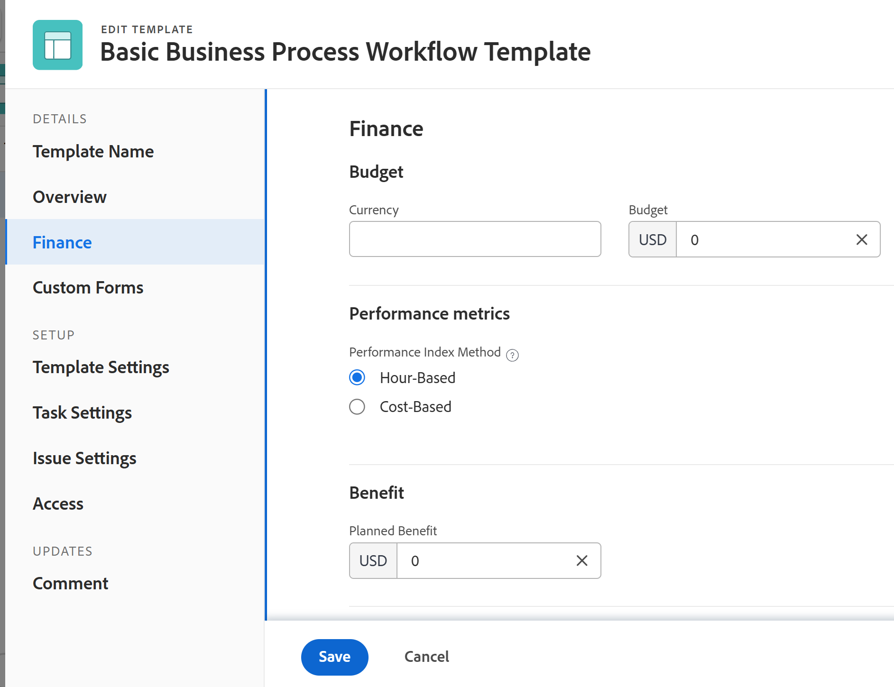

# Editar plantillas del proyecto

<!-- Audited: 2/2024 -->

<!--The Resource Pools part also duplicates in the "Working with Resource Pools" article-->

Puede editar las plantillas del proyecto para reflejar los cambios en los procesos y la configuración del proyecto. Después de actualizar y guardar los cambios en una plantilla, los nuevos cambios serán visibles en los nuevos proyectos cuando los proyectos se creen con la plantilla. Los cambios que realice en la plantilla no se reflejarán en el proyecto que esté utilizando esa plantilla.

## Requisitos de acceso

+++ Expanda para ver los requisitos de acceso para la funcionalidad en este artículo.

Debe tener el siguiente acceso para realizar los pasos de este artículo:

<table style="table-layout:auto"> 
 <col> 
 <col> 
 <tbody> 
  <tr> 
   <td role="rowheader">Plan de Adobe Workfront</td> 
   <td> 
Cualquiera 
 </td> 
  </tr> 
  <tr> 
   <td role="rowheader">Licencias de Adobe Workfront</td> 
   <td>
      
Nuevo: estándar

      
O

      
Actual: plan

   </td> 
  </tr> 
  <tr> 
   <td role="rowheader">Nivel de acceso</td> 
   <td> 
Acceso de edición a las plantillas
 </td> 
  </tr> 
  <tr> 
   <td role="rowheader">Permisos de objeto</td> 
   <td> 
    <ul> 
     <li> 
Permisos de colaboración de una plantilla para editarla en la pestaña Detalles de la plantilla
 </li> 
     <li> 
Administre los permisos de una plantilla para editarla en el cuadro Editar plantilla
 </li> 
   </td> 
  </tr> 
 </tbody> 
</table>

Para obtener más información sobre el contenido de esta tabla, consulte [Requisitos de acceso en la documentación de Workfront](/help/quicksilver/administration-and-setup/add-users/access-levels-and-object-permissions/access-level-requirements-in-documentation.md).

+++

## Editar una plantilla {#edit-a-template}

<!--
Editing a template differs depending on what environment you choose. 

### Edit a template in the Production environment {#edit-a-template-in-the-production-environment} 

1. Go to the template you want to edit.
1. (Conditional) To edit limited information about the template,  click **Template Details** in the left panel, then go to the areas listed in the left panel to edit information for each area. 
1. To edit information in the Details section, click the **Edit** icon , then select from any of the areas below, or click **Edit all** to edit information in all areas:

   * Overview
   * Custom Forms

     Names of customs forms display only if there are custom forms attached to the object.
   
   * Finance

   >[!TIP]
   >
   >For information about all fields that display in the Details area, continue with editing all fields using the Edit Template box below.

1. (Conditional) To edit all information about the template, click the **More** menu  next to the name of the template, then click **Edit**.

   The **Edit Template** box opens. The sections in this box contain the same fields available in  the Template Details section .

1. Consider editing information in any of the following sections:

   * [Overview](#overview) 
   * [Finance](#finance) 
   * [Portfolio](#portfolio) 
   * [Settings](#settings) 
   * [Access](#access) 
   * [Custom Forms](#custom-forms) 
   * [Tasks](#tasks) 
   * [Issues](#issues) 
   * [Comment](#comment)

### Overview {#overview}

1. Begin editing your template as described above.
1. In the **Edit Template** box, click **Overview**.

   

1. Update the following fields:

   <table style="table-layout:auto"> 
    <col> 
    <col> 
    <tbody> 
     <tr> 
      <td role="rowheader"><strong>Name</strong></td> 
      <td>Specify a name for the template.</td> 
     </tr> 
     <tr> 
      <td role="rowheader"><strong>Description</strong></td> 
      <td>Add additional information about the template.</td> 
     </tr> 
     <tr> 
      <td role="rowheader"><strong>Is Active</strong></td> 
      <td>
Select this checkbox if you want the template to be active. Other users can find this template and attach it to projects when creating projects. Deselect this checkbox if you want to deactivate templates that are no longer used. Deactivated templates cannot be attached to projects. This is enabled by default. 

<b>TIP</b>
      
      You can deactivate a template from the template header as described in the [Activate or deactivate a template](#activate-or-deactivate-a-template) section in this article.
</td> 
     </tr> 
     <tr> 
      <td role="rowheader"><strong>URL</strong></td> 
      <td>Specify a web link that relates to information about this template.</td> 
     </tr> 
     <tr> 
      <td role="rowheader"><strong>Schedule From</strong></td> 
      <td>
Specify whether the project using this template is scheduled from the <strong>Start Date</strong>, or from the <strong>Completion Date</strong>. This selection determines the planned dates of the future tasks on the project using this template. 

Select from the following: 
 
       <ul> 
        <li>
<strong>Schedule From Start Date</strong>: The Start Date of the template is actually the Start Day. When you schedule a template from Start Date, Adobe Workfront calculates the Completion Day of the template based on the Duration of all the template tasks. The Start Day of the template becomes the Planned Start Date of the future project.
</li> 
        <li>
<strong>Schedule from Completion Date</strong>: The Completion Date of the template is actually the Completion Day. When you schedule a template from Completion Date, Workfront calculates the Start Day of the template based on the Duration of all the template tasks. The Completion Day of the template becomes the Planned Completion Date of the future project. 
</li> 
       </ul>
For more information about the Start and Completion Days of template tasks, see <a href="../../../manage-work/projects/create-and-manage-templates/overview-of-start-completion-day-on-template.md" class="MCXref xref">Overview of Start and Completion Days in a template</a>. 

The Schedule From setting for templates is similar to that of projects. Your Workfront administrator selects the default Schedule From setting for the projects in your system. For information about setting project defaults, see <a href="../../../administration-and-setup/set-up-workfront/configure-system-defaults/set-project-preferences.md" class="MCXref xref">Configure system-wide project preferences</a>.
</td> 
     </tr> 
     <tr> 
      <td role="rowheader"><strong>Condition Type</strong></td> 
      <td>
Select between the following Condition Types:
 
       <ul> 
        <li><strong>Manual:</strong> The project owner sets the Condition of the project on the project manually. <strong></strong></li> 
        <li><strong>Progress Status:</strong> Workfront automatically sets the Condition of the future project based on the Progress Status of tasks on the Critical Path. For more information about understanding Progress Status, see <a href="../../../manage-work/tasks/task-information/task-progress-status.md" class="MCXref xref">Task Progress Status overview</a>.</li> 
       </ul></td> 
     </tr> 
     <tr> 
      <td role="rowheader"><strong>Priority</strong></td> 
      <td>
This is just a visual flag for you which allows you to prioritize your future projects. Select from the following options:
 
       <ul> 
        <li>
<strong>None</strong>
</li> 
        <li>
<strong>Low</strong>
</li> 
        <li>
<strong>Normal</strong>
</li> 
        <li>
<strong>High</strong>
</li> 
        <li>
<strong>Urgent</strong>
</li> 
       </ul>

Depending on the Project Preferences selected by your Workfront administrator, the names of priorities might be different for you. For more information about editing priorities, see <a href="../../../administration-and-setup/customize-workfront/creating-custom-status-and-priority-labels/create-customize-priorities.md" class="MCXref xref">Create and customize priorities</a>.

</td> 
     </tr> 
     <tr> 
      <td role="rowheader"><strong>Template Owner</strong></td> 
      <td>
The user who is designated as the Template Owner must be a Workfront active user. 

Consider the following about the user designated as the Template Owner: 
 
       <ul> 
        <li>They are automatically given Manage permissions to the template. </li> 
        <li>They are added to the project team and are automatically given Manage permissions to the project created from the template. </li> 
        <li>They become the Project Owner, when the project is created from this template. </li> 
       </ul></td> 
     </tr> 
     <tr> 
      <td role="rowheader"><strong>Template Sponsor</strong></td> 
      <td>
The user specified in this field becomes the Project Sponsor, when the template is added to the project. This user is added to the project team and is automatically given view permissions to the project. The user who is designated as the Template Sponsor must be a Workfront active user. 
</td> 
     </tr> 
     <tr> 
      <td role="rowheader"><strong>Resource Manager</strong></td> 
      <td>
The specified users are automatically given manage permissions to the future projects and can assign resources to the tasks and issues of the projects. You can specify more than one Resource Manager. 
</td> 
     </tr> 
     <tr data-mc-conditions="QuicksilverOrClassic.Quicksilver"> 
      <td role="rowheader"><strong>Group</strong></td> 
      <td>
In the drop-down list, select the group that you want to be associated with projects created from the template. It can be a group of any level. 

You can make sure you are selecting the right group by hovering over it and clicking the information icon  that displays next to it. This displays a tooltip listing information about the group, such as the hierarchy of groups above it and its administrators.
 
<b>NOTES</b>
      
    <ul> 
    <li>
In the Projects area on a group's page, when someone creates a project using a template that doesn't have a group selected, the system associates the currently open group with the project.

This is different from other areas where the system associates a user's Home Group with the project when the user creates the project using a template that doesn't have a group selected.

    </li> 
      <li>
If a user selects a template that has a group selected while creating a project—or while converting a task or issue to a project—the user can choose a different group for the project.
</li> 
      <li>Though this field is available in templates only in the new Adobe Workfront experience, you can see it in lists and reports both there and in Adobe Workfront Classic. </li> 
      </ul> 
</td> 
     </tr> 
     <tr> 
      <td role="rowheader"><strong>Company</strong></td> 
      <td>
Specify the Company that you want to associate with the template. Only active companies display in the list.
</td> 
     </tr> 
    </tbody> 
   </table>

1. (Optional) Continue editing the following sections, depending on the information you want to modify.

   Or

   Click **Save Changes**.

### Finance {#finance}

1. Begin editing your template as described above.
1. In the **Edit Template** box, click **Finance**.

   

1. Update the following fields:

   <table style="table-layout:auto"> 
    <col> 
    <col> 
    <tbody> 
     <tr> 
      <td role="rowheader"><strong>Performance Index Method</strong></td> 
      <td>
Specify whether the Earned Value metrics of the future project are calculated using hours or costs. For more information about the Performance Index Method, see <a href="../../../manage-work/projects/project-finances/set-pim.md" class="MCXref xref">Set the Performance Index Method (PIM)</a>. 
</td> 
     </tr> 
     <tr> 
      <td role="rowheader"><strong>Budget</strong></td> 
      <td>
Specify a Budget for the projects that are created from this template.
</td> 
     </tr> 
     <tr> 
      <td role="rowheader"><strong>Fixed Cost</strong></td> 
      <td>
Specify the Fixed Cost for the projects that are created from this template. This is different than the Labor Cost which comes from the hours on the project and the Expense Cost which comes from the amount of expenses on the project. The Fixed Cost of a project is taken into account when calculating the Net Value of a project and it is part of the Budgeted Cost.
</td> 
     </tr> 
     <tr> 
      <td role="rowheader"><strong>Fixed Revenue</strong></td> 
      <td>
Specify the Fixed Revenue for the projects that are created from this template.
</td> 
     </tr> 
     <tr> 
      <td role="rowheader"><strong>Template Currency</strong></td> 
      <td>
Specify the currency for the future project, if it is different than the default currency of your system. This field is not visible if you have only the default currency in the system. For more information about currency, see <a href="../../../administration-and-setup/manage-workfront/exchange-rates/set-up-exchange-rates.md" class="MCXref xref">Set up exchange rates</a>.
</td> 
     </tr> 
     <tr> 
      <td role="rowheader"><strong>Require time to be approved for this project</strong></td> 
      <td>
Select this option to require the Project Owner of the future project created from this template to approve time logged on the project. If you are using Billing Records and you select this option, only the approved hours on the project appear as available billable hours for the Billing Records. Approving time on the project is independent of approving timesheets. For more information about requiring time to be approved on a project, see <a href="../../../manage-work/projects/manage-projects/require-time-approval-for-projects.md" class="MCXref xref">Require time to be approved for a project</a>.
</td> 
     </tr> 
    </tbody> 
   </table>

1. (Optional) Continue editing the following sections, depending on the information you want to modify.

   Or

   Click **Save Changes**.

### Portfolio {#portfolio}

1. Begin editing your template as described above.
1. In the **Edit Template** box, click **Portfolio**.

   

1. Update the following fields:

   <table style="table-layout:auto">
    <col> 
    <tbody> 
     <tr> 
      <td role="rowheader"><strong>Portfolio</strong></td> 
      <td>
Specify a Portfolio for the projects that are created from this template. You must create a Portfolio first, before it appears in the drop-down list. 

Only active portfolios display in the list. For more information about creating portfolios, see <a href="../../../manage-work/portfolios/create-and-manage-portfolios/create-portfolios.md" class="MCXref xref">Create a portfolio </a>.
</td> 
     </tr> 
     <tr> 
      <td role="rowheader"><strong>Program</strong></td> 
      <td>
If you selected a Portfolio for the template, specify a <strong>Program</strong> for the future project. Some Portfolios might not have Programs. You must create a Program first, before it appears in this drop-down list. Only active programs display in the list.

For more information about creating programs, see <a href="../../../manage-work/portfolios/create-and-manage-programs/create-program.md" class="MCXref xref">Create a program</a>.
</td> 
     </tr> 
     <tr> 
      <td role="rowheader"><strong>Planned Benefit</strong></td> 
      <td>
Specify the Planned Benefit of the projects that are created from this template. The Planned Benefit is used in the Business Case of the project and the Portfolio Optimizer. 

For more information about the Planned Benefit of a project, see <a href="../../../manage-work/projects/project-finances/project-planned-benefit.md" class="MCXref xref">Overview of project Planned Benefit</a>. The Planned Benefit of a project is taken into account when the Net Value of a project is calculated. 

For more information about using the Portfolio Optimizer, see <a href="../../../manage-work/portfolios/portfolio-optimizer/manage-projects-in-portfolio-optimizer.md" class="MCXref xref">Manage projects in the Portfolio Optimizer</a> 
</td> 
     </tr> 
    </tbody> 
   </table>

1. (Optional) Continue editing the following sections, depending on the information you want to modify.

   Or

   Click **Save Changes**.

### Settings {#settings}

1. Begin editing your template as described above.
1. In the **Edit Template** box, click **Settings**.

   

1. Update the following fields: 

   <table style="table-layout:auto"> 
    <col> 
    <col> 
    <tbody> 
     <tr> 
      <td role="rowheader"><strong>Milestone Path</strong> </td> 
      <td> 
Select a Milestone Path for the template. Only active milestone paths display in the list. For more information about Milestone Paths, see <a href="../../../administration-and-setup/customize-workfront/configure-approval-milestone-processes/create-milestone-path.md" class="MCXref xref">Create a milestone path</a>.
 </td> 
     </tr> 
     <tr> 
      <td role="rowheader"><strong>Completion Mode</strong> </td> 
      <td> 
Controls how the future project will be marked as Complete.  Select from the following options:
 
       <ul> 
        <li> 
<strong>Automatic</strong>: The project is marked Complete when all the tasks and issues are completed.
 </li> 
        <li> 
<strong>Manual</strong>: You have to manually select the Complete status for the project, when all the tasks and issues are completed. 
 </li> 
       </ul> </td> 
     </tr> 
     <tr> 
      <td role="rowheader"><strong>Summary Completion Mode</strong> </td> 
      <td> 
Controls how the parent tasks on the future project are marked as Complete.  Select from the following options:
 
       <ul> 
        <li> 
<strong>Automatic</strong>: The parent tasks are marked Complete and they update their percent complete automatically, as the children tasks are completed and the percent complete of the children is updated. 
 </li> 
        <li> 
<strong>Manual</strong>: You have to manually update the percent complete and the status of the parent tasks, independently of what changes are made to the children tasks. 
 </li> 
       </ul> </td> 
     </tr> 
     <tr> 
      <td role="rowheader"><strong>Update Type</strong> </td> 
      <td> 
Controls when the changes you make to the timeline of the future project are saved on the project. 
 
       <b>EXAMPLE </b> 
        
The following changes to the project trigger an update to the timeline of the project:
 
        <ul> 
         <li> 
update the dates of tasks
 </li> 
         <li> 
change predecessor relationships 
 </li> 
         <li> 
change parent-child relationships
 </li> 
         <li> 
add or remove assignments in addition to changing the task constraint or duration type.
 </li> 
        </ul> 
       
 
Select from the following options: 
 
       <ul> 
        <li> 
<strong>Automatic and On Change</strong> (Default setting): The future project timeline is updated each time a change occurs in the project or in another project that the timeline is dependent on (On Change). The project timeline is also updated each night (Automatic). This is the recommended setting for this field because it ensures that the project timeline is always up to date. When you perform an action on a task or project that triggers a timeline recalculation, all available dates are immediately displayed, allowing you to continue working. On projects with more than 100 tasks, dates that require longer recalculations display briefly as a question mark (between 1 and 5 seconds, or up to a minute for large projects). This indicates that the recalculation is not yet finished, and the dates are subject to change. 
 </li> 
       </ul> 
       <ul> 
        <li> 
<strong>Change Only</strong>: The project timeline is updated each time a change occurs in the project or in another project that the timeline is dependent on. You might want to select this option if changes rarely occur in the project or in other projects that the timeline is dependent on. 
 </li> 
       </ul> 
       <ul> 
        <li> 
<strong>Automatic Only</strong>: The project timeline is updated each night; it is not updated immediately after changes are made. You might want to select this option if many changes occur each day in the project or in other projects that the timeline is dependent on. However, be aware that you chose this setting, as the project will not update at the same time that the changes are made. 
 </li> 
       </ul> 
       <ul> 
        <li> 
<strong>Manual Only</strong>: The project timeline is updated only when you select the option to Recalculate Timelines, as described in <a href="../../../manage-work/projects/manage-projects/recalculate-project-timeline.md" class="MCXref xref">Recalculate project timelines</a>. 
 </li> 
       </ul> 
You might want to select this option if you are making many changes to the project at one time, and you want the timeline recalculation to occur after all of the changes have been made (rather than after each individual change).
 </td> 
     </tr> 
     <tr> 
      <td role="rowheader"><strong>Schedule</strong> </td> 
      <td> 
Select a schedule for your template. This will become the schedule of the project that is created from this template. This should be the same schedule assigned to most people that are working on the project. You must create a schedule before you can assign it to a template. For more information about creating schedules, see <a href="../../../administration-and-setup/set-up-workfront/configure-timesheets-schedules/create-schedules.md" class="MCXref xref">Create a schedule</a>.  If you have not created custom schedules in your system, the Default Schedule is selected. 
 </td> 
     </tr> 
     <tr> 
      <td role="rowheader"><strong>User Time Off</strong> </td> 
      <td> 
Determines whether the time off of the Primary Assignee of a task adjusts the task planned dates. When you attach the template to an existing project, and the template has a different setting for this field than the project, the setting on the project remains unchanged. The default option for this setting for a new template is the same as the system-level project preference. 
 
For information about the project preferences at the System level, see <a href="../../../administration-and-setup/set-up-workfront/configure-system-defaults/set-project-preferences.md" class="MCXref xref">Configure system-wide project preferences</a>. 
 
For information about how this setting affects the task dates on a project, see <a href="../../../manage-work/projects/manage-projects/edit-projects.md" class="MCXref xref">Edit projects</a>. Select from the following options: 
 
       <ul> 
        <li> 
<strong>Consider user time off in task durations</strong>: When selecting this option, the planned dates of the tasks on the project created from this template adjust according to the time off of the Primary Assignee of the task, if the time off occurs during the duration of the task. 
 </li> 
        <li> 
<strong>Ignore user time off in task durations</strong>: When selecting this option, the planned dates of the tasks on the project created from this template remain as originally planned, even if the Primary Assignee of the task has time off during the duration of the task. 
 </li> 
       </ul> </td> 
     </tr> 
     <tr> 
      <td role="rowheader"><strong>Resource Leveling Mode</strong> </td> 
      <td> 
Select from the following options: 
 
       <ul> 
        <li> 
<strong>Manual</strong>: you must manually level your resources on the project created from this template (this is the default setting)
 </li> 
        <li> 
<strong>Automatic:</strong> Workfront levels the resources on the future project.  For more information about Resource Leveling, see <a href="../../../manage-work/gantt-chart/use-the-gantt-chart/level-resources-in-gantt.md" class="MCXref xref">Level Resources in the Gantt Chart </a>. 
 </li> 
       </ul> </td> 
     </tr> 
     <tr> 
      <td role="rowheader"><strong>Risk</strong> </td> 
      <td> 
Define the level of risk of the projects created from this template. The risk is just an indicator of how risky a project can be. You can prioritize the execution of your projects based on the level of risk. Consider selecting from the following levels of risk: 
 
       <ul> 
        <li> 
<strong>Very Low</strong> 
 </li> 
        <li> 
<strong>Low</strong> 
 </li> 
        <li> 
<strong>Medium</strong> 
 </li> 
        <li> 
<strong>High</strong> 
 </li> 
        <li> 
<strong>Very High</strong> 
 </li> 
       </ul> </td> 
     </tr> 
     <tr> 
      <td role="rowheader"><strong>Resource Pools</strong> </td> 
      <td> 
Specify the resource pools associated with the template. Resource pools are collections of users that are needed at the same time for the completion of a project. For more information about resource pools, see <a href="../../../resource-mgmt/resource-planning/resource-pools/work-with-resource-pools.md" class="MCXref xref"> Resource pools overview </a>.
 
 
<b>NOTE</b> 
      
      When you edit templates in bulk, only the resource pools that are common to all the templates selected appear in this field. If the templates selected have no shared resource pools, this field will be empty. The resource pools you specify here will overwrite the templates' individual resource pools.
 
 </td> 
     </tr> 
     <tr> 
      <td role="rowheader"><strong>Approval Process</strong> </td> 
      <td> 
Select the approval process you want to associate with the template. Your Workfront administrator or a user with administrative access to Approval Processes must define system-level or group-level project approval processes before you can associate them with a template. For more information about creating approval processes, see <a href="../../../administration-and-setup/customize-workfront/configure-approval-milestone-processes/create-approval-processes.md" class="MCXref xref">Create an approval process for work items</a>.
 
Consider the following when adding approval processes: 
 
      <ul> 
      <li>Only active approval processes display in the list. </li> 
      <li> 
System-wide and group-specific approval processes display in the list. An approval process associated with a group other than that of the template does not display in the list.
 
<b>IMPORTANT</b> 
      
      If the group associated with the template changes, the group-specific approval process becomes a single-use approval process. For more information about how changes to the group of the project or changes in the approval process affect approval settings, see <a href="../../../administration-and-setup/customize-workfront/configure-approval-milestone-processes/how-changes-affect-group-approvals.md">How group and approval process changes affect assigned approval processes</a>. 
 </li> 
      <li> 
If you added a single-use approval process, it displays as "Custom" in this field. For information, see <a href="../../../review-and-approve-work/manage-approvals/associate-approval-with-work.md" class="MCXref xref">Associate a new or existing approval process with work</a>. 
 
      </li> 
      <li> 
When bulk-editing templates, the following scenarios exist:
 
      <ul> 
         <li> 
When you select templates from the same group, both system-level and group-level approval processes display in this field.
 </li> 
         <li> 
When you select templates from different groups, only system-level approval processes display in this field.
 </li> 
         <li> 
When any of the templates has a single-use approval process attached, it is replaced by the system-level you select. 
 </li> 
      </ul> </li> 
      </ul> </td> 
     </tr> 
     <tr> 
      <td role="rowheader"><strong>Filter Hour Types</strong> </td> 
      <td> 
Consider the following:
 
Select <strong>No</strong> to make all project-specific hour types available on the future project. (This is the default selection)
 
Or
 
Select <strong>Yes</strong> to make only a subset of the project-specific hour types available on the future project, then select the hour types you want to make available. (Hold the Shift key to select multiple hour types.)
 
If you select this option, only the hour types you select are made available to select when logging hours on the project (or on tasks and issues within the project). You must select at least one hour type; if you select this option and you do not select any hour types, all hour types are made available on the project.
 
The same hour type selections must be made at the individual user level in order for the user to see these hour type options on the project. 
 
For more information about defining hour types at the user level, see the section <a href="../../../timesheets/create-and-manage-timesheets/log-time.md#understa" class="MCXref xref">Log time</a> in <a href="../../../timesheets/create-and-manage-timesheets/log-time.md" class="MCXref xref">Log time</a>.
 </td> 
     </tr> 
     <tr> 
      <td role="rowheader"><strong>Reminder Notification</strong> </td> 
      <td>Select the Reminder Notification that should be associated with the future project. You must configure Reminder Notifications for projects for this field to appear during editing a template.  For more information about configuring Reminder Notifications, see <a href="../../../administration-and-setup/manage-workfront/emails/set-up-reminder-notifications.md" class="MCXref xref">Set up reminder notifications</a>.</td> 
     </tr> 
    </tbody> 
   </table>

1. (Optional) Continue editing the following sections, depending on the information you want to modify.  
   Or
1. Click **Save Changes**.

### Access {#access}

1. Begin editing your template as described above.
1. In the **Edit Template** box, click **Access**.

   

   The Access you specify for your template will become the Access of users associated with the project when the template is used to create a project.

   Specify the following **Access** information for the template:

   <table style="table-layout:auto"> 
    <col> 
    <col> 
    <tbody> 
     <tr> 
      <td role="rowheader"><strong>When someone is assigned to a task</strong> </td> 
      <td> 
Select from <strong>View</strong>, <strong>Contribute,</strong> or <strong>Manage</strong> access to a task. The user assigned to a task is automatically granted this access to the task. 
 </td> 
     </tr> 
     <tr> 
      <td role="rowheader"><strong>Also grant access to the project</strong> </td> 
      <td> 
 Select from <strong>View</strong>, <strong>Contribute</strong>, or <strong>Manage</strong> access to the project. The user assigned to a task is automatically granted this access to the project, as well. 
 </td> 
     </tr> 
     <tr> 
      <td role="rowheader"><strong>When someone is assigned to an issue</strong> </td> 
      <td> 
Select from <strong>View</strong>, <strong>Contribute,</strong> or <strong>Manage</strong> access to an issue. The user assigned to an issue is automatically granted this access to the issue. 
 </td> 
     </tr> 
     <tr> 
      <td role="rowheader"><strong>Also grant access to the project</strong> </td> 
      <td> 
 Select from <strong>View</strong>, <strong>Contribute</strong>, or <strong>Manage</strong> access to the project. The user assigned to an issue is automatically granted this access to the project, as well. 
 </td> 
     </tr> 
     <tr> 
      <td role="rowheader"><strong>When someone submits a request: Give them access</strong> </td> 
      <td> 
 Select from <strong>View</strong>, <strong>Contribute</strong>, or <strong>Manage</strong> access to the request. When they submit a request to the project, they are granted this access to the request they submitted. For more information, see <a href="../../../workfront-basics/grant-and-request-access-to-objects/share-an-issue.md" class="MCXref xref">Share an issue </a>.
 </td> 
     </tr> 
     <tr> 
      <td role="rowheader"><strong>People from the same company will inherit the same permissions for all requests</strong> </td> 
      <td> 
Select this field if you want people from the same company to have the same access to all the requests on the project, whether they submitted them or not.
 </td> 
     </tr> 
     <tr> 
      <td role="rowheader"><strong>When someone is given access to this project: Give them access to ...</strong> </td> 
      <td> 
Select the access options that you want users to have on the project, if the project is shared with them. Select the specific options for their access, if they are designated as <strong>Viewers</strong>, <strong>Contributors</strong>, or <strong>Managers</strong> when sharing the project with them. 
 </td> 
     </tr> 
    </tbody> 
   </table>

1. (Optional) Continue editing the following sections, depending on the information you want to modify.

   Or

   Click **Save Changes**.

### Custom Forms {#custom-forms}

1. Begin editing your template as described above.
1. In the **Edit Template** box, click **Custom Forms**.

   

1. Select the custom form or forms that you want to associate with the template. You must build the custom forms before they are available to select in this field.

   Only active custom forms display in the list. s

   You can add up to ten custom forms to a template.

   The forms will be added to the project that is created from this template. 

1. (Optional) Continue editing the following section, depending on the information you want to modify.

   Or

   Click **Save Changes**.

### Tasks {#tasks}

You can define the defaults that will be associated with all the new tasks when you add them to a project that is created from the template.

For information about how these settings affect creating new tasks, see [Create tasks overview](../../../manage-work/tasks/create-tasks/create-tasks-overview.md).

1. Begin editing your template as described above.
1. In the **Edit Template** box, click **Tasks**.

   

1. In the **Task Default Approval Process** box, select the Approval Process you want to associate with all new tasks when you add them to a project created from this template. You must create an Approval Process for tasks before you can associate it with tasks. Only active approval processes display in the list. For more information about creating Approval Processes, see [Creating Approval Processes](../../../administration-and-setup/customize-workfront/configure-approval-milestone-processes/create-approval-processes.md).
1. In the **Task Default Custom Forms** box, select the custom form or forms that you want to associate with all new tasks when you add them to a project created from this template. You must build the custom forms before they are available to select in this field. Only active custom forms display in the list. You can associate up to ten custom forms with a task.
1. (Optional) **Select Use Work Effort to automatically calculate task Planned Hours** if you want to enable managing task effort by using&nbsp;Work Effort instead of Planned Hours in the project created from the template.
1. (Conditional and optional) If you selected Use Work Effort to automatically calculate task Planned Hours, click the drop-down menu to update the percentage for each level of Work Effort. The following percentage values are the defaults:
 
   | Work Effort level |Percentage value|
   |---|---|
   | Small |25% |
   | Medium |50% |
   | Large |75% |

  For information about using Work Effort to manage the effort on tasks on projects, see [Work Effort overview](../../../manage-work/tasks/task-information/work-effort.md).

1. (Optional) Continue editing the following section, depending on the information you want to modify.

   Or

   Click **Save Changes**.

### Issues {#issues}

By editing issue settings, you can prevent users from adding issues inline in the future project created from the template.

1. Begin editing your template as described above.
1. In the **Edit Template** box, click **Issues**.

   

1. (Optional) Deselect the **Allow users to add issues inline** option. It is enabled by default.

   When disabling this option users cannot add issues inline to the project or the tasks in the Issues section, when the project is created from the template.

   >[!TIP]
   >
   >Disable this option if you want to enforce users to complete the New Issue Fields or the custom forms associated with new issues.

   When disabling this option, users with permissions to add issues to the project created from the template can do so by using the New Issue button or a request queue associated with the project.

   For more information about configuring issue settings on projects, see the [Issue Settings](../../../manage-work/projects/manage-projects/edit-projects.md#issue) section in the article [Edit projects](../../../manage-work/projects/manage-projects/edit-projects.md).

   For information about creating issues on projects, see [Create issues](../../../manage-work/issues/manage-issues/create-issues.md). 

1. (Optional) Continue editing the following section, depending on the information you want to modify.

   Or

   Click **Save Changes**.

### Comment {#comment}

1. Begin editing your template as described above.
1. In the **Edit Template** box, click **Comment**.

   

1. Specify a comment that you want to display in the updates stream of the template in the available field.

   This comment is visible for everyone with View access to the template and with access to view Notes.

1. Click **Save Changes**.

   Your changes will be submitted for this template.

   Now, when you use this template to create a project all these settings will transfer to the new project.

   <!--drafted section below for the edit template story: 
   remove this tag and add the Preview blurb at the top of this article in yellow, if it's not already there. Keep the "div class" tags below until 23.1 production: 

### Edit a template in the Preview environment {#edit-a-template-in-the-preview-environment}
-->

1. Vaya a la plantilla que desea editar.
1. (Condicional) Para editar información limitada sobre la plantilla, haga clic en **Detalles de la plantilla** en el panel izquierdo y, a continuación, vaya a las áreas que aparecen en el panel izquierdo para editar la información de cada área.
1. Para editar información en la sección Detalles, haga clic en el icono **Editar** , luego seleccione una de las áreas siguientes o haga clic en **Editar todo** para editar información en todas las áreas:

   * Información general
   * Formularios personalizados

   Los nombres de los formularios personalizados solo se muestran si hay formularios personalizados adjuntos al objeto.

   * Finanzas

   >[!TIP]
   >
   >Para obtener información sobre todos los campos que se muestran en el área de Detalles, continúe editando todos los campos con el cuadro Editar plantilla que aparece a continuación.

1. (Condicional) Para editar toda la información acerca de la plantilla, haga clic en el **Más** menú  junto al nombre de la plantilla y, a continuación, haga clic en **Editar**.

   Se abre el cuadro **Editar plantilla**. Las secciones de este cuadro contienen los mismos campos disponibles en la sección Detalles de la plantilla.

1. Considere la posibilidad de editar la información en cualquiera de las siguientes secciones:

   * [Nombre de la plantilla](#template-name)
   * [Información general](#overview-preview)
   * [Finanzas](#finance-preview)
   * [Formularios personalizados](#custom-forms-preview)
   * [Configuración del proyecto](#project-settings)
   * [Configuración de tareas](#task-settings)
   * [Configuración del problema](#issue-settings)
   * [Acceso](#access-preview)
   * [Carpetas vinculadas](#linked-folders-conditional-availability) (disponibilidad condicional)

### Nombre de plantilla{#template-name}

1. Empiece a editar la plantilla tal como se ha descrito anteriormente.
1. En el cuadro **Editar plantilla**, haga clic en **Nombre de la plantilla**.
1. (Opcional) Siga editando las secciones siguientes, según la información que desee modificar

   O

   Haga clic en **Guardar**.

### Información general {#overview-preview}

1. Empiece a editar la plantilla tal como se ha descrito anteriormente.
1. En el cuadro **Editar plantilla**, haga clic en **Información general**.

   

1. Actualice los campos siguientes:

   <table style="table-layout:auto"> 
       <col> 
       <col> 
       <tbody> 
         <tr> 
         <td role="rowheader"><strong>Descripción</strong></td> 
         <td>Añada información adicional sobre la plantilla.</td> 
       </tr> 
         <tr> 
         <td role="rowheader"><strong>Prioridad</strong></td> 
         <td>
Es tan solo un indicador visual que le permite priorizar sus proyectos futuros. Seleccione entre las siguientes opciones:
 
         <ul> 
         <li>
<strong>Ninguno</strong>
</li> 
         <li>
<strong>Bajo</strong>
</li> 
         <li>
<strong>Normal</strong>
</li> 
         <li>
<strong>Alto</strong>
</li> 
         <li>
<strong>Urgente</strong>
</li> 
         </ul>

Según las Preferencias del proyecto seleccionadas por el administrador de Workfront, los nombres de las prioridades pueden ser diferentes para usted. Para obtener más información sobre cómo editar prioridades, consulte <a href="../../../administration-and-setup/customize-workfront/creating-custom-status-and-priority-labels/create-customize-priorities.md" class="MCXref xref">Crear y personalizar prioridades</a>.

</td> 
       </tr> 
       <tr> 
       <td role="rowheader"><strong>URL</strong></td> 
         <td>Especifique un vínculo web relacionado con la información sobre esta plantilla.</td> 
       </tr>
       <tr> 
       <td role="rowheader"><strong>Tipo de condición</strong></td> 
       <td>
Seleccione entre los siguientes tipos de condición:
 
         <ul> 
         <li><strong>Manual:</strong> el propietario del proyecto establece manualmente la condición del proyecto en el proyecto. <strong></strong></li> 
         <li><strong>Estado del progreso:</strong> Workfront establece automáticamente la condición del proyecto futuro en función del estado del progreso de las tareas en la ruta crítica. Para obtener más información sobre el significado del estado de progreso, consulte <a href="../../../manage-work/tasks/task-information/task-progress-status.md" class="MCXref xref">Información general sobre el estado de progreso de la tarea</a>.</li> 
       </ul>
         </td> 
         </tr> 
       <tr> 
         <td role="rowheader"><strong>Modo de programación</strong></td> 
         <td>
Especifique si el proyecto que usa esta plantilla está programado a partir de la <strong>fecha de inicio</strong> o a partir de la <strong>fecha de finalización</strong>. Esta selección determina las fechas planificadas de las tareas futuras del proyecto mediante esta plantilla. 

Seleccione entre las siguientes opciones: 
 
       <ul> 
       <li>
<strong>Programar a partir de la fecha de inicio</strong>: la fecha de inicio de la plantilla es en realidad el día de inicio. Cuando se programa una plantilla a partir de la fecha de inicio, Adobe Workfront calcula el día de finalización de la plantilla en función de la duración de todas las tareas de plantilla. El día de inicio de la plantilla se convierte en la fecha planificada de inicio del futuro proyecto.
</li> 
       <li>
<strong>Programar a partir de la fecha de finalización</strong>: la fecha de finalización de la plantilla es en realidad el día de finalización. Cuando se programa una plantilla a partir de la fecha de finalización, Workfront calcula el día de inicio de la plantilla en función de la duración de todas las tareas de plantilla. El día de finalización de la plantilla se convierte en la fecha planificada de finalización del futuro proyecto. 
</li> 
       </ul>
Para obtener más información sobre los días de inicio y finalización de las tareas de plantilla, consulte <a href="../../../manage-work/projects/create-and-manage-templates/overview-of-start-completion-day-on-template.md" class="MCXref xref">Información general sobre los días de inicio y finalización en una plantilla</a>. 

La configuración de Programación desde de las plantillas es similar a la de los proyectos. El administrador de Workfront selecciona la configuración predeterminada Programación desde para los proyectos del sistema. Para obtener información sobre cómo establecer los valores predeterminados del proyecto, consulte <a href="../../../administration-and-setup/set-up-workfront/configure-system-defaults/set-project-preferences.md" class="MCXref xref">Configurar las preferencias del proyecto en todo el sistema</a>.
</td> 
       </tr>

   <tr> 
         <td role="rowheader"><strong>Portafolio</strong></td> 
         <td>
Especifique un portafolio para los proyectos creados a partir de esta plantilla. Para que un Portafolio aparezca en la lista desplegable, primero debe crearlo. 

En la lista solo se muestran los portafolios activos. Para obtener más información sobre la creación de portafolios, consulte <a href="../../../manage-work/portfolios/create-and-manage-portfolios/create-portfolios.md" class="MCXref xref">Crear un portafolio </a>.
</td> 
       </tr> 
       <tr> 
         <td role="rowheader"><strong>Programa</strong></td> 
         <td>
Si ha seleccionado un portafolio para la plantilla, especifique un <strong>Programa</strong> para el proyecto futuro. Es posible que algunos portafolios no tengan programa. Para que un programa aparezca en esta lista desplegable, primero debe crearlo. En la lista solo se muestran los programas activos.

Para obtener más información sobre cómo crear programas, consulte <a href="../../../manage-work/portfolios/create-and-manage-programs/create-program.md" class="MCXref xref">Crear un programa</a>.
</td> 
       </tr>  
       <tr data-mc-conditions="QuicksilverOrClassic.Quicksilver"> 
         <td role="rowheader"><strong>Grupo</strong></td> 
         <td>
En la lista desplegable, seleccione el grupo que desea asociar a los proyectos creados a partir de la plantilla. Puede ser un grupo de cualquier nivel. 

Para asegurarse de que está seleccionando el grupo correcto, pase el puntero por encima de él y haga clic en el icono de información  que se muestra junto a él. Esta acción muestra la ayuda contextual con información sobre el grupo, como la jerarquía de los grupos que tiene por encima y sus administradores.
 
<b>NOTAS</b>

   <ul> 
       <li>
En el área Proyectos de la página de un grupo, cuando alguien crea un proyecto con una plantilla que no tiene un grupo seleccionado, el sistema asocia el grupo que está abierto en ese momento con el proyecto.

Esto es distinto en otras áreas en las que el sistema asocia el grupo de inicio de un usuario con el proyecto cuando el usuario crea el proyecto mediante una plantilla que no tiene un grupo seleccionado.
</li> 
       <li>
Si un usuario selecciona una plantilla que tiene un grupo seleccionado cuando está creando un proyecto (o al convertir una tarea o un problema en un proyecto), el usuario puede elegir un grupo diferente para el proyecto.
</li> 
       <li>Aunque este campo está disponible solamente en las plantillas de la nueva experiencia de Adobe Workfront, puede verlo en listas e informes tanto allí como en Adobe Workfront Classic. </li> 
         </ul> 
</td> 
       </tr> 
       <tr> 
         <td role="rowheader"><strong>Compañía</strong></td> 
         <td>
Especifique la Compañía que desee asociar con la plantilla. En la lista solo se muestran las compañías activas.
</td> 
       </tr> 
       <tr> 
         <td role="rowheader"><strong>Propietario de la plantilla</strong></td> 
         <td>
El usuario designado como Propietario de la plantilla debe ser un usuario activo de Workfront. 

Tenga en cuenta lo siguiente sobre el usuario designado como propietario de la plantilla: 
 
         <ul> 
         <li>Se les otorgan automáticamente permisos de administración en la plantilla. </li> 
         <li>Se añaden al equipo del proyecto y se les otorgan automáticamente permisos de administración en el proyecto creado a partir de la plantilla. </li> 
         <li>Se convierten en Propietario del proyecto cuando el proyecto se crea a partir de esta plantilla. </li> 
         <li> Si el usuario designado como Propietario de la plantilla tiene acceso limitado a las plantillas o proyectos desde su nivel de acceso, sus permisos de administración en la plantilla y en los proyectos estarán limitados. Por ejemplo, si solo tienen acceso para Ver en las plantillas o proyectos de su nivel de acceso, recibirán automáticamente permisos para Ver en la plantilla y el proyecto cuando se designen como Propietario de la plantilla.</li>
         </ul></td> 
       </tr> 
       <tr> 
         <td role="rowheader"><strong>Patrocinador de plantilla</strong></td> 
         <td>
El usuario especificado en este campo se convierte en patrocinador del proyecto cuando la plantilla se añade al proyecto. Este usuario se añade al equipo del proyecto y se le conceden automáticamente permisos para Ver en el proyecto. El usuario designado como Patrocinador de la plantilla debe ser un usuario activo de Workfront. 
</td> 
       </tr> 
       <tr> 
         <td role="rowheader"><strong>Gerente de recursos</strong></td> 
         <td>
A los usuarios especificados se les conceden automáticamente permisos de administración en los proyectos futuros y pueden asignar recursos a las tareas y problemas de los proyectos. Puede especificar más de un Administrador de recursos. 
</td> 
       </tr> 
      </table>

1. (Opcional) Siga editando las secciones siguientes, según la información que desee modificar.

   O

   Haga clic en **Guardar**.

### Finanzas {#finance-preview}

1. Empiece a editar la plantilla tal como se ha descrito anteriormente.
1. En el cuadro **Editar plantilla**, haga clic en **Finanzas**.

   

1. Actualice los campos siguientes:

   <table style="table-layout:auto"> 
       <col> 
       <col> 
       <tbody>
       <tr> 
         <td role="rowheader"><strong> Divisa</strong></td> 
         <td>
Especifique la moneda para el proyecto futuro, si es diferente a la moneda predeterminada del sistema. Este campo no está visible si solo tiene la moneda predeterminada en el sistema. Para obtener más información sobre la moneda, consulte <a href="../../../administration-and-setup/manage-workfront/exchange-rates/set-up-exchange-rates.md" class="MCXref xref">Configurar tasas de cambio</a>.
</td> 
       </tr>
       <tr> 
       <td role="rowheader"><strong>Presupuesto</strong></td> 
       <td>
Especifique un presupuesto para los proyectos creados a partir de esta plantilla.
</td> 
       </tr>  
       <tr> 
         <td role="rowheader"><strong>Método de índice de rendimiento</strong></td> 
         <td>
Elija cómo calculará Workfront las métricas de valor ganado del proyecto futuro. Elija entre las siguientes opciones:
         <ul>
         <li>Basado en horas</li>
         <li>Basado en costes</li>
         </ul>

   Para obtener más información sobre el método de índice de rendimiento, consulte <a href="../../../manage-work/projects/project-finances/set-pim.md" class="MCXref xref">Establecer el método de índice de rendimiento (PIM)</a>. 
</td>
   </tr> 
         <tr> 
         <td role="rowheader"><strong>Beneficio planificado</strong></td> 
         <td>
Especifique el beneficio planificado de los proyectos que se crean a partir de esta plantilla. El beneficio planificado se utiliza en el Caso empresarial del proyecto y en el Optimizador de portafolios. 

Para obtener más información sobre el beneficio planificado de un proyecto, consulte <a href="../../../manage-work/projects/project-finances/project-planned-benefit.md" class="MCXref xref">Información general sobre el beneficio planificado del proyecto</a>. El Beneficio planificado de un proyecto se tiene en cuenta cuando se calcula el valor neto de un proyecto. 

Para obtener más información sobre el uso del Optimizador de portafolios, consulte <a href="../../../manage-work/portfolios/portfolio-optimizer/manage-projects-in-portfolio-optimizer.md" class="MCXref xref">Administrar proyectos en el Optimizador de portafolios</a> 
</td> 
       </tr> 
       <tr> 
         <td role="rowheader"><strong>Coste fijo</strong></td> 
         <td>
Especifique el coste fijo de los proyectos creados a partir de esta plantilla. Esto es diferente al coste de mano de obra que proviene de las horas en el proyecto y al coste de gasto que proviene de la cantidad de gastos en el proyecto. El coste fijo de un proyecto se tiene en cuenta al calcular su valor neto y forma parte del coste presupuestado.
</td> 
       </tr> 
       <tr> 
       <td role="rowheader"><strong>Ingresos fijos</strong></td> 
       <td>
Especifique los ingresos fijos de los proyectos creados a partir de esta plantilla.
</td> 
       </tr> 
       <tr> 
       <td role="rowheader"><strong>Requerir tiempo de aprobación de este proyecto</strong></td> 
       <td>
Seleccione esta opción para solicitar al propietario del proyecto del futuro proyecto creado a partir de esta plantilla que apruebe el tiempo de registro en el proyecto. Si utiliza Registros de facturación y selecciona esta opción, solo las horas aprobadas en el proyecto aparecen como horas facturables disponibles para los Registros de facturación. La aprobación de las horas en el proyecto es independiente de la aprobación de plantillas de horas. Para obtener más información sobre cómo requerir tiempo para aprobar un proyecto, vea <a href="../../../manage-work/projects/manage-projects/require-time-approval-for-projects.md" class="MCXref xref">Requerir tiempo de aprobación de un proyecto</a>.
</td> 
       </tr> 
       </tbody> 
      </table>

1. (Opcional) Siga editando las secciones siguientes, según la información que desee modificar.

   O

   Haga clic en **Guardar**.

### Formularios personalizados {#custom-forms-preview}

1. Empiece a editar la plantilla tal como se ha descrito anteriormente.
1. En el cuadro **Editar plantilla**, haga clic en **Formularios personalizados**.

   

   Los nombres de los formularios personalizados que ya están adjuntos a la plantilla se muestran en el panel izquierdo.

1. Haga clic dentro del campo **Añadir formulario personalizado** y seleccione el formulario o formularios personalizados que desea asociar a la plantilla. Debe generar los formularios personalizados antes de que estén disponibles para seleccionarlos en este campo.

   En la lista solo se muestran los formularios personalizados activos. Para obtener más información sobre la creación de formularios personalizados, consulte [Crear un formulario personalizado](/help/quicksilver/administration-and-setup/customize-workfront/create-manage-custom-forms/form-designer/design-a-form/design-a-form.md).

   Puede añadir hasta diez formularios personalizados a una plantilla.

   Los formularios se añadirán al proyecto creado a partir de esta plantilla.

1. (Opcional) Actualice la información en cualquiera de los campos de los formularios personalizados. La información se transferirá a los proyectos que se crearán a partir de la plantilla.

1. (Opcional) Haga clic en el icono **x** a la derecha del nombre de un formulario personalizado y, a continuación, haga clic en **Quitar** para quitarlo de la plantilla.

1. (Opcional) Siga editando la sección siguiente, según la información que desee modificar.

   O

   Haga clic en **Guardar**.

### Configuración de proyecto {#project-settings}

1. Empiece a editar la plantilla tal como se ha descrito anteriormente.
1. En el cuadro **Editar plantilla**, haga clic en **Configuración del proyecto**.

   

1. Actualice los campos siguientes:

   <table style="table-layout:auto"> 
       <col> 
       <col> 
       <tbody> 
       <tr> 
       <td role="rowheader"><strong>Ruta de hitos</strong> </td> 
       <td> 
Seleccione una ruta de hitos para la plantilla. En la lista solo se muestran las trayectorias de hitos activas. Para obtener más información sobre las rutas de hitos, consulte <a href="../../../administration-and-setup/customize-workfront/configure-approval-milestone-processes/create-milestone-path.md" class="MCXref xref">Crear una ruta de hitos</a>.
 </td> 
       </tr> 
       <tr> 
         <td role="rowheader"><strong>Modo de finalización</strong> </td> 
         <td> 
Controla la manera en que el futuro proyecto se marcará como completo.  Seleccione entre las siguientes opciones:
 
         <ul> 
         <li> 
<strong>Automático</strong>: el proyecto se marca como completo cuando se completen todas las tareas y problemas.
 </li> 
         <li> 
<strong>Manual</strong>: debe seleccionar manualmente el estado completo del proyecto cuando se hayan completado todas las tareas y problemas. 
 </li> 
         </ul> </td> 
       </tr> 
       <tr> 
       <td role="rowheader"><strong>Modo de finalización de resumen</strong> </td> 
       <td> 
Controla la manera en que las tareas principales del futuro proyecto se marcan como completas.  Seleccione entre las siguientes opciones:
 
       <ul> 
       <li> 
<strong>Automático</strong>: las tareas principales se marcan como Completas y actualizan su porcentaje completado automáticamente, a medida que se completan las tareas secundarias y se actualiza el porcentaje completado de las tareas secundarias. 
 </li> 
       <li> 
<strong>Manual</strong>: debe actualizar manualmente el porcentaje completado y el estado de las tareas principales, independientemente de los cambios que se realicen en las tareas secundarias. 
 </li> 
       </ul> </td> 
       </tr> 
       <tr> 
         <td role="rowheader"><strong>Tipo de actualización</strong> </td> 
         <td> 
Controla cuándo se guardan en el proyecto los cambios realizados en la línea de tiempo del futuro proyecto. 
 
         <b>EJEMPLO </b> 
         
Los siguientes cambios en el proyecto activan una actualización en la línea de tiempo del proyecto:
 
         <ul> 
         <li> 
actualizar las fechas de las tareas
 </li> 
         <li> 
cambiar relaciones de predecesoras 
 </li> 
         <li> 
cambiar relaciones principales y secundarias
 </li> 
         <li> 
añadir o quitar asignaciones, además de cambiar la restricción de tarea o el tipo de duración.
 </li> 
         </ul> 
         
 
Seleccione entre las siguientes opciones: 
 
         <ul> 
         <li> 
<strong>Automático y al cambiar</strong> (configuración predeterminada): la línea de tiempo del proyecto futuro se actualiza cada vez que se produce un cambio en el proyecto o en otro proyecto del que depende la línea de tiempo (al cambiar). La cronología del proyecto también se actualiza cada noche (Automática). Esta es la configuración recomendada para este campo porque garantiza que la línea de tiempo del proyecto siempre esté actualizada. Cuando realiza una acción en una tarea o proyecto que activa un recálculo de línea de tiempo, todas las fechas disponibles se muestran inmediatamente, lo que le permite seguir trabajando. En los proyectos con más de 100 tareas, las fechas que requieran recálculos mayores se muestran brevemente como signo de interrogación (entre 1 y 5 segundos, o hasta un minuto en los proyectos grandes). Esto indica que el recálculo aún no ha finalizado y que las fechas están sujetas a cambios. 
 </li> 
         </ul> 
         <ul> 
         <li> 
<strong>Solo al cambiar</strong>: la línea de tiempo del proyecto se actualiza cada vez que se produce un cambio en el proyecto o en otro proyecto del que depende la línea de tiempo. Es posible que desee seleccionar esta opción si los cambios rara vez se producen en el proyecto o en otros proyectos de los que depende la cronología. 
 </li> 
         </ul> 
         <ul> 
         <li> 
<strong>Solo automático</strong>: la línea de tiempo del proyecto se actualiza cada noche; no se actualiza inmediatamente después de realizar los cambios. Es posible que desee seleccionar esta opción si se producen muchos cambios cada día en el proyecto o en otros proyectos de los que depende la línea de tiempo. Sin embargo, tenga en cuenta que ha elegido esta configuración, ya que el proyecto no se actualizará al mismo tiempo que se realizan los cambios. 
 </li> 
         </ul> 
         <ul> 
         <li> 
<strong>Solo manual</strong>: la línea de tiempo del proyecto solo se actualiza cuando selecciona la opción para recalcular las líneas de tiempo, tal como se describe en <a href="../../../manage-work/projects/manage-projects/recalculate-project-timeline.md" class="MCXref xref">Recalcular las líneas de tiempo del proyecto</a>. 
 </li> 
         </ul> 
Es posible que desee seleccionar esta opción si realiza muchos cambios en el proyecto al mismo tiempo y desea que el cálculo de la escala de tiempo se produzca después de realizar todos los cambios (en lugar de después de cada cambio individual).
 </td> 
       </tr> 
       <tr> 
         <td role="rowheader"><strong>Programación</strong> </td> 
         <td> 
Seleccione una programación para la plantilla. Esto se convertirá en la programación del proyecto que se crea a partir de esta plantilla. Debe ser la misma programación asignada a la mayoría de las personas que trabajan en el proyecto. Debe crear una programación para poder asignarla a una plantilla. Para obtener más información sobre cómo crear programaciones, consulte <a href="../../../administration-and-setup/set-up-workfront/configure-timesheets-schedules/create-schedules.md" class="MCXref xref">Crear una programación</a>.  Si no ha creado programaciones personalizadas en el sistema, se selecciona la Programación predeterminada. 
 </td> 
       </tr> 
       <tr> 
         <td role="rowheader"><strong>Días libres del usuario</strong> </td> 
         <td> 
Determina si los días libres de la persona asignada principal de una tarea ajusta las fechas planificadas de la tarea. Cuando adjunta la plantilla a un proyecto existente y la plantilla tiene una configuración para este campo diferente a la del proyecto, la configuración del proyecto permanece sin cambios. La opción predeterminada para esta configuración para una plantilla nueva es la misma que la preferencia del proyecto a nivel del sistema. 
 
Para obtener información acerca de las preferencias del proyecto a nivel del sistema, consulte <a href="../../../administration-and-setup/set-up-workfront/configure-system-defaults/set-project-preferences.md" class="MCXref xref">Configurar las preferencias de proyecto de todo el sistema</a>. 
 
Para obtener información acerca de cómo afecta esta configuración a las fechas de las tareas de un proyecto, consulte <a href="../../../manage-work/projects/manage-projects/edit-projects.md" class="MCXref xref">Editar proyectos</a>. Seleccione entre las siguientes opciones: 
 
         <ul> 
         <li> 
<strong>Tenga en cuenta el tiempo libre del usuario en las duraciones de la tarea</strong>: al seleccionar esta opción, las fechas planificadas de las tareas en el proyecto creadas a partir de esta plantilla se ajustan según el tiempo libre de la persona asignada principal de la tarea, si el tiempo libre se produce durante la duración de la tarea. 
 </li> 
         <li> 
<strong>Ignore el tiempo libre del usuario en las duraciones de la tarea</strong>: al seleccionar esta opción, las fechas planificadas de las tareas en el proyecto creado a partir de esta plantilla permanecen tal y como se planificó originalmente, incluso si la persona asignada principal de la tarea tiene tiempo libre durante la duración de la tarea. 
 </li> 
         </ul> </td> 
       </tr> 
       <tr> 
         <td role="rowheader"><strong>Modo de nivelación de recursos</strong> </td> 
         <td> 
Seleccione entre las siguientes opciones: 
 
         <ul> 
         <li> 
<strong>Manual</strong>: debe redistribuir manualmente los recursos en el proyecto creado a partir de esta plantilla (esta es la configuración predeterminada)
 </li> 
         <li> 
<strong>Automático:</strong> Workfront nivela los recursos en el proyecto futuro.  Para obtener más información acerca de la nivelación de recursos, consulte <a href="../../../manage-work/gantt-chart/use-the-gantt-chart/level-resources-in-gantt.md" class="MCXref xref">Nivelar recursos en el Gráfico Gantt </a>. 
 </li> 
         </ul> </td> 
       </tr> 
       <tr> 
         <td role="rowheader"><strong>Riesgo</strong> </td> 
         <td> 
Defina el nivel de riesgo de los proyectos creados a partir de esta plantilla. El riesgo es solo un indicador de lo riesgoso que puede ser un proyecto. Puede priorizar la ejecución de sus proyectos en función del nivel de riesgo. Considere la posibilidad de seleccionar entre los siguientes niveles de riesgo: 
 
         <ul> 
         <li> 
<strong>Muy bajo</strong> 
 </li> 
         <li> 
<strong>Bajo</strong> 
 </li> 
         <li> 
<strong>Medio</strong> 
 </li> 
         <li> 
<strong>Alto</strong> 
 </li> 
         <li> 
<strong>Muy alto</strong> 
 </li> 
         </ul> </td> 
       </tr> 
       <tr> 
         <td role="rowheader"><strong>Conjuntos de recursos</strong> </td> 
         <td> 
Especifique los conjuntos de recursos asociados a la plantilla. Los conjuntos de recursos son colecciones de usuarios que se necesitan al mismo tiempo para completar un proyecto. Para obtener más información sobre los conjuntos de recursos, consulte <a href="../../../resource-mgmt/resource-planning/resource-pools/work-with-resource-pools.md" class="MCXref xref"> Información general sobre los conjuntos de recursos </a>.
 
 
<b>NOTA</b>

   Cuando edita plantillas de forma masiva, solo aparecen en este campo los conjuntos de recursos que son comunes a todas las plantillas seleccionadas. Si las plantillas seleccionadas no tienen conjuntos de recursos compartidos, este campo estará vacío. Los conjuntos de recursos que especifique aquí sobrescribirán los conjuntos de recursos individuales de las plantillas.
 
 </td>
   </tr>
       <tr> 
         <td role="rowheader"><strong>Filtrar tipo de horas</strong> </td> 
         <td> 
Tenga en cuenta lo siguiente:
 
Seleccione <strong>No</strong> para que todos los tipos de horas específicas del proyecto estén disponibles en el proyecto futuro. (Es la selección predeterminada)
 
O
 
Seleccione <strong>Sí</strong> para que solo un subconjunto de los tipos de horas específicas del proyecto esté disponible en el proyecto futuro y, a continuación, seleccione los tipos de horas que desee que estén disponibles. (Mantenga pulsada la tecla Mayús para seleccionar varios tipos de horas).
 
Si selecciona esta opción, solo se podrán seleccionar los tipos de horas que seleccione cuando registre las horas en el proyecto (o en tareas y problemas dentro del proyecto). Debe seleccionar al menos un tipo de hora; si selecciona esta opción y no selecciona ningún tipo de hora, todos los tipos de horas estarán disponibles en el proyecto.
 
Las mismas selecciones de tipo de hora deben realizarse a nivel de usuario individual para que el usuario pueda ver estas opciones de tipo de hora en el proyecto. 
 
Para obtener más información sobre la definición de tipos de horas en el nivel de usuario, consulte la sección <a href="../../../timesheets/create-and-manage-timesheets/log-time.md#understa" class="MCXref xref">Hora de registro</a> en <a href="../../../timesheets/create-and-manage-timesheets/log-time.md" class="MCXref xref">Hora de registro</a>.
 </td> 
       </tr> 
       <tr> 
         <td role="rowheader"><strong>Proceso de aprobación</strong> </td> 
         <td> 
Seleccione el proceso de aprobación que desee asociar con la plantilla. El administrador de Workfront o un usuario con acceso administrativo a los procesos de aprobación deben definir los procesos de aprobación de proyectos de nivel de sistema o de grupo para poder asociarlos a una plantilla. Para obtener más información sobre cómo crear procesos de aprobación, consulte <a href="../../../administration-and-setup/customize-workfront/configure-approval-milestone-processes/create-approval-processes.md" class="MCXref xref">Crear un proceso de aprobación para elementos de trabajo</a>.
 
Tenga en cuenta lo siguiente a la hora de añadir procesos de aprobación: 
 
         <ul> 
         <li>En la lista solo se muestran los procesos de aprobación activos. </li> 
         <li> 
Los procesos de aprobación de todo el sistema y específicos del grupo se muestran en la lista. Un proceso de aprobación asociado a un grupo que no sea el de la plantilla no se muestra en la lista.
 
<b>IMPORTANTE</b>

   Si el grupo asociado a la plantilla cambia, el proceso de aprobación específico del grupo se convertirá en un proceso de aprobación de un solo uso. Para obtener más información sobre cómo los cambios en el grupo del proyecto o los cambios en el proceso de aprobación afectan a la configuración de la aprobación, consulte <a href="../../../administration-and-setup/customize-workfront/configure-approval-milestone-processes/how-changes-affect-group-approvals.md">Cómo afectan los cambios en el grupo y el proceso de aprobación a los procesos de aprobación asignados</a>. 
 </li>
   <li> 
Si ha añadido un proceso de aprobación de un solo uso, se mostrará como “Personalizado” en este campo. Para obtener más información, consulte <a href="../../../review-and-approve-work/manage-approvals/associate-approval-with-work.md" class="MCXref xref">Asociar un proceso de aprobación nuevo o existente con el trabajo</a>. 
 
         </li> 
         <li> 
Cuando se editan plantillas de forma masiva, se dan los siguientes escenarios:
 
         <ul> 
            <li> 
Al seleccionar plantillas del mismo grupo, en este campo se muestran tanto los procesos de aprobación a nivel de sistema como los de nivel de grupo.
 </li> 
            <li> 
Al seleccionar plantillas de diferentes grupos, solo se muestran en este campo los procesos de aprobación a nivel de sistema.
 </li> 
            <li> 
Cuando alguna de las plantillas tiene un proceso de aprobación de un solo uso adjunto, se reemplazará por el proceso a nivel de sistema que seleccione. 
 </li> 
         </ul> </li> 
         </ul> </td> 
       </tr> 
       <tr> 
         <td role="rowheader"><strong>Notificación de recordatorio</strong> </td> 
         <td>Seleccione la notificación de recordatorio que debe asociarse al proyecto futuro. Debe configurar las notificaciones de recordatorio de los proyectos para que este campo aparezca durante la edición de una plantilla.  Para obtener más información sobre cómo configurar las notificaciones de recordatorio, consulte <a href="../../../administration-and-setup/manage-workfront/emails/set-up-reminder-notifications.md" class="MCXref xref">Configurar notificaciones de recordatorio</a>.</td> 
       </tr> 
       </tbody> 
      </table>

1. (Opcional) Siga editando las secciones siguientes, según la información que desee modificar.\
   O
1. Haga clic en **Guardar**.

### Configuración de tarea {#task-settings}

Puede definir los valores predeterminados que se asociarán a todas las tareas nuevas cuando las añada a un proyecto que se cree a partir de la plantilla.

Para obtener información sobre cómo afecta esta configuración a la creación de nuevas tareas, consulte [Información general sobre la creación de tareas](../../../manage-work/tasks/create-tasks/create-tasks-overview.md).

1. Empiece a editar la plantilla tal como se ha descrito anteriormente.
1. En el cuadro **Editar plantilla**, haga clic en **Configuración de tarea**.

   

1. En el cuadro **Proceso de aprobación predeterminado de tarea**, seleccione el proceso de aprobación que desee asociar con todas las tareas nuevas cuando las añada a un proyecto creado a partir de esta plantilla. Debe crear un proceso de aprobación para las tareas antes de poder asociarlo a las tareas. En la lista solo se muestran los procesos de aprobación activos. Para obtener más información sobre la creación de procesos de aprobación, consulte [Creación de procesos de aprobación](../../../administration-and-setup/customize-workfront/configure-approval-milestone-processes/create-approval-processes.md).
1. En el cuadro **Formularios personalizados predeterminados de tareas**, seleccione el formulario o formularios personalizados que desee asociar con todas las tareas nuevas cuando los añada a un proyecto creado a partir de esta plantilla. Debe generar los formularios personalizados antes de que estén disponibles para seleccionarlos en este campo. En la lista solo se muestran los formularios personalizados activos. Para obtener más información sobre la creación de formularios personalizados, consulte [Crear un formulario personalizado](/help/quicksilver/administration-and-setup/customize-workfront/create-manage-custom-forms/form-designer/design-a-form/design-a-form.md). Puede asociar hasta diez formularios personalizados a una tarea.
1. (Opcional) Seleccione **Usar esfuerzo laboral para calcular automáticamente las horas planificadas de la tarea** si desea habilitar la administración del esfuerzo de la tarea mediante esfuerzo laboral en lugar de horas planificadas en el proyecto creado a partir de la plantilla.
1. (Condicional y opcional) Si ha seleccionado Usar esfuerzo laboral para calcular automáticamente las horas planificadas de la tarea, haga clic en el menú desplegable para actualizar el porcentaje de cada nivel de esfuerzo laboral. Los siguientes valores de porcentaje son los predeterminados:

   | Nivel de esfuerzo laboral | Valor porcentual |
   |---|---|
   | Pequeño | 25 % |
   | Media | 50 % |
   | Grande | 75 % |

   Para obtener información sobre cómo usar Esfuerzo laboral para administrar el esfuerzo en tareas de proyectos, consulte [Información general de esfuerzo laboral](../../../manage-work/tasks/task-information/work-effort.md).

1. (Opcional) Siga editando la sección siguiente, según la información que desee modificar.

   O

   Haga clic en **Guardar**.

### Configuración de problema {#issue-settings}

Al editar la configuración de problemas, puede evitar que los usuarios añadan problemas en línea en el proyecto futuro creado a partir de la plantilla.

1. Empiece a editar la plantilla tal como se ha descrito anteriormente.
1. En el cuadro **Editar plantilla**, haga clic en **Configuración del problema**.

   

1. (Opcional) Anule la selección de la opción **Permitir que los usuarios añadan problemas en línea**. Está habilitada de forma predeterminada.

   Al deshabilitar esta opción, los usuarios no pueden añadir problemas en línea al proyecto o a las tareas de la sección Problemas, cuando el proyecto se crea a partir de la plantilla.

   >[!TIP]
   >
   >Deshabilite esta opción si desea obligar a los usuarios a rellenar los campos de nuevo problema o los formularios personalizados asociados a nuevos problemas.

   Al deshabilitar esta opción, los usuarios con permisos para añadir problemas al proyecto creado a partir de la plantilla pueden hacerlo utilizando el botón Nuevo problema o una cola de solicitudes asociadas al proyecto.

   Para obtener más información acerca de la configuración de problemas en proyectos, consulte la sección [Configuración del problema](../../../manage-work/projects/manage-projects/edit-projects.md#issue) en el artículo [Editar proyectos](../../../manage-work/projects/manage-projects/edit-projects.md).

   Para obtener información sobre cómo crear problemas en proyectos, consulte [Crear problemas](../../../manage-work/issues/manage-issues/create-issues.md).

1. (Opcional) Siga editando la sección siguiente, según la información que desee modificar.

   O

   Haga clic en **Guardar**.

### Acceso {#access-preview}

1. Empiece a editar la plantilla tal como se ha descrito anteriormente.
1. En el cuadro **Editar plantilla**, haga clic en el **Acceder**.

   

   El acceso que especifique para la plantilla se convertirá en el acceso de los usuarios asociados al proyecto cuando la plantilla se utilice para crear un proyecto.

   Especifique la siguiente información de **Acceso** para la plantilla:

   <table style="table-layout:auto"> 
       <col> 
       <col> 
       <tbody> 
       <tr> 
         <td role="rowheader"><strong>Cada vez que se asigne a una persona a una tarea</strong> </td> 
         <td> 
Seleccione entre el acceso de <strong>Visualización</strong>, <strong>Contribución</strong> o <strong>Administración</strong> a una tarea. Al usuario asignado a una tarea se le concede automáticamente este acceso a la tarea. 
 </td> 
       </tr> 
       <tr> 
         <td role="rowheader"><strong>Conceder también acceso al proyecto</strong> </td> 
         <td> 
 Seleccione entre el acceso de <strong>Visualización</strong>, <strong>Contribución</strong> o <strong>Administración</strong> al proyecto. Al usuario asignado a una tarea se le concede automáticamente este acceso al proyecto. 
 </td> 
       </tr> 
       <tr> 
         <td role="rowheader"><strong>Cuando se asigna a una persona a un problema</strong> </td> 
         <td> 
Seleccione entre el acceso de <strong>Visualización</strong>, <strong>Contribución</strong> o <strong>Administración</strong> a un problema. Al usuario asignado a un problema se le concede automáticamente este acceso. 
 </td> 
       </tr> 
       <tr> 
         <td role="rowheader"><strong>Conceder también acceso al proyecto</strong> </td> 
         <td> 
 Seleccione entre el acceso de <strong>visualización</strong>, <strong>contribución</strong> o <strong>administración</strong> del proyecto. Al usuario asignado a un problema se le concede también automáticamente este acceso al proyecto. 
 </td> 
       </tr> 
       <tr> 
         <td role="rowheader"><strong>Cuando una persona envía una solicitud: concederle acceso</strong> </td> 
         <td> 
 Seleccione entre el acceso de <strong>visualización</strong>, <strong>contribución</strong> o <strong>administración</strong> de la solicitud. Cuando envían una solicitud al proyecto, se les concede este acceso a la solicitud que han enviado. Para obtener más información, consulte <a href="../../../workfront-basics/grant-and-request-access-to-objects/share-an-issue.md" class="MCXref xref">Compartir un problema</a>.
 </td> 
       </tr> 
       <tr> 
         <td role="rowheader"><strong>Las personas de la misma compañía heredarán los mismos permisos en todas las solicitudes.</strong> </td> 
         <td> 
Seleccione este campo si desea que las personas de la misma compañía tengan el mismo acceso a todas las solicitudes del proyecto, tanto si las han enviado como si no.
 </td> 
       </tr> 
       <tr> 
         <td role="rowheader"><strong>Cuando alguien recibe acceso a este proyecto: concederle acceso a...</strong> </td> 
         <td> 
Seleccione las opciones de acceso que desea que tengan los usuarios en el proyecto, si el proyecto se comparte con ellos. Seleccione las opciones específicas para su acceso si se les ha designado como <strong>visualizadores</strong>, <strong>colaboradores</strong> o <strong>administradores</strong> al compartir el proyecto con ellos. 
 </td> 
       </tr> 
       </tbody> 
      </table>

1. (Opcional) Siga editando las secciones siguientes, según la información que desee modificar.

   O

   Haga clic en **Guardar**.

   Los cambios se enviarán para esta plantilla.

   Ahora, cuando utilice esta plantilla para crear un proyecto, toda esta configuración se transferirá al nuevo proyecto.

### Carpetas vinculadas (disponibilidad condicional) {#linked-folders}

La funcionalidad de carpetas vinculadas crea automáticamente carpetas en Adobe Experience Manager Assets y las conecta a Workfront.

Esta sección solo aparece si se aplican todas las condiciones siguientes:

* Su organización ha migrado a Adobe Admin Console
* Su organización ha habilitado y configurado una integración con Adobe Experience Manager
* La plantilla ha habilitado y configurado las carpetas vinculadas.

Para obtener instrucciones sobre la edición de carpetas vinculadas, consulte [Editar valores de flujo de trabajo en un proyecto](/help/quicksilver/documents/adobe-workfront-for-experience-manager-assets-essentials/use-aem-workflows.md#edit-workflow-values-in-a-project) en el artículo [Usar flujos de trabajo en la integración de Experience Manager Assets](/help/quicksilver/documents/adobe-workfront-for-experience-manager-assets-essentials/use-aem-workflows.md).

<!--I don't think this note is valid anymore - this note was on Edit project when this section was in that article, by mistake: 
>[!NOTE]
>
>Because linked folders are created when the project is created, editing the linked folder workflow on an existing project is ineffective. Editing these values when creating a project functions as expected.-->

## Editar plantillas de forma masiva

Puede editar las plantillas de forma masiva y actualizar toda su información al mismo tiempo.

Para editar plantillas de forma masiva:

1. Haga clic en el icono **Menú principal**  en la esquina superior derecha de Adobe Workfront.

1. Haga clic en **Plantillas**.
1. Seleccione varias plantillas en la lista.
1. Haga clic en **Editar**.

   Se abrirá el cuadro de diálogo **Editar plantillas**.

   

1. Haga clic en las secciones de la izquierda para editar todas las plantillas seleccionadas.

   Para obtener más información sobre cómo editar la información de las plantillas, consulte la sección [Editar una plantilla](#edit-a-template) en este artículo.

1. Haga clic en **Guardar cambios**.

   Todos los cambios que haya realizado estarán ahora visibles en todas las plantillas seleccionadas.

## Añadir tareas a una plantilla

Una vez creada la plantilla y editada su información, puede añadirle tareas.

La adición de tareas a una plantilla es similar a la adición de tareas a un proyecto.

Para obtener más información sobre cómo añadir tareas a un proyecto, consulte [Crear tareas en un proyecto](../../../manage-work/tasks/create-tasks/create-tasks-in-project.md).

Cuando se añaden tareas a una plantilla, la duración de la plantilla y los días de inicio y de finalización de la plantilla cambian en consecuencia. Para obtener información sobre los días de inicio y de finalización de la plantilla y de las tareas de la plantilla, consulte [Información general sobre los días de inicio y finalización de una plantilla](../../../manage-work/projects/create-and-manage-templates/overview-of-start-completion-day-on-template.md).

## Añadir elementos adicionales a una plantilla

Una vez creada la plantilla y editada su información, puede añadirle más elementos. Los elementos que añada estarán disponibles para el proyecto cuando lo esté creando a partir de la plantilla.

La adición de los siguientes elementos a una plantilla es idéntica a su adición a un proyecto:

* Documentos
* Riesgos

  Para obtener más información sobre la creación de riesgos, consulte la sección [Crear y editar riesgos en proyectos](../../../manage-work/projects/define-a-business-case/create-edit-risks-on-projects.md#create) en el artículo [Crear y editar riesgos en proyectos](../../../manage-work/projects/define-a-business-case/create-edit-risks-on-projects.md).

* Procesos de aprobación

  Para obtener información sobre cómo asociar procesos de aprobación con trabajo, consulte [Asociar un proceso de aprobación nuevo o existente con trabajo](../../../review-and-approve-work/manage-approvals/associate-approval-with-work.md).

* Tarifas de facturación

  Agregar tarifas de facturación para una plantilla es similar a agregar tarifas de facturación a un proyecto. Para obtener más información, consulte [Anulación de tarifas de facturación de funciones en el nivel de proyecto](/help/quicksilver/manage-work/projects/project-finances/override-job-role-billing-rates-at-the-project-level.md).

* Gastos

  Para obtener más información sobre cómo añadir gastos, consulte [Administrar gastos del proyecto](../../../manage-work/projects/project-finances/manage-project-expenses.md).

* Detalles de la cola

  Para obtener información acerca de cómo agregar detalles de cola a un proyecto o una plantilla, vea [Crear una cola de solicitudes](/help/quicksilver/manage-work/requests/create-and-manage-request-queues/create-request-queue.md).

* Grupos de temas y temas de la cola

  Para obtener información sobre cómo agregar grupos de temas y temas de colas a un proyecto o plantilla, vea los siguientes artículos:

   * [Crear grupos de temas](/help/quicksilver/manage-work/requests/create-and-manage-request-queues/create-topic-groups.md)
   * [Crear temas de la cola](/help/quicksilver/manage-work/requests/create-and-manage-request-queues/create-queue-topics.md)

Puede añadir los siguientes elementos a las tareas de la plantilla:

* Documentos
* Gastos

  Para obtener más información sobre cómo añadir gastos, consulte [Administrar gastos del proyecto](../../../manage-work/projects/project-finances/manage-project-expenses.md).

* Rutas de aprobación

  Para obtener más información sobre cómo asociar las aprobaciones con el trabajo, consulte [Asociar un proceso de aprobación nuevo o existente con trabajo](../../../review-and-approve-work/manage-approvals/associate-approval-with-work.md).

## Activar o desactivar una plantilla

Puede desactivar una plantilla si desea que los usuarios no puedan encontrarla y crear proyectos a partir de ella. No puede adjuntar una plantilla desactivada a proyectos ni utilizarla para crear un proyecto.

Las plantillas desactivadas no afectan a los proyectos existentes que se crearon con ellas.

Para desactivar una plantilla:

1. Vaya a una plantilla activa, luego haga clic en el menú **Más**  junto al nombre de la plantilla y, a continuación, haga clic en **Desactivar**.

   

   La plantilla dejará de estar activa y los usuarios ya no podrán encontrarla para crear proyectos a partir de ella.
1. (Opcional) Para activar la plantilla, haga clic en el menú **Más**  junto al nombre de la plantilla y, a continuación, haga clic en **Activar**.

   La plantilla ahora estará activa y ya se puede adjuntar a proyectos o utilizar para crear proyectos.

