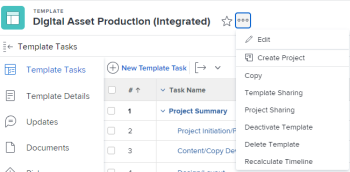

# Compartir plantillas de proyecto

Puede compartir una plantilla con los usuarios o puede definir cómo se compartirán los proyectos creados a partir de una plantilla con los usuarios mediante las siguientes opciones de uso compartido en el nivel de plantilla.

Al compartir un objeto en Adobe Workfront, permite a otros usuarios ver, aportar o editar dicho objeto.

Para obtener información sobre los permisos de Workfront, consulte [Información general sobre los permisos de uso compartido de objetos](../../../workfront-basics/grant-and-request-access-to-objects/sharing-permissions-on-objects-overview.md).

Para obtener información sobre los permisos que puede conceder a los usuarios al compartir una plantilla, consulte [Compartir una plantilla](../../../workfront-basics/grant-and-request-access-to-objects/share-a-template.md).

## Requisitos de acceso

Debe tener el siguiente acceso para realizar los pasos de este artículo:

<table style="table-layout:auto"> 
 <col> 
 <col> 
 <tbody> 
  <tr> 
   <td role="rowheader">Plan de Adobe Workfront*</td> 
   <td> 
Cualquiera 
 </td> 
  </tr> 
  <tr> 
   <td role="rowheader">Licencia de Adobe Workfront*</td> 
   <td> 
Plan 
 </td> 
  </tr> 
  <tr> 
   <td role="rowheader">Configuraciones de nivel de acceso*</td> 
   <td> 
Acceso de edición a las plantillas
 
Nota: Si sigue sin tener acceso, pregunte al administrador de Workfront si ha establecido restricciones adicionales en su nivel de acceso. Para obtener información sobre cómo un administrador de Workfront puede modificar su nivel de acceso, consulte <a href="../../../administration-and-setup/add-users/configure-and-grant-access/create-modify-access-levels.md" class="MCXref xref">Crear o modificar niveles de acceso personalizados</a>.
 </td> 
  </tr> 
  <tr> 
   <td role="rowheader">Permisos de objeto</td> 
   <td> 
Permisos de administración para una plantilla
 
Para obtener información sobre cómo solicitar acceso adicional, consulte <a href="../../../workfront-basics/grant-and-request-access-to-objects/request-access.md" class="MCXref xref">Solicitar acceso a los objetos </a>.
 </td> 
  </tr> 
 </tbody> 
</table>

&#42;Para saber qué plan, tipo de licencia o acceso tiene, póngase en contacto con el administrador de Workfront.

## Compartir una plantilla {#share-a-template}

Puede compartir las plantillas con otros usuarios mediante Distribución de plantilla. Esta acción define quién tiene permisos para la plantilla.

>[!NOTE]
>
>Cuando designa un usuario activo como Propietario de la plantilla, dicho usuario recibe automáticamente permisos de Administración sobre la plantilla. Para obtener información sobre cómo designar a alguien como propietario de la plantilla, consulte [Editar plantillas de proyecto](../../../manage-work/projects/create-and-manage-templates/edit-templates.md).

Para compartir una plantilla:

1. En el icono **Menú principal** , haga clic en **Plantillas**.

1. Realice una de las siguientes acciones:\
   Haga clic en el nombre de una plantilla para abrirla y luego haga clic en el menú **Más** , luego en **Uso compartido de plantillas**.

   O

   Seleccione una plantilla de la lista, haga clic en el icono Compartir  y, a continuación, haga clic en **Plantilla.**

   >[!TIP]
   >
   >Únicamente puede compartir un objeto con usuarios, equipos, funciones o compañías activas.

1. En el cuadro **Acceso a la plantilla**, seleccione las personas, los equipos, las funciones, los grupos o las empresas con los que desea compartir la plantilla.

   También puede hacer clic en el icono **Opciones** para que la plantilla esté disponible en todo el sistema:

1. En el menú desplegable de cada entidad con la que comparta, seleccione entre las siguientes opciones:

   * **Visualizar**: los usuarios con estos permisos pueden ver la plantilla y crear un proyecto mediante ella o adjuntarla a un proyecto existente.

     >[!TIP]
     >
     >El administrador de Workfront debe otorgarle acceso de edición sobre los proyectos para poder crear proyectos.

   * **Administrar**: los usuarios con estos permisos pueden editar o eliminar la plantilla.

     Para obtener información sobre la configuración avanzada  disponible aquí, consulte la sección [Configuración avanzada para distribución de plantilla](../../../workfront-basics/grant-and-request-access-to-objects/share-a-template.md#template-permissions) en el artículo [Compartir una plantilla](../../../workfront-basics/grant-and-request-access-to-objects/share-a-template.md).

1. Haga clic en **Guardar**.

## Compartir un proyecto a partir de una plantilla {#share-a-project-from-a-template}

Con el uso compartido de proyectos de plantilla, puede definir quién tiene permisos en los proyectos creados a partir de la plantilla en el nivel de plantilla.

Para compartir proyectos futuros creados a partir de una plantilla con usuarios:

1. Realice una de las siguientes acciones:\
   Haga clic en el nombre de una plantilla para abrirla y luego haga clic en el menú **Más** , luego en **Uso compartido de plantillas**.

   

   O

   Seleccione una plantilla de la lista, haga clic en **Compartir** y, a continuación, haga clic en **Proyecto.**

1. En el cuadro **Acceso al proyecto**, seleccione las personas, los equipos, las funciones, los grupos o las compañías con los que se comparte la plantilla.

   >[!TIP]
   >
   >Únicamente puede compartir un objeto con usuarios, equipos, funciones o compañías activas.

1. En el menú desplegable de cada entidad, seleccione una de las siguientes opciones:

   * **Sin acceso**: puede especificar qué usuarios no tendrán acceso a la plantilla.\
     Esta opción solo está disponible cuando se comparten proyectos en lote desde plantillas. 
   * **Visualizar**: los usuarios con estos permisos pueden ver los proyectos creados a partir de la plantilla.
   * **Aportar**: los usuarios con estos permisos pueden contribuir a los proyectos creados a partir de la plantilla 
   * **Administrar**: los usuarios con estos permisos pueden administrar o eliminar proyectos creados a partir de esta plantilla.

1. (Opcional) Haga clic en el icono **Opciones** para que los proyectos estén disponibles en todo el sistema.
1. Haga clic en **Guardar**.

<!--

<h3>Overview of project sharing from other sources</h3>

You may already have been assigned access to projects from other areas of Workfront.  You may have been assigned access to projects from the following areas: 

<ul>
<li>When a project is created For more information about sharing projects when the project is created, see the "Access" section in <a href="../../../manage-work/projects/manage-projects/edit-projects.md" class="MCXref xref">Edit projects</a>.</li>
<li>When your Workfront administrator sets user access levels For more information about setting access levels, see <a href="../../../administration-and-setup/add-users/configure-and-grant-access/create-modify-access-levels.md" class="MCXref xref">Create or modify custom access levels</a>.</li>
<li>When using the project access template</li>
</ul>

When using the Template Project Sharing feature, if a user's access to a project is View, but you set the access permissions for Template Project Sharing to Manage, the user will have Manage permission for every project created using this specific template. The user will only have View permission for the other projects they are on.

-->

## Compartir plantillas y proyectos desde plantillas en lotes

Puede compartir varias plantillas, así como proyectos desde varias plantillas al mismo tiempo.

>[!NOTE]
>
>Cuando se seleccionan varias plantillas, no es posible ver quién tiene ya permisos para las plantillas individuales.

1. Ir a una lista de plantillas.
1. Seleccione varias plantillas y haga clic en .

   

   >[!TIP]
   >
   >Únicamente puede compartir un objeto con usuarios, equipos, funciones o compañías activas.

1. Haga clic en **Plantilla** para compartir las plantillas seleccionadas.

   O

   Haga clic en **Proyecto** para compartir los proyectos que se crearán a partir de las plantillas seleccionadas.

1. Siga compartiendo las plantillas para los proyectos, tal como se describe en las siguientes secciones de este artículo:

   * [Compartir una plantilla](#share-a-template)
   * [Compartir un proyecto a partir de una plantilla](#share-a-project-from-a-template)
