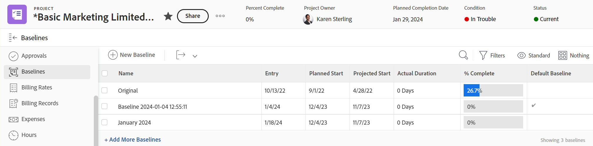

# Crear líneas de base del proyecto

<!-- Audited: 08/2025 -->

Una línea de base es una instantánea del proyecto que representa información clave incluida en el plan inicial del proyecto o en cualquier momento dado durante la duración del proyecto.

Puede utilizar la línea de base para comparar la información del plan actual con el plan original o con cualquier otro momento, para identificar las tareas problemáticas, la evolución del ámbito y otras tendencias a lo largo del tiempo.

## Requisitos de acceso

+++ Expanda para ver los requisitos de acceso para la funcionalidad en este artículo.

<table style="table-layout:auto"> 
 <col> 
 <col> 
 <tbody> 
  <tr> 
   <td role="rowheader">paquete de Adobe Workfront</td> 
   <td> 
Cualquiera
 </td> 
  </tr> 
  <tr> 
   <td role="rowheader">Licencia de Adobe Workfront</td> 
    <td>
Estándar

        
Plan
 </td> 
  </tr> 
  <tr> 
   <td role="rowheader">Configuración de nivel de acceso</td> 
   <td> 
Acceso de edición a proyectos
 </td> 
  </tr> 
  <tr> 
   <td role="rowheader">Permisos de objeto</td> 
   <td> 
Ver permisos del proyecto o superior para ver las líneas de base
 
Administrar permisos del proyecto para crear líneas de base
 </td> 
  </tr> 
 </tbody> 
</table>

Para obtener más información, consulte [Requisitos de acceso en la documentación de Workfront](/help/quicksilver/administration-and-setup/add-users/access-levels-and-object-permissions/access-level-requirements-in-documentation.md).

+++

<!--Old:

<table style="table-layout:auto"> 
 <col> 
 <col> 
 <tbody> 
  <tr> 
   <td role="rowheader">Adobe Workfront plan</td> 
   <td> 
Any
 </td> 
  </tr> 
  <tr> 
   <td role="rowheader">Adobe Workfront license*</td> 
    <td>
New: Standard

        
or

        
Current: Plan 
 </td> 
  </tr> 
  <tr> 
   <td role="rowheader">Access level</td> 
   <td> 
Edit access to Projects
 </td> 
  </tr> 
  <tr> 
   <td role="rowheader">Object permissions</td> 
   <td> 
View permissions to the project or higher to view baselines
 
Manage permissions to the project to create baselines
 </td> 
  </tr> 
 </tbody> 
</table>-->

## Consideraciones a la hora de trabajar con líneas de base

* Puede capturar una instantánea del progreso de un proyecto varias veces a lo largo de la duración del mismo y crear varias líneas de base.
* Puede ver la información incluida en las líneas de base de un proyecto creando una línea de base o un informe de línea de base.
* Cuando se crea una línea de base, la información de la tarea también se captura en las tareas de línea de base de esa línea de base.
* Puede ver la información de las tareas de línea de base creando un informe de Tarea de línea de base.

>[!IMPORTANT]
>
>Una línea de base toma una instantánea del nombre, las fechas y la información financiera del proyecto. La línea de base no incluye los valores de los campos personalizados del proyecto. Para obtener información financiera incluida en la línea de base, consulte [Finanzas del proyecto incluidas en las líneas de base del proyecto](../../../manage-work/projects/project-finances/project-finances-included-in-project-baselines.md).

## Crear una línea de base

Se puede crear una línea de base de las siguientes maneras:

* **Automáticamente**: el administrador de Workfront o un administrador de grupo establecen la preferencia de proyecto para que Workfront cree automáticamente una línea de base cuando un proyecto pase a ser Actual. Si se habilita esta configuración, se crea una línea de base cuando el estado del proyecto pasa a ser Actual. Cuando esta configuración no está habilitada, debe crear manualmente las líneas de base.

  Para obtener más información acerca de cómo configurar las preferencias del proyecto y configurar la creación automática de líneas de base, consulte [Configurar las preferencias de proyecto en todo el sistema](../../../administration-and-setup/set-up-workfront/configure-system-defaults/set-project-preferences.md).

  >[!CAUTION]
  >
  >Al habilitar esta configuración, se crea automáticamente una línea de base para un proyecto cada vez que el estado de un proyecto cambia a Actual. La primera línea de base creada es la predeterminada. Debe crear manualmente todas las demás líneas de base en el transcurso del proyecto.

* **Manualmente**: puede crear nuevas líneas de base para el proyecto según sea necesario a medida que avance el proyecto. A continuación, puede comparar las líneas de base para ver el progreso del proyecto a lo largo del tiempo.

Para crear una línea de base:

1. Vaya a un proyecto. 
1. En el panel izquierdo, haga clic en **Líneas de base**.

   

1. Haga clic en **Nueva línea de base.**
1. Especifique el nombre de la línea de base.
1. (Opcional) Si esta es la primera línea de base, es posible que desee elegirla como predeterminada.
1. Haga clic en **Guardar**.

   De forma predeterminada, se muestra la siguiente información sobre la línea de base creada:

   * Nombre de la línea de base
   * Fecha de entrada de la línea de base
   * Fecha de inicio planificada del proyecto en la que se creó la línea de base
   * Fecha proyectada de inicio del proyecto en que se creó la línea de base
   * Duración real del proyecto cuando se creó la línea de base
   * % Finalizado del proyecto cuando se creó la línea de base
   * Indicador de línea de base predeterminada que muestra si una línea de base es la línea de base predeterminada del proyecto

     >[!TIP]
     >
     >No es posible ver información de dos líneas de base al mismo tiempo en la misma vista o informe. Sólo se puede ver información de una línea de base determinada y de la línea de base predeterminada en el mismo informe. Puede modificar la línea de base que considere como predeterminada en cualquier momento durante el transcurso del proyecto.

1. (Opcional) Haga clic en el botón **Ver** y, a continuación, cree una nueva vista o edite la vista actual para añadir campos a la vista y comparar información adicional entre líneas de base. Para obtener más información, consulte [Crear o editar vistas en Adobe Workfront](/help/quicksilver/reports-and-dashboards/reports/reporting-elements/create-edit-views.md).

## Crear un informe de línea de base o de tarea de línea de base

Para ver la información de la línea de base, también puede crear un informe de línea de base o de tarea de línea de base. Esto le permite mostrar cualquier número de campo acerca de las líneas de base o las tareas de la línea de base para compararlos en una vista.

>[!TIP]
>
>Debe crear una línea de base antes de crear un informe de línea de base o de tarea de línea de base.

Para obtener información sobre cómo crear un informe, consulte [Crear un informe personalizado](../../../reports-and-dashboards/reports/creating-and-managing-reports/create-custom-report.md).

Se recomienda añadir una agrupación Nombre del proyecto al informe de línea de base o de tarea de línea de base para facilitar la lectura.

 Para obtener información sobre cómo crear una agrupación, consulte [Crear agrupaciones en Adobe Workfront](../../../reports-and-dashboards/reports/reporting-elements/create-groupings.md).
