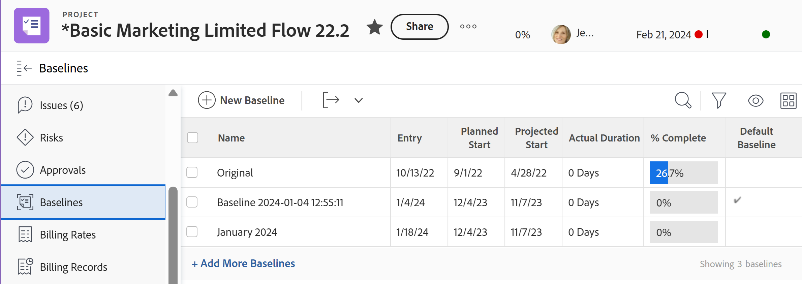

# Crear líneas de base del proyecto

Una línea de base es una instantánea del proyecto que representa partes clave de información incluidas en el plan inicial del proyecto o en cualquier momento durante la vida del proyecto.

Puede utilizar la línea de base para comparar esos fragmentos de información del plan actual con el plan original o cualquier otro punto en el tiempo, a fin de identificar las tareas problemáticas, el alcance de la eliminación y otras tendencias a lo largo del tiempo.

## Requisitos de acceso

<!--
drafted for P&P:

<table style="table-layout:auto"> 
 <col> 
 <col> 
 <tbody> 
  <tr> 
   <td role="rowheader">Adobe Workfront plan*</td> 
   <td> 
Any
 </td> 
  </tr> 
  <tr> 
   <td role="rowheader">Adobe Workfront license*</td> 
   <td> 
Current license: Standard 
 
   Or
   
Legacy license: Plan 
 
   </td> 
  </tr> 
  <tr> 
   <td role="rowheader">Access level*</td> 
   <td> 
Edit access to Projects
 
<b>NOTE</b>
   
   If you still don't have access, ask your Workfront administrator if they set additional restrictions in your access level. For information about access to projects, see <a href="../../../administration-and-setup/add-users/configure-and-grant-access/grant-access-projects.md" class="MCXref xref">Grant access to projects</a>. For information on how a Workfront administrator can change your access level, see <a href="../../../administration-and-setup/add-users/configure-and-grant-access/create-modify-access-levels.md" class="MCXref xref">Create or modify custom access levels</a>. 
 </td> 
  </tr> 
  <tr> 
   <td role="rowheader">Object permissions</td> 
   <td> 
View permissions to the project or higher to view baselines
 
Manage permissions to the project to create baselines
 
 For information about project permissions, see <a href="../../../workfront-basics/grant-and-request-access-to-objects/share-a-project.md" class="MCXref xref">Share a project in Adobe Workfront</a>.
 
For information on requesting additional access, see <a href="../../../workfront-basics/grant-and-request-access-to-objects/request-access.md" class="MCXref xref">Request access to objects </a>.
 </td> 
  </tr> 
 </tbody> 
</table>
-->

Debe tener el siguiente acceso para realizar los pasos de este artículo:

<table style="table-layout:auto"> 
 <col> 
 <col> 
 <tbody> 
  <tr> 
   <td role="rowheader">plan de Adobe Workfront*</td> 
   <td> 
Cualquiera
 </td> 
  </tr> 
  <tr> 
   <td role="rowheader">Licencia de Adobe Workfront*</td> 
   <td> 
Plan 
 </td> 
  </tr> 
  <tr> 
   <td role="rowheader">Nivel de acceso*</td> 
   <td> 
Editar acceso a Proyectos
 
<b>NOTA</b>
   Si todavía no tiene acceso, pregunte a su administrador de Workfront si establece restricciones adicionales en su nivel de acceso. Para obtener información sobre el acceso a los proyectos, consulte <a href="../../../administration-and-setup/add-users/configure-and-grant-access/grant-access-projects.md" class="MCXref xref">Concesión de acceso a proyectos</a>. Para obtener información sobre cómo un administrador de Workfront puede cambiar su nivel de acceso, consulte <a href="../../../administration-and-setup/add-users/configure-and-grant-access/create-modify-access-levels.md" class="MCXref xref">Crear o modificar niveles de acceso personalizados</a>. 
 </td> 
  </tr> 
  <tr> 
   <td role="rowheader">Permisos de objeto</td> 
   <td> 
Ver permisos para el proyecto o superior para ver líneas de base
 
Administre permisos al proyecto para crear líneas de base
 
 Para obtener información sobre los permisos del proyecto, consulte <a href="../../../workfront-basics/grant-and-request-access-to-objects/share-a-project.md" class="MCXref xref">Uso compartido de un proyecto en Adobe Workfront</a>.
 
Para obtener información sobre la solicitud de acceso adicional, consulte <a href="../../../workfront-basics/grant-and-request-access-to-objects/request-access.md" class="MCXref xref">Solicitar acceso a objetos </a>.
 </td> 
  </tr> 
 </tbody> 
</table>

&#42;Para saber qué plan, tipo de licencia o acceso tiene, póngase en contacto con el administrador de Workfront.

## Consideraciones para trabajar con líneas de base

* Puede capturar una instantánea del progreso de un proyecto varias veces durante la duración del mismo, creando varias líneas de base.
* Puede ver la información incluida en las líneas de base de un proyecto creando una línea de base o creando un informe de línea de base.
* Cuando se crea una línea de base, la información de la tarea también se captura en las tareas de línea de base de esa línea de base.
* Puede ver la información de las tareas de línea de base mediante la creación de un informe Tarea de línea de base.

>[!IMPORTANT]
>
>Una línea de base toma una instantánea del nombre, las fechas y la información financiera del proyecto. La línea de base no incluye los valores de los campos personalizados del proyecto. Para obtener información sobre la información financiera incluida en la línea de base, consulte [Finanzas de proyectos incluidas en las bases de referencia de proyectos](../../../manage-work/projects/project-finances/project-finances-included-in-project-baselines.md).

## Crear una línea de base

Puede crear una línea de base de las siguientes maneras:

* **Automáticamente**: El administrador de Workfront o un administrador de grupo establecen la preferencia del proyecto para que Workfront cree automáticamente una línea de base cuando un proyecto se convierta en actual. Cuando esta configuración está habilitada, se crea una línea de base cuando el estado del proyecto se convierte en Actual. Cuando esta configuración no está habilitada, debe crear líneas de base manualmente.

   Para obtener más información sobre la configuración de las preferencias de proyecto y la configuración de la creación de línea de base automática, consulte [Configurar las preferencias de proyecto de todo el sistema](../../../administration-and-setup/set-up-workfront/configure-system-defaults/set-project-preferences.md).

   >[!CAUTION]
   >
   >Al habilitar esta configuración, se crea automáticamente una línea de base para un proyecto cada vez que el estado de un proyecto cambia a Actual. La primera línea de base creada es la predeterminada. Debe crear manualmente todas las demás líneas de base durante la duración del proyecto .

* **Manualmente**: Puede crear nuevas líneas de base para el proyecto según sea necesario a medida que avance el proyecto. A continuación, puede comparar las líneas de base para ver el progreso del proyecto a lo largo del tiempo.

Para crear una línea de base:

1. Vaya a un proyecto.
1. En el panel izquierdo, haga clic en **Líneas de base**.

   O

   Haga clic en **Mostrar más** y haga clic en **Líneas de base**.

   

1. Haga clic en **Nueva línea de base.**
1. Especifique el nombre de la línea base.
1. (Opcional) Si esta es la primera línea de base, puede que desee seleccionarla como la predeterminada.
1. Haga clic en **Guardar**.

   De forma predeterminada, se muestra la siguiente información sobre la línea base creada:

   * Nombre de línea de base
   * Fecha de entrada de línea de base
   * Fecha de inicio planeada del proyecto cuando se creó la línea de base
   * Fecha de inicio prevista del proyecto cuando se creó la línea de base
   * Duración real del proyecto cuando se creó la línea de base
   * % Finalización del proyecto cuando se creó la línea de base
   * Indicador de línea de base predeterminada que muestra si una línea de base es la línea de base predeterminada del proyecto

      >[!TIP]
      >
      >No se puede ver información de dos líneas de base al mismo tiempo en la misma vista o informe. En el mismo informe solo se puede ver información de una línea de base determinada y la línea de base predeterminada. Puede modificar la línea de base que considere predeterminada en cualquier momento durante la duración del proyecto.

1. (Opcional) Haga clic en la flecha desplegable situada junto a la Vista y, a continuación, **Personalizar vista** para agregar campos a la vista y comparar información adicional entre líneas de base.

## Crear un informe de Línea de base o de Tarea de línea de base

Para ver la información de la línea de base, también puede crear un informe de Tarea de línea de base o de línea de base. Esto le permite mostrar cualquier número de campos sobre las líneas de base o las tareas de línea de base para compararlas en una vista.

>[!TIP]
>
>Debe crear una línea de base para poder crear un informe de Tarea de línea de base o de línea de base.

Para obtener información sobre cómo crear un informe, consulte [Crear un informe personalizado](../../../reports-and-dashboards/reports/creating-and-managing-reports/create-custom-report.md).

Le recomendamos que agregue una agrupación Nombre del proyecto al informe Línea de base o Línea de base para facilitar la lectura.

Para obtener información sobre cómo crear una agrupación, consulte [Crear agrupaciones en Adobe Workfront](../../../reports-and-dashboards/reports/reporting-elements/create-groupings.md).
