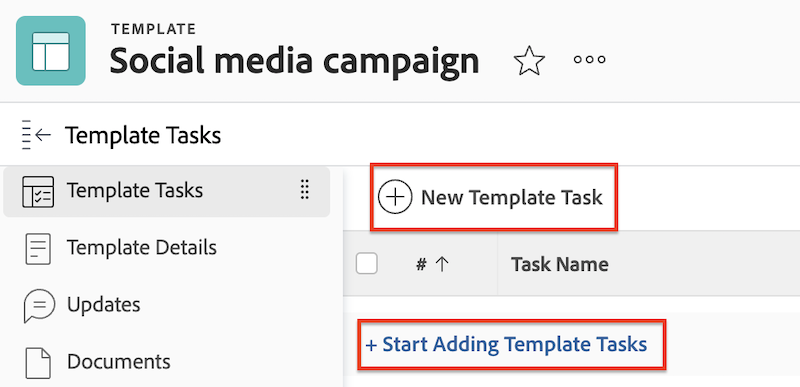
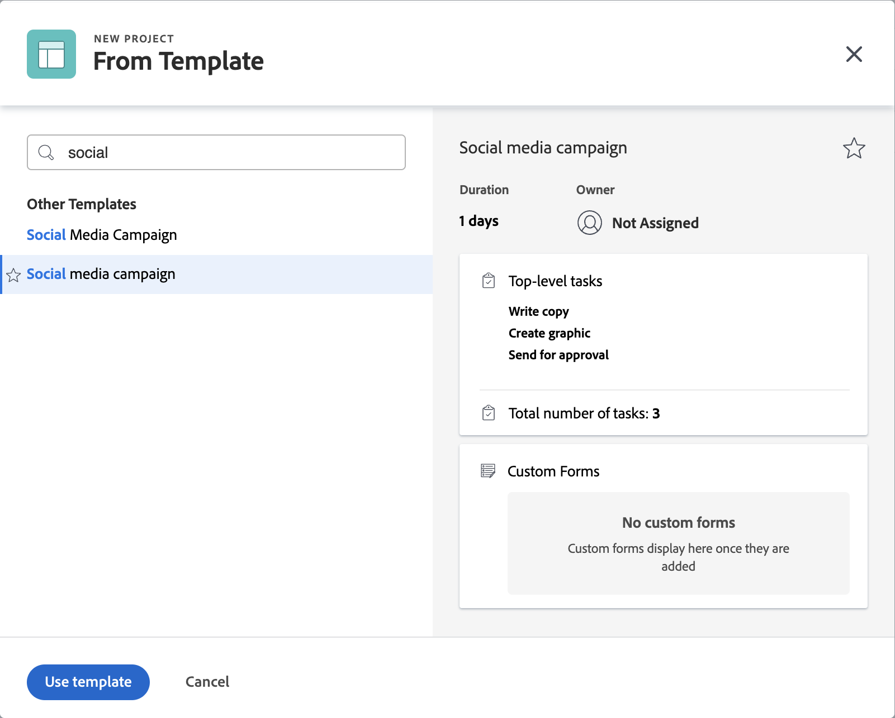

# Crear un proyecto conectado con Frame.io

La integración de Workfront y Frame.io le permite crear proyectos en Workfront que se reflejan en Frame.io, lo que proporciona una experiencia de revisión y aprobación sin problemas.

Cuando un proyecto de Workfront está conectado con Frame.io, puede

* **Asignar usuarios de Frame.io a tareas**: se notifica por correo electrónico a los usuarios habilitados para Frame.io cuando se les asigna una tarea de Workfront, indicando que hay trabajo para completar.
* **Compartir el proyecto con usuarios de Frame.io**: cuando se comparte un proyecto con usuarios habilitados para Frame.io, tienen acceso al proyecto tanto dentro de Workfront como en Frame.io.
* **Compartir materiales creativos con Frame.io**: los coordinadores de proyectos pueden enviar instrucciones y materiales desde Workfront directamente al usuario creativo en Frame.io mediante una carpeta de proyectos de sincronización unidireccional. [!BADGE Muy pronto]{type=Informative}
* **Seguimiento del progreso de las tareas**: los creativos pueden enviar los recursos finalizados y marcar las tareas como completadas, todo sin salir de Frame.io.

## Requisitos de acceso

+++ Expanda para ver los requisitos de acceso para la funcionalidad en este artículo.

>[!IMPORTANT]
>
>Esta funcionalidad solo está disponible para las organizaciones que se han incorporado a [!DNL Adobe Admin Console].

Debe tener lo siguiente:

<table style="table-layout:auto"> 
 <col> 
 <col> 
 <tbody> 
  <tr> 
   <td role="rowheader">Plan de Adobe Workfront</td> 
   <td> 
Cualquiera
 </td> 
  </tr> 
  <tr> 
   <td role="rowheader">Licencia de Adobe Workfront</td> 
   <td> 
Estándar
 </td> 
  </tr> 
  <tr> 
   <td role="rowheader">Configuraciones de nivel de acceso</td> 
   <td> 
Acceso de edición a proyectos
 </td> 
  </tr> 
  <tr> 
   <td role="rowheader">Permisos de objeto</td> 
   <td> 
Al crear un proyecto, recibirá automáticamente permisos de Administración en el proyecto.
 </td> 
  </tr> 
 </tbody> 
</table>

Para obtener más información sobre esta tabla, consulte [Requisitos de acceso en la documentación de Workfront](/help/quicksilver/administration-and-setup/add-users/access-levels-and-object-permissions/access-level-requirements-in-documentation.md).

+++

## Requisitos previos

* Configure la cuenta predeterminada de Frame.io en el área de configuración de Workfront
* Habilite usuarios de Frame.io en el perfil de usuario de Workfront

Para obtener más información sobre los requisitos previos anteriores, consulte [Configurar la  [!DNL Workfront] integración de  [!DNL Frame.io]  y](/help/quicksilver/administration-and-setup/configure-integrations/configure-wf-and-frame.md).

## Creación de una nueva plantilla de proyecto

Al crear una plantilla nueva, puede introducir la información de todas las tareas y de la configuración futura del proyecto. Esta información se transferirá a cualquier proyecto que cree a partir de la plantilla.

Los proyectos de Frame.io están organizados por equipos conectados a grupos de Workfront. Se recomienda utilizar una plantilla de proyecto para crear proyectos conectados, ya que puede establecer el grupo de proyectos antes.

Si decide crear el proyecto desde cero, Workfront añade automáticamente el grupo de proyectos Predeterminado y el proyecto Frame.io reflejado se crea en ese equipo predeterminado en Frame.io.

>[!NOTE]
>
>La actualización del grupo después de la creación del proyecto no cambia el equipo de Frame.io.

### Crear la plantilla y especificar el grupo de proyectos

{{step1-to-templates}}

1. Haga clic en **Nueva plantilla**.
1. Escriba un nombre para la plantilla y presione **Intro** para guardar el nombre.
1. En el panel izquierdo, haga clic en **Detalles de plantilla**.
1. En la sección **Asociación de plantillas**, asegúrese de especificar un grupo. Si no añade ningún grupo, se añadirá el grupo de proyecto predeterminado y el proyecto de Frame.io se creará en el equipo predeterminado correspondiente de Frame.io.

Continúe con la sección siguiente.

### Añadir tareas y asignar usuarios habilitados para Frame.io

1. En el panel izquierdo, haga clic en **Tareas de plantilla**.
1. Haga clic en **Comenzar a añadir tareas de plantilla** para añadir rápidamente tareas a su plantilla. Puede configurar opciones adicionales más adelante.

   O

   Haga clic en **Nueva tarea de plantilla** para añadir una tarea a la vez y configurar opciones adicionales.
   
1. Añada un nombre de tarea.
1. En el área **Asignaciones**, asigne usuarios o equipos. Si asigna a un usuario habilitado para Frame.io, ya sea de forma individual o en equipo, se le concede acceso de colaborador al proyecto Frame.io y se le notifica la tarea en el proyecto Frame.io por correo electrónico. Desde ese correo electrónico, pueden unirse al proyecto de Frame.io y empezar a trabajar.
1. Repita los pasos 1 y 2 según sea necesario.

Continúe con la sección siguiente.

### Configuración de detalles de plantilla adicionales

Workfront tiene funcionalidades sólidas de administración de proyectos. Se recomienda leer el artículo [Editar plantillas del proyecto](/help/quicksilver/manage-work/projects/create-and-manage-templates/edit-templates.md) para configurar las siguientes áreas de la plantilla:

* Información general
* Finanzas
* Formularios personalizados
* Configuración de proyecto
* Configuración de tareas
* Configuración de problema
* Acceso

### Crear un proyecto a partir de una plantilla

Una vez creada una plantilla, puede utilizarla para crear proyectos.

{{step1-to-projects}}

1. Haga clic en **Nuevo proyecto a partir de plantilla**
1. Con el cuadro de búsqueda, empiece a escribir el nombre de la plantilla que necesita.
1. Seleccione el nombre de la plantilla y luego haga clic en **Usar plantilla**.
   
1. Ajuste la configuración del proyecto según sea necesario y haga clic en **Crear proyecto**.
1. En el panel izquierdo, haga clic en **Documentos**.
1. Utilice la carpeta de sincronización unidireccional para compartir automáticamente los materiales creativos con Frame.io. [!BADGE Muy pronto]{type=Informative}

   >[!NOTE]
   >
   >Esta función está actualmente en desarrollo. Para compartir información con los usuarios en Frame.io, cargue los archivos en la pestaña Documento. Cuando el estado del proyecto se establece en Actual, esos archivos se insertan automáticamente en Frame.io.

1. En el encabezado del proyecto, cambie el proyecto de **Planificación** a **Actual**.

Una vez creado el proyecto y cargado por los creativos los recursos finalizados, puede asignar un flujo de trabajo de revisión y aprobación al recurso en Workfront. Para obtener más información, consulte [Crear una solicitud de revisión o aprobación de documento](/help/quicksilver/review-and-approve-work/document-reviews-and-approvals/manage-document-approvals/create-a-document-approval.md). <!-- name may need to change -->

## Creación de un proyecto desde cero

Puede crear un nuevo proyecto desde cero según sea necesario.

>[!IMPORTANT]
>
>* Los proyectos de Frame.io están organizados por equipos conectados a grupos de Workfront. Se recomienda utilizar una plantilla de proyecto para crear proyectos conectados, ya que puede establecer el grupo de proyectos antes.
>
>
>* Si decide crear el proyecto desde cero, Workfront añade automáticamente el grupo de proyectos Predeterminado y el proyecto Frame.io reflejado se crea en ese equipo predeterminado en Frame.io.
>
>La actualización del grupo después de la creación del proyecto no cambia el equipo de Frame.io.

### Crear el proyecto

{{step1-to-projects}}

1. Haga clic en **Nuevo proyecto**.
1. Escriba un nombre para el proyecto y presione **Entrar** para guardar el nombre.

Continúe con la sección siguiente.

### Añadir tareas y asignar usuarios habilitados para Frame.io

1. En el panel izquierdo, haga clic en **Tareas**.
1. Haga clic en **Añadir la adición de tareas** para añadir rápidamente tareas al proyecto. Puede configurar opciones adicionales más adelante.

   O

   Haga clic en **Nueva tarea** para añadir una tarea a la vez y configurar opciones adicionales.
   
1. Añada un nombre de tarea.
1. En el área **Asignaciones**, asigne usuarios o equipos. Si asigna a un usuario habilitado para Frame.io, ya sea de forma individual o en equipo, se le concede acceso de colaborador al proyecto Frame.io y se le notifica la tarea en el proyecto Frame.io por correo electrónico. Desde ese correo electrónico, pueden unirse al proyecto de Frame.io y empezar a trabajar.
1. Repita los pasos 1 y 2 según sea necesario.

Continúe con la sección siguiente.

### Cargar materiales creativos

1. En el panel izquierdo, haga clic en **Documentos**.
1. Utilice la carpeta de sincronización unidireccional para compartir automáticamente los materiales creativos con Frame.io. [!BADGE Muy pronto]{type=Informative}

   >[!NOTE]
   >
   >Esta función está actualmente en desarrollo. Para compartir información con los usuarios en Frame.io, cargue los archivos en la pestaña Documento. Cuando el estado del proyecto se establece en Actual, esos archivos se insertan automáticamente en Frame.io

Continúe con la sección siguiente.

### Configurar detalles adicionales del proyecto

Workfront tiene funcionalidades sólidas de administración de proyectos. Se recomienda usar el artículo [Editar proyectos](/help/quicksilver/manage-work/projects/manage-projects/edit-projects.md) para configurar las siguientes áreas del proyecto:

* Información general
* Finanzas
* Formularios personalizados
* Configuración de proyecto
* Configuración de tareas
* Configuración de problema
* Acceso

### Establecer el proyecto en actual

1. En la cabecera del proyecto, cambie el proyecto de Planificación a Actual.
Una vez creado el proyecto y cargado por los creativos los recursos finalizados, puede asignar un flujo de trabajo de revisión y aprobación al recurso en Workfront.

Una vez creado el proyecto y cargado por los creativos los recursos finalizados, puede asignar un flujo de trabajo de revisión y aprobación al recurso en Workfront.

Para obtener más información, vea [Crear una solicitud de revisión o aprobación de documento](/help/quicksilver/review-and-approve-work/document-reviews-and-approvals/manage-document-approvals/create-a-document-approval.md). <!-- name may need to change -->
