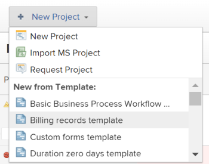
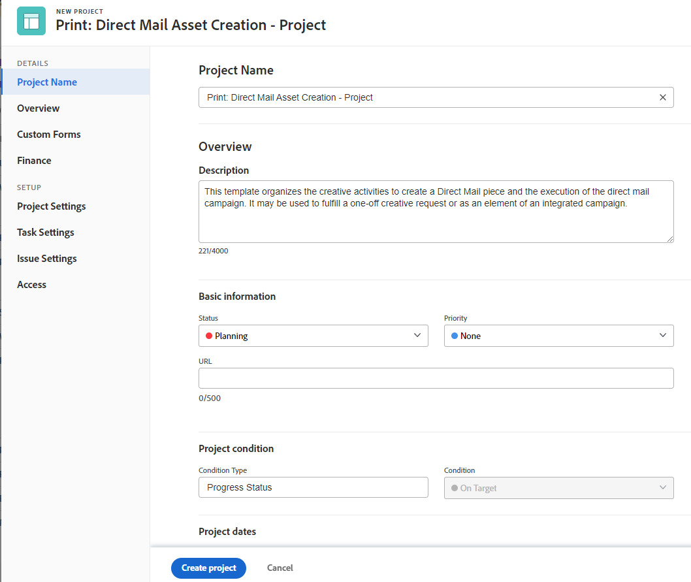

# Crear un proyecto a partir de una plantilla

<!-- Audited: 10/2025 -->

Puede utilizar las plantillas como un marco de trabajo para crear proyectos en Adobe Workfront. Si tiene proyectos que se repiten con frecuencia, el uso de plantillas para la cronología general del nuevo proyecto evita tener que generar los mismos proyectos repetidamente.

Las plantillas le proporcionan una forma de capturar procesos, información y configuraciones repetibles asociados a sus proyectos. La información asociada con una plantilla se transfiere al proyecto. Esto incluye tareas, asignaciones, duraciones, documentos, detalles financieros, riesgos y formularios personalizados.

>[!TIP]
>
>Workfront define el Grupo y el Estado del nuevo proyecto de la siguiente manera:
>
>* El estado predeterminado de un nuevo proyecto creado a partir de una plantilla corresponde al estado definido por el administrador de Workfront en el área principal Preferencias de proyecto, o por un administrador de grupo (o administrador de Workfront) en el área Preferencias de proyecto para un grupo. Para obtener información acerca de cómo configurar las preferencias del proyecto, consulte [Configurar las preferencias de proyecto de todo el sistema](../../../administration-and-setup/set-up-workfront/configure-system-defaults/set-project-preferences.md) o [Configurar las preferencias de proyecto para un grupo](../../../administration-and-setup/manage-groups/create-and-manage-groups/configure-project-preferences-group.md).
>
>* El Grupo del nuevo proyecto es el Grupo de la plantilla. Si la plantilla no está asociada a un Grupo, el Grupo del proyecto es el Grupo de inicio del usuario que crea el proyecto.
>
>* Los estados disponibles para un nuevo proyecto coinciden con los estados del Grupo del proyecto, que es el Grupo de la plantilla o el Grupo de inicio del usuario que crea el proyecto.

Tiene las siguientes opciones para crear un proyecto a partir de una plantilla:

* Crear un proyecto a partir de una plantilla en el área Proyectos
* Crear un proyecto a partir de una plantilla en el nivel de plantilla
* Adjuntar una plantilla a un proyecto existente

  Para obtener información, consulte [Adjuntar una plantilla a un proyecto](../../../manage-work/projects/create-and-manage-templates/attach-template-to-project.md).

* Crear un proyecto a partir de una plantilla en el área Grupos

## Requisitos de acceso

+++ Expanda para ver los requisitos de acceso para la funcionalidad en este artículo.

<table style="table-layout:auto"> 
 <col> 
 <col> 
 <tbody> 
  <tr> 
   <td role="rowheader">paquete de Adobe Workfront</td> 
   <td> 
Cualquiera
 </td> 
  </tr> 
  <tr> 
   <td role="rowheader">Licencia de Workfront</td> 
   <td> 
Estándar

        
Plan
 </td> 
  </tr> 
  <tr> 
   <td role="rowheader">Configuración de nivel de acceso</td> 
   <td> 
Editar el acceso a Proyectos y Plantillas

   
Editar el acceso a Portafolios y Programas, si la plantilla utilizada contiene un Portfolio y un Programa
  
   </td> 
  </tr> 
  <tr> 
   <td role="rowheader">Permisos de objeto</td> 
   <td> 
Ver permisos de una plantilla
 
  
Si la plantilla que utiliza contiene un Portafolio y un Programa, debe tener permisos de administración en el portafolio y el programa para crear el proyecto 
 
   
Al crear un proyecto, recibirá automáticamente permisos de Administración en el proyecto.
</td> 
  </tr> 
 </tbody> 
</table>

Para obtener más información, consulte [Requisitos de acceso en la documentación de Workfront](/help/quicksilver/administration-and-setup/add-users/access-levels-and-object-permissions/access-level-requirements-in-documentation.md).

+++

<!--Old:

<table style="table-layout:auto"> 
 <col> 
 <col> 
 <tbody> 
  <tr> 
   <td role="rowheader">Adobe Workfront plan</td> 
   <td> 
Any 
 </td> 
  </tr> 
  <tr> 
   <td role="rowheader">Workfront license*</td> 
   <td> 
New: Standard

        
or

        
Current: Plan 
 </td> 
  </tr> 
  <tr> 
   <td role="rowheader">Access level</td> 
   <td> 
Edit access to Projects and to Templates

   
   
edit access to Portfolios and Programs, if the template you use contains a Portfolio and a Program

   
   </td> 
  </tr> 
  <tr> 
   <td role="rowheader">Object permissions</td> 
   <td> 
View permissions to a template
 
  
If the template you use contains a Portfolio and a Program, you must have Manage permissions to the portfolio and program to create the project 
 
   
When you create a project, you automatically receive Manage permissions to the project.
</td> 
  </tr> 
 </tbody> 
</table>-->

## Crear un proyecto a partir de una plantilla en el área Proyectos

Puede crear un proyecto desde el área Proyectos del menú principal o desde el área Proyectos de un portafolio o programa.

>[!NOTE]
>
>El administrador del sistema o del grupo puede modificar la interfaz mediante una plantilla de diseño. En este caso, algunos de los nombres de las secciones y áreas a las que se hace referencia en los pasos siguientes podrían ser diferentes en su instancia de Workfront.

1. Realice una de las siguientes acciones:

   * Haga clic en el icono **[!UICONTROL Menú principal]**  en la esquina superior izquierda, o en el icono **[!UICONTROL Menú principal]**  en la esquina superior derecha de Adobe Workfront, si está disponible, luego haga clic en **Proyectos** y expanda **Nuevo proyecto**.
   * Vaya a un portafolio y expanda **Nuevo proyecto**.

     >[!TIP]
     >
     >Cuando se crea un proyecto utilizando una plantilla de un portafolio, el campo Portafolio del nuevo proyecto se actualiza para mostrar el portafolio desde el que se eligió crear el proyecto. Esto sobrescribe el campo del Portafolio en la plantilla, si se especifica.

   * Vaya a un programa y expanda **Nuevo proyecto**.

     >[!TIP]
     >
     >Cuando se crea un proyecto con una plantilla desde un programa, el campo Programa de los nuevos proyectos se actualiza para mostrar el Programa desde el que se eligió crear el proyecto. El campo Portafolio de la plantilla se actualiza para mostrar el portafolio del programa desde el que eligió crear el proyecto. Esto sobrescribe los campos Programa y Portafolio de la plantilla, si se especifican.

   * Si es administrador de un grupo, también puede crear un proyecto en la sección Proyectos de un grupo que administre. Para obtener más información, consulte [Crear y modificar proyectos de un grupo](../../../administration-and-setup/manage-groups/work-with-group-objects/create-and-modify-a-groups-projects.md).

     >[!TIP]
     >
     >Cuando se crea un proyecto utilizando una plantilla de un grupo, el grupo desde el que se crea el proyecto solo se muestra en el campo Grupo del nuevo proyecto cuando no se especifica el campo Grupo de la plantilla. Si se especifica el campo Grupo de plantilla, el campo Grupo del nuevo proyecto es el de la plantilla.

   <!--
   
(this, above, is hyperlinked to the classic version of this article; the Milestone View steps are similar to creating a project in Classic than to the way you do it in NWE)

   -->

   

1. Haga clic en el nombre de una plantilla en la lista **Plantillas favoritas**.

   

   O

   Haga lo siguiente:

   1. Haga clic en **Nuevo proyecto a partir de plantilla**
   1. En el campo **Buscar plantillas**, empiece a escribir el nombre de una plantilla y haga clic en ella cuando se muestre en la lista.
   1. Revise los detalles de la plantilla a la derecha.

      Los detalles de la plantilla incluyen lo siguiente:

      * Duración de la plantilla
      * Propietario de la plantilla
      * Número de tareas de nivel superior, que incluye los nombres de las tres tareas principales
      * Número de todas las tareas de la plantilla
      * Nombres de los formularios personalizados de plantilla

   1. (Opcional) Pase el ratón sobre el nombre de una plantilla en el panel izquierdo y haga clic en el **icono de Favoritos** **icono**  para marcarla como favorita para uso futuro.

      O

      Expanda la lista **Plantillas favoritas** y seleccione una plantilla de la lista desplegable.

      >[!TIP]
      >
      >Puede tener hasta 40 elementos de Workfront marcados como favoritos. Esto incluye plantillas y otros elementos.

   1. Haga clic en **Usar plantilla** cuando haya seleccionado una plantilla.

      

      <!--no longer available, after unshimming - Oct 2025:
      >[!NOTE]
      >
      >If you have the Milestone View applied to the list of projects, click the name of a template in the **New from Template section**.
      >
      >
      >
      >
      -->

   Se abre el cuadro **Nuevo proyecto**.

   

1. (Condicional) Si un campo ya se ha rellenado en la plantilla, ya se ha rellenado en el cuadro **Nuevo proyecto**.

   Edite los valores rellenados previamente para que coincidan mejor con el proyecto.

   Para obtener más información, consulte [Editar proyectos](../../../manage-work/projects/manage-projects/edit-projects.md).
1. Haga clic en **Crear proyecto**.

   Todos los detalles definidos en la plantilla se asocian automáticamente al proyecto recién creado si no los ha cambiado en el paso anterior.

## Cree un proyecto a partir de una plantilla en el área Plantillas

En lugar de empezar en el área de Proyectos, puede crear un proyecto a partir de una plantilla empezando por la plantilla.

{{step1-to-templates}}

1. Haga clic en el nombre de la plantilla que desee utilizar.
1. Haga clic en el icono **Más** del menú  a la derecha del nombre de la plantilla en el encabezado, luego haga clic en **Crear proyecto**.

   

   Se abre el cuadro **Nuevo proyecto**.

1. Escriba un nombre para el proyecto. Workfront utiliza el nombre de la plantilla para asignar un nombre al nuevo proyecto.

1. Revise cada sección del cuadro **Nuevo proyecto** y realice los cambios que sean necesarios.

   

   Si un campo ya se ha rellenado en la plantilla, el campo ya se ha rellenado previamente en el cuadro **Nuevo proyecto**. Puede editar los valores rellenados previamente para que coincidan mejor con su proyecto.

   Para obtener más información, consulte [Editar proyectos](../../../manage-work/projects/manage-projects/edit-projects.md).

1. Haga clic en **Crear proyecto**.

   Todos los detalles definidos en la plantilla se asocian automáticamente al proyecto recién creado si no los ha cambiado en el paso anterior.
