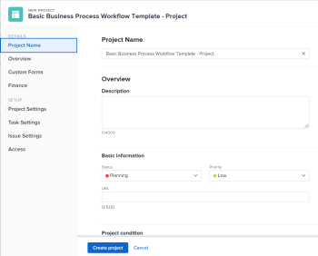

# Creación de un proyecto mediante una plantilla

Puede utilizar plantillas como marco para crear nuevos proyectos. Si tiene proyectos que se repiten con frecuencia, el uso de plantillas para la cronología general del nuevo proyecto evita tener que crear los mismos proyectos repetidamente.

Las plantillas le proporcionan una forma de capturar todos los procesos, la información y la configuración repetibles asociados a sus proyectos. Toda la información asociada a una plantilla se transfiere al proyecto. Esto incluye tareas, asignaciones, duraciones, documentos, detalles financieros, riesgos y formularios personalizados.

>[!TIP]
>
>El estado de un nuevo proyecto creado a partir de una plantilla se corresponde con el estado definido por el administrador de Workfront en el área principal de Preferencias del proyecto o por un administrador de grupo (o administrador de Workfront) en el área Preferencias del proyecto de un grupo. Para obtener información sobre cómo configurar las preferencias del proyecto, consulte [Configurar las preferencias de proyecto de todo el sistema](../../../administration-and-setup/set-up-workfront/configure-system-defaults/set-project-preferences.md) o [Configuración de las preferencias de un proyecto para un grupo](../../../administration-and-setup/manage-groups/create-and-manage-groups/configure-project-preferences-group.md).

Tiene las siguientes opciones para crear un proyecto a partir de una plantilla:

* Crear un proyecto a partir de una plantilla en el área Proyectos
* Crear un proyecto a partir de una plantilla en el nivel de plantilla
* Adjuntar una plantilla a un proyecto existente

   Para obtener más información, consulte [Adjuntar una plantilla a un proyecto](../../../manage-work/projects/create-and-manage-templates/attach-template-to-project.md).

* Crear un proyecto a partir de una plantilla en el área Grupos

## Requisitos de acceso

<!--drafted for P&P:

<table style="table-layout:auto"> 
 <col> 
 <col> 
 <tbody> 
  <tr> 
   <td role="rowheader">Adobe Workfront plan*</td> 
   <td> 
Any 
 </td> 
  </tr> 
  <tr> 
   <td role="rowheader">Workfront license*</td> 
   <td> 
Current license: Standard 

   Or
   
Legacy license: Plan 

    </td> 
  </tr> 
  <tr> 
   <td role="rowheader">Access level configurations*</td> 
   <td> 
Edit access to Projects and to Templates
 
<b>NOTE</b>
   
   If you still don't have access, ask your Workfront administrator if they set additional restrictions in your access level. For information about access to projects, see <a href="../../../administration-and-setup/add-users/configure-and-grant-access/grant-access-projects.md" class="MCXref xref">Grant access to projects</a>. For information on how a Workfront administrator can change your access level, see <a href="../../../administration-and-setup/add-users/configure-and-grant-access/create-modify-access-levels.md" class="MCXref xref">Create or modify custom access levels</a>. 
 </td> 
  </tr> 
  <tr> 
   <td role="rowheader">Object permissions</td> 
   <td> 
View permissions to a template
 
When you create a project you automatically receive Manage permissions to the project 
 
 For information about project permissions, see <a href="../../../workfront-basics/grant-and-request-access-to-objects/share-a-project.md" class="MCXref xref">Share a project in Adobe Workfront</a>.
 
For information on requesting additional access, see <a href="../../../workfront-basics/grant-and-request-access-to-objects/request-access.md" class="MCXref xref">Request access to objects </a>.
 </td> 
  </tr> 
 </tbody> 
</table>
-->

Debe tener el siguiente acceso para realizar los pasos de este artículo:

<table style="table-layout:auto"> 
 <col> 
 <col> 
 <tbody> 
  <tr> 
   <td role="rowheader">plan de Adobe Workfront*</td> 
   <td> 
Cualquiera 
 </td> 
  </tr> 
  <tr> 
   <td role="rowheader">Información general sobre las licencias de Workfront*</td> 
   <td> 
Plan 
 </td> 
  </tr> 
  <tr> 
   <td role="rowheader">Nivel de acceso*</td> 
   <td> 
Editar acceso a Proyectos y Plantillas
 
<b>NOTA</b>

Si todavía no tiene acceso, pregunte a su administrador de Workfront si establece restricciones adicionales en su nivel de acceso. Para obtener información sobre el acceso a los proyectos, consulte <a href="../../../administration-and-setup/add-users/configure-and-grant-access/grant-access-projects.md" class="MCXref xref">Concesión de acceso a proyectos</a>. Para obtener información sobre cómo un administrador de Workfront puede cambiar su nivel de acceso, consulte <a href="../../../administration-and-setup/add-users/configure-and-grant-access/create-modify-access-levels.md" class="MCXref xref">Crear o modificar niveles de acceso personalizados</a>. 
 </td>
</tr> 
  <tr> 
   <td role="rowheader">Permisos de objeto</td> 
   <td> 
Ver permisos de una plantilla
 
Cuando crea un proyecto, automáticamente recibe permisos de administración para el proyecto 
 
 Para obtener información sobre los permisos del proyecto, consulte <a href="../../../workfront-basics/grant-and-request-access-to-objects/share-a-project.md" class="MCXref xref">Uso compartido de un proyecto en Adobe Workfront</a>.
 
Para obtener información sobre la solicitud de acceso adicional, consulte <a href="../../../workfront-basics/grant-and-request-access-to-objects/request-access.md" class="MCXref xref">Solicitar acceso a objetos </a>.
 </td> 
  </tr> 
 </tbody> 
</table>

&#42;Para saber qué plan, tipo de licencia o acceso tiene, póngase en contacto con el administrador de Workfront.

## Crear un proyecto a partir de una plantilla en el área Proyectos

Puede crear un proyecto desde el área Proyectos del menú principal o desde el área Proyectos de un portafolio o un programa.

1. Realice una de las siguientes acciones:

   * Haga clic en el **Menú principal** , haga clic en **Proyectos** y, a continuación, expanda **Nuevo proyecto**.
   * Vaya a un portafolio y, a continuación, expanda **Nuevo proyecto**.

      >[!TIP]
      >
      >Cuando crea un proyecto utilizando una plantilla de un portafolio, el campo Portfolio del nuevo proyecto se actualiza para mostrar el portafolio desde el que eligió crear el proyecto. Esto sobrescribe el campo Portfolio de la plantilla, si se especifica.

   * Vaya a un programa y, a continuación, expanda **Nuevo proyecto**.

      >[!TIP]
      >
      >Cuando crea un proyecto utilizando una plantilla de un programa, se actualiza el campo Program de los nuevos proyectos para mostrar el Programa que ha elegido para crear el proyecto. El campo Portfolio de la plantilla se actualiza para mostrar el portafolio del programa desde el que ha elegido crear el proyecto. Esto sobrescribe los campos Programa y Portfolio de la plantilla, si se especifican.

   * Si es administrador de un grupo, también puede crear un proyecto en la sección Proyectos de un grupo que administre. Para obtener más información, consulte [Creación y modificación de los proyectos de un grupo](../../../administration-and-setup/manage-groups/work-with-group-objects/create-and-modify-a-groups-projects.md).

      >[!TIP]
      >
      >Cuando se crea un proyecto con una plantilla de un grupo, el grupo desde el que se crea el proyecto se muestra en el campo Grupo del nuevo proyecto solo cuando no se especifica el campo Grupo de la plantilla. Si se especifica el campo Grupo de plantilla, el campo Grupo del nuevo proyecto es el de la plantilla.
   <!--
   
(this, above, is hyperlinked to the classic version of this article; the Milestone View steps are similar to creating a project in Classic than to the way you do it in NWE)

   -->

   

1. Haga clic en el nombre de una plantilla en la **Plantillas favoritas** list

   

   O

   Haga lo siguiente:

   1. Select **Nuevo proyecto a partir de plantilla**.
   1. En el **Buscar plantillas** , empiece a escribir el nombre de una plantilla y haga clic en ella cuando aparezca en la lista.
   1. Revise los detalles de la plantilla a la derecha.

      Los detalles de la plantilla incluyen lo siguiente:

      * Duración de la plantilla
      * Propietario de la plantilla
      * El número de tareas de nivel superior que incluye los nombres de las tres tareas principales
      * El número de todas las tareas de la plantilla
      * Los nombres de los formularios personalizados de plantilla
   1. (Opcional) Pase el ratón sobre el nombre de una plantilla y haga clic en el botón **Favoritos** **icono**  para marcarla como favorita para uso futuro.

      O

      Expanda el **Plantillas favoritas** y seleccione una plantilla en la lista desplegable.

      >[!TIP]
      >
      >Puede tener hasta 40 elementos de Workfront marcados como favoritos. Esto incluye plantillas y otros elementos.

   1. Haga clic en **Usar plantilla** cuando haya seleccionado una plantilla.

   

   >[!NOTE]
   >
   >Si ha aplicado la vista de Milestone a la lista de proyectos, haga clic en el nombre de una plantilla en la **Nuevo desde la sección Plantilla**.
   >
   >
   >   >

1. La variable **Nuevo proyecto** se abre.

   

1. Si un campo ya está rellenado en la plantilla, el campo se rellena previamente en la variable **Nuevo proyecto** en la ventana Puede editar los valores rellenados previamente para que coincidan mejor con el proyecto. Para obtener más información, consulte [Editar proyectos](../../../manage-work/projects/manage-projects/edit-projects.md).
1. Haga clic en **Crear proyecto**.

   Todos los detalles definidos en la plantilla se asocian automáticamente al proyecto recién creado si no los ha cambiado en el paso anterior.

## Crear un proyecto a partir de una plantilla en el área Plantillas

En lugar de comenzar en el área Proyectos , puede crear un proyecto a partir de una plantilla empezando por la plantilla.

 

1. En el **Menú principal**, haga clic en **Plantillas**.

1. Haga clic en el nombre de la plantilla que desee utilizar.
1. Haga clic en el **Más** menú y haga clic en **Crear proyecto.**

   

   La variable **Nuevo proyecto** se abre.

1. Especifique un nombre para el proyecto y, a continuación, revise cada sección y realice los cambios que sean necesarios.

   

   Si un campo ya está rellenado en la plantilla, el campo se rellena previamente en la variable **Nuevo proyecto** en la ventana Puede editar los valores rellenados previamente para que coincidan mejor con el proyecto. Para obtener más información, consulte [Editar proyectos](../../../manage-work/projects/manage-projects/edit-projects.md).

1. Haga clic en **Crear proyecto.**

   Todos los detalles definidos en la plantilla se asocian automáticamente al proyecto recién creado si no los ha cambiado en el paso anterior.
