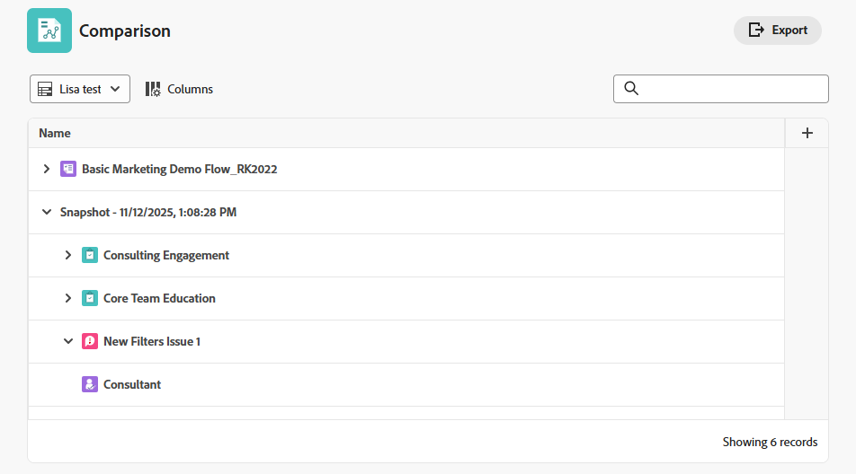

# Crear y ver instantáneas de proyectos

{{highlighted-preview-article-level}}

Los jefes de proyecto a menudo necesitan comparar los datos pasados de un proyecto con el estado actual para tomar decisiones informadas y ver cómo sus proyectos han cambiado con el paso del tiempo.

Las instantáneas de Adobe Workfront le proporcionan una forma de ver estas diferencias entre instantáneas (tomadas en una fecha y hora específicas) y los datos actuales del proyecto de forma rápida y precisa, lo que le ayuda a administrar los proyectos de forma más eficaz y a tomar mejores decisiones. Las comparaciones de instantáneas muestran en paralelo la evolución del proyecto.

## Requisitos de acceso

+++ Expanda para ver los requisitos de acceso para la funcionalidad en este artículo.

<table style="table-layout:auto"> 
 <col> 
 <col> 
 <tbody> 
  <tr> 
   <td>Paquete de Adobe Workfront</td> 
   <td> 
Workflow Ultimate
 </td> 
  </tr> 
  <tr> 
   <td>Licencia de Adobe Workfront</td> 
    <td>Estándar</td> 
  </tr> 
  <tr> 
   <td>Configuración de nivel de acceso</td> 
   <td>Acceso de edición a proyectos</td> 
  </tr> 
  <tr> 
   <td>Permisos de objeto</td> 
   <td>Al ver una instantánea, puede ver todos los campos para los que tiene permiso para ver en el proyecto original </td> 
  </tr> 
 </tbody> 
</table>

Para obtener más información, consulte [Requisitos de acceso en la documentación de Workfront](/help/quicksilver/administration-and-setup/add-users/access-levels-and-object-permissions/access-level-requirements-in-documentation.md).

+++

## Crear una instantánea

1. Vaya a un proyecto. 
1. En el panel izquierdo, haga clic en **Instantáneas**.

   

1. Haga clic en **Nueva instantánea**.
1. Escriba un nombre para la instantánea en el cuadro de diálogo **Nueva instantánea** y haga clic en **Guardar**.

   El nombre de instantánea aparece en la lista.

   >[!NOTE]
   >
   >Cuando se crea una instantánea, no está disponible para su visualización inmediata. Los datos que se ejecutan en segundo plano pueden tardar hasta cuatro horas en estar listos. El estado de creación es **Pendiente** cuando la instantánea aún no está disponible y **Listo** cuando pueda verla.

## Ver una sola instantánea

1. Vaya a un proyecto y haga clic en **Instantáneas** en el panel izquierdo.
1. Haga clic en un nombre de instantánea de la lista para abrirla. El estado debe ser **Listo** para poder abrirlo.

   >[!TIP]
   >
   >Las rutas de exploración en la parte superior de la pantalla enlazan de nuevo al proyecto y le ayudan a identificar que está viendo una instantánea.

   La instantánea muestra los siguientes elementos tal y como existían en el momento en que se creó la instantánea:

   * La jerarquía de tareas y subtareas del proyecto
   * Detalles del proyecto y cualquier formulario personalizado adjunto a los detalles
   * Proyectos asociados y su jerarquía
   * Problemas
   * Tarifas
   * Registros de facturación
   * Gastos <!--* Bookings (on its own line of course when they get released)-->
   * Equipo del proyecto (pestaña Personas)

   Puede personalizar cualquier lista de la instantánea filtrando, ordenando, agregando y quitando columnas o aplicando una vista. Los KPI de fase temporal están disponibles para agregarlos a la vista de instantáneas. Para obtener más información, consulte [Personalizar listas de instantáneas](#customize-snapshot-lists) en este artículo.

## Comparar instantáneas

1. Vaya a un proyecto y haga clic en **Instantáneas** en el panel izquierdo.
1. Seleccione una opción para comparar instantáneas:

   * Para comparar dos o más instantáneas entre sí, seleccione las casillas de verificación situadas junto a las instantáneas de la lista y haga clic en **Comparar** en la barra de acciones de la parte inferior de la pantalla.
   * Para comparar instantáneas con el proyecto actual, active las casillas de verificación situadas junto a las instantáneas de la lista y haga clic en **Comparar con actual** en la barra de acciones de la parte inferior de la pantalla.

     >[!NOTE]
     >
     >El estado de cada instantánea que desee comparar debe ser **Listo**.

1. En la pantalla Comparación, expanda cada instantánea y el proyecto actual para ver la jerarquía debajo.

   

1. Puede personalizar la comparación ordenando, agregando y quitando columnas o aplicando una vista. Para obtener más información, consulte [Personalizar listas de instantáneas](#customize-snapshot-lists) en este artículo.

## Exportar instantáneas

Puede exportar la lista de todas las instantáneas o una comparación de instantáneas en formato .xlsx o .csv. Todas las columnas mostradas se incluyen en el archivo exportado.

1. Haga clic en el icono **Exportar**  en la lista de instantáneas o comparación de instantáneas.
1. Seleccione el formato del archivo de exportación.

   El archivo se guardará en el equipo. Es posible que se le pida que elija la ubicación.

1. (Opcional) Abra la lista exportada utilizando la aplicación adecuada.

## Personalización de listas de instantáneas

Puede personalizar la lista de todas las instantáneas, así como las listas de una instantánea o comparación, filtrando, ordenando, agregando y quitando columnas o aplicando una vista.

Para obtener más información sobre la personalización de listas, vea [Usar listas mejoradas](/help/quicksilver/workfront-basics/navigate-workfront/use-lists/enhanced-lists.md).

### Filtrar elementos de una lista

Los filtros le ayudan a reducir la cantidad de información que se muestra en la lista.

1. Haga clic en **Filtro** sobre la lista.
1. En el cuadro Filtro, haga clic en **Agregar condición**.
1. Seleccione un campo por el que filtrar.
1. Seleccione un modificador de filtro, como &quot;Tiene cualquiera de&quot;, &quot;No tiene ninguno de&quot;, &quot;Es anterior a&quot; o &quot;Es posterior a&quot;. Las opciones del modificador son diferentes según el tipo de campo por el que esté filtrando.
1. Seleccione el valor o los valores del campo. Según el tipo de campo por el que filtre, se le puede pedir que seleccione el elemento de una lista, lo busque o utilice un calendario para seleccionar un intervalo de fechas.

   

   El filtro se aplica automáticamente a la lista.

1. Haga clic en **Agregar condición** para agregar otra condición al filtro.

   Puede unir varios filtros mediante un conector AND u OR.

1. Cuando se aplique el filtro, puede volver a abrir las opciones de **Filter** para cambiar las opciones de filtro o borrar todos los filtros.

   Aparece un indicador en el botón **Filter** cuando se aplica un filtro a la lista.

   

### Ordenar en una lista

Para ordenar columnas individuales:

1. Pase el ratón sobre la columna, luego haga clic en la flecha abajo y seleccione **Ordenar**.

   Un icono junto al nombre de una columna indica que la lista está ordenada por los valores de esa columna y la dirección de la ordenación.

   

### Personalización de columnas de una lista

Puede ocultar, mostrar y reordenar columnas en una lista.

1. Haga clic en **Columnas** sobre la lista.

   

1. Utilice las teclas de alternancia para mostrar u ocultar columnas de la lista.
1. Para reordenar las columnas, haga clic en el icono **Arrastrar**  y mueva una columna a la ubicación que desee. Al mover columnas, la lista cambia automáticamente.

   >[!NOTE]
   >
   >El campo principal es la primera columna de la lista. Se fija en la primera posición y no se puede cambiar su columna. Si el número de columnas es grande, el campo principal se bloquea a la izquierda y, cuando se desplaza horizontalmente, siempre lo ve.
   >
   >El icono junto al nombre de un campo muestra el tipo de campo, como el campo de texto o de fecha.

   Aparece un indicador en el botón **Columnas** cuando las columnas están ocultas. El indicador no aparece cuando se reordenan las columnas.

   

### Agregar y quitar columnas con el Administrador de columnas

Puede utilizar el Administrador de columnas en algunas listas mejoradas para agregar y quitar fácilmente columnas de la lista. Puede agregar o quitar campos personalizados y del sistema que ya existen en Workfront como columnas.

1. Haga clic en el icono **+** en la esquina superior derecha de la tabla para abrir el cuadro **Administrador de columnas**.

   

1. Busque un campo de objeto existente en la columna **Disponible** y, a continuación, haga clic en **+** a la derecha del nombre del campo para agregarlo a la columna **Seleccionado**.
1. Haga clic en **-** a la derecha de un campo en la columna **Seleccionado** para quitarlo de la lista.
1. Haga clic en **Guardar**.

   La lista actualiza las columnas según las opciones que haya realizado.

### Aplicación de una vista a una lista

Para aplicar o crear una vista:

1. Haga clic en el menú desplegable **Vistas** y seleccione una vista existente para aplicarla a la lista

   O

   Haga clic en **Nueva vista** para crear una.

   

1. (Condicional) Para agregar una vista nueva, escriba un nombre para la vista y haga clic en **Crear**.
1. (Opcional) Oculte, muestre o reorganice las columnas. Para obtener más información, vea [Personalizar columnas en una lista](#customize-columns-in-a-list).
1. (Opcional) Filtre la lista. Para obtener más información, vea [Filtrar elementos de una lista](#filter-items-in-a-list).

Los cambios en las vistas se guardan automáticamente. La próxima vez que aplique esta vista, la configuración de columna y filtro seguirá siendo la misma que la establecida. Para obtener más información sobre las vistas, consulte [Usar listas mejoradas](/help/quicksilver/workfront-basics/navigate-workfront/use-lists/enhanced-lists.md).

