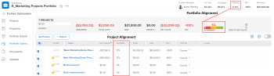

# Aplicar un cuadro de resultados a un proyecto y generar una puntuación de alineación

Puede utilizar un cuadro de resultados para medir la alineación de un proyecto con los criterios de un portafolio establecidos anteriormente. Un cuadro de resultados suele reflejar la misión, los valores y los objetivos estratégicos de una organización.

Para obtener más información sobre los cuadros de resultados y cómo crearlos, consulte [Crear un informe de valoración](../../../administration-and-setup/set-up-workfront/configure-system-defaults/create-scorecard.md).

## Requisitos de acceso

Debe tener el siguiente acceso para realizar los pasos de este artículo:

<table style="table-layout:auto"> 
 <col> 
 <col> 
 <tbody> 
  <tr> 
   <td role="rowheader">plan Adobe Workfront*</td> 
   <td> <p>Empresa o superior</p> </td> 
  </tr> 
  <tr> 
   <td role="rowheader">Licencia de Adobe Workfront*</td> 
   <td> <p>Plan </p> </td> 
  </tr> 
  <tr> 
   <td role="rowheader">Configuraciones de nivel de acceso*</td> 
   <td> <p>Editar acceso a Proyectos</p> <p>Acceso de visualización o superior a los Portfolio</p> <p>Nota: Si sigue sin tener acceso, pregunte al administrador de Workfront si ha establecido restricciones adicionales en su nivel de acceso. Para obtener información sobre cómo un administrador de Workfront puede modificar su nivel de acceso, consulte <a href="../../../administration-and-setup/add-users/configure-and-grant-access/create-modify-access-levels.md" class="MCXref xref">Crear o modificar niveles de acceso personalizados</a>.</p> </td> 
  </tr> 
  <tr> 
   <td role="rowheader">Permisos de objeto</td> 
   <td> <p>Administración de permisos en un proyecto</p> <p>Ver o permisos superiores de un portafolio </p> <p>Para obtener información sobre cómo solicitar acceso adicional, consulte <a href="../../../workfront-basics/grant-and-request-access-to-objects/request-access.md" class="MCXref xref">Solicitud de acceso a objetos </a>.</p> </td> 
  </tr> 
 </tbody> 
</table>

&#42;Para saber qué plan, tipo de licencia o acceso tiene, póngase en contacto con su administrador de Workfront.

## Cuadros de resultados del proyecto {#project-scorecards}

* [Resumen de informes de valoración](#scorecards-overview)
* [Cuadros de resultados del proyecto](#project-scorecards)

### Resumen de informes de valoración {#scorecards-overview}

Normalmente, un administrador de proyectos completa la información del cuadro de mandos para generar un valor de alineación entre 0 y 100 para el proyecto. El valor producido se utiliza posteriormente cuando el administrador de portafolios revisa los proyectos en el optimizador de portafolios para compararlos.

Para obtener más información sobre la optimización del portafolio, consulte el artículo [Información general de Portfolio Optimizer](../../../manage-work/portfolios/portfolio-optimizer/portfolio-optimizer-overview.md).

### Aplicar un cuadro de resultados a un proyecto

Como usuario con una licencia de planificación y permisos de administración en un proyecto, puede adjuntar un cuadro de resultados al proyecto.

Para obtener más información sobre los permisos del proyecto, consulte [Uso compartido de un proyecto en Adobe Workfront](../../../workfront-basics/grant-and-request-access-to-objects/share-a-project.md).

Puede agregar cuadros de resultados a un proyecto como parte de la creación del caso empresarial para el proyecto.

Para obtener más información sobre la creación de un caso empresarial, consulte [Crear un caso comercial para un proyecto](../../../manage-work/projects/define-a-business-case/create-business-case.md).

El administrador de Adobe Workfront o del grupo debe habilitar la sección Informe de valoración en el área de Caso comercial de sus proyectos para que pueda acceder a los informes de valoración desde el Caso comercial. Para obtener información sobre la configuración de preferencias de proyecto y la habilitación de áreas del caso empresarial, consulte [Configurar las preferencias de proyecto de todo el sistema](../../../administration-and-setup/set-up-workfront/configure-system-defaults/set-project-preferences.md).

Para aplicar un cuadro de resultados a un proyecto:

1. Vaya a un proyecto al que desee aplicar un cuadro de mandos.
1. Clic **Caso comercial** en el panel izquierdo.
1. Busque el **Informe de valoración** de la sección de caso comercial.\
   Debe crear un informe de valoración antes de la **Informe de valoración** La sección se muestra en el caso comercial.

   Para obtener información sobre cómo crear un cuadro de mandos, consulte [Crear un informe de valoración](../../../administration-and-setup/set-up-workfront/configure-system-defaults/create-scorecard.md).

1. Seleccione un informe de valoración en el menú desplegable.

   

1. Especifique una respuesta para todas las preguntas del informe de valoración.

   Workfront aplica una puntuación a cada pregunta respondida y calcula una puntuación general del proyecto en función de la puntuación individual de cada pregunta.

   Para obtener más información sobre la generación de la puntuación de alineación general del proyecto, consulte [Generación de una puntuación de alineación para un proyecto](#generate-an-alignment-score-for-a-project).

1. Clic **Guardar** para guardar el cuadro de resultados y puntuar el proyecto.

   El cuadro de resultados ahora está asociado con el proyecto y se puntúa el proyecto.

1. (Condicional) Cuando se producen cambios en los valores de las preguntas del cuadro de mandos, debe volver a calcular el cuadro de mandos para reflejar los nuevos valores de la puntuación del proyecto. Para volver a calcular el cuadro de resultados, haga lo siguiente:

   1. Vaya a una lista de proyectos y seleccione todos los proyectos de la lista.
   1. Haga clic en **Editar** en la parte superior de la lista.
   1. Clic **Configuración** en el panel izquierdo y, a continuación, compruebe **Recalcular informes de valoración** al final del área de Configuración.
   1. Haga clic en Guardar. Esto vuelve a calcular el valor de puntuación en función de los cuadros de resultados adjuntos para todos los proyectos seleccionados.

      >[!NOTE]
      >
      >   <span class="preview">La opción para volver a calcular los cuadros de resultados se ha eliminado del entorno de vista previa al editar proyectos de forma masiva. </span>


## Generación de una puntuación de alineación

* [Generación de una puntuación de alineación para un proyecto](#generate-an-alignment-score-for-a-project)
* [Generación de una puntuación de alineación para un portafolio](#generate-an-alignment-score-for-a-portfolio)

### Generación de una puntuación de alineación para un proyecto {#generate-an-alignment-score-for-a-project}

La puntuación de alineación es el valor producido después de completar el cuadro de resultados.

Los informes de valoración contienen preguntas con opciones de respuesta a las que se les han asignado valores numéricos, denominados puntos de alineación. Estos puntos se utilizan para determinar cómo se alinea el proyecto con su organización. Los puntos de alineación de cada pregunta contienen un número entre 0 y 100.

Cuando finaliza el cuadro de resultados, Workfront calcula la puntuación de alineación del proyecto como un porcentaje, utilizando la fórmula siguiente:

```
Project Alignment Score = The sum of the question points from the scorecard met at a given time/ The sum of the possible points on the scorecard
```

Para obtener más información, consulte [Crear un informe de valoración](../../../administration-and-setup/set-up-workfront/configure-system-defaults/create-scorecard.md).

### Generación de una puntuación de alineación para un portafolio {#generate-an-alignment-score-for-a-portfolio}

La puntuación de alineación del portafolio es un promedio de las puntuaciones de alineación de todos los proyectos del portafolio.

Cuando se completan los cuadros de resultados de los proyectos, Workfront utiliza esos valores para calcular la puntuación de alineación del portafolio como porcentaje, mediante la fórmula siguiente:

Puntuación de alineación del Portfolio = La suma de los porcentajes de las puntuaciones de alineación del proyecto/ Número de proyectos del portafolio

>[!NOTE]
>
>Si un proyecto no tiene asociado un informe de valoración y, por lo tanto, no tiene una puntuación de alineación, se considera que tiene una alineación del 0% en el portafolio. El proyecto se tiene en cuenta en el número de proyectos del portafolio.

## Visualización de la puntuación de alineación

Puede ver la puntuación de alineación de un proyecto en el nivel de proyecto o en Portfolio Optimizer.

* [Visualización de la puntuación de alineación en un proyecto](#View%20the)
* [Vea las puntuaciones de alineación del proyecto y del portafolio en Portfolio Optimizer](#View%20the2)

### Visualización de la puntuación de alineación en un proyecto

Puede ver la puntuación de alineación de un proyecto en el nivel de proyecto si tiene derechos de contribución sobre el proyecto.

1. Vaya al proyecto cuya puntuación de alineación desee ver.
1. Clic **Caso comercial** en el panel izquierdo.
1. Vaya a la **Resumen de caso comercial** en el lado derecho de la pantalla.

   La puntuación de alineación se encuentra en el resumen del caso empresarial, en la variable **Alineado** valor.

   

### Vea las puntuaciones de alineación del proyecto y del portafolio en Portfolio Optimizer

Puede ver la puntuación de alineación de un proyecto o de un portafolio en Portfolio Optimizer si tiene acceso de Administración al portafolio.

Para obtener más información sobre la información mostrada en Portfolio Optimizer, consulte [Información general de Portfolio Optimizer](../../../manage-work/portfolios/portfolio-optimizer/portfolio-optimizer-overview.md).

* [Busque la puntuación de alineación del proyecto en Portfolio Optimizer](#locate-the-alignment-score-of-the-project-in-the-portfolio-optimizer)
* [Busque la puntuación de alineación del portafolio en Portfolio Optimizer](#locate-the-alignment-score-of-the-portfolio-in-the-portfolio-optimizer)

   

#### Busque la puntuación de alineación del proyecto en Portfolio Optimizer {#locate-the-alignment-score-of-the-project-in-the-portfolio-optimizer}

1. Haga clic en **Menú principal** icono , entonces **Portfolio**.

1. Haga clic en el nombre de un Portfolio.
1. Clic **Optimización de Portfolio** en el panel izquierdo.

   Se muestra Portfolio Optimizer.

1. La puntuación de alineación de un proyecto se muestra como un porcentaje en la variable **Alineación** de Portfolio Optimizer.

   Esta es la puntuación de alineación del proyecto basada en el cuadro de resultados asociado al proyecto.

#### Busque la puntuación de alineación del portafolio en Portfolio Optimizer  {#locate-the-alignment-score-of-the-portfolio-in-the-portfolio-optimizer}

1. Vaya a la **Proyectos** en la barra de navegación global.
1. Seleccione el **Portfolio** pestaña.
1. Haga clic en el nombre de un Portfolio.
1. Seleccione el **Optimización de Portfolio** pestaña.
1. En la parte superior de Portfolio Optimizer, encontrará lo siguiente **Alineado** , así como la variable **Alineación** medidor que indica la puntuación de alineación del portafolio.

   Esta es la puntuación de alineación del portafolio.

   Para obtener más información sobre cómo se genera la puntuación de alineación de un portafolio, consulte [Generación de una puntuación de alineación para un portafolio](#generate-an-alignment-score-for-a-portfolio).

## Descripción general de la puntuación de Portfolio Optimizer

Hay una diferencia entre la puntuación de alineación y la puntuación del optimizador de portafolio de un proyecto.

La puntuación de alineación de un proyecto se calcula según los puntos obtenidos tras completar el cuadro de resultados. A continuación, esta puntuación se utiliza para determinar la puntuación de alineación del portafolio. La puntuación de alineación se muestra como un porcentaje.

La puntuación de alineación de un proyecto se muestra en la variable **Alineación** de Portfolio Optimizer.

La puntuación del optimizador de portafolios es una clasificación calculada automáticamente en Portfolio Optimizer mediante la cual se pueden priorizar los proyectos. La puntuación del optimizador de portafolios se muestra como un icono indicador acompañado de un número y se muestra en la **Puntuación** de Portfolio Optimizer. Solo se genera una puntuación de Portfolio Optimizer cuando se completan todas las secciones del caso empresarial, excepto los objetivos.

Para obtener más información sobre la creación de un caso empresarial para un proyecto, consulte [Crear un caso comercial para un proyecto](../../../manage-work/projects/define-a-business-case/create-business-case.md).

Para obtener más información sobre el cálculo de la puntuación del optimizador de portafolios de un proyecto, consulte [Descripción general de la puntuación de Portfolio Optimizer](../../../manage-work/portfolios/portfolio-optimizer/portfolio-optimizer-score.md).
