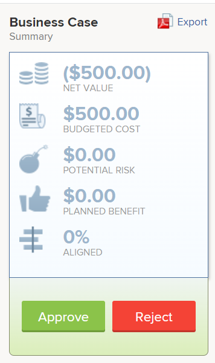

# Aprobación de un caso empresarial

<!--Audit: 6/2025-->

Una vez completado y enviado el caso empresarial para una solicitud de proyecto, el caso empresarial debe aprobarse. Esto depende del flujo de trabajo de su organización. Un proyecto puede iniciarse sin que sea necesario aprobar el caso empresarial, pero es posible que el administrador de Adobe Workfront y los propietarios del proyecto no lo consideren ideal.

Para obtener más información sobre cómo completar y enviar un caso empresarial, consulte el artículo [Crear un caso empresarial para un proyecto](../../../manage-work/projects/define-a-business-case/create-business-case.md).

## Requisitos de acceso

+++ Expanda para ver los requisitos de acceso para la funcionalidad en este artículo.

<table style="table-layout:auto"> 
 <col> 
 <col> 
 <tbody> 
  <tr> 
   <td role="rowheader"><p>Paquete de Adobe Workfront</p></td> 
   <td> 
   <p>Prime o superior</p>
   </td> 
  </tr> 
  <tr> 
   <td role="rowheader">Licencia de Adobe Workfront</td> 
   <td> 
   <p>Estándar </p> 
   <p>Plan </p> </td> 
  </tr> 
  <tr> 
   <td role="rowheader">Configuraciones de nivel de acceso</td> 
   <td> <p>Acceso de edición a proyectos</p> </td> 
  </tr> 
  <tr> 
   <td role="rowheader"><p>Permisos de objeto</p></td> 
   <td> <p>Administración de permisos en un proyecto</p> <p>Permisos de visualización o superiores para un portafolio</p>  </td> 
  </tr> 
 </tbody> 
</table>

Para obtener más información, consulte [Requisitos de acceso en la documentación de Workfront](/help/quicksilver/administration-and-setup/add-users/access-levels-and-object-permissions/access-level-requirements-in-documentation.md).

+++

## Descripción general de la aprobación de caso empresarial

Tenga en cuenta lo siguiente al aprobar un caso empresarial de un proyecto:

* Debe tener permisos de administración en un proyecto para aprobar el caso empresarial correspondiente.
* No podrá ver los proyectos que están esperando a que el caso empresarial se apruebe en el widget Mis aprobaciones en Inicio.
* Debe ir manualmente a los proyectos individuales que necesitan la aprobación de su caso empresarial para ver que están pendientes de aprobación. No hay ningún mecanismo de notificación de Workfront que alerte a alguien de que debe aprobar el caso empresarial de un proyecto.
* Puede encontrar los proyectos que esperan la aprobación del caso empresarial creando un informe del proyecto o accediendo al portafolio con el que están asociados.

  Para obtener más información sobre portafolios, consulte el artículo [Información general de Portfolio en Adobe Workfront](../../../manage-work/portfolios/portfolios-overview/portfolio-overview.md).

## Aprobar el caso comercial creando un informe de proyecto

Puede generar un informe de proyectos para ver qué proyectos necesitan que se apruebe su caso comercial.

Para generar un informe para los proyectos que están pendientes de la aprobación de sus casos comerciales:

1. Cree un informe para los proyectos.

   Para obtener más información sobre la creación de informes, consulte el artículo [Crear un informe personalizado](../../../reports-and-dashboards/reports/creating-and-managing-reports/create-custom-report.md).

1. Seleccione la ficha **Ver** del informe y, a continuación, haga clic en **Agregar columna**.

1. Empiece a escribir *Status* en el campo **Mostrar en esta columna** y seleccione este campo cuando aparezca en la lista.

   Esta columna muestra el estado de los proyectos.

1. Seleccione la ficha **Filtros** del informe y, a continuación, haga clic en **Agregar una regla de filtro**.

1. Empiece a escribir *Status* en **Mostrar solo los proyectos en los que el campo ...** y selecciónelo cuando aparezca en la lista.
1. Seleccione **Equal** para el modificador de filtro.
1. Empiece a escribir *Solicitado* en el campo disponible.

   Esto garantiza que el informe incluya solo los proyectos que están en el estado Solicitado.

   

1. (Opcional) Haga clic en **Agregar otra regla de filtro**.

   Puede añadir filtros adicionales para mostrar solo los proyectos en los que sea propietario del proyecto, patrocinador del proyecto o propietario de Portfolio.

   Por ejemplo, puede utilizar las siguientes instrucciones de filtro:

   ```
   Project Sponsor ID Equals $$USER.ID
   ```

   para mostrar los proyectos en los que esté designado como patrocinador del proyecto

   ```
   Project Owner ID Equals $$USER.ID
   ```

   para mostrar los proyectos en los que esté designado propietario del Proyecto

   ```
   Project Portfolio Owner ID Equals $$USER. ID
   ```

   para mostrar dónde está designado como Portfolio Manager.

1. Haga clic en **Guardar + Cerrar**.

   Observe que todos los proyectos del informe se encuentran en el estado de **Solicitado**.

1. Haga clic en el nombre de un proyecto en el informe para abrirlo.
1. Haga clic en **Caso empresarial** en el panel de la izquierda.
1. Haga clic en **Aprobar** o **Rechazar** en el área Resumen de caso comercial para aprobar o rechazar el caso comercial.

<!--  -->

El estado del proyecto cambia a **Aprobado** si se aprueba el caso comercial.

El estado del proyecto se cambia a **Rechazado** si se rechaza el caso empresarial.

>[!NOTE]
>
>No hay notificaciones que avisen al usuario que envió la aprobación del caso empresarial sobre si su solicitud de proyecto se aprobó o rechazó.

## Aprobar el caso empresarial accediendo a los proyectos solicitados en un portafolio

Para obtener más información acerca de la revisión de proyectos solicitados, vea el artículo [Revisar proyectos solicitados](../../../manage-work/portfolios/create-and-manage-portfolios/review-requested-projects.md).
