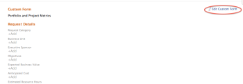

# Adjuntar un formulario personalizado a un caso empresarial

Los formularios personalizados se utilizan para recopilar información que no se muestra en los campos de Adobe Workfront existentes.

Para obtener más información acerca de cómo crear Forms personalizado, vea el artículo [Crear un formulario personalizado](/help/quicksilver/administration-and-setup/customize-workfront/create-manage-custom-forms/form-designer/design-a-form/design-a-form.md).

## Requisitos de acceso

<!--Audit: 06/2025-->

+++ Expanda para ver los requisitos de acceso para la funcionalidad en este artículo.

<table style="table-layout:auto"> 
 <col> 
 <col> 
 <tbody> 
  <tr> 
   <td role="rowheader">
Paquete de Adobe Workfront
</td> 
   <td> 
Prime o superior

  </tr> 
  <tr> 
   <td role="rowheader">
Licencia de Adobe Workfront/p&gt;</td> 
   <td> 
   
Estándar 
 
   
Plan 
 </td> 
  </tr> 
  <tr> 
   <td role="rowheader">Configuraciones de nivel de acceso</td> 
   <td> 
Acceso de edición a proyectos
  </td> 
  </tr> 
  <tr> 
   <td role="rowheader">
Permisos de objeto
</td> 
   <td> 
Permisos de administración o superiores del proyecto
  </td> 
  </tr> 
 </tbody> 
</table>

Para obtener más información, consulte [Requisitos de acceso en la documentación de Workfront](/help/quicksilver/administration-and-setup/add-users/access-levels-and-object-permissions/access-level-requirements-in-documentation.md).

+++

## Adjuntar formularios personalizados a proyectos

Puede adjuntar formularios personalizados a un proyecto en las siguientes áreas:

* Al editar un proyecto, en la sección Detalles del proyecto.
* Al editar un proyecto, en el cuadro Editar proyecto.
* Al editar varios proyectos de forma masiva, a partir de una lista de proyectos.

  Para obtener información sobre cómo adjuntar formularios personalizados a proyectos mientras se editan uno o varios proyectos, consulte el artículo [Editar proyectos](../../../manage-work/projects/manage-projects/edit-projects.md).

* Al crear el caso empresarial de un proyecto, en el caso empresarial, tal como se describe en este artículo.

Para obtener información para adjuntar formularios personalizados a objetos, consulte [Añadir un formulario personalizado a un objeto](../../../workfront-basics/work-with-custom-forms/add-a-custom-form-to-an-object.md).

## Adjuntar formularios personalizados al caso empresarial

Para añadir un formulario personalizado a un caso empresarial, el administrador de Workfront debe seleccionar esta opción en Configuración. Para obtener más información sobre cómo habilitar formularios personalizados en la configuración, consulte [Configurar las preferencias de proyecto en todo el sistema](../../../administration-and-setup/set-up-workfront/configure-system-defaults/set-project-preferences.md).

Para adjuntar un formulario personalizado:

1. Vaya al proyecto al que desee adjuntar el formulario y, a continuación, haga clic en **Caso comercial** en el panel izquierdo. Se muestra el caso empresarial.

1. En la sección **Formulario personalizado**, seleccione el formulario personalizado que desee adjuntar en el menú desplegable. El formulario personalizado aparece en la sección **Formularios agregados** a continuación.

1. (Opcional) Para expandir los detalles del formulario personalizado, haga clic en la flecha a la izquierda del nombre del formulario personalizado.

   

<!--
1. (Optional) Select **Edit Custom Form**.  
  

1. (Optional) Specify information in the fields of the custom form, then click **Save** .
-->
