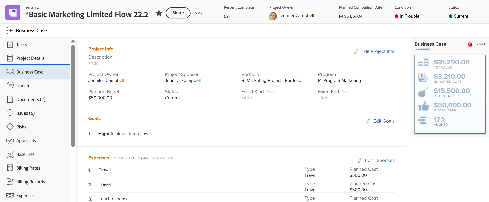

# Crear metas de caso empresarial

Como parte del caso empresarial, puede crear un conjunto de metas para definir los objetivos de un proyecto. Las metas del caso empresarial se utilizan para comunicar al administración del portafolio o al patrocinador del proyecto el propósito de completar un proyecto.

<!--

(NOTE: below snippet: NWE only, not classic)

-->

>[!TIP]
>
>Puede crear metas estratégicas para su organización que no estén conectadas al caso empresarial individual de un proyecto. Debe tener acceso a las metas de Adobe Workfront para poder crear metas estratégicas. A continuación, puede conectarlos con proyectos fuera de sus casos empresariales. Para obtener información sobre cómo crear metas con Workfront Goals, consulte [Información general sobre Adobe Workfront Goals](../../../workfront-goals/goal-management/wf-goals-overview.md).

Tenga en cuenta lo siguiente al crear metas de caso empresarial para sus proyectos:

* Los objetivos del caso empresarial son específicos del proyecto. No puede copiar metas de un proyecto a otro ni establecerlas en el nivel de sistema. Deben definirse al nivel de cada proyecto.
* El administrador de Adobe Workfront o del grupo debe habilitar la sección Metas para sus proyectos antes de que se muestre en el caso empresarial de sus proyectos. Para obtener información acerca de cómo habilitar los campos de caso empresarial para los proyectos, vea [Configurar las preferencias de proyecto de todo el sistema](../../../administration-and-setup/set-up-workfront/configure-system-defaults/set-project-preferences.md).

* Las metas no son una sección obligatoria en el caso empresarial de un proyecto.

  Un proyecto puede recibir una puntuación para ser priorizado en el Optimizador de portafolios incluso si no se ha definido la sección Metas del caso empresarial.

  Para obtener más información sobre la puntuación del Optimizador de portafolios, consulte [Aplicar un cuadro de resultados a un proyecto y generar una puntuación de alineación](../../../manage-work/projects/define-a-business-case/apply-scorecard-to-project-to-generate-alignment-score.md).

* No puede informar sobre las metas del caso empresarial.

## Requisitos de acceso

Debe tener el siguiente acceso para realizar los pasos de este artículo:

<table style="table-layout:auto"> 
 <col> 
 </col> 
 <col> 
 </col> 
 <tbody> 
  <tr> 
   <td role="rowheader">Plan de Adobe Workfront*</td> 
   <td> 
Pro o superior
 </td> 
  </tr> 
  <tr> 
   <td role="rowheader">Licencia de Adobe Workfront*</td> 
   <td> 
Plan 
 </td> 
  </tr> 
  <tr> 
   <td role="rowheader">Configuraciones de nivel de acceso*</td> 
   <td> 
Acceso de edición a proyectos
 
Nota: Si sigue sin tener acceso, pregunte al administrador de Workfront si ha establecido restricciones adicionales en su nivel de acceso. Para obtener información sobre cómo un administrador de Workfront puede modificar su nivel de acceso, consulte <a href="../../../administration-and-setup/add-users/configure-and-grant-access/create-modify-access-levels.md" class="MCXref xref">Crear o modificar niveles de acceso personalizados</a>.
 </td> 
  </tr> 
  <tr> 
   <td role="rowheader">Permisos de objeto</td> 
   <td> 
Permisos de administración o superiores del proyecto
 
Para obtener información sobre cómo solicitar acceso adicional, consulte <a href="../../../workfront-basics/grant-and-request-access-to-objects/request-access.md" class="MCXref xref">Solicitar acceso a objetos</a>.
 </td> 
  </tr> 
 </tbody> 
</table>

&#42;Para saber qué plan, tipo de licencia o acceso tiene, póngase en contacto con el administrador de Workfront.

## Añadir una meta al caso empresarial de un proyecto

1. Vaya a un proyecto para el cual desee definir las metas del caso empresarial.
1. Haga clic en **Caso empresarial en el panel de la izquierda.**

   Se muestra el caso empresarial.

   

1. En la sección **Metas**, haga clic en **Editar metas**.

1. Especifique sus metas.
En el menú desplegable **Importancia**, seleccione el nivel de importancia:

   * Máximo
   * Alto
   * Media
   * Bajo
   * Mínimo

     Importancia (assets/g1-350x76.png)

     No puede personalizar los niveles de importancia de las metas.

1. (Opcional) Para añadir otra meta, haga clic en **Añadir otra meta** y repita los pasos 5 y 6.
1. Haga clic en **Guardar**.
