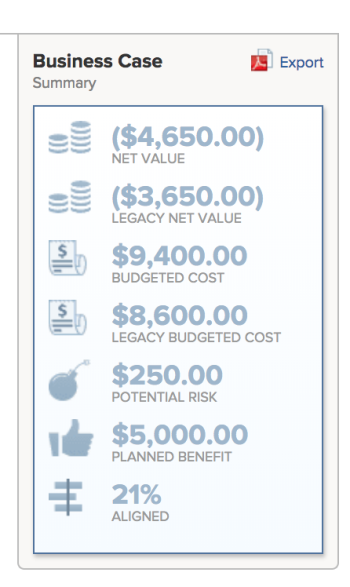

# Exportar el caso comercial de un proyecto

Puede exportar el caso empresarial a un archivo de PDF, en caso de que necesite imprimirlo o adjuntarlo a un mensaje de correo electrónico en un formato más conciso. 

## Requisitos de acceso

Debe tener lo siguiente:

<table style="table-layout:auto"> 
 <col> 
 <col> 
 <tbody> 
  <tr> 
   <td role="rowheader">plan Adobe Workfront*</td> 
   <td> 
Cualquiera 
 </td> 
  </tr> 
  <tr> 
   <td role="rowheader">Licencia de Adobe Workfront*</td> 
   <td> 
Revisar o superior
 </td> 
  </tr> 
  <tr> 
   <td role="rowheader">Configuraciones de nivel de acceso*</td> 
   <td> 
Ver acceso a Proyectos, Datos financieros y Administración de recursos
 
Nota: Si sigue sin tener acceso, pregunte al administrador de Workfront si ha establecido restricciones adicionales en su nivel de acceso. Para obtener información sobre cómo un administrador de Workfront puede modificar su nivel de acceso, vea <a href="../../../administration-and-setup/add-users/configure-and-grant-access/create-modify-access-levels.md" class="MCXref xref">Crear o modificar niveles de acceso personalizados</a>.
 </td> 
  </tr> 
  <tr> 
   <td role="rowheader">Permisos de objeto</td> 
   <td> 
Ver permisos superiores en el proyecto
 
Para obtener información sobre cómo solicitar acceso adicional, vea <a href="../../../workfront-basics/grant-and-request-access-to-objects/request-access.md" class="MCXref xref">Solicitar acceso a los objetos </a>.
 </td> 
  </tr> 
 </tbody> 
</table>

&#42;Para saber qué plan, tipo de licencia o acceso tiene, póngase en contacto con el administrador de Workfront.

## Exportar el caso comercial

1. Vaya al proyecto desde el que desea exportar el caso empresarial.
1. Haga clic en **Caso comercial** en el panel izquierdo.
1. En el área superior derecha **Resumen de caso empresarial**, haga clic en **Exportar**.

   \
   Un PDF  El archivo de se ha descargado en el equipo. El archivo contiene todas las áreas del caso empresarial en un formato fácil de leer.

   

1. (Opcional) Puede adjuntar el archivo del PDF a un correo electrónico o imprimirlo para compartirlo con otros usuarios. 
