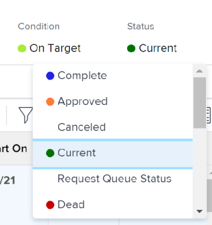

# Cambiar el estado de un proyecto

<!--Audited: 02/2024-->

Puede actualizar manualmente el estado de un proyecto a cualquier otro estado, si es necesario.

Puede actualizar manualmente el estado de un proyecto a un estado que equivalga a Completo solo cuando el modo de finalización del proyecto esté establecido en Manual.

De lo contrario, Adobe Workfront marca automáticamente el proyecto como Completo cuando todas las tareas y problemas del proyecto se completan y aprueban.

Para obtener más información acerca del modo de finalización del proyecto, vea [Editar proyectos](/help/quicksilver/manage-work/projects/manage-projects/edit-projects.md).

## Requisitos de acceso

+++ Expanda para ver los requisitos de acceso para la funcionalidad en este artículo.

<table style="table-layout:auto"> 
 <col> 
 <col> 
 <tbody> 
  <tr> 
   <td role="rowheader">Paquete de Adobe Workfront</td> 
   <td> 
Cualquiera
 </td> 
  </tr> 
  <tr> 
   <td role="rowheader">Licencia de Adobe Workfront</td> 
   <td> 
Estándar
 
   
Plan

   </td> 
  </tr> 
  <tr> 
   <td role="rowheader">Configuraciones de nivel de acceso</td> 
   <td> 
Acceso de edición a proyectos
 </td> 
  </tr> 
  <tr> 
   <td role="rowheader">Permisos de objeto</td> 
   <td> 
Administración de permisos en el proyecto
 </td> 
  </tr> 
 </tbody> 
</table>

Para obtener más información, consulte [Requisitos de acceso en la documentación de Workfront](/help/quicksilver/administration-and-setup/add-users/access-levels-and-object-permissions/access-level-requirements-in-documentation.md).

+++

<!--
Old:

<table style="table-layout:auto"> 
 <col> 
 <col> 
 <tbody> 
  <tr> 
   <td role="rowheader">Adobe Workfront plan</td> 
   <td> 
Any
 </td> 
  </tr> 
  <tr> 
   <td role="rowheader">Adobe Workfront license*</td> 
   <td> 
New: Standard 
 
   Or
   
Current: Plan 

   </td> 
  </tr> 
  <tr> 
   <td role="rowheader">Access level configurations</td> 
   <td> 
Edit access to Projects
 </td> 
  </tr> 
  <tr> 
   <td role="rowheader">Object permissions</td> 
   <td> 
Manage permissions on the project
 </td> 
  </tr> 
 </tbody> 
</table>
-->

## Consideraciones sobre la actualización a estados específicos

* **Al actualizar un proyecto a Completo:** Asegúrese de que todas las tareas y problemas se hayan completado en el proyecto. No puede seleccionar el estado Completado de un proyecto ni ningún otro estado que equivalga a Completado cuando hay tareas o problemas que no se han completado en el proyecto. Esto incluye la aprobación de cualquier tarea o problema que esté en un estado de Aprobación completa-pendiente.
* **Al actualizar un proyecto de Completo a Actual:** Si se han completado todas las tareas y problemas del proyecto, asegúrese de que el modo de finalización del proyecto esté establecido en Manual. Si el modo de finalización del proyecto es automático, el estado del proyecto permanece completo.

## Cambio del estado del proyecto

1. Vaya al proyecto cuyo estado desee actualizar.
1. En el encabezado del proyecto, haga clic en el nombre del estado en el campo **Estado** y, a continuación, seleccione un nuevo estado.

   

   O

   Haga clic en el menú **Más**  junto al nombre del proyecto, haga clic en **Editar**, seleccione un nuevo estado en el campo **Estado** y, a continuación, haga clic en **Guardar**.

   El estado del proyecto se actualiza al estado seleccionado.
