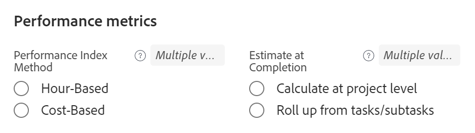
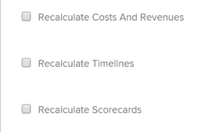

# Editar proyectos

<!--Audited: 07/2024-->

La información resaltada en esta página hace referencia a una funcionalidad que aún no está disponible de forma general. Solo está disponible en el entorno de vista previa para todos los clientes. Después de las versiones mensuales en Production, las mismas funciones también están disponibles en el entorno Production para los clientes que habilitaron versiones rápidas. 

Para obtener información sobre las versiones rápidas, consulte [Habilitar o deshabilitar las versiones rápidas para su organización](/help/quicksilver/administration-and-setup/set-up-workfront/configure-system-defaults/enable-fast-release-process.md). 

<!--

***Linked to many articles,

The Resource Pools part also duplicates in the "Working with Resource Pools" article 

The Update Type section is also documented in Selecting the Project Update Type article

Keep the reference link to the other article that also documents the Update Type) 

(NOTE 2: information described here also exists in these articles:

** Project Overview area

**Manage project Finance area

If you need to update just one field, check to see if that field is also listed there and update in both places.)

-->

Puede editar un proyecto en Adobe Workfront con tanta frecuencia como sea necesaria. Le recomendamos que edite los proyectos mínimamente después de haber cambiado su estado a Actual, para así evitar las confusiones que podrían surgir si se envían notificaciones sobre los cambios a todo el equipo del proyecto.

Lo ideal es editar un proyecto cuando se encuentra en estado de Planificación. Para obtener información sobre el equipo del proyecto, consulte [Información general del equipo del proyecto](../../../manage-work/projects/planning-a-project/project-team-overview.md).

## Requisitos de acceso

+++ Expanda para ver los requisitos de acceso para la funcionalidad en este artículo.

<table style="table-layout:auto"> 
 <col> 
 <col> 
 <tbody> 
  <tr> 
   <td role="rowheader">Plan de Adobe Workfront</td> 
   <td> 
Cualquiera
 </td> 
  </tr> 
  <tr> 
   <td role="rowheader">Licencia de Adobe Workfront*</td> 
   <td>
Nuevo: estándar 
 
   O
   
Actual: plan 
 </td> 
  </tr> 
  <tr> 
   <td role="rowheader">Configuraciones de nivel de acceso</td> 
   <td> 
Acceso de edición a proyectos
 </td> 
  </tr> 
  <tr> 
   <td role="rowheader">Permisos de objeto</td> 
   <td> 
     
Administración de permisos en un proyecto 
 
     </td> 
  </tr> 
 </tbody> 
</table>

Para obtener más información sobre el contenido de esta tabla, consulte [Requisitos de acceso en la documentación de Workfront](/help/quicksilver/administration-and-setup/add-users/access-levels-and-object-permissions/access-level-requirements-in-documentation.md).

+++

## Limitaciones para editar proyectos

Existen algunas limitaciones que podrían impedir la edición de los proyectos.

Tenga en cuenta lo siguiente al editar proyectos:

* No se pueden editar proyectos que se encuentren en proceso de aprobación, excepto para registrar el tiempo y cambiar el estado.
* Puede adjuntar documentos o plantillas a un proyecto que tenga el estado Completado, Inactivo o Pendiente de aprobación solo si el administrador de Workfront o un administrador de grupos han habilitado esta funcionalidad en el área Preferencias del proyecto. Para obtener información sobre cómo configurar las Preferencias de proyecto, consulte [Configurar las preferencias de proyecto de todo el sistema](../../../administration-and-setup/set-up-workfront/configure-system-defaults/set-project-preferences.md).
* Solo puede editar la siguiente información en un proyecto con estado Inactivo o Completado:

   * Modificar los gastos existentes.
   * Añadir, quitar o editar formularios personalizados.

## Edición de un proyecto

Al editar un proyecto, puede modificar la información y la configuración del proyecto, así como las tareas y problemas del proyecto.

Algunas de las configuraciones mencionadas en este artículo podrían modificarse de su estado predeterminado a su estado en la plantilla desde la que se creó el proyecto.

Para obtener información sobre cómo editar plantillas, consulte [Editar plantillas de proyecto](../../../manage-work/projects/create-and-manage-templates/edit-templates.md).

Para obtener información sobre cómo crear un proyecto a partir de una plantilla, consulte [Crear un proyecto mediante una plantilla](/help/quicksilver/manage-work/projects/create-projects/create-project-from-template.md).

{{step1-to-projects}}

1. (Opcional) Haga clic en **Proyectos en los que participo** o **Proyectos de mi propiedad** en la esquina superior derecha para mostrar los proyectos en los que es el propietario o los proyectos en los que forma parte del equipo del proyecto.

   

   >[!NOTE]
   >
   >Si es administrador de grupos, puede ver y editar los proyectos del grupo tanto en el área de Grupos como en el área de Proyectos. Para obtener más información, consulte [Crear y modificar proyectos de un grupo](../../../administration-and-setup/manage-groups/work-with-group-objects/create-and-modify-a-groups-projects.md).

1. Haga clic en el nombre del proyecto que desee editar para abrir la página del proyecto.

1. (Opcional) Para editar información limitada sobre un proyecto, haga clic en **Detalles del proyecto** en el panel izquierdo. Si desea editar toda la información sobre el proyecto, continúe en el paso 5. <!--accurate?!-->

   

   >[!NOTE]
   >
   >Según la forma en que el administrador de Workfront o el de grupos hayan modificado la plantilla de diseño, los campos del área Detalles del proyecto podrían volver a organizarse o no mostrarse. Para obtener más información, consulte [Personalizar la vista de detalles con una plantilla de diseño](../../../administration-and-setup/customize-workfront/use-layout-templates/customize-details-view-layout-template.md).

   Para editar la información de la sección Detalles, haga lo siguiente:

   1. (Opcional) Haga clic en el icono **Contraer todo**  en la esquina superior derecha para contraer todas las áreas.
   1. (Opcional y condicional) Cuando un área esté contraída, haga clic en la **flecha hacia la derecha**  junto a cada área para expandir el área que desea editar.
   1. Para obtener más información sobre cómo editar la información de la pestaña Detalles del proyecto, consulte los siguientes artículos:

      * [Administrar información en el área Información general del proyecto](../../../manage-work/projects/manage-projects/understand-project-overview-area.md)
      * [Administrar información en el área Finanzas del proyecto](../../../manage-work/projects/project-finances/manage-project-finance-area.md)

   1. (Opcional) Para adjuntar un formulario personalizado, empiece a escribir el nombre de un formulario en el campo **Añadir formulario personalizado**, selecciónelo cuando se muestre en la lista y, a continuación, haga clic en **Guardar cambios**.
   1. (Opcional) Haga clic en el icono **Exportar**  para exportar la información general y de los formularios personalizados a un archivo de PDF y, a continuación, haga clic en **Exportar**. Seleccione entre las siguientes opciones:

      * Seleccionar todo (solo se muestra cuando hay al menos un formulario personalizado adjunto)
      * Información general
      * El nombre de uno o varios formularios personalizados

      El archivo PDF se descarga en el equipo.

      

      Para obtener más información, consulte [Exportar formularios personalizados y detalles de objetos](../../../workfront-basics/work-with-custom-forms/export-custom-forms-details.md).

   Para obtener información sobre los campos visibles en la sección Detalles del proyecto, continúe editando el proyecto en el cuadro Editar proyecto como se describe a continuación.
1. Para editar toda la información sobre el proyecto, haga clic en el menú **Más**  junto al nombre del proyecto y luego haga clic en **Editar**.

   O

   En una lista de proyectos, selecciona uno o varios y luego haz clic en el icono **Editar**  que se encuentra en la parte superior de la lista.

   Para obtener más información sobre la edición masiva de proyectos, consulte la sección [Editar proyectos de forma masiva](#edit-projects-in-bulk) en este artículo.

   Se abre el cuadro **Editar proyecto**.

   >[!IMPORTANT]
   >
   >Debe tener permisos de administración en el proyecto para poder ver la opción de edición.

   Todos los campos del proyecto están disponibles en el cuadro Editar proyecto y se agrupan por las áreas enumeradas en el panel izquierdo.

   >[!NOTE]
   >
   >Según la forma en que el administrador de Workfront o el de grupos hayan modificado la plantilla de diseño, las áreas del panel izquierdo del cuadro Editar proyecto o cualquier campo enumerado en estas áreas podrían reorganizarse o no mostrarse. Para obtener más información, consulte [Personalizar la vista de detalles con una plantilla de diseño](../../../administration-and-setup/customize-workfront/use-layout-templates/customize-details-view-layout-template.md).

1. (Condicional) Si ha hecho clic en el menú **Más** y luego en **Editar**, actualice la información en cualquiera de las siguientes áreas enumeradas en el panel izquierdo:

   * [Nombre del proyecto](#project-name)
   * [Información general](#overview)
   * [Formularios personalizados](#custom-forms)
   * [Finanzas](#finance)
   * [Configuración de proyecto](#project-settings)
   * [Configuración de tarea](#task-settings)
   * [Configuración de problema](#issue-settings)
   * [Acceso](#access)
   * [Comment](#comment)

   >[!NOTE]
   >
   >Según la forma en que el administrador de Workfront configure la plantilla de diseño para el área de detalles del proyecto, las secciones y los campos del cuadro Editar proyecto podrían ser diferentes en su entorno. Para obtener más información, consulte [Personalizar la vista de detalles con una plantilla de diseño](../../../administration-and-setup/customize-workfront/use-layout-templates/customize-details-view-layout-template.md).

### Nombre del proyecto {#project-name}

1. Empiece a editar el proyecto como se ha descrito anteriormente.
1. Haga clic en **Nombre del proyecto** en el panel izquierdo.

   

1. Actualice el nombre del proyecto.

   No se puede editar el nombre del proyecto al editar proyectos de forma masiva.

### Información general {#overview}

1. Empiece a editar el proyecto como se ha descrito anteriormente.
1. Haga clic en **Información general** en el panel izquierdo.

   

1. Actualice la siguiente información sobre el proyecto:

   <table style="table-layout:auto"> 
      <col> 
      <col> 
      <tbody> 
      <tr> 
         <td role="rowheader"><strong>Descripción</strong> </td> 
         <td> 
Añada información adicional sobre el proyecto.
 </td> 
      </tr> 
      <tr> 
         <td role="rowheader"><strong>Estado</strong> </td> 
         <td> 
Seleccione el estado del proyecto. No puede marcar un proyecto como Completado antes de haber completado todas las tareas y problemas. Para obtener información sobre los estados de los proyectos, consulte <a href="../../../administration-and-setup/customize-workfront/creating-custom-status-and-priority-labels/project-statuses.md" class="MCXref xref">Acceder a la lista de estados de proyectos del sistema</a>
 </td> 
      </tr> 
      <tr> 
         <td role="rowheader"><strong>Prioridad</strong> </td> 
         <td> 
 
Esto solo es un indicador visual para usted que le permite priorizar sus proyectos.
 
Según las Preferencias del proyecto seleccionadas por el administrador de Workfront, los nombres de las prioridades pueden ser diferentes para usted. Para obtener más información sobre cómo editar prioridades, consulte <a href="../../../administration-and-setup/customize-workfront/creating-custom-status-and-priority-labels/create-customize-priorities.md" class="MCXref xref">Crear y personalizar prioridades</a>
 
 </td> 
      </tr> 
      <tr> 
         <td role="rowheader"><strong>URL</strong> </td> 
         <td> 
Especifique un vínculo web relacionado con la información sobre este proyecto.
 </td> 
      </tr> 
      <tr> 
         <td role="rowheader"><strong>Tipo de condición</strong> </td> 
         <td> 
Seleccione entre los siguientes tipos de condición: 
         <ul> 
         <li><strong>Manual:</strong> el propietario del proyecto establece manualmente la condición en el proyecto.</li> 
         <li><strong>Estado de progreso:</strong> Workfront establece automáticamente la condición en función del estado de progreso de las tareas en la ruta crítica. Para obtener más información y comprender el estado de progreso, consulte <a href="../../../manage-work/tasks/task-information/task-progress-status.md" class="MCXref xref">Información general del estado de progreso de la tarea</a>.</li> 
         </ul>
El administrador de Workfront o un administrador de grupos seleccionan el valor predeterminado para calcular la condición de los proyectos para su sistema o el de su grupo. Para obtener información sobre cómo establecer los valores predeterminados del proyecto, consulte <a href="../../../administration-and-setup/set-up-workfront/configure-system-defaults/set-project-preferences.md" class="MCXref xref">Configurar las preferencias de proyecto de todo el sistema</a>. 

 </td> 
      </tr> 
      <tr> 
         <td role="rowheader"><strong>Condición</strong> </td> 
         <td> 
 
(Solo se muestra después de seleccionar <strong>Manual</strong> para <strong>Tipo de condición</strong>): seleccione una condición para indicar cómo va el proyecto. 
 
Para obtener información sobre cómo establecer las condiciones del proyecto de forma automática o manual, consulte <a href="../../../manage-work/projects/manage-projects/project-condition-and-condition-type.md" class="MCXref xref">Información general sobre la condición del proyecto y el tipo de condición</a>
 
 </td> 
      </tr> 
      <tr> 
         <td role="rowheader"><strong>Modo de programación</strong> </td> 
         <td> 
Especifique si el proyecto está programado desde la fecha de inicio o desde la fecha de finalización. Esta selección determina las fechas planificadas de las tareas del proyecto. 
         <ul> 
         <li><strong>Fecha de inicio</strong>: la primera tarea del proyecto tiene la misma fecha de inicio planificada que el proyecto de forma predeterminada. Para obtener información sobre la fecha de inicio planificada de la tarea, consulte <a href="../../../manage-work/tasks/task-information/task-planned-start-date.md" class="MCXref xref">Información general sobre la fecha de inicio planificada de la tarea</a>. La cronología del proyecto se calcula a partir de la fecha de inicio, y la fecha de finalización del proyecto la calcula el sistema en función de la duración de todas las tareas. </li> 
         <li><strong>Fecha de finalización</strong>: la última tarea del proyecto tiene la misma fecha planificada de finalización que el proyecto. La cronología del proyecto se calcula a partir de la fecha de finalización, y la fecha de inicio del proyecto la calcula el sistema restando la duración de todas las tareas de la fecha de finalización del proyecto. </li> 
         </ul>
Su administrador de Workfront o un administrador de grupos seleccionan la configuración del modo Horario predeterminado para su sistema o grupo. Para obtener información sobre cómo establecer los valores predeterminados del proyecto, consulte <a href="../../../administration-and-setup/set-up-workfront/configure-system-defaults/set-project-preferences.md" class="MCXref xref">Configurar las preferencias de proyecto de todo el sistema</a>.

 </td> 
      </tr> 
      <tr> 
         <td role="rowheader"><strong>Fecha de inicio planificada y hora</strong> </td> 
         <td> 
 
Especifique la fecha cuando seleccione <strong>Programar a partir de la fecha de inicio</strong>.  
 
Este es un campo de solo lectura cuando selecciona <strong>Programar a partir de la fecha de finalización</strong>. 
 
 </td> 
      </tr> 
      <tr> 
         <td role="rowheader"><strong>Fecha planificada de finalización y hora</strong> </td> 
         <td> 
Especifique la fecha cuando seleccione <strong>Programar a partir de la fecha de finalización</strong>. 
 
Este es un campo de solo lectura cuando selecciona <strong>Programar a partir de la fecha de inicio</strong>. 
 </td> 
      </tr> 
      <tr> 
         <td role="rowheader"><strong>Portafolio</strong></td> 
         <td>Indique el Portafolio al que pertenece el proyecto. Para que un Portafolio aparezca en la lista desplegable, primero debe crearlo. Solo los portafolios activos pueden asociarse a un proyecto. Para obtener más información sobre la creación de portafolios, consulte <a href="../../../manage-work/portfolios/create-and-manage-portfolios/create-portfolios.md" class="MCXref xref">Crear un portafolio </a>.
         
<b>NOTA</b>

         
Debe tener permisos de administración en el portafolio para poder añadirlo al proyecto o quitarlo de él.

      </td> 
      </tr> 
      <tr> 
         <td role="rowheader"><strong>Programa</strong></td> 
         <td> 
Si ha seleccionado un Portafolio para el proyecto, especifique un Programa para el proyecto. Es posible que algunos portafolios no tengan programa. Para que un programa aparezca en esta lista desplegable, primero debe crearlo. Solo los programas activos pueden asociarse a un proyecto. 
 
Para obtener más información sobre la creación de programas, consulte <a href="../../../manage-work/portfolios/create-and-manage-programs/create-program.md" class="MCXref xref">Crear un programa</a>.
 
      
<b>NOTA</b>

         
Debe tener permisos de administración en el programa para poder añadirlo al proyecto o quitarlo de él.
   
      </td> 
      </tr> 
      <tr> 
         <td role="rowheader"><strong>Grupo</strong></td> 
         <td> 
 
Especifique el nombre del grupo asociado al proyecto. 
Este campo es obligatorio. No puede tener un proyecto que no esté asociado a un grupo. 
 
Para asegurarse de estar seleccionando el grupo correcto, pase el puntero por encima de él y haga clic en el icono de información  que se muestra junto a él. Esta acción muestra la ayuda contextual con información sobre el grupo, como la jerarquía de los grupos que tiene por encima y sus administradores.
 De forma predeterminada, uno de los siguientes grupos se asociará automáticamente a un proyecto cuando se crea, a menos que se especifique un grupo diferente:
 
         <ul> 
         <li> 
Cuando se crea el proyecto a partir del área Proyectos, el grupo de inicio del creador del proyecto se asocia al proyecto. 
 
Esto también ocurre cuando el proyecto se crea a partir de la sección Proyectos de un portafolio o programa.
 </li> 
         <li> 
Cuando el proyecto se crea a partir de la página principal de un grupo en el área de Configuración, ese grupo se asocia al proyecto.
 </li> 
         </ul> 
 
  
 
         
<b>NOTAS</b>

         <ul>
         <li>
Si el proyecto, o sus tareas o problemas están asociados con un estado personalizado de nivel de grupo, cambiar el grupo del proyecto puede hacer que el estado del proyecto, las tareas o los problemas cambien para coincidir con el nuevo grupo.
</li>
         <li>
Si el proyecto, sus tareas o problemas ya están asociados a un proceso de aprobación de nivel de grupo mediante estados personalizados de nivel de grupo, cambiar el grupo podría crear un conflicto entre los estados de aprobación del grupo anterior y los existentes en el nivel de sistema.

         
Considere la posibilidad de eliminar los procesos de aprobación de nivel de grupo en el proyecto, o sus tareas o problemas antes de actualizar el grupo.

         
Para obtener información acerca de cómo crear procesos de aprobación de nivel de grupo, vea <a href="../../../administration-and-setup/manage-groups/work-with-group-objects/create-and-modify-groups-approval-processes.md" class="MCXref xref">Procesos de aprobación de nivel de grupo</a>.

         
Para obtener información sobre cómo crear un estado personalizado de nivel de grupo, vea <a href="../../../administration-and-setup/manage-groups/manage-group-statuses/create-or-edit-a-group-status.md" class="MCXref xref">Crear o editar un estado de grupo</a>
</li></ul> </td> 
      </tr> 
      <tr> 
         <td role="rowheader"><strong>Empresa</strong> </td> 
         <td> 
Especifique una empresa asociada al proyecto. Debe crear una empresa antes de asociarla a un proyecto. Solo las empresas activas pueden asociarse a un proyecto. Para obtener información acerca de cómo crear empresas, vea <a href="../../../administration-and-setup/set-up-workfront/organizational-setup/create-and-edit-companies.md" class="MCXref xref">Crear y editar empresas</a>.
 </td> 
      </tr> 
      <tr> 
         <td role="rowheader"><strong>Propietario del proyecto</strong> </td> 
         <td> 
Empiece a escribir el nombre de un usuario para añadirlo al proyecto y, a continuación, selecciónelo cuando se muestre en la lista. El usuario se añade al equipo del proyecto y se le otorgan automáticamente permisos de administración del proyecto. El usuario designado como Propietario del proyecto debe ser un usuario activo de Workfront.

         </td> 
      </tr> 
      <tr> 
         <td role="rowheader"><strong>Patrocinador del proyecto</strong> </td> 
         <td> 
Empiece a escribir el nombre de un usuario para añadirlo al proyecto y, a continuación, selecciónelo cuando se muestre en la lista. El usuario se añade al equipo del proyecto y se le conceden automáticamente permisos de visualización en el proyecto. El usuario designado como Patrocinador del proyecto debe ser un usuario activo de Workfront. 
 </td> 
      </tr> 
      <tr> 
         <td role="rowheader"><strong>Gerente de recursos</strong> </td> 
         <td> 
 Empiece a escribir los nombres de los usuarios para añadirlos al proyecto y, a continuación, selecciónelos cuando se muestren en la lista. Los usuarios se añaden al equipo del proyecto y se les otorgan automáticamente permisos de administración al proyecto, y pueden asignar recursos a las tareas y los problemas del proyecto. Los usuarios mantienen los permisos de Administración en el proyecto incluso cuando se eliminan del campo Administrador de recursos. Puede especificar más de un Administrador de recursos. 
 </td> 
      </tr>

   <tr> 
         <td role="rowheader"><strong>Generador de problema convertido</strong> </td> 
         <td> 
 De forma predeterminada, este campo se rellena automáticamente con el nombre del usuario que creó el problema desde el que se convirtió el proyecto. Puede actualizar este nombre con cualquier otro nombre de usuario en Workfront.  
 </td> 
      </tr>

   </tbody> 
      </table>

   >[!TIP]
   >
   >Al actualizar los campos Propietario del proyecto, Patrocinador del proyecto y Administrador de recursos, observe el avatar, la función principal del usuario o su dirección de correo electrónico para distinguir entre usuarios con nombres idénticos.
   >
   >Los usuarios deben estar asociados con al menos una función para verla a medida que los añade.
   >
   >Debe tener activada la configuración Ver información de contacto en su nivel de acceso para que los usuarios vean los correos electrónicos de los usuarios. Para obtener más información, consulte [Conceder acceso a usuarios](../../../administration-and-setup/add-users/configure-and-grant-access/grant-access-other-users.md).

1. (Opcional) Siga editando las secciones siguientes, según la información que desee modificar

   O

   Haga clic en **Guardar**.

### Formularios personalizados {#custom-forms}

Según el nivel de acceso y los permisos que tenga en el proyecto, se producirán los siguientes escenarios:

* Si no tiene permisos de Editar formulario personalizado en el proyecto, no puede editar los campos en ninguno de los formularios personalizados adjuntos. Solo puede ver los campos en los formularios personalizados adjuntos al proyecto.
* Si tiene acceso de Vista (y no de Edición) a una sección de un formulario personalizado, no puede editar los campos de esa sección.
* Si no tiene acceso a una sección de uno de los formularios personalizados adjuntos al proyecto, la sección no se mostrará en el cuadro Editar proyecto.

Cuando se selecciona más de un proyecto para editarlos en lote, existen los siguientes escenarios:

* Si no tiene permisos de Editar formulario personalizado en al menos uno de los proyectos seleccionados, no podrá editar los campos en ninguno de los formularios personalizados adjuntos. Solo puede ver los campos en los formularios personalizados adjuntos
* Si tiene acceso de Vista (y no de Edición) a una sección de un formulario personalizado, no puede editar los campos de esa sección. Solo puede ver los campos de esa sección.
* Si no tiene acceso a una sección de uno de los formularios personalizados adjuntos al menos a uno de los proyectos, la sección no se mostrará en el cuadro Editar proyectos.
* Si tiene campos obligatorios en cualquiera de los formularios personalizados adjuntos a todos los proyectos y selecciona un campo sin editarlo realmente, debe descartar los cambios en ese campo o agregarle información antes de poder guardar los proyectos seleccionados. Si no selecciona ningún campo obligatorio, puede guardar los proyectos seleccionados aunque el campo requerido esté en blanco.

Para obtener información sobre el acceso a formularios personalizados, consulte los siguientes artículos:

* [Compartir un formulario personalizado](../../../administration-and-setup/customize-workfront/create-manage-custom-forms/share-access-to-a-custom-form.md)
* [Organización y previsualización de un formulario](/help/quicksilver/administration-and-setup/customize-workfront/create-manage-custom-forms/form-designer/design-a-form/organize-a-form.md)

Para editar información sobre formularios personalizados al editar un proyecto:

1. Empiece a editar el proyecto como se ha descrito anteriormente.
1. Haga clic en **Formularios personalizados** en el panel de la izquierda.

   

1. Haga clic en el cuadro **Agregar formulario personalizado** y seleccione un formulario de la lista para adjuntarlo al proyecto. De forma predeterminada, los primeros 40 formularios se muestran en orden alfabético. Si no ve el formulario en la lista, empiece a escribir su nombre y selecciónelo cuando aparezca en la lista.

   >[!NOTE]
   >
   >Debe generar los formularios personalizados antes de que estén disponibles para seleccionarlos en este campo. En la lista solo aparecen los formularios personalizados activos. Para obtener más información sobre la creación de formularios personalizados, consulte [Crear un formulario personalizado](/help/quicksilver/administration-and-setup/customize-workfront/create-manage-custom-forms/form-designer/design-a-form/design-a-form.md). Puede añadir hasta diez formularios personalizados a un proyecto.

1. (Condicional) Si adjuntó un formulario personalizado al proyecto, edite los campos del formulario. Debe especificar todos los campos obligatorios antes de guardar el proyecto.
1. (Opcional) Haga clic en el icono **X** a la derecha del nombre de un formulario personalizado para quitarlo y, a continuación, haga clic en **Quitar**.
1. (Opcional) Siga editando las secciones siguientes, según la información que desee modificar

   O

   Haga clic en **Guardar**.

### Finanzas {#finance}

Según el nivel de acceso y los permisos que tenga en el proyecto, se producirán los siguientes escenarios:

* Si tiene acceso de visualización a datos financieros y permisos de visualización de finanzas en el proyecto, solo puede ver los campos en la sección Finanzas. No puede editar los campos de esta sección.
* Si tiene acceso de edición a los datos financieros y permisos de administración de finanzas en el proyecto, puede actualizar los campos en esta sección.

Al seleccionar más de un proyecto para editarlos de forma masiva y en tiempo real, existen los siguientes escenarios:

* Si selecciona al menos un proyecto en el que tenga permisos de Ver finanzas (en lugar de Administrar finanzas), solo podrá ver los campos de esta sección para todos los proyectos seleccionados. No puede editar los campos de forma masiva en la sección Finanzas.
* Si selecciona al menos un proyecto en el que no tiene permisos financieros, esta sección no se muestra en absoluto.

Para editar campos en el área Finanzas:

1. Empiece a editar el proyecto como se ha descrito anteriormente.
1. Haga clic en **Finanzas** en el panel izquierdo.

   

1. Actualice la siguiente información financiera para el proyecto:

   <table style="table-layout:auto"> 
    <col> 
    <col> 
    <tbody> 
     <tr data-mc-conditions=""> 
      <td role="rowheader"> <strong>Divisa</strong> </td> 
      <td> 
 
Especifique la moneda del proyecto si es diferente a la moneda predeterminada del sistema. No se puede cambiar la moneda de un proyecto cuando ya contiene información financiera. Este campo no está visible si solo tiene la moneda predeterminada en el sistema. 
 
Para obtener más información sobre la moneda, consulte <a href="../../../administration-and-setup/manage-workfront/exchange-rates/set-up-exchange-rates.md" class="MCXref xref">Configurar tasas de cambio</a>. 
 
 </td> 
     </tr> 
     <tr> 
      <td role="rowheader"><strong>Presupuesto</strong> </td> 
      <td> Especifique un presupuesto para el proyecto. </td> 
     </tr> 
     <tr> 
      <td role="rowheader"><strong>Método de índice de rendimiento</strong> </td> 
      <td> 
Seleccione <b>Basado en horas</b> o <b>Basado en costes</b> para indicar si las métricas del valor ganado del proyecto (como el índice de rendimiento de costes o el coste real estimado) se calculan usando horas o costes. 
 
Para obtener más información acerca del método de índice de rendimiento, consulte <a href="../../../manage-work/projects/project-finances/set-pim.md" class="MCXref xref">Establecer el método de índice de rendimiento (PIM)</a>. 
 
Su administrador de Workfront o un administrador de grupo selecciona la configuración predeterminada del Método de índice de rendimiento para su sistema o grupo. Para obtener información sobre cómo establecer los valores predeterminados del proyecto, consulte <a href="../../../administration-and-setup/set-up-workfront/configure-system-defaults/set-project-preferences.md" class="MCXref xref">Configurar las preferencias de proyecto de todo el sistema</a>.
 </td> 
     </tr> 
     <tr> 
      <td role="rowheader"><strong>Estimación al finalizar</strong> </td> 
      <td> 
 
Especifique cómo Workfront debe calcular la Estimación al finalizar (EAC). 

      Seleccione entre las siguientes opciones: 
      <ul><li><b>Calcular a nivel de proyecto</b></li>
      <li><b>Resumen a partir de tareas/subtareas</b></li> </ul>
      
Para obtener más información acerca de cómo calcula la Estimación al finalizar, consulte <a href="../../../manage-work/projects/project-finances/calculate-eac.md" class="MCXref xref">Calcular estimación al finalizar (EAC)</a>.
 
El administrador de Workfront o del grupo selecciona la configuración predeterminada Estimación al finalizar para el sistema o el grupo. Para obtener información sobre cómo establecer los valores predeterminados del proyecto, consulte <a href="../../../administration-and-setup/set-up-workfront/configure-system-defaults/set-project-preferences.md" class="MCXref xref">Configurar las preferencias de proyecto de todo el sistema</a>.
 
 </td> 
     </tr> 
     <tr> 
      <td role="rowheader"><strong>Beneficio planificado</strong> </td> 
      <td> 
Estime cuál es el beneficio planificado del proyecto. Se utiliza en el Caso empresarial del proyecto y en Optimizador de portafolios. Para obtener más información sobre el beneficio planificado de un proyecto, consulte <a href="../../../manage-work/projects/project-finances/project-planned-benefit.md" class="MCXref xref">Información general sobre el beneficio planificado del proyecto</a>. El Beneficio planificado de un proyecto se tiene en cuenta cuando se calcula el valor neto de un proyecto. 
 
Para obtener más información, consulte <a href="../../../manage-work/portfolios/portfolio-optimizer/manage-projects-in-portfolio-optimizer.md" class="MCXref xref">Administrar proyectos en Optimizador de portafolios</a> . 
 </td> 
     </tr> 
     <tr> 
      <td role="rowheader"><strong>Beneficio real</strong> </td> 
      <td> 
Estimar el beneficio real del proyecto. Se trata de un importe en divisa que representa el beneficio que su empresa o departamento obtendría una vez completado este proyecto. 
 </td> 
     </tr> 
      <tr> 
      <td role="rowheader"><strong>Coste fijo</strong> </td> 
      <td> 
Especifique el Coste fijo del proyecto. Esto es diferente al coste de mano de obra que proviene de las horas en el proyecto y al coste de gasto que proviene de la cantidad de gastos en el proyecto. El coste fijo de un proyecto se tiene en cuenta al calcular su valor neto y forma parte del coste presupuestado. 
 </td> 
     </tr> 
     <tr> 
      <td role="rowheader"><strong>Ingresos fijos</strong> </td> 
      <td> 
Especifique los ingresos fijos del proyecto. 
 </td> 
     </tr> 
    </tbody> 
   </table>

1. (Opcional) Siga editando las secciones siguientes, según la información que desee modificar.

   O

   Haga clic en **Guardar**.

### Configuración de proyecto {#project-settings}

1. Empiece a editar el proyecto como se ha descrito anteriormente.
1. Haga clic en **Configuración del proyecto** en el panel izquierdo.

   

1. Actualice la siguiente información:

   <table style="table-layout:auto"> 
      <col> 
      <col> 
      <tbody> 
      <tr> 
      <td role="rowheader"><strong>Ruta de hitos</strong> </td> 
       <td> 
Seleccione una Ruta de hitos para el proyecto. En la lista solo se muestran las trayectorias de hitos activas.
 
Para obtener más información acerca de las Rutas de hitos, consulte <a href="../../../administration-and-setup/customize-workfront/configure-approval-milestone-processes/create-milestone-path.md" class="MCXref xref">Creación de una ruta de hitos</a>.
 </td> 
      </tr> 
      <tr> 
      <td role="rowheader"><strong>Modo de finalización</strong> </td> 
      <td> 
Controla la manera en que el proyecto se marca como Completo. Seleccione entre las siguientes opciones: 
       <ul> 
       <li>
<strong>Automático</strong>: el proyecto se marca como Completado cuando se completan todas las tareas y problemas.

El Estado del proyecto se cambia automáticamente a Completo solo cuando el estado del proyecto es Actual cuando se han completado las tareas. 
</li> 
       <li><strong>Manual</strong>: debe seleccionar manualmente el estado Completo del proyecto cuando se hayan completado todas las tareas y problemas.</li> 
       </ul>
 </td> 
       </tr> 
       <tr> 
       <td role="rowheader"><strong>Modo de finalización de resumen</strong></td> 
       <td> 
Controla la manera en que las tareas principales se marcan como Completadas. Seleccione entre las siguientes opciones: 
       <ul> 
       <li><strong>Automático</strong>: Las tareas principales se marcan como Completadas y actualizan su porcentaje completado automáticamente, a medida que se completan las tareas secundarias y se actualiza el porcentaje completado de las tareas secundarias. </li> 
       <li><strong>Manual</strong>: debe actualizar manualmente el porcentaje completado y el estado de las tareas principales, independientemente de los cambios que se realicen en las tareas secundarias. Esto le permite marcar una tarea principal como completada incluso cuando las subtareas están incompletas. </li> 
       </ul>
 </td> 
       </tr> 
       <tr> 
       <td role="rowheader"><strong>Tipo de actualización</strong></td> 
       <td> 
Controla cuándo se guardan los cambios realizados en la cronología del proyecto en el proyecto o en las tareas principales. Por ejemplo, los siguientes cambios en el activador del proyecto pueden actualizar la cronología del proyecto: 
       <ul> 
       <li>Actualizar las fechas de las tareas</li> 
       <li>Cambiar relaciones de predecesoras de tareas</li> 
       <li>
Cambie las relaciones principal-secundario, añadiendo o quitando asignaciones además de cambiar la restricción de tarea o el tipo de duración.

Cuando se actualizan las tareas, sus objetos principales (tareas principales o el proyecto) se actualizan en el momento indicado por el Tipo de actualización. 

Si los objetos principales no se actualizan inmediatamente después del cambio al seleccionar “Automático y al cambiar” o “Solo al cambiar” Tipo de actualización, actualice la página

Seleccione entre las siguientes opciones: 

- <strong>Automático y al cambiar</strong> (configuración predeterminada): la cronología de tiempo del proyecto se actualiza cada vez que se produce un cambio en el proyecto o en otro proyecto del que depende el proyecto (al cambiar). La cronología del proyecto también se actualiza cada noche (Automática).

Esta es la configuración recomendada para este campo porque garantiza que el proyecto siempre esté actualizado.

Cuando realiza una acción en una tarea o proyecto que activa un recálculo de cronología, todas las fechas disponibles se muestran inmediatamente, lo que le permite continuar trabajando. En los proyectos con más de 100 tareas, las fechas que requieran recálculos mayores se muestran brevemente como signo de interrogación (entre 1 y 5 segundos, o hasta un minuto en los proyectos grandes). Esto indica que el recálculo aún no ha finalizado y que las fechas están sujetas a cambios.

- <strong>Solo al cambiar</strong>: la cronología del proyecto se actualiza cada vez que se produce un cambio en el proyecto o en otro proyecto del que depende el proyecto. Es posible que desee seleccionar esta opción si los cambios rara vez se producen en el proyecto o en otros proyectos de los que depende la cronología.

- <strong>Solo automático</strong>: la cronología del proyecto se actualiza cada noche; la cronología no se actualiza inmediatamente después de realizar cambios.

Es posible que desee seleccionar esta opción si se producen muchos cambios cada día en el proyecto o en otros proyectos de los que depende la cronología. Sin embargo, tenga en cuenta que ha elegido esta configuración, ya que el proyecto no se actualizará al mismo tiempo que se realizan los cambios.

- <strong>Solo manual</strong>: la escala de tiempo del proyecto se actualiza solamente cuando selecciona la opción para Recalcular la cronología. Para obtener más información sobre cómo recalcular manualmente la cronología del proyecto, consulte <a href="../../../manage-work/projects/manage-projects/recalculate-project-timeline.md" class="MCXref xref">Recalcular cronologías del proyecto</a>. 

Es posible que desee seleccionar esta opción si realiza muchos cambios en el proyecto al mismo tiempo y desea que el cálculo de la escala de tiempo se produzca después de realizar todos los cambios (en lugar de después de cada cambio individual).
</li> 
       </ul>
 </td> 
       </tr> 
       <tr> 
       <td role="rowheader"><strong>Programación</strong> </td> 
       <td> 
Seleccione una programación para el proyecto. Debe ser la misma programación asignada a la mayoría de las personas que trabajan en el proyecto. Debe crear una programación para poder asignarla a un proyecto o a un usuario. Si no ha creado programaciones personalizadas en el sistema, se seleccionará la Programación predeterminada.
 
Para obtener más información acerca de cómo crear programaciones, vea <a href="../../../administration-and-setup/set-up-workfront/configure-timesheets-schedules/create-schedules.md" class="MCXref xref">Crear una programación</a>. 
 </td> 
       </tr> 
       <tr> 
       <td role="rowheader"><strong>Días libres del usuario</strong> </td> 
       <td> 
Determina si los días libres de la Usuario asignado principal de una tarea ajusta las fechas planificadas de la tarea en el proyecto. 

El administrador de Workfront o un administrador de grupo selecciona el valor predeterminado de esta configuración para el sistema o para el grupo. Para obtener información sobre cómo establecer los valores predeterminados del proyecto, consulte <a href="../../../administration-and-setup/set-up-workfront/configure-system-defaults/set-project-preferences.md" class="MCXref xref">Configurar las preferencias de proyecto de todo el sistema</a>. 

Seleccione entre las siguientes opciones: - <strong>Considere los días libres del usuario en las duraciones de las tareas</strong>: Al seleccionar esta opción, las fechas planificadas de las tareas se ajustan según los días libres de la Usuario asignado principal de la tarea, si los días libres se producen durante la duración de la tarea. 

Por ejemplo, si una tarea con una restricción de Lo antes posible está programada para comenzar el 1 de junio y finalizar el 3 de junio, y la Persona principal asignada tiene el 2 de junio marcado como Día libre, cuando esta selección está habilitada, las fechas planificadas para la tarea son del 1 de junio al 4 de junio. Dependiendo de la Restricción de tarea, existen los siguientes escenarios: 
 
       <ul> 
       <li>Para las restricciones de tareas relacionadas con la planificación desde una fecha de inicio (Lo antes posible, La primera hora disponible, No comenzar antes del, No comenzar después del, Debe comenzar el), la fecha de inicio planificada no cambia, pero la fecha planificada de finalización cambia.</li> 
       <li>Para las delimitaciones de tareas relacionadas con la planificación a partir de una fecha de finalización (Lo más tarde posible, Última hora disponible, No finalizar antes del, No finalizar después del, Debe finalizar el), la Fecha planificada de finalización no cambia, pero la Fecha planificada de inicio cambia.</li> 
       <li>En las tareas con una restricción de Fechas fijas, no cambia la Fecha planificada de inicio ni la Fecha de finalización. </li> 
       </ul>
La duración de la tarea no cambia al seleccionar esta configuración. Solo cambian las fechas planificadas, dependiendo de la Restricción de tarea. Para obtener información acerca de la restricción de tareas, vea <a href="../../../manage-work/tasks/task-constraints/task-constraint-overview.md" class="MCXref xref">Información general sobre la restricción de tareas</a>. 

- <strong>Ignorar días libres del usuario en las duraciones de las tareas</strong>: al seleccionar esta opción, las fechas planificadas de las tareas en el proyecto permanecen tal como se planeó originalmente, incluso si la Usuario asignado principal de la tarea tiene días libres durante la duración de la tarea. 

Tenga en cuenta lo siguiente al seleccionar opciones para esta configuración:
 
       <ul> 
       <li>
La opción predeterminada para esta configuración para un nuevo proyecto es la misma que la preferencia de proyecto del sistema. 

Para obtener información acerca de las preferencias del proyecto en el nivel de sistema, consulte <a href="../../../administration-and-setup/set-up-workfront/configure-system-defaults/set-project-preferences.md" class="MCXref xref">Configurar las preferencias de proyecto en todo el sistema</a>. 
</li> 
       <li>Al adjuntar una plantilla a un proyecto existente, la configuración del proyecto se actualiza para que coincida con la de la plantilla. </li> 
       <li>
Workfront decide qué fechas de tareas planificadas se ajustan según el valor de Restricción de tarea de la tarea. Dependiendo de cuál sea, tanto la Fecha planificada de inicio como la Fecha planificada de finalización, o ambas, podrían verse afectadas, o incluso permanecer iguales. Por ejemplo, si una tarea tiene una restricción de fechas fijas, las fechas no se ajustan cuando el Usuario asignado principal tiene días libres, incluso cuando <strong>Considerar los días libres del usuario en las duraciones de las tareas</strong> está seleccionado. 
</li> 
       </ul></td> 
      </tr> 
      <tr> 
       <td role="rowheader"><strong>Modo de nivelación de recursos</strong> </td> 
       <td> 
 
Seleccione entre las siguientes opciones:
 
- <strong>Manual</strong>: debe redistribuir manualmente los recursos (esta es la configuración predeterminada)
 
- <strong>Automático</strong>: Workfront nivela los recursos.
 
Para obtener más información acerca de la nivelación de recursos, consulte <a href="../../../manage-work/gantt-chart/use-the-gantt-chart/level-resources-in-gantt.md" class="MCXref xref">Nivelar recursos en el Gráfico Gantt </a>.
 
 </td> 
      </tr> 
      <tr> 
       <td role="rowheader"><strong>Riesgo</strong> </td> 
       <td> 
 
Defina el nivel de riesgo del proyecto. El riesgo es solo un indicador de lo riesgoso que puede ser un proyecto. Puede priorizar la ejecución de sus proyectos en función del nivel de riesgo.
 
 
Considere la posibilidad de seleccionar entre los siguientes niveles de riesgo:
 
- Muy bajo
 
- Bajo
 
- Medio
 
- Alto
 
- Muy alto
 
Los niveles de riesgos que indique aquí no se pueden personalizar.
 
No están relacionados con los riesgos potenciales que podrían producirse durante la vida de un proyecto y que deben registrarse en la pestaña Riesgos del proyecto o en el caso empresarial. Para obtener información sobre posibles riesgos del proyecto, consulte <a href="../../../administration-and-setup/set-up-workfront/configure-system-defaults/edit-create-risk-types.md" class="MCXref xref">Editar y crear tipos de riesgos</a>. 
 
 
 </td> 
      </tr> 
      <tr> 
       <td role="rowheader"><strong>Conjuntos de recursos</strong> </td> 
       <td> 
 
Especifique los conjuntos de recursos asociados al proyecto. Los conjuntos de recursos son conjuntos de usuarios que se necesitan al mismo tiempo para la finalización de un proyecto y que permiten presupuestar el proyecto en el Planificador de recursos. Para obtener más información sobre los conjuntos de recursos, consulte <a href="../../../resource-mgmt/resource-planning/resource-pools/work-with-resource-pools.md" class="MCXref xref"> Información general sobre los conjuntos de recursos </a>. 
 
Cuando edita proyectos de forma masiva, solo aparecen en este campo los conjuntos de recursos que son comunes a todos los proyectos seleccionados. Si los proyectos seleccionados no tienen conjuntos de recursos compartidos, este campo estará vacío. Los conjuntos de recursos que especifique aquí sobrescribirán los conjuntos de recursos individuales de los proyectos.
 
 </td> 
      </tr> 
      <tr> 
       <td role="rowheader"> <strong>Permitir que las tarifas de facturación a nivel de compañía anulen las tarifas de facturación a nivel de proyecto</strong></td> 
       <td>Seleccione esta opción para permitir que las tarifas de facturación de la compañía anulen las tarifas históricas de funciones a menos que se marquen como facturadas. Al habilitar esta opción, se anularán las tarifas de funciones históricas a menos que se marquen como facturadas.  Para obtener más información, consulte <a href="../../../manage-work/projects/project-finances/override-project-level-with-company-level-billing-rates.md" class="MCXref xref">Anular tarifas de facturación a nivel de proyecto con tarifas de facturación a nivel de compañía</a>.</td> 
      </tr> 
      <tr> 
       <td role="rowheader"><strong>Requerir tiempo de aprobación de este proyecto</strong></td> 
       <td> 
 Seleccione esta opción para solicitar al propietario del proyecto que apruebe el tiempo registrado en el proyecto. Si utiliza Registros de facturación y selecciona esta opción, solo las horas aprobadas en el proyecto aparecen como horas facturables disponibles para los Registros de facturación. La aprobación de las horas en el proyecto es independiente de la aprobación de plantillas de horas. 
 
Para obtener más información sobre cómo requerir tiempo para aprobarse en un proyecto, consulte <a href="../../../manage-work/projects/manage-projects/require-time-approval-for-projects.md" class="MCXref xref">Requerir tiempo de aprobación de un proyecto</a>.
 </td> 
      </tr> 
      <tr> 
       <td role="rowheader"><strong>Filtrar tipos de horas</strong> y <strong>Tipos de horas</strong></td> 
       <td> 
 
Seleccione entre las siguientes opciones:
 
       <ul> 
       <li> 
Seleccione <strong>No</strong> para que todos los tipos de horas específicas del proyecto estén disponibles en el proyecto. (Es la selección predeterminada)
 
O
 </li> 
       <li>Seleccione <strong>Sí</strong> para que solo un subconjunto de los tipos de horas específicas del proyecto esté disponible en el proyecto y, a continuación, seleccione los tipos de horas que desea que estén disponibles en el campo <b>Tipos de horas</b>.</li> 
       
<b>Sugerencia</b>

       
El campo <b>Tipos de horas</b> no se puede editar si selecciona <b>No</b>.
 
       
Si selecciona esta opción, solo se podrán seleccionar los tipos de horas que seleccione cuando registre las horas en el proyecto (o en tareas y problemas dentro del proyecto). Debe seleccionar al menos un tipo de hora; si selecciona esta opción y no selecciona ningún tipo de hora, todos los tipos de horas estarán disponibles en el proyecto.
 </ul>

   
Las mismas selecciones de tipo de hora deben realizarse a nivel de usuario individual para que el usuario pueda ver estas opciones de tipo de hora en el proyecto. Para obtener más información sobre la definición de tipos de horas en el nivel de usuario, consulte <a href="../../../timesheets/create-and-manage-timesheets/log-time.md" class="MCXref xref">Hora de registro</a>. 
 
 </td> 
      </tr> 
      <tr data-mc-conditions=""> 
       <td role="rowheader"><strong>Notificación de recordatorio</strong> </td> 
       <td> 
 
Seleccione la notificación de recordatorio que debe asociarse al proyecto. Debe configurar las notificaciones de recordatorio de los proyectos para que este campo aparezca durante la edición de un proyecto. Para obtener más información sobre cómo configurar notificaciones de recordatorio, consulte <a href="../../../administration-and-setup/manage-workfront/emails/set-up-reminder-notifications.md"><a href="../../../administration-and-setup/manage-workfront/emails/set-up-reminder-notifications.md" class="MCXref xref">Configurar notificaciones de recordatorio</a>.</a>
 
 </td> 
      </tr> 
      <tr data-mc-conditions=""> 
       <td role="rowheader"><strong>Proceso de aprobación</strong></td> 
       <td> 
Seleccione el proceso de aprobación que desea asociar al proyecto. El administrador de Workfront debe definir los procesos de aprobación a nivel de sistema para poderlos asociar a proyectos. Un usuario con acceso administrativo a los procesos de aprobación también puede crear procesos de aprobación específicos del grupo. Para obtener más información acerca de cómo crear procesos de aprobación, consulte <a href="../../../administration-and-setup/customize-workfront/configure-approval-milestone-processes/create-approval-processes.md" class="MCXref xref">Crear un proceso de aprobación para elementos de trabajo</a>.
 
Tenga en cuenta lo siguiente a la hora de añadir procesos de aprobación: 
 
       <ul> 
       <li>En la lista solo se muestran los procesos de aprobación activos. </li> 
       <li> 
Los procesos de aprobación de todo el sistema y específicos del grupo se muestran en la lista. Un proceso de aprobación asociado a un grupo que no sea el del proyecto no se muestra en la lista.
 
Si el grupo asociado al proyecto cambia, el proceso de aprobación específico del grupo se convertirá en un proceso de aprobación de un solo uso. Para obtener más información sobre cómo los cambios en el grupo del proyecto o los cambios en el proceso de aprobación afectan a la configuración de la aprobación, consulte <a href="../../../administration-and-setup/customize-workfront/configure-approval-milestone-processes/how-changes-affect-group-approvals.md" class="MCXref xref">Cómo afectan los cambios en el grupo y el proceso de aprobación a los procesos de aprobación asignados</a>. 
 </li> <!--(NOTE: this bullet stays here although the sections it might appear in are QS only, so we can use the snippet for both Qs and classic)-->
       
Cuando se editan proyectos de forma masiva, se dan los siguientes escenarios:
 
       <ul> 
       <li> 
Al seleccionar proyectos del mismo grupo, en este campo se muestran tanto los procesos de aprobación a nivel de sistema como los de nivel de grupo.
 </li> 
       <li> 
Al seleccionar proyectos de diferentes grupos, solo se muestran en este campo los procesos de aprobación a nivel de sistema.
 </li> 
       <li> 
Cuando alguno de los proyectos tiene un proceso de aprobación de un solo uso adjunto, se reemplaza por el proceso de aprobación a nivel de sistema o de grupo que seleccione. 
 </li> 
      </ul> </td> 
      </tr> 
      <tr> 
      </tr> 
      </tbody> 
      </table>

1. (Opcional) Siga editando las secciones siguientes, según la información que desee modificar.

   O

   Haga clic en **Guardar**.

### Configuración de tarea {#task-settings}

Puede definir los valores predeterminados que se asociarán con todas las tareas nuevas al añadirlas al proyecto.

Para obtener información sobre cómo afecta esta configuración a la creación de nuevas tareas, consulte la sección [Valores predeterminados de tarea al añadir tareas a un proyecto](../../../manage-work/tasks/create-tasks/create-tasks-overview.md#understa) en el artículo [Información general sobre la creación de tareas](../../../manage-work/tasks/create-tasks/create-tasks-overview.md).

1. Empiece a editar el proyecto como se ha descrito anteriormente.
1. Haga clic en **Configuración de tarea** en el panel de la izquierda.

   

1. En el cuadro **Proceso de aprobación predeterminado de tarea**, seleccione el proceso de aprobación de la tarea que desee asociar a todas las tareas nuevas cuando las añada al proyecto.

   El administrador de Workfront (o un usuario con acceso administrativo a los procesos de aprobación) debe crear un proceso de aprobación a nivel de sistema o de grupo para una tarea antes de que pueda asociarla a un proyecto. En la lista solo se muestran los procesos de aprobación activos. Para obtener información sobre cómo crear procesos de aprobación, consulte [Crear un proceso de aprobación para elementos de trabajo](../../../administration-and-setup/customize-workfront/configure-approval-milestone-processes/create-approval-processes.md). Para obtener información sobre cómo los cambios en el grupo del proyecto o los cambios en el proceso de aprobación afectan a la configuración de aprobación, consulte [Cómo afectan los cambios en el grupo y el proceso de aprobación a los procesos de aprobación asignados](../../../administration-and-setup/customize-workfront/configure-approval-milestone-processes/how-changes-affect-group-approvals.md).

   Cuando se editan proyectos de forma masiva, se dan los siguientes escenarios:

   * Cuando se seleccionan varios proyectos del mismo grupo, en este campo se muestran tanto los procesos de aprobación de tareas específicas del sistema como los específicos del grupo.
   * Al seleccionar varios proyectos de diferentes grupos, solo se muestran en este campo los procesos de aprobación de tareas a nivel de sistema.

1. En el cuadro **Formularios personalizados predeterminados de tareas**, seleccione el formulario o formularios personalizados que desee asociar a todas las tareas nuevas cuando las añada al proyecto. Debe generar los formularios personalizados antes de que estén disponibles para seleccionarlos en este campo. En la lista solo se muestran los formularios personalizados activos. Para obtener más información sobre la creación de formularios personalizados, consulte [Crear un formulario personalizado](/help/quicksilver/administration-and-setup/customize-workfront/create-manage-custom-forms/form-designer/design-a-form/design-a-form.md). Puede asociar hasta diez formularios personalizados a una tarea.
1. (Opcional) Seleccione **Utilizar esfuerzo laboral para calcular automáticamente las horas planificadas de la tarea** si desea habilitar la administración del esfuerzo de la tarea utilizando el esfuerzo laboral en lugar de las horas planificadas.

   

1. (Condicional y opcional) Si ha seleccionado Utilizar esfuerzo laboral para calcular automáticamente las horas planificadas de la tarea, haga clic en el menú desplegable de cada nivel de esfuerzo y seleccione un porcentaje para cada nivel. Los siguientes porcentajes son valores predeterminados:

   | Tamaño | Porcentaje |
   |---|---|
   | Pequeño | 25 % |
   | Media | 50 % |
   | Grande | 75 % |

   >[!TIP]
   >
   >Cuando el tipo de actualización del proyecto se establece en Automático y selecciona esta configuración, las horas planificadas de las tareas se actualizarán según la duración de la tarea y el porcentaje de esfuerzo laboral, si se establecen en cero. Para obtener más información sobre cómo utilizar el esfuerzo laboral para planificar el esfuerzo de una tarea, consulte [Información general del esfuerzo laboral](../../../manage-work/tasks/task-information/work-effort.md).

1. (Opcional) Siga editando las secciones siguientes, según la información que desee modificar.

   O

   Haga clic en **Guardar**.

### Configuración de problema {#issue-settings}

1. Empiece a editar el proyecto como se ha descrito anteriormente.
1. Haga clic en **Configuración de problema** en el panel de la izquierda.

   

1. (Opcional) Anule la selección de la opción **Permitir que los usuarios añadan problemas en línea**. Está seleccionada de forma predeterminada.

   Al anular la selección de esta opción, los usuarios no pueden añadir problemas en línea al proyecto ni a las tareas de la sección Problemas.

   >[!TIP]
   >
   >Anule la selección de esta opción si desea obligar a los usuarios a rellenar los campos de nuevos problemas o los formularios personalizados asociados a nuevos problemas. Permitir a los usuarios introducir problemas en línea les permite omitir los campos de Nuevo problema y los formularios personalizados al crear problemas. Para obtener información sobre cómo establecer campos y formularios personalizados para nuevos problemas, consulte [Crear una cola de solicitudes](../../../manage-work/requests/create-and-manage-request-queues/create-request-queue.md).

   Cuando anulan la selección de esta opción, los usuarios con permisos para añadir problemas al proyecto o a las tareas pueden hacerlo de las siguientes maneras:

   * Haga clic en Nuevo problema en la parte superior de la lista de problemas de la sección Problemas del proyecto o de las tareas.
   * Cuando el proyecto se ha configurado como cola de solicitudes, pueden introducir una nueva solicitud en el área Solicitudes.

   >[!NOTE]
   >
   >Cuando se editan proyectos de forma masiva, esta configuración se habilita si al menos un proyecto la tiene habilitada y se deshabilita si todos los proyectos seleccionados la tienen deshabilitada.

   <!--drafted for bulk edit projects: the statement above needs to be corrected when the new UI for bulk edit projects is updated; not sure if we'll need to describe this at all or we can cover this in  a "Considerations" mini section inside the Editing in bulk section below- ??? -->

1. (Opcional) Siga editando las secciones siguientes, según la información que desee modificar.

   O

   Haga clic en **Guardar**.

### Acceso {#access}

1. Empiece a editar el proyecto como se ha descrito anteriormente.
1. Haga clic en **Acceso** en el panel izquierdo.

   

1. Especifique la siguiente información de **Acceso** para el proyecto:

   <table style="table-layout:auto"> 
    <col> 
    <col> 
    <tbody> 
     <tr data-mc-conditions=""> 
      <td role="rowheader"><strong>Cuando se asigna a una persona una tarea</strong></td> 
      <td>
Seleccione entre el acceso de <strong>visualización</strong>, <strong>contribución</strong> o <strong>administración</strong> de una tarea. Al usuario asignado a una tarea se le concede automáticamente este acceso a la tarea.
</td> 
     </tr> 
     <tr data-mc-conditions=""> 
      <td role="rowheader"><strong>Conceder también acceso al proyecto</strong></td> 
      <td>
Seleccione entre el acceso de <strong>visualización</strong>, <strong>contribución</strong> o <strong>administración</strong> del proyecto. Al usuario asignado a una tarea se le concede automáticamente este acceso al proyecto. 
</td> 
     </tr> 
     <tr data-mc-conditions=""> 
      <td role="rowheader"><strong>Cuando se asigna a una persona un problema</strong></td> 
      <td>
Seleccione entre el acceso de <strong>visualización</strong>, <strong>contribución</strong> o <strong>administración</strong> de un problema. Al usuario asignado a un problema se le concede automáticamente este acceso. Para obtener más información, consulte <a href="../../../workfront-basics/grant-and-request-access-to-objects/share-an-issue.md" class="MCXref xref">Compartir un problema </a>. 
</td> 
     </tr> 
     <tr data-mc-conditions=""> 
      <td role="rowheader"><strong>Conceder también acceso al proyecto</strong></td> 
      <td>
Seleccione entre el acceso de <strong>visualización</strong>, <strong>contribución</strong> o <strong>administración</strong> del proyecto. Al usuario asignado a un problema se le concede también automáticamente este acceso al proyecto. 
</td> 
     </tr> 
     <tr data-mc-conditions=""> 
      <td role="rowheader"><strong>Cuando una persona envía una solicitud: concederle acceso</strong></td> 
      <td>
Seleccione entre el acceso de <strong>visualización</strong>, <strong>contribución</strong> o <strong>administración</strong> de la solicitud. Cuando el proyecto también es una cola de solicitudes y un usuario envía una solicitud al proyecto, se le concede este acceso a la solicitud que envió. Para obtener información sobre cómo configurar un proyecto como cola de solicitudes, consulte <a href="../../../manage-work/requests/create-and-manage-request-queues/create-request-queue.md" class="MCXref xref">Crear una cola de solicitudes</a>. 
</td> 
     </tr> 
     <tr data-mc-conditions=""> 
      <td role="rowheader"><strong>Las personas de la misma compañía heredarán los mismos permisos en todas las solicitudes.</strong></td> 
      <td>
Seleccione este campo si desea que las personas de la misma compañía tengan el mismo acceso a todas las solicitudes del proyecto, tanto si las han enviado como si no. 
</td> 
     </tr> 
     <tr> 
      <td role="rowheader"><strong>Cuando a una persona se le da acceso a este proyecto: indicar el acceso predeterminado para…</strong></td> 
      <td>
Seleccione las opciones de acceso que desea que tengan los usuarios en el proyecto, si el proyecto se comparte con ellos. Seleccione las opciones específicas para su acceso si se les designa como <strong>visualizadores</strong>, <strong>colaboradores</strong> o <strong>administradores</strong> al compartir el proyecto con ellos. 

El acceso de <strong>eliminación</strong> en el nivel de permisos de <strong>administración</strong> determina si los usuarios pueden eliminar el proyecto en sí. Los usuarios con acceso para <strong>administrar</strong> pueden eliminar tareas y problemas dentro del proyecto, independientemente de si está seleccionada esta opción, si tienen permisos para <strong>administrar</strong> las tareas y los problemas. 
</td> 
     </tr> 
    </tbody> 
   </table>

1. Haga clic en **Guardar**.

### Comentario

1. Empiece a editar el proyecto como se ha descrito anteriormente.
1. Haga clic en **Comentario** en el panel izquierdo.

   

1. Agregue un comentario en el espacio proporcionado. Workfront agrega el comentario en el área de Actualizaciones del proyecto. Para obtener más información sobre cómo actualizar el trabajo, vea [Actualizar trabajo](/help/quicksilver/workfront-basics/updating-work-items-and-viewing-updates/update-work.md).
1. Haga clic en **Guardar**.

## Editar un proyecto en el encabezado del proyecto (limitado)

Puede editar una cantidad limitada de información en el encabezado del proyecto.

El administrador del sistema o de grupos puede personalizar los campos que se ven en el encabezado del proyecto.

Los campos siguientes se incluyen en el encabezado del proyecto de forma predeterminada.

* Nombre del proyecto
* Porcentaje completado
* Propietario del proyecto
* Fecha y hora planificadas de finalización

  >[!NOTE]
  >
  >Solo se puede editar este campo cuando el proyecto está programado desde la fecha de finalización. Cuando el proyecto está programado desde la fecha de inicio, Workfront calcula la fecha planificada de finalización en función de la duración de las tareas.

* Condición

  >[!NOTE]
  >
  >Solo puede editar este campo cuando el tipo de condición del proyecto sea Manual. Cuando el Tipo de condición está establecido en Estado de progreso, Workfront calcula la condición en función del progreso de las tareas. Para obtener más información, consulte [Información general sobre la condición y el tipo de condición del proyecto](../../../manage-work/projects/manage-projects/project-condition-and-condition-type.md).

* Estado
* Tomar decisiones de aprobación si se establece como aprobador en un proceso de aprobación actual

## Editar proyectos de forma masiva

Puede editar proyectos de forma masiva y actualizar la información de todos los proyectos seleccionados al mismo tiempo.

Tenga en cuenta lo siguiente al editar proyectos de forma masiva:

* La información que está cambiando en todos los proyectos seleccionados sobrescribe la información existente en proyectos individuales, excepto en el campo Administrador de recursos.

  Si se añade un nuevo administrador de recursos al editar proyectos de forma masiva, se añade dicho administrador a todos los proyectos seleccionados. Si hay otros administradores de recursos asociados a los proyectos seleccionados, permanecen en los proyectos además del añadido mediante la edición masiva.

* Cuando se seleccionan proyectos que tienen valores diferentes para el mismo campo, el campo muestra un indicador “Varios valores” en el cuadro Editar proyectos. Los campos que son casillas de verificación, botones de opción y conmutadores tienen el indicador “Varios valores” junto a ellos.

  

* Además del indicador “Varios valores”, cuando las opciones seleccionadas son diferentes en al menos uno de los proyectos seleccionados, los campos que tienen varias opciones se muestran de una de las siguientes maneras:

   * Los campos de casilla de verificación tienen una línea en lugar de una casilla de verificación para la opción que está marcada para algunos pero no para todos los proyectos seleccionados.

     

   * Los campos de tipo conmutador se muestran atenuados, con el conmutador en el centro para la opción que está habilitada para algunos pero no para todos los proyectos seleccionados.

  

   * Los campos del tipo de botón de opción que tienen algunas opciones seleccionadas, pero no todas, muestran todos los botones de opción como vacíos.

     

* Cuando se actualiza una opción en un campo de varias opciones (por ejemplo, un campo que se muestra como un conjunto de opciones o casillas de verificación), todas las demás opciones deben coincidir entre los proyectos seleccionados.

  >[!IMPORTANT]
  >
  >Por ejemplo, puede que tenga un campo de casilla de verificación con tres casillas de verificación (Opción 1, Opción 2 y Opción 3): la Opción 1 está desmarcada para todos los proyectos, y las Opciones 2 y 3 están marcadas para algunos y no están marcadas para otros proyectos que haya seleccionado. Si desea marcar la opción 1 para todos los proyectos, deberá hacer coincidir también las opciones 2 y 3 para todos los proyectos seleccionados antes de guardar los cambios, por lo que deberá seleccionarlas o deseleccionarlas para que puedan coincidir en todos los proyectos seleccionados. Si no cambia ninguna de las opciones, puede guardar el campo tal cual y los proyectos mantendrán su selección actual para todas las opciones.

* Cuando se seleccionan varios proyectos que pertenecen a grupos diferentes, los estados que se muestran en el campo Estado son estados a nivel de sistema y no estados a nivel de grupo.

Para editar proyectos de forma masiva:

{{step1-to-projects}}

1. Seleccione varios proyectos en la lista.
1. Haga clic en el icono **Editar**  en la parte superior de la lista.
Se abrirá el cuadro de diálogo **Editar proyectos**.

   

Según la forma en que el administrador de Workfront o el de grupos hayan modificado la plantilla de diseño, las áreas del panel izquierdo del cuadro Editar proyecto o cualquier campo enumerado en estas áreas podrían reorganizarse o no mostrarse. Para obtener más información, consulte [Personalizar la vista de detalles con una plantilla de diseño](../../../administration-and-setup/customize-workfront/use-layout-templates/customize-details-view-layout-template.md).

1. Haga clic en **Información general** para editar la información general sobre los proyectos seleccionados.  Para obtener más información sobre cómo editar el área Información general, consulte la sección [Información general](#overview) en este artículo.

   >[!TIP]
   >
   >Los campos que edite se mostrarán con un fondo morado claro.

1. Haga clic en **Formularios personalizados** para editar, añadir o reemplazar los formularios personalizados asociados a los proyectos seleccionados.

   Los formularios personalizados adjuntos a todos los proyectos seleccionados se muestran en la subsección **Formularios personalizados en común** del área **Formularios personalizados**.

   

   >[!TIP]
   >
   >   Los nombres de los formularios que son comunes a todos los proyectos seleccionados se muestran en el panel izquierdo del cuadro Editar proyectos.

1. Empiece a escribir el nombre de un formulario personalizado en el campo **Añadir formulario personalizado**.

   

   Los formularios personalizados que ya se han adjuntado a los proyectos seleccionados se muestran en la subsección **Formularios adjuntos** del campo **Añadir formulario personalizado**.

   Los formularios personalizados adicionales que se pueden asociar a proyectos, pero que no se han adjuntado a ninguno de los proyectos seleccionados, se muestran en la subsección **Formularios para añadir** del campo **Añadir formulario personalizado**.

1. Haga clic para seleccionar formularios personalizados adicionales en las subsecciones **Añadir formulario personalizado** o **Formularios para añadir** cuando se muestre en la lista.

   Cuando ya se ha adjuntado un formulario personalizado a algunos de los proyectos seleccionados, al añadir un formulario, aparece una indicación junto al nombre del formulario sobre cuántos proyectos ya tienen el formulario adjunto.

1. (Opcional) Haga clic en el icono **x** a la derecha del nombre de un formulario personalizado y, a continuación, haga clic en **Quitar** para quitarlo de todos los proyectos seleccionados.

   >[!CAUTION]
   >
   >Si se quitan los formularios personalizados, se perderá toda la información de los campos personalizados de los formularios. Esto no se puede recuperar.

   Para obtener más información sobre cómo editar formularios personalizados, consulte la sección [Formularios personalizados](#custom-forms) en este artículo.

1. Haga clic en **Finanzas** para editar la información financiera de todos los proyectos seleccionados.
Para obtener más información acerca de cómo editar el área de Finanzas, consulte la sección [Finanzas](#finance) en este artículo.
1. Haga clic en **Configuración del proyecto** para editar la configuración de todos los proyectos seleccionados.
Para obtener más información acerca de cómo editar el área de Configuración del proyecto, vea la sección [Configuración del proyecto](#project-settings) en este artículo.
1. Haga clic en **Configuración de tarea** para editar la configuración de tarea para todos los proyectos seleccionados.
Para obtener más información acerca de cómo editar el área Configuración de tarea, consulte la sección [Configuración de tarea](#task-settings) en este artículo.
1. Haga clic en **Configuración de problema** para editar la configuración del problema de todos los proyectos seleccionados.
Para obtener más información acerca de cómo editar el área Configuración del problema, consulte la sección [Configuración del problema](#issue-settings) en este artículo.
1. Haga clic en **Acceso** para editar la configuración de acceso de todos los proyectos seleccionados.
Para obtener más información acerca de cómo editar el área de acceso, vea la sección [Acceso](#access) en este artículo.
1. Haga clic en **Comentario** y, a continuación, agregue un comentario en el espacio proporcionado. Workfront agrega el comentario en el área **Actualizaciones** de cada proyecto. Para obtener información acerca de cómo actualizar el trabajo, vea [Actualizar el trabajo](/help/quicksilver/workfront-basics/updating-work-items-and-viewing-updates/update-work.md).
1. (Opcional) Para eliminar cualquier información que haya añadido en el cuadro Editar proyectos, pase el puntero sobre un campo editado y, a continuación, haga clic en el icono de descartar **x** que hay en la parte superior derecha del campo.

   

1. (Opcional) Haga clic en **Cancelar** en la parte inferior de la página **Editar proyectos** para eliminar todos los cambios realizados en todos los proyectos.
1. Haga clic en **Guardar**.

<!-- Old information for how to bulk edit in classic/ before project bulk edit redesign: 

### Edit projects in bulk in the Production environment

To edit projects in bulk:

1. Click the **Main Menu** icon  in the upper-right corner of Adobe Workfront.

1. Click **Projects**.  
1. Select several projects in the list.
1. Click **Edit**.

   The **Edit Projects** dialog box opens.

   

1. Specify the information on all selected projects in the following sections:

   * **Overview**

     For information, see the [Overview](#overview) section in this article.
   
   * **Finance**

     For information, see the [Finance](#finance) section in this article.
   
   * **Portfolio**

     For information, see the "Project association" section in the [Overview](#overview) section in this article.
   
   * **Settings**

     For information, see the [Project Settings](#project-settings) section in this article.
   
   * **Access**

     For information, see the [Access](#access) section in this article.
   
   * **Custom Forms**

     For information, continue with step 7 below.

     <!--   
     
(NOTE:&nbsp;make sure this stays accurate)
   
     

   * **Tasks**

     For information, see the [Task Settings](#task-settings) section in this article.
   
   * **Issues**

     For information, see the   [Issue Settings](#issue-settings) section in this article.
   
   * **Comment**

     For information, continue with step 9 below.

     <!--   
     
(NOTE: ensure this step stays accurate)
   
     

1. (Optional) In the Settings area, select any of the following options:

   * **Recalculate Costs and Revenues**: Select this option to recalculate Costs and Revenues on all projects selected.
   * **Recalculate Timelines**: Select this option to recalculate the Timelines of all projects selected.
   * **Recalculate Scorecards**: Select this option to recalculate the Scorecard values for all projects selected.

   

1. Click **Custom Forms** to edit the custom forms attached to all the projects selected.

   If the projects selected do not have any common custom forms, no forms are listed in this section.

   You can edit only the fields on the forms that are attached to all projects selected and which you have permissions to edit. 

1. (Optional) In the Custom Forms section, select the **Recalculate Custom Expressions** option to ensure that all Calculated Custom Fields that are on the Custom Forms attached to the projects selected are up to date.

   >[!IMPORTANT]
   >
   >We recommend not to select more than 500 projects at a time when you recalculate custom expressions.

1. (Optional) Click **Comment**, then select the Post an update to each project box and specify a comment that you want to display in the updates stream of the project in the available field and do one of the following:

   * Click the **People** icon  to tag a user who will be notified about your comment.
   * Click the **Lock** icon  to restrict your comment only to people within your company.

   This comment is visible for everyone with View access to the project and with access to view Notes.

1. Click **Save Changes**.

   All changes you made are now visible on all the selected projects.

-->