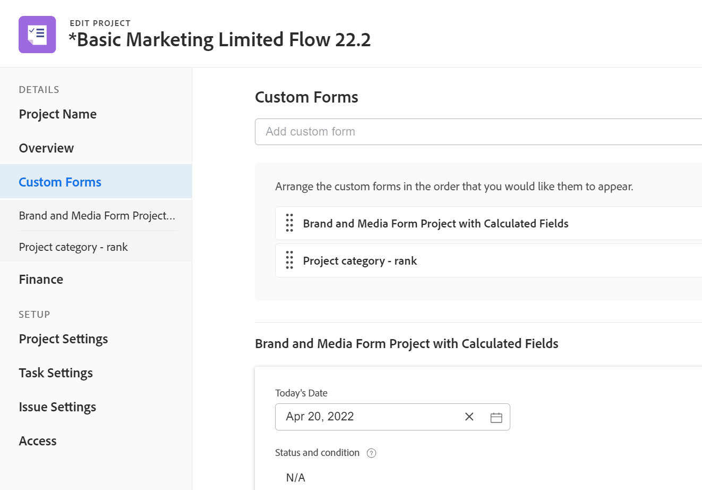

# Editar proyectos

<!--Audited: 01/2024-->

<!--The highlighted information on this page refers to functionality not yet generally available. It is available for all customers in the Preview environment and for a select group of customers in the Production environment.-->

<!--

***Linked to many articles,

The Resource Pools part also duplicates in the "Working with Resource Pools" article 

The Update Type section is also documented in Selecting the Project Update Type article

Keep the reference link to the other article that also documents the Update Type) 

(NOTE 2: information described here also exists in these articles:

** Project Overview area

**Manage project Finance area

If you need to update just one field, check to see if that field is also listed there and update in both places.)

-->

Puede editar un proyecto en Adobe Workfront con la frecuencia necesaria. Le recomendamos que edite los proyectos mínimamente después de que su estado cambie a Actual para evitar confusiones enviando notificaciones sobre los cambios a todo el equipo del proyecto.

Lo ideal es editar un proyecto cuando se encuentra en estado de planificación. Para obtener información sobre el equipo del proyecto, consulte [Información general del equipo del proyecto](../../../manage-work/projects/planning-a-project/project-team-overview.md).

## Requisitos de acceso

+++ Expanda para ver los requisitos de acceso para la funcionalidad en este artículo.

<table style="table-layout:auto"> 
 <col> 
 <col> 
 <tbody> 
  <tr> 
   <td role="rowheader">plan de Adobe Workfront</td> 
   <td> 
Cualquiera
 </td> 
  </tr> 
  <tr> 
   <td role="rowheader">Licencia de Adobe Workfront</td> 
   <td>
Nuevo: estándar 
 
   O
   
Actual: plan 
 </td> 
  </tr> 
  <tr> 
   <td role="rowheader">Configuraciones de nivel de acceso</td> 
   <td> 
Editar acceso a Proyectos
 </td> 
  </tr> 
  <tr> 
   <td role="rowheader">Permisos de objeto</td> 
   <td> 
     
Administración de permisos en un proyecto 
 
     
 Para obtener información sobre los permisos del proyecto, consulte <a href="../../../workfront-basics/grant-and-request-access-to-objects/share-a-project.md" class="MCXref xref">Uso compartido de un proyecto en Adobe Workfront</a>.
 
Para obtener información sobre cómo solicitar acceso adicional, consulte <a href="../../../workfront-basics/grant-and-request-access-to-objects/request-access.md" class="MCXref xref">Solicitud de acceso a objetos </a>.
 </td> 
  </tr> 
 </tbody> 
</table>

Para obtener más información sobre esta tabla, consulte [Requisitos de acceso en la documentación de Workfront](/help/quicksilver/administration-and-setup/add-users/access-levels-and-object-permissions/access-level-requirements-in-documentation.md).

+++

## Limitaciones para editar proyectos

Existen algunas limitaciones que pueden impedir la edición de proyectos.

Tenga en cuenta lo siguiente al editar proyectos:

* No se pueden editar proyectos que se encuentren en proceso de aprobación, excepto para registrar el tiempo y cambiar el estado.
* Puede adjuntar documentos o plantillas a un proyecto que tenga el estado Completo, Inactivo o Pendiente de aprobación sólo si el administrador de Workfront o un administrador de grupo han habilitado esta funcionalidad en el área Preferencias del proyecto. Para obtener información sobre cómo establecer las preferencias del proyecto, consulte [Configurar las preferencias de proyecto de todo el sistema](../../../administration-and-setup/set-up-workfront/configure-system-defaults/set-project-preferences.md).
* Solo puede editar la siguiente información en un proyecto con estado Cancelado o Completado:

   * Modificar gastos existentes.
   * Agregar, quitar o editar formularios personalizados.

## Edición de un proyecto

Al editar un proyecto, puede modificar la información y la configuración del proyecto, así como las tareas y problemas del proyecto.

Algunas de las configuraciones mencionadas en este artículo podrían modificarse de su estado predeterminado por su estado en la plantilla desde la que se creó el proyecto.

Para obtener información sobre la edición de plantillas, consulte [Editar plantillas de proyecto](../../../manage-work/projects/create-and-manage-templates/edit-templates.md).

Para obtener información sobre cómo crear un proyecto a partir de una plantilla, consulte [Creación de un proyecto con una plantilla](/help/quicksilver/manage-work/projects/create-projects/create-project-from-template.md).

{{step1-to-projects}}

1. (Opcional) Haga clic en **Proyectos en los que trabajo** o **Proyectos de mi propiedad** en la esquina superior derecha para mostrar los proyectos donde es el propietario o los proyectos donde forma parte del equipo del proyecto.

   

   >[!NOTE]
   >
   >Si es administrador de un grupo, puede ver y editar los proyectos del grupo tanto en el área de Grupos como en el área de Proyectos. Para obtener más información, consulte [Crear y modificar proyectos de un grupo](../../../administration-and-setup/manage-groups/work-with-group-objects/create-and-modify-a-groups-projects.md).

1. Haga clic en el nombre del proyecto que desee editar para abrir la página del proyecto.

1. (Opcional) Para editar información limitada sobre un proyecto, haga clic en **Detalles del proyecto** en el panel izquierdo. Si desea editar toda la información sobre el proyecto, continúe con el paso 5. <!--accurate?!-->

   

   >[!NOTE]
   >
   >Según la forma en que el administrador de Workfront o el administrador del grupo hayan modificado la plantilla de diseño, los campos del área Detalles del proyecto podrían volver a organizarse o no mostrarse. Para obtener más información, consulte [Personalización de la vista Detalles mediante una plantilla de diseño](../../../administration-and-setup/customize-workfront/use-layout-templates/customize-details-view-layout-template.md).

   Para editar la información de la sección Detalles, haga lo siguiente:

   1. (Opcional) Haga clic en **Contraer todo** icono   en la esquina superior derecha para contraer todas las áreas.
   1. (Opcional y condicional) Cuando un área esté contraída, haga clic en **flecha hacia la derecha**  junto a cada área para expandir el área que desea editar.
   1. Para obtener más información sobre cómo editar la información en la ficha Detalles del proyecto, consulte los siguientes artículos:

      * [Administrar información en el área de Información general del proyecto](../../../manage-work/projects/manage-projects/understand-project-overview-area.md)
      * [Administrar información en el área de finanzas del proyecto](../../../manage-work/projects/project-finances/manage-project-finance-area.md)

   1. (Opcional) Para adjuntar un formulario personalizado, empiece a escribir el nombre de un formulario en la **Añadir formulario personalizado** , selecciónelo cuando se muestre en la lista y haga clic en **Guardar cambios**.
   1. (Opcional) Haga clic en **Exportar** icono  para exportar la información general y de los formularios personalizados a un archivo de PDF, haga clic en **Exportar**. Seleccione una de las siguientes opciones:

      * Seleccionar todo (solo se muestra cuando hay al menos un formulario personalizado adjunto)
      * Información general
      * El nombre de uno o varios formularios personalizados

      El archivo del PDF se descarga en el equipo.

      

      Para obtener más información, consulte [Exportar formularios personalizados y detalles del objeto](../../../workfront-basics/work-with-custom-forms/export-custom-forms-details.md).

   Para obtener información sobre los campos visibles en la sección Detalles del proyecto, continúe editando el proyecto en el cuadro Editar proyecto como se describe a continuación.
1. Para editar toda la información sobre el proyecto, haga clic en **Más** menú  junto al nombre del proyecto y haga clic en **Editar**.

   O

   En una lista de proyectos, seleccione uno o varios proyectos y haga clic en **Editar** icono  al principio de la lista.

   Para obtener más información sobre la edición masiva de proyectos, consulte la sección [Editar proyectos por lotes](#edit-projects-in-bulk) en este artículo.

   El **Editar proyecto** se abre el cuadro.

   >[!IMPORTANT]
   >
   >Debe tener permisos de administración en el proyecto para ver la opción de edición.

   Todos los campos del proyecto están disponibles en el cuadro Editar proyecto y se agrupan por las áreas enumeradas en el panel izquierdo.

   >[!NOTE]
   >
   >Según la forma en que el administrador de Workfront o del grupo haya modificado la plantilla de diseño, las áreas del panel izquierdo del cuadro Editar proyecto o cualquier campo enumerado en estas áreas podrían reorganizarse o no mostrarse. Para obtener más información, consulte [Personalización de la vista Detalles mediante una plantilla de diseño](../../../administration-and-setup/customize-workfront/use-layout-templates/customize-details-view-layout-template.md).

1. (Condicional) Si hizo clic en el botón **Más** y luego **Editar**, actualice la información en cualquiera de las siguientes áreas enumeradas en el panel izquierdo:

   * [Nombre de proyecto](#project-name)
   * [Información general](#overview)
   * [Formularios personalizados](#custom-forms)
   * [Finanzas](#finance)
   * [Configuración de proyecto](#project-settings)
   * [Configuración de tarea](#task-settings)
   * [Configuración de problema](#issue-settings)
   * [Acceso](#access)

   >[!NOTE]
   >
   >Según la forma en que el administrador de Workfront configure la plantilla de diseño para el área de detalles del proyecto, las secciones y los campos del cuadro Editar proyecto podrían ser diferentes en su entorno. Para obtener más información, consulte [Personalización de la vista Detalles mediante una plantilla de diseño](../../../administration-and-setup/customize-workfront/use-layout-templates/customize-details-view-layout-template.md).

### Nombre del proyecto {#project-name}

1. Empiece a editar el proyecto como se ha descrito anteriormente.
1. Clic **Nombre de proyecto** en el panel izquierdo.

   

1. Actualice el nombre del proyecto.

   No se puede editar el nombre del proyecto al editarlo por lotes.

### Información general {#overview}

1. Empiece a editar el proyecto como se ha descrito anteriormente.
1. Clic **Información general** en el panel izquierdo.

   

1. Actualice la siguiente información sobre el proyecto:

   <table style="table-layout:auto"> 
      <col> 
      <col> 
      <tbody> 
      <tr> 
         <td role="rowheader"><strong>Descripción</strong> </td> 
         <td> 
Agregue información adicional sobre el proyecto.
 </td> 
      </tr> 
      <tr> 
         <td role="rowheader"><strong>Estado</strong> </td> 
         <td> 
Seleccione el estado del proyecto. No puede marcar un proyecto como Completado antes de que se completen todas las tareas y problemas. Para obtener información sobre los estados de los proyectos, consulte <a href="../../../administration-and-setup/customize-workfront/creating-custom-status-and-priority-labels/project-statuses.md" class="MCXref xref">Acceso a la lista de estados de proyectos del sistema</a>
 </td> 
      </tr> 
      <tr> 
         <td role="rowheader"><strong>Prioridad</strong> </td> 
         <td> 
 
Esto solo es un indicador visual para usted que le permite priorizar sus proyectos.
 
Según las Preferencias del proyecto seleccionadas por el administrador de Workfront, los nombres de las prioridades pueden ser diferentes para usted. Para obtener más información sobre la edición de prioridades, consulte <a href="../../../administration-and-setup/customize-workfront/creating-custom-status-and-priority-labels/create-customize-priorities.md" class="MCXref xref">Creación y personalización de prioridades</a>
 
 </td> 
      </tr> 
      <tr> 
         <td role="rowheader"><strong>URL</strong> </td> 
         <td> 
Especifique un vínculo web relacionado con la información sobre este proyecto.
 </td> 
      </tr> 
      <tr> 
         <td role="rowheader"><strong>Tipo de condición</strong> </td> 
         <td> 
Seleccione entre los siguientes tipos de condición: 
         <ul> 
         <li><strong>Manual:</strong> El propietario del proyecto establece la condición en el proyecto manualmente.</li> 
         <li><strong>Estado de progreso:</strong> Workfront establece automáticamente la condición en función del estado de progreso de las tareas en la ruta crítica. Para obtener más información sobre el estado de progreso, consulte <a href="../../../manage-work/tasks/task-information/task-progress-status.md" class="MCXref xref">Resumen del estado de progreso de tareas</a>.</li> 
         </ul>
El administrador de Workfront o un administrador de grupo selecciona el valor predeterminado para la forma en que se calcula la condición de los proyectos para el sistema o su grupo. Para obtener información sobre cómo establecer los valores predeterminados del proyecto, consulte <a href="../../../administration-and-setup/set-up-workfront/configure-system-defaults/set-project-preferences.md" class="MCXref xref">Configurar las preferencias de proyecto de todo el sistema</a>. 

 </td> 
      </tr> 
      <tr> 
         <td role="rowheader"><strong>Condición</strong> </td> 
         <td> 
 
(Solo se muestra después de seleccionar <strong>Manual</strong> para el <strong>Tipo de condición</strong>): Seleccione una condición para indicar el estado del proyecto. 
 
Para obtener información sobre cómo se pueden configurar las condiciones del proyecto de forma automática o manual, consulte <a href="../../../manage-work/projects/manage-projects/project-condition-and-condition-type.md" class="MCXref xref">Descripción general de la condición y el tipo de condición del proyecto</a>
 
 </td> 
      </tr> 
      <tr> 
         <td role="rowheader"><strong>Modo de programación</strong> </td> 
         <td> 
Especifique si el proyecto está programado desde la fecha de inicio o desde la fecha de finalización. Esta selección determina las fechas planificadas de las tareas del proyecto. 
         <ul> 
         <li><strong>Fecha de inicio</strong>: la primera tarea del proyecto tiene la misma fecha planificada de inicio que el proyecto de forma predeterminada. Para obtener información sobre la fecha planificada de inicio de la tarea, consulte <a href="../../../manage-work/tasks/task-information/task-planned-start-date.md" class="MCXref xref">Información general sobre la fecha planificada de inicio de la tarea</a>. La cronología del proyecto se calcula a partir de la fecha de inicio y la fecha de finalización del proyecto se calcula mediante el sistema, en función de la duración de todas las tareas. </li> 
         <li><strong>Fecha de finalización</strong>: la última tarea del proyecto tiene la misma fecha planificada de finalización que el proyecto. La cronología del proyecto se calcula a partir de la fecha de finalización y la fecha de inicio del proyecto se calcula mediante el sistema, restando la duración de todas las tareas de la fecha de finalización del proyecto. </li> 
         </ul>
El administrador de Workfront o un administrador de grupo selecciona la configuración predeterminada del Modo de horario para su sistema o grupo. Para obtener información sobre cómo establecer los valores predeterminados del proyecto, consulte <a href="../../../administration-and-setup/set-up-workfront/configure-system-defaults/set-project-preferences.md" class="MCXref xref">Configurar las preferencias de proyecto de todo el sistema</a>.

 </td> 
      </tr> 
      <tr> 
         <td role="rowheader"><strong>Fecha y hora planificadas para el inicio</strong> </td> 
         <td> 
 
Especifique la fecha cuando seleccione <strong>Programar desde la fecha de inicio</strong>.  
 
Este es un campo de solo lectura cuando selecciona <strong>Programar desde fecha de finalización</strong>. 
 
 </td> 
      </tr> 
      <tr> 
         <td role="rowheader"><strong>Fecha y hora planificadas de finalización</strong> </td> 
         <td> 
Especifique la fecha cuando seleccione <strong>Programar desde fecha de finalización</strong>. 
 
Este es un campo de solo lectura cuando selecciona <strong>Programar desde la fecha de inicio</strong>. 
 </td> 
      </tr> 
      <tr> 
         <td role="rowheader"><strong>Portafolio</strong></td> 
         <td>Indique el Portfolio al que pertenece el proyecto. Primero debe crear un Portfolio para que aparezca en la lista desplegable. Solo los portafolios activos pueden asociarse a un proyecto. Para obtener más información sobre la creación de portafolios, consulte <a href="../../../manage-work/portfolios/create-and-manage-portfolios/create-portfolios.md" class="MCXref xref">Crear un portafolio </a>.</td> 
      </tr> 
      <tr> 
         <td role="rowheader"><strong>Programar</strong></td> 
         <td> 
Si seleccionó un Portfolio para el proyecto, especifique un Programa para el proyecto. Es posible que algunos Portfolio no tengan programas. Primero debe crear un programa, antes de que aparezca en esta lista desplegable. Solo los programas activos pueden asociarse a un proyecto. 
 
Para obtener más información sobre la creación de programas, consulte <a href="../../../manage-work/portfolios/create-and-manage-programs/create-program.md" class="MCXref xref">Creación de un programa</a>.
 </td> 
      </tr> 
      <tr> 
         <td role="rowheader"><strong>Grupo</strong></td> 
         <td> 
 
Especifique el nombre del grupo asociado con el proyecto. 
Este campo es obligatorio. No puede tener un proyecto que no esté asociado a un grupo. 
 
Puede asegurarse de que está seleccionando el grupo correcto pasando el puntero sobre él y haciendo clic en el icono de información  que se muestra junto a ella. Se muestra información de objeto sobre el grupo, como la jerarquía de grupos por encima y sus administradores.
 De forma predeterminada, uno de los siguientes grupos se asocia automáticamente a un proyecto cuando se crea, a menos que especifique un grupo diferente:
 
         <ul> 
         <li> 
Cuando se crea el proyecto desde el área de Proyectos, el grupo de inicio del creador del proyecto se asocia al proyecto. 
 
Esto también ocurre cuando el proyecto se crea desde la sección Proyectos en un portafolio o programa.
 </li> 
         <li> 
Cuando el proyecto se crea a partir de la página principal de un grupo en el área de Configuración, ese grupo se asocia al proyecto.
 </li> 
         </ul> 
 
  
 
         
<b>NOTAS</b>

         <ul>
         <li>
Si el proyecto, o sus tareas o problemas están asociados con un estado personalizado de nivel de grupo, cambiar el grupo del proyecto puede hacer que el estado del proyecto, las tareas o los problemas cambien para coincidir con el nuevo grupo.
</li>
         <li>
Si el proyecto, sus tareas o problemas ya están asociados a un proceso de aprobación de nivel de grupo mediante estados personalizados de nivel de grupo, cambiar el grupo podría crear un conflicto entre los estados de aprobación del grupo anterior y los existentes en el nivel de sistema.

         
Considere la posibilidad de eliminar los procesos de aprobación de nivel de grupo en el proyecto, o sus tareas o problemas antes de actualizar el grupo.

         
Para obtener información sobre la creación de procesos de aprobación de nivel de grupo, consulte <a href="../../../administration-and-setup/manage-groups/work-with-group-objects/create-and-modify-groups-approval-processes.md" class="MCXref xref">Procesos de aprobación de nivel de grupo</a>.

         
Para obtener información sobre cómo crear un estado personalizado de nivel de grupo, consulte <a href="../../../administration-and-setup/manage-groups/manage-group-statuses/create-or-edit-a-group-status.md" class="MCXref xref">Crear o editar un estado de grupo</a>
</li></ul> </td> 
      </tr> 
      <tr> 
         <td role="rowheader"><strong>Compañía</strong> </td> 
         <td> 
Especifique una compañía asociada al proyecto. Debe crear una compañía antes de asociarla a un proyecto. Solo las empresas activas pueden asociarse a un proyecto. Para obtener información sobre la creación de empresas, consulte <a href="../../../administration-and-setup/set-up-workfront/organizational-setup/create-and-edit-companies.md" class="MCXref xref">Crear y editar compañías</a>.
 </td> 
      </tr> 
      <tr> 
         <td role="rowheader"><strong>Propietario del proyecto</strong> </td> 
         <td> 
Empiece a escribir el nombre de un usuario para agregarlo al proyecto y, a continuación, selecciónelo cuando se muestre en la lista. El usuario se añade al equipo del proyecto y se le otorgan automáticamente permisos de administración del proyecto. El usuario designado como Propietario del proyecto debe ser un usuario activo de Workfront.

         </td> 
      </tr> 
      <tr> 
         <td role="rowheader"><strong>Patrocinador del proyecto</strong> </td> 
         <td> 
Empiece a escribir el nombre de un usuario para agregarlo al proyecto y, a continuación, selecciónelo cuando se muestre en la lista. El usuario se añade al equipo del proyecto y se le conceden automáticamente permisos de visualización en el proyecto. El usuario designado como patrocinador del proyecto debe ser un usuario activo de Workfront. 
 </td> 
      </tr> 
      <tr> 
         <td role="rowheader"><strong>Gerente de recursos</strong> </td> 
         <td> 
 Empiece a escribir los nombres de los usuarios para agregarlos al proyecto y, a continuación, selecciónelos cuando se muestren en la lista. Los usuarios se agregan al equipo del proyecto y se les otorgan automáticamente permisos de administración al proyecto, y pueden asignar recursos a las tareas y los problemas del proyecto. Los usuarios mantienen los permisos de Administración en el proyecto incluso cuando se eliminan del campo Administrador de recursos. Puede especificar más de un gerente de recursos. 
 </td> 
      </tr>

   <tr> 
         <td role="rowheader"><strong>Originador de problema convertido</strong> </td> 
         <td> 
 De forma predeterminada, este campo se rellena automáticamente con el nombre del usuario que creó el problema desde el que se convirtió el proyecto. Puede actualizar este nombre con cualquier otro nombre de usuario en Workfront.  
 </td> 
      </tr>

   </tbody> 
      </table>

   >[!TIP]
   >
   >Al actualizar los campos Propietario del proyecto, Patrocinador del proyecto y Administrador de recursos, observe el avatar, la función principal del usuario o su dirección de correo electrónico para distinguir entre usuarios con nombres idénticos.
   >
   >Los usuarios deben estar asociados con al menos un rol para verlo a medida que los agregue.
   >
   >Debe tener activada la configuración Ver información de contacto en su nivel de acceso para que los usuarios vean los correos electrónicos de los usuarios. Para obtener más información, consulte [Concesión de acceso a los usuarios](../../../administration-and-setup/add-users/configure-and-grant-access/grant-access-other-users.md).

1. (Opcional) Siga editando las secciones siguientes, según la información que desee modificar

   O

   Haga clic en **Guardar**.

### Formularios personalizados {#custom-forms}

Según el nivel de acceso y los permisos que tenga en el proyecto, se producirán los siguientes escenarios:

* Si no tiene permisos de Editar formulario personalizado en el proyecto, no puede editar los campos en ninguno de los formularios personalizados adjuntos. Solo puede ver los campos en los formularios personalizados adjuntos al proyecto.
* Si tiene acceso de Vista (y no de Edición) a una sección de un formulario personalizado, no puede editar los campos de esa sección.
* Si no tiene acceso a una sección de uno de los formularios personalizados adjuntos al proyecto, la sección no se mostrará en el cuadro Editar proyecto.

Cuando se selecciona más de un proyecto para editarlos en lote, existen los siguientes escenarios:

* Si no tiene permisos Editar formulario personalizado en al menos uno de los proyectos seleccionados, no podrá editar los campos en ninguno de los formularios personalizados adjuntos. Solo puede ver los campos en los formularios personalizados adjuntos
* Si tiene acceso de Vista (y no de Edición) a una sección de un formulario personalizado, no puede editar los campos de esa sección. Solo puede ver los campos de esa sección.
* Si no tiene acceso a una sección de uno de los formularios personalizados adjuntos al menos a uno de los proyectos, la sección no se mostrará en el cuadro Editar proyectos.
* Si tiene campos obligatorios en cualquiera de los formularios personalizados adjuntos a todos los proyectos y selecciona un campo sin editarlo realmente, debe descartar los cambios en ese campo o agregarle información antes de poder guardar los proyectos seleccionados. Si no selecciona ningún campo obligatorio, puede guardar los proyectos seleccionados aunque el campo requerido esté en blanco.

Para obtener información sobre el acceso a formularios personalizados, consulte los siguientes artículos:

* [Compartir un formulario personalizado](../../../administration-and-setup/customize-workfront/create-manage-custom-forms/share-access-to-a-custom-form.md)
* [Agregar un salto de sección a un formulario personalizado](../../../administration-and-setup/customize-workfront/create-manage-custom-forms/add-a-section-break-to-a-custom-form.md)

Para editar información sobre formularios personalizados al editar un proyecto:

1. Empiece a editar el proyecto como se ha descrito anteriormente.
1. Clic **Forms personalizado** en el panel izquierdo.

   

1. Haga clic en **Añadir formulario personalizado** y seleccione un formulario de la lista para adjuntarlo al proyecto. De forma predeterminada, los primeros 40 formularios se muestran en orden alfabético. Si no ve el formulario en la lista, empiece a escribir su nombre y selecciónelo cuando aparezca en la lista.

   >[!NOTE]
   >
   >Debe crear los formularios personalizados antes de que estén disponibles para seleccionarlos en este campo. En la lista solo aparecen los formularios personalizados activos. Para obtener más información sobre la creación de formularios personalizados, consulte [Crear o editar un formulario personalizado](../../../administration-and-setup/customize-workfront/create-manage-custom-forms/create-or-edit-a-custom-form.md). Puede agregar hasta diez formularios personalizados a un proyecto.

1. (Condicional) Si adjuntó un formulario personalizado al proyecto, edite los campos del formulario. Debe especificar todos los campos obligatorios antes de guardar el proyecto.
1. (Opcional) Haga clic en **Icono X** a la derecha del nombre de un formulario personalizado para eliminarlo, y haga clic en **Eliminar**.
1. (Opcional) Siga editando las secciones siguientes, según la información que desee modificar

   O

   Haga clic en **Guardar**.

### Finanzas {#finance}

Según el nivel de acceso y los permisos que tenga en el proyecto, se producirán los siguientes escenarios:

* Si tiene acceso de visualización a datos financieros y permisos de visualización de finanzas en el proyecto, solo puede ver los campos en la sección Finanzas. No puede editar los campos de esta sección.
* Si tiene acceso de edición a los datos financieros y permisos de administración de finanzas en el proyecto, puede actualizar los campos en esta sección.

Al seleccionar más de un proyecto para editarlos de forma masiva y en tiempo real, existen los siguientes escenarios:

* Si selecciona al menos un proyecto en el que tenga permisos de Ver finanzas (en lugar de Administrar finanzas), solo podrá ver los campos de esta sección para todos los proyectos seleccionados. No puede editar los campos de forma masiva en la sección Finanzas.
* Si selecciona al menos un proyecto en el que no tiene permisos financieros, esta sección no se muestra en absoluto.

Para editar campos en el área Finanzas:

1. Empiece a editar el proyecto como se ha descrito anteriormente.
1. Clic **Finanzas** en el panel izquierdo.

   

1. Actualice la siguiente información financiera para el proyecto:

   <table style="table-layout:auto"> 
    <col> 
    <col> 
    <tbody> 
     <tr data-mc-conditions=""> 
      <td role="rowheader"><strong>Moneda</strong> </td> 
      <td> 
 
Especifique la moneda del proyecto si es diferente a la moneda predeterminada del sistema. No puede cambiar la moneda de un proyecto si ya contiene información financiera. Este campo no está visible si solo tiene la moneda predeterminada en el sistema. 
 
Para obtener más información sobre la divisa, consulte <a href="../../../administration-and-setup/manage-workfront/exchange-rates/set-up-exchange-rates.md" class="MCXref xref">Configurar tasas de cambio</a>. 
 
 </td> 
     </tr> 
     <tr> 
      <td role="rowheader"><strong>Presupuesto</strong> </td> 
      <td> Especifique un presupuesto para el proyecto. </td> 
     </tr> 
     <tr> 
      <td role="rowheader"><strong>Método de índice de rendimiento</strong> </td> 
      <td> 
Seleccionar <b>Basado en horas</b>, o <b>Basado en costes</b> para indicar si las métricas Valor ganado del proyecto (como Índice de rendimiento de costos o Costo real estimado) se calculan usando horas o costos. 
 
Para obtener más información sobre el método de índice de rendimiento, consulte <a href="../../../manage-work/projects/project-finances/set-pim.md" class="MCXref xref">Establecer el método de índice de rendimiento (PIM)</a>. 
 
El administrador de Workfront o un administrador de grupo selecciona la configuración predeterminada Método de índice de rendimiento para su sistema o grupo. Para obtener información sobre cómo establecer los valores predeterminados del proyecto, consulte <a href="../../../administration-and-setup/set-up-workfront/configure-system-defaults/set-project-preferences.md" class="MCXref xref">Configurar las preferencias de proyecto de todo el sistema</a>.
 </td> 
     </tr> 
     <tr> 
      <td role="rowheader"><strong>Estimar al finalizar</strong> </td> 
      <td> 
 
Especifique cómo Workfront debe calcular el valor de Estimar al finalizar (EAC). 

      Seleccione entre las siguientes opciones: 
      <ul><li><b>Calcular a nivel de proyecto</b></li>
      <li><b>Resumir a partir de tareas/ subtareas</b></li> </ul>
      
Para obtener más información acerca de cómo se calcula Estimar al finalizar, consulte <a href="../../../manage-work/projects/project-finances/calculate-eac.md" class="MCXref xref">Calcular estimación al finalizar (EAC)</a>.
 
El administrador de Workfront o del grupo selecciona la configuración predeterminada Estimar al finalizar para el sistema o el grupo. Para obtener información sobre cómo establecer los valores predeterminados del proyecto, consulte <a href="../../../administration-and-setup/set-up-workfront/configure-system-defaults/set-project-preferences.md" class="MCXref xref">Configurar las preferencias de proyecto de todo el sistema</a>.
 
 </td> 
     </tr> 
     <tr> 
      <td role="rowheader"><strong>Beneficio planificado</strong> </td> 
      <td> 
Estime cuál es el beneficio planificado del proyecto. Se utiliza en el caso comercial del proyecto y en Portfolio Optimizer. Para obtener más información sobre el beneficio planificado de un proyecto, consulte <a href="../../../manage-work/projects/project-finances/project-planned-benefit.md" class="MCXref xref">Visión General de Beneficio Planificado del Proyecto</a>. El beneficio planificado de un proyecto se tiene en cuenta cuando se calcula el valor neto de un proyecto. 
 
Para obtener más información, consulte <a href="../../../manage-work/portfolios/portfolio-optimizer/manage-projects-in-portfolio-optimizer.md" class="MCXref xref">Administrar proyectos en Portfolio Optimizer</a> . 
 </td> 
     </tr> 
     <tr> 
      <td role="rowheader"><strong>Beneficio real</strong> </td> 
      <td> 
Calcular el beneficio real del proyecto. Se trata de un importe en moneda que representa el beneficio que su compañía o departamento obtendría una vez completado este proyecto. 
 </td> 
     </tr> 
      <tr> 
      <td role="rowheader"><strong>Costo fijo</strong> </td> 
      <td> 
Especifique el Coste fijo del proyecto. Esto es diferente al costo de mano de obra que proviene de las horas en el proyecto y al costo de gasto que proviene de la cantidad de gastos en el proyecto. El costo fijo de un proyecto se tiene en cuenta al calcular su valor neto y forma parte del costo presupuestado. 
 </td> 
     </tr> 
     <tr> 
      <td role="rowheader"><strong>Ingresos fijos</strong> </td> 
      <td> 
Especifique los ingresos fijos del proyecto. 
 </td> 
     </tr> 
    </tbody> 
   </table>

1. (Opcional) Siga editando las secciones siguientes, según la información que desee modificar.

   O

   Haga clic en **Guardar**.

### Configuración de proyecto {#project-settings}

1. Empiece a editar el proyecto como se ha descrito anteriormente.
1. Clic **Configuración de proyecto** en el panel izquierdo.

   

1. Actualice la siguiente información:

   <table style="table-layout:auto"> 
      <col> 
      <col> 
      <tbody> 
      <tr> 
      <td role="rowheader"><strong>Ruta de hitos</strong> </td> 
       <td> 
Seleccione una Ruta de hitos para el proyecto. En la lista solo se muestran las trayectorias de hitos activas.
 
Para obtener más información sobre las Rutas de hitos, consulte <a href="../../../administration-and-setup/customize-workfront/configure-approval-milestone-processes/create-milestone-path.md" class="MCXref xref">Creación de una trayectoria del hito</a>.
 </td> 
      </tr> 
      <tr> 
      <td role="rowheader"><strong>Modo de finalización</strong> </td> 
      <td> 
Controla la manera en que el proyecto se marca como Completo. Seleccione entre las siguientes opciones: 
       <ul> 
       <li>
<strong>Automático</strong>: el proyecto se marca como Completado cuando se completan todas las tareas y problemas.

El estado del proyecto se cambia automáticamente a Completo sólo cuando el estado del proyecto es Actual cuando se han completado las tareas. 
</li> 
       <li><strong>Manual</strong>: debe seleccionar manualmente el estado Completo del proyecto cuando se hayan completado todas las tareas y problemas.</li> 
       </ul>
 </td> 
       </tr> 
       <tr> 
       <td role="rowheader"><strong>Modo de finalización de resumen</strong></td> 
       <td> 
Controla la manera en que las tareas principales se marcan como Completadas. Seleccione entre las siguientes opciones: 
       <ul> 
       <li><strong>Automático</strong>: las tareas principales se marcan como Completadas y actualizan el porcentaje completado automáticamente, a medida que se completan las tareas secundarias y se actualiza el porcentaje completado de las tareas secundarias. </li> 
       <li><strong>Manual</strong>: Debe actualizar manualmente el porcentaje completado y el estado de las tareas principales, independientemente de los cambios realizados en las tareas secundarias. Esto le permite marcar una tarea principal como completada incluso cuando las subtareas están incompletas. </li> 
       </ul>
 </td> 
       </tr> 
       <tr> 
       <td role="rowheader"><strong>Tipo de actualización</strong></td> 
       <td> 
Controla cuándo se guardan los cambios realizados en la escala de tiempo del proyecto en el proyecto o en las tareas principales. Por ejemplo, los siguientes cambios en el déclencheur del proyecto pueden actualizar la cronología del proyecto: 
       <ul> 
       <li>Actualizar las fechas de las tareas</li> 
       <li>Cambiar relaciones de predecesoras de tareas</li> 
       <li>
Cambie las relaciones principal-secundario, agregando o quitando asignaciones además de cambiar la restricción de tarea o el tipo de duración.

Cuando se actualizan las tareas, sus objetos principales (tareas principales o el proyecto) se actualizan en el momento indicado por el Tipo de actualización. 

Si los objetos principales no se actualizan inmediatamente después del cambio al seleccionar "Automático y al cambiar" o "Solo cambiar" Tipo de actualización, actualice la página

Seleccione entre las siguientes opciones: 

- <strong>Automático y al cambiar</strong> (Configuración predeterminada): La cronología del proyecto se actualiza cada vez que se produce un cambio en el proyecto o en otro proyecto del que el proyecto depende (Al cambiar). La cronología del proyecto también se actualiza cada noche (Automática).

Esta es la configuración recomendada para este campo porque garantiza que el proyecto siempre esté actualizado.

Cuando realiza una acción en una tarea o proyecto que almacena en déclencheur un cálculo de escala de tiempo, todas las fechas disponibles se muestran inmediatamente, lo que le permite continuar trabajando. En los proyectos con más de 100 tareas, las fechas que requieran recalculaciones más largas se muestran brevemente como signo de interrogación (entre 1 y 5 segundos, o hasta un minuto en los proyectos grandes). Esto indica que el cálculo aún no ha finalizado y que las fechas están sujetas a cambios.

- <strong>Cambiar solo</strong>: la cronología del proyecto se actualiza cada vez que se produce un cambio en el proyecto o en otro proyecto del que depende el proyecto. Es posible que desee seleccionar esta opción si los cambios rara vez se producen en el proyecto o en otros proyectos de los que depende la escala de tiempo.

- <strong>Solo automático</strong>: la cronología del proyecto se actualiza cada noche; la cronología no se actualiza inmediatamente después de realizar cambios.

Es posible que desee seleccionar esta opción si se producen muchos cambios cada día en el proyecto o en otros proyectos de los que depende la escala de tiempo. Sin embargo, tenga en cuenta que ha elegido esta configuración, ya que el proyecto no se actualizará al mismo tiempo que se realizan los cambios.

- <strong>Solo manual</strong>: la cronología del proyecto solo se actualiza cuando selecciona la opción Recalcular cronología. Para obtener más información sobre cómo recalcular manualmente la escala de tiempo del proyecto, consulte <a href="../../../manage-work/projects/manage-projects/recalculate-project-timeline.md" class="MCXref xref">Recalcular escalas de tiempo del proyecto</a>. 

Es posible que desee seleccionar esta opción si realiza muchos cambios en el proyecto al mismo tiempo y desea que el cálculo de la escala de tiempo se produzca después de realizar todos los cambios (en lugar de después de cada cambio individual).
</li> 
       </ul>
 </td> 
       </tr> 
       <tr> 
       <td role="rowheader"><strong>Programación</strong> </td> 
       <td> 
Seleccione una programación para el proyecto. Debe ser la misma programación asignada a la mayoría de las personas que trabajan en el proyecto. Debe crear una programación para poder asignarla a un proyecto o a un usuario. Si no ha creado programaciones personalizadas en el sistema, se seleccionará la Programación predeterminada.
 
Para obtener más información sobre la creación de programaciones, consulte <a href="../../../administration-and-setup/set-up-workfront/configure-timesheets-schedules/create-schedules.md" class="MCXref xref">Creación de una programación</a>. 
 </td> 
       </tr> 
       <tr> 
       <td role="rowheader"><strong>Tiempo libre del usuario</strong> </td> 
       <td> 
Determina si el tiempo libre de la persona asignada principal de una tarea ajusta las fechas planificadas de la tarea en el proyecto. 

El administrador de Workfront o un administrador de grupo selecciona el valor predeterminado de esta configuración para el sistema o su grupo. Para obtener información sobre cómo establecer los valores predeterminados del proyecto, consulte <a href="../../../administration-and-setup/set-up-workfront/configure-system-defaults/set-project-preferences.md" class="MCXref xref">Configurar las preferencias de proyecto de todo el sistema</a>. 

Seleccione entre las siguientes opciones: - <strong>Considere el tiempo libre del usuario en las duraciones de tareas</strong>: Al seleccionar esta opción, las fechas planificadas de las tareas se ajustan según el tiempo de espera de la persona principal asignada a la tarea, si el tiempo de espera se produce durante la duración de la tarea. 

Por ejemplo, si una tarea con una delimitación de Lo antes posible está programada para comenzar el 1 de junio y finalizar el 3 de junio, y la Persona principal asignada tiene el 2 de junio marcado para Tiempo de espera, cuando esta selección está habilitada, las fechas planificadas para la tarea son del 1 de junio al 4 de junio. Dependiendo de la Restricción de tarea, existen los siguientes escenarios: 
 
       <ul> 
       <li>Para las delimitaciones de tareas relacionadas con la planificación desde una fecha de inicio (Lo antes posible, Lo antes posible, No comenzar antes del, No comenzar después del, Debe comenzar el), la fecha de inicio planificada no cambia, pero la fecha planificada de finalización cambia.</li> 
       <li>Para las delimitaciones de tareas relacionadas con la planificación a partir de una fecha de finalización (Lo más tarde posible, Última hora disponible, No finalizar antes del, No finalizar después del, Debe finalizar el), la fecha planificada de finalización no cambia, pero la fecha planificada de inicio cambia.</li> 
       <li>En las tareas con una delimitación de Fechas fijas, no cambia la Fecha planificada de inicio ni la Fecha de finalización. </li> 
       </ul>
La duración de la tarea no cambia al seleccionar esta configuración. Solo cambian las fechas planificadas, dependiendo de la Restricción de tarea. Para obtener información sobre la restricción de tareas, consulte <a href="../../../manage-work/tasks/task-constraints/task-constraint-overview.md" class="MCXref xref">Información general sobre restricciones de tarea</a>. 

- <strong>Omitir tiempo libre del usuario en duraciones de tareas</strong>: Al seleccionar esta opción, las fechas planificadas de las tareas en el proyecto permanecen tal como se planificaron originalmente, incluso si la Persona principal asignada a la tarea tiene tiempo libre durante la duración de la tarea. 

Tenga en cuenta lo siguiente al seleccionar opciones para esta configuración:
 
       <ul> 
       <li>
La opción predeterminada para esta configuración para un nuevo proyecto es la misma que la preferencia de proyecto del sistema. 

Para obtener información sobre las preferencias del proyecto en el nivel de sistema, consulte <a href="../../../administration-and-setup/set-up-workfront/configure-system-defaults/set-project-preferences.md" class="MCXref xref">Configurar las preferencias de proyecto de todo el sistema</a>. 
</li> 
       <li>Al adjuntar una plantilla a un proyecto existente, la configuración del proyecto se actualiza para que coincida con la de la plantilla. </li> 
       <li>
Workfront decide qué fechas de tareas planificadas se ajustan según el valor de Restricción de tarea de la tarea. Dependiendo de cuál sea, tanto la Fecha planificada de inicio como la Fecha planificada de finalización, o ambas podrían verse afectadas, o incluso permanecer iguales. Por ejemplo, si una tarea tiene una Restricción de fechas fijas, las fechas no se ajustan cuando el usuario asignado principal tiene tiempo libre, incluso cuando <strong>Considere el tiempo libre del usuario en las duraciones de tareas</strong> está seleccionado. 
</li> 
       </ul></td> 
      </tr> 
      <tr> 
       <td role="rowheader"><strong>Modo de nivelación de recursos</strong> </td> 
       <td> 
 
Seleccione entre las siguientes opciones:
 
- <strong>Manual</strong>: debe nivelar manualmente los recursos (esta es la configuración predeterminada)
 
- <strong>Automático</strong>: Workfront nivela sus recursos.
 
Para obtener más información sobre la nivelación de recursos, consulte <a href="../../../manage-work/gantt-chart/use-the-gantt-chart/level-resources-in-gantt.md" class="MCXref xref">Nivelar recursos en el gráfico Gantt </a>.
 
 </td> 
      </tr> 
      <tr> 
       <td role="rowheader"><strong>Riesgo</strong> </td> 
       <td> 
 
Defina el nivel de riesgo del proyecto. El riesgo es solo un indicador de lo riesgoso que puede ser un proyecto. Puede priorizar la ejecución de sus proyectos en función del nivel de riesgo.
 
 
Considere la posibilidad de seleccionar entre los siguientes niveles de riesgo:
 
- Muy baja
 
- Baja
 
- Mediana
 
- Alta
 
- Muy alta
 
Los niveles de riesgos que indica aquí no se pueden personalizar.
 
Estos no están relacionados con los riesgos potenciales que podrían producirse durante la duración de un proyecto y que deben registrarse en la pestaña Riesgos del proyecto o en el caso empresarial. Para obtener información sobre los riesgos potenciales del proyecto, consulte <a href="../../../administration-and-setup/set-up-workfront/configure-system-defaults/edit-create-risk-types.md" class="MCXref xref">Editar y crear tipos de riesgos</a>. 
 
 
 </td> 
      </tr> 
      <tr> 
       <td role="rowheader"><strong>Conjuntos de recursos</strong> </td> 
       <td> 
 
Especifique los conjuntos de recursos asociados al proyecto. Los conjuntos de recursos son conjuntos de usuarios que se necesitan al mismo tiempo para la finalización de un proyecto y que permiten la presupuestación de proyectos en el Planificador de recursos. Para obtener más información sobre los conjuntos de recursos, consulte <a href="../../../resource-mgmt/resource-planning/resource-pools/work-with-resource-pools.md" class="MCXref xref"> Resumen de conjuntos de recursos </a>. 
 
Cuando edita proyectos por lotes, solo aparecen en este campo los conjuntos de recursos que son comunes a todos los proyectos seleccionados. Si los proyectos seleccionados no tienen conjuntos de recursos compartidos, este campo está vacío. Los conjuntos de recursos que especifique aquí sobrescribirán los conjuntos de recursos individuales de los proyectos.
 
 </td> 
      </tr> 
      <tr> 
       <td role="rowheader"> <strong>Permitir que las tarifas de facturación a nivel de compañía anulen las tarifas a nivel de proyecto</strong></td> 
       <td>Seleccione esta opción para permitir que las tarifas de facturación en la empresa anulen las tarifas históricas de funciones a menos que se marquen como facturadas. Al habilitar esta opción, se anulan las tasas de rol históricas a menos que se marquen como facturadas.  Para obtener más información, consulte <a href="../../../manage-work/projects/project-finances/override-project-level-with-company-level-billing-rates.md" class="MCXref xref">Anular Tarifas de facturación a nivel de proyecto con Tarifas de facturación a nivel de compañía</a>.</td> 
      </tr> 
      <tr> 
       <td role="rowheader"><strong>Requerir tiempo de aprobación de este proyecto</strong></td> 
       <td> 
 Seleccione esta opción para solicitar al propietario del proyecto que apruebe el tiempo de registro en el proyecto. Si está utilizando Registros de facturación y selecciona esta opción, solo las horas aprobadas en el proyecto aparecen como horas facturables disponibles para los Registros de facturación. La aprobación de las horas en el proyecto es independiente de la aprobación de plantillas de horas. 
 
Para obtener más información sobre cómo requerir tiempo para aprobarse en un proyecto, consulte <a href="../../../manage-work/projects/manage-projects/require-time-approval-for-projects.md" class="MCXref xref">Requerir tiempo de aprobación de un proyecto</a>.
 </td> 
      </tr> 
      <tr> 
       <td role="rowheader"><strong>Filtrar tipos de horas</strong> y <strong>Tipos de horas</strong></td> 
       <td> 
 
Seleccione entre las siguientes opciones:
 
       <ul> 
       <li> 
Seleccionar <strong>No</strong> para que todos los tipos de horas específicos del proyecto estén disponibles en el proyecto. (Esta es la selección predeterminada)
 
O
 </li> 
       <li>Seleccionar <strong>Sí</strong> para que solo un subconjunto de los tipos de horas específicos del proyecto esté disponible en el proyecto, seleccione los tipos de horas que desee que estén disponibles en <b>Tipos de horas</b> field.</li> 
       
<b>SUGERENCIA</b>

       
El <b>Tipos de horas</b> El campo no se puede editar al seleccionar <b>No</b>.
 
       
Si selecciona esta opción, solo estarán disponibles para seleccionarlos los tipos de horas que seleccione al registrar horas en el proyecto (o en tareas y problemas dentro del proyecto). Debe seleccionar al menos un tipo de hora; si selecciona esta opción y no selecciona ningún tipo de hora, todos los tipos de horas estarán disponibles en el proyecto.
 </ul>

   
Las mismas selecciones de tipo de hora deben realizarse en el nivel de usuario individual para que el usuario pueda ver estas opciones de tipo de hora en el proyecto. Para obtener más información sobre la definición de tipos de horas en el nivel de usuario, consulte <a href="../../../timesheets/create-and-manage-timesheets/log-time.md" class="MCXref xref">Registrar tiempo</a>. 
 
 </td> 
      </tr> 
      <tr data-mc-conditions=""> 
       <td role="rowheader"><strong>Notificación de recordatorio</strong> </td> 
       <td> 
 
Seleccione la notificación de recordatorio que debe asociarse al proyecto. Debe configurar las notificaciones de recordatorio de los proyectos para que este campo aparezca durante la edición de un proyecto. Para obtener más información sobre la configuración de notificaciones de recordatorio, consulte <a href="../../../administration-and-setup/manage-workfront/emails/set-up-reminder-notifications.md"><a href="../../../administration-and-setup/manage-workfront/emails/set-up-reminder-notifications.md" class="MCXref xref">Configuración de notificaciones de recordatorio</a> .</a>
 
 </td> 
      </tr> 
      <tr data-mc-conditions=""> 
       <td role="rowheader"><strong>Proceso de aprobación</strong></td> 
       <td> 
Seleccione el proceso de aprobación que desea asociar al proyecto. El administrador de Workfront debe definir los procesos de aprobación en el nivel de sistema para poder asociarlos a proyectos. Un usuario con acceso administrativo a los procesos de aprobación también puede crear procesos de aprobación específicos del grupo. Para obtener más información sobre la creación de procesos de aprobación, consulte <a href="../../../administration-and-setup/customize-workfront/configure-approval-milestone-processes/create-approval-processes.md" class="MCXref xref">Crear un proceso de aprobación para elementos de trabajo</a>.
 
Tenga en cuenta lo siguiente al añadir procesos de aprobación: 
 
       <ul> 
       <li>En la lista solo se muestran los procesos de aprobación activos. </li> 
       <li> 
Los procesos de aprobación de todo el sistema y específicos del grupo se muestran en la lista. Un proceso de aprobación asociado a un grupo que no sea el del proyecto no se muestra en la lista.
 
Si el grupo asociado con el proyecto cambia, el proceso de aprobación específico del grupo se convierte en un proceso de aprobación de un solo uso. Para obtener más información sobre cómo afectan los cambios en el grupo del proyecto o los cambios en el proceso de aprobación a la configuración de aprobación, consulte <a href="../../../administration-and-setup/customize-workfront/configure-approval-milestone-processes/how-changes-affect-group-approvals.md" class="MCXref xref">Cómo afectan los cambios en los procesos de aprobación y de grupo a los procesos de aprobación asignados</a>. 
 </li> <!--(NOTE: this bullet stays here although the sections it might appear in are QS only, so we can use the snippet for both Qs and classic)-->
       
Cuando se editan proyectos por lotes, existen los siguientes escenarios:
 
       <ul> 
       <li> 
Al seleccionar proyectos del mismo grupo, en este campo se muestran tanto los procesos de aprobación de nivel de sistema como los de nivel de grupo.
 </li> 
       <li> 
Al seleccionar proyectos de diferentes grupos, solo se muestran en este campo los procesos de aprobación de nivel de sistema.
 </li> 
       <li> 
Cuando alguno de los proyectos tiene un proceso de aprobación de un solo uso adjunto, se reemplaza por el proceso de aprobación de nivel de sistema o de grupo que seleccione. 
 </li> 
      </ul> </td> 
      </tr> 
      <tr> 
      </tr> 
      </tbody> 
      </table>

1. (Opcional) Siga editando las secciones siguientes, según la información que desee modificar.

   O

   Haga clic en **Guardar**.

### Configuración de tarea {#task-settings}

Puede definir los valores predeterminados que se asociarán con todas las tareas nuevas al agregarlas al proyecto.

Para obtener información sobre cómo afectan estos ajustes a la creación de nuevas tareas, consulte la sección [Valores predeterminados de tarea al agregar tareas a un proyecto](../../../manage-work/tasks/create-tasks/create-tasks-overview.md#understa) en el artículo [Información general sobre Crear tareas](../../../manage-work/tasks/create-tasks/create-tasks-overview.md).

1. Empiece a editar el proyecto como se ha descrito anteriormente.
1. Clic **Configuración de tarea** en el panel izquierdo.

   

1. En el **Proceso predeterminado de aprobación de tarea** , seleccione la tarea Proceso de aprobación que desee asociar con todas las tareas nuevas cuando las agregue al proyecto.

   El administrador de Workfront (o un usuario con acceso administrativo a los procesos de aprobación) debe crear un proceso de aprobación de nivel de sistema o de grupo para una tarea antes de que pueda asociarla a un proyecto. En la lista solo se muestran los procesos de aprobación activos. Para obtener información sobre la creación de procesos de aprobación, consulte [Crear un proceso de aprobación para elementos de trabajo](../../../administration-and-setup/customize-workfront/configure-approval-milestone-processes/create-approval-processes.md). Para obtener información sobre cómo afectan los cambios en el grupo del proyecto o los cambios en el proceso de aprobación a la configuración de aprobación, consulte [Cómo afectan los cambios en los procesos de aprobación y de grupo a los procesos de aprobación asignados](../../../administration-and-setup/customize-workfront/configure-approval-milestone-processes/how-changes-affect-group-approvals.md).

   Cuando se editan proyectos por lotes, existen los siguientes escenarios:

   * Cuando se seleccionan varios proyectos del mismo grupo, en este campo se muestran tanto los procesos de aprobación de tareas del sistema como los específicos del grupo.
   * Al seleccionar varios proyectos de diferentes grupos, solo se muestran en este campo los procesos de aprobación de tareas de nivel del sistema.

1. En el **Forms personalizado predeterminado de tarea** , seleccione el formulario o formularios personalizados que desee asociar con todas las tareas nuevas cuando los agregue al proyecto. Debe crear los formularios personalizados antes de que estén disponibles para seleccionarlos en este campo. En la lista solo se muestran los formularios personalizados activos. Para obtener más información sobre la creación de formularios personalizados, consulte [Crear o editar un formulario personalizado](../../../administration-and-setup/customize-workfront/create-manage-custom-forms/create-or-edit-a-custom-form.md). Puede asociar hasta diez formularios personalizados a una tarea.
1. (Opcional) Seleccione **Utilizar Esfuerzo de trabajo para calcular automáticamente las horas planificadas para la tarea** si desea habilitar la administración del esfuerzo de la tarea mediante el uso de Esfuerzo de trabajo en lugar de Horas planificadas.

   

1. (Condicional y opcional) Si ha seleccionado Utilizar esfuerzo de trabajo para calcular automáticamente las horas planificadas para la tarea, haga clic en el menú desplegable de cada nivel de esfuerzo y seleccione un porcentaje para cada nivel. Los siguientes valores de porcentaje son predeterminados:

   | Tamaño | Porcentaje |
   |---|---|
   | Pequeño | 25 % |
   | Media | 50 % |
   | Grande | 75 % |

   >[!TIP]
   >
   >Cuando el tipo de actualización del proyecto se establece en Automática y selecciona esta configuración, las horas planificadas de las tareas se actualizan según la duración de la tarea y el porcentaje de esfuerzo de trabajo, si se establecen en cero. Para obtener más información sobre el uso de Esfuerzo de trabajo para planificar el esfuerzo de una tarea, consulte [Resumen de esfuerzo de trabajo](../../../manage-work/tasks/task-information/work-effort.md).

1. (Opcional) Siga editando las secciones siguientes, según la información que desee modificar.

   O

   Haga clic en **Guardar**.

### Configuración de problema {#issue-settings}

1. Empiece a editar el proyecto como se ha descrito anteriormente.
1. Clic **Configuración de problema** en el panel izquierdo.

   

1. (Opcional) Anule la selección del **Permitir que los usuarios agreguen problemas en línea** opción. Está seleccionada de forma predeterminada.

   Al anular la selección de esta opción, los usuarios no pueden agregar problemas en línea al proyecto ni a las tareas de la sección Problemas.

   >[!TIP]
   >
   >Anule la selección de esta opción si desea obligar a los usuarios a rellenar los campos de nuevo problema o los formularios personalizados asociados a nuevos problemas. Al permitir que los usuarios especifiquen problemas en línea, podrán omitir los campos Nuevo problema y los formularios personalizados al crear problemas. Para obtener información sobre la configuración de campos y formularios personalizados para nuevos problemas, consulte [Crear una cola de solicitudes](../../../manage-work/requests/create-and-manage-request-queues/create-request-queue.md).

   Al anular la selección de esta opción, los usuarios con permisos para agregar problemas al proyecto o a las tareas pueden hacerlo de las siguientes maneras:

   * Haga clic en Nuevo problema en la parte superior de la lista de problemas de la sección Problemas del proyecto o de las tareas.
   * Cuando el proyecto está configurado como cola de solicitudes, pueden introducir una nueva solicitud en el área Solicitudes.

   >[!NOTE]
   >
   >Al editar proyectos de forma masiva, esta configuración está habilitada si al menos un proyecto lo tiene habilitado y está deshabilitada si todos los proyectos seleccionados lo tienen deshabilitado.

   <!--drafted for bulk edit projects: the statement above needs to be corrected when the new UI for bulk edit projects is updated; not sure if we'll need to describe this at all or we can cover this in  a "Considerations" mini section inside the Editing in bulk section below- ??? -->

1. (Opcional) Siga editando las secciones siguientes, según la información que desee modificar.

   O

   Haga clic en **Guardar**.

### Acceso {#access}

1. Empiece a editar el proyecto como se ha descrito anteriormente.
1. Clic **Acceso** en el panel izquierdo.

   

1. Especifique lo siguiente **Acceso** información para el proyecto:

   <table style="table-layout:auto"> 
    <col> 
    <col> 
    <tbody> 
     <tr data-mc-conditions=""> 
      <td role="rowheader"><strong>Cada vez que se asigne a una persona a una tarea</strong></td> 
      <td>
Seleccionar de <strong>Ver</strong>, <strong>Aportar,</strong> o <strong>Administrar</strong> acceso a una tarea. Al usuario asignado a una tarea se le concede automáticamente este acceso.
</td> 
     </tr> 
     <tr data-mc-conditions=""> 
      <td role="rowheader"><strong>Conceder también acceso al proyecto</strong></td> 
      <td>
Seleccionar de <strong>Ver</strong>, <strong>Contribute</strong>, o <strong>Administrar</strong> acceso al proyecto. Al usuario asignado a una tarea se le concede automáticamente este acceso al proyecto. 
</td> 
     </tr> 
     <tr data-mc-conditions=""> 
      <td role="rowheader"><strong>Cada vez que se asigne a una persona a un problema</strong></td> 
      <td>
Seleccionar de <strong>Ver</strong>, <strong>Aportar,</strong> o <strong>Administrar</strong> acceso a un problema. Al usuario asignado a un problema se le concede automáticamente este acceso. Para obtener más información, consulte <a href="../../../workfront-basics/grant-and-request-access-to-objects/share-an-issue.md" class="MCXref xref">Compartir un problema </a>. 
</td> 
     </tr> 
     <tr data-mc-conditions=""> 
      <td role="rowheader"><strong>Conceder también acceso al proyecto</strong></td> 
      <td>
Seleccionar de <strong>Ver</strong>, <strong>Contribute</strong>, o <strong>Administrar</strong> acceso al proyecto. Al usuario asignado a un problema se le concede automáticamente este acceso al proyecto. 
</td> 
     </tr> 
     <tr data-mc-conditions=""> 
      <td role="rowheader"><strong>Cada vez que alguien envíe una solicitud: Conceder acceso</strong></td> 
      <td>
Seleccionar de <strong>Ver</strong>, <strong>Contribute</strong>, o <strong>Administrar</strong> acceso a la solicitud. Cuando el proyecto también es una cola de solicitudes y un usuario envía una solicitud al proyecto, se le concede este acceso a la solicitud que envió. Para obtener información sobre la configuración de un proyecto como cola de solicitudes, consulte <a href="../../../manage-work/requests/create-and-manage-request-queues/create-request-queue.md" class="MCXref xref">Crear una cola de solicitudes</a>. 
</td> 
     </tr> 
     <tr data-mc-conditions=""> 
      <td role="rowheader"><strong>Las personas de la misma compañía heredarán los mismos permisos en todas las solicitudes.</strong></td> 
      <td>
Seleccione este campo si desea que las personas de la misma compañía tengan el mismo acceso a todas las solicitudes del proyecto, tanto si las han enviado como si no. 
</td> 
     </tr> 
     <tr> 
      <td role="rowheader"><strong>Cada vez que alguien reciba acceso a este proyecto: Indique el acceso predeterminado para...</strong></td> 
      <td>
Seleccione las opciones de acceso que desea que tengan los usuarios en el proyecto, si el proyecto se comparte con ellos. Seleccione las opciones específicas para su acceso si están designadas como <strong>Espectadores</strong>, <strong>Colaboradores</strong>, o <strong>Responsables</strong> al compartir el proyecto con ellos. 

El <strong>Eliminar</strong> acceso en la <strong>Administrar</strong> el nivel de permisos determina si los usuarios pueden eliminar el proyecto en sí. Usuarios con <strong>Administrar</strong> el acceso al proyecto puede eliminar tareas y problemas dentro del proyecto, independientemente de si está seleccionada esta opción, si tiene <strong>Administrar</strong> permisos para las tareas y problemas. 
</td> 
     </tr> 
    </tbody> 
   </table>

1. Haga clic en **Guardar**.

### Carpetas vinculadas

La funcionalidad de carpetas vinculadas crea automáticamente carpetas en Adobe Experience Manager Assets y las conecta a Workfront.

Esta sección solo aparece si se aplican todas las condiciones siguientes:

* Su organización se ha migrado a Adobe Admin Console
* Su organización ha habilitado y configurado una integración con Adobe Experience Manager
* La plantilla utilizada para crear este proyecto ha habilitado y configurado las carpetas vinculadas.

Para obtener instrucciones sobre la edición de carpetas vinculadas, consulte [Edición de valores de flujo de trabajo en un proyecto](/help/quicksilver/documents/adobe-workfront-for-experience-manager-assets-essentials/use-aem-workflows.md#edit-workflow-values-in-a-project) en el artículo Uso de flujos de trabajo en la integración de Experience Manager Assets.

>[!NOTE]
>
>Dado que las carpetas vinculadas se crean cuando se crea el proyecto, la edición del flujo de trabajo de carpetas vinculadas en un proyecto existente no es eficaz. La edición de estos valores al crear un proyecto funciona según lo esperado.

## Editar un proyecto en el encabezado del proyecto (limitado)

Puede editar una cantidad limitada de información en el encabezado del proyecto.

El administrador del sistema o del grupo puede personalizar los campos que se ven en el encabezado del proyecto.

Los campos siguientes se incluyen en el encabezado del proyecto de forma predeterminada.

* Nombre de proyecto
* Porcentaje completado
* Propietario del proyecto
* Fecha y hora planificadas de finalización

  >[!NOTE]
  >
  >Solo se puede editar este campo cuando el proyecto está programado desde la fecha de finalización. Cuando el proyecto está programado desde la fecha de inicio, Workfront calcula la fecha y hora planificadas de finalización en función de la duración de las tareas.

* Condición

  >[!NOTE]
  >
  >Solo puede editar este campo cuando el tipo de condición del proyecto es Manual. Cuando el Tipo de condición está establecido en Estado de progreso, Workfront calcula la condición en función del progreso de las tareas. Para obtener más información, consulte [Descripción general de la condición y el tipo de condición del proyecto](../../../manage-work/projects/manage-projects/project-condition-and-condition-type.md).

* Estado
* Tome decisiones de aprobación si se establece como aprobador en un proceso de aprobación actual

## Editar proyectos por lotes

Puede editar proyectos por lotes y actualizar la información de todos los proyectos seleccionados al mismo tiempo.

Tenga en cuenta lo siguiente al editar proyectos por lotes:

* La información que está cambiando en todos los proyectos seleccionados sobrescribe la información existente en proyectos individuales, excepto en el campo Administrador de recursos.

  Si se añade un nuevo administrador de recursos al editar proyectos de forma masiva, se añade dicho administrador a todos los proyectos seleccionados. Si hay otros administradores de recursos asociados a los proyectos seleccionados, permanecen en los proyectos además del añadido mediante la edición masiva.

* Cuando se seleccionan proyectos que tienen valores diferentes para el mismo campo, el campo muestra un indicador &quot;Varios valores&quot; en el cuadro Editar proyectos. Los campos que son casillas de verificación, botones de opción y toggles tienen un indicador &quot;Varios valores&quot; junto a ellos.

  

* Además del indicador &quot;Varios valores&quot;, cuando las opciones seleccionadas son diferentes en al menos uno de los proyectos seleccionados, los campos que tienen varias opciones se muestran de una de las siguientes maneras:

   * Los campos de casilla de verificación tienen una línea en lugar de una casilla de verificación para la opción que está marcada para algunos pero no para todos los proyectos seleccionados.

     

   * Los campos de tipo de alternancia se muestran atenuados, con el conmutador en el medio para la opción que está habilitada para algunos proyectos pero no para todos los seleccionados.

  

   * Los campos del tipo de botón de opción que tienen algunas opciones seleccionadas, pero no todas, muestran todos los botones de opción como vacíos.

     

* Cuando se actualiza una opción en un campo de varias opciones (por ejemplo, un campo que se muestra como un conjunto de opciones o casillas de verificación), todas las demás opciones deben coincidir entre los proyectos seleccionados.

  >[!IMPORTANT]
  >
  >Por ejemplo, puede tener un campo de casilla de verificación con tres casillas de verificación (Opción 1, Opción 2 y Opción 3) y la Opción 1 está desactivada para todos los proyectos, y las Opciones 2 y 3 están seleccionadas para algunos y no están seleccionadas para otros proyectos que ha seleccionado. Si desea comprobar la opción 1 para todos los proyectos, también debe hacer que las opciones 2 y 3 coincidan con todos los proyectos seleccionados antes de guardar los cambios, por lo que debe seleccionarlas o deseleccionarlas para que puedan coincidir en todos los proyectos seleccionados. Si no cambia ninguna de las opciones, puede guardar el campo tal cual y los proyectos mantendrán su selección actual para todas las opciones.

* Al seleccionar varios proyectos que pertenecen a grupos diferentes, los estados que se muestran en el campo Estado son estados de nivel del sistema y no estados de nivel de grupo.

Para editar proyectos de forma masiva:

{{step1-to-projects}}

1. Seleccione varios proyectos en la lista.
1. Haga clic en **Editar** icono  al principio de la lista.
El **Editar proyectos** se abre el cuadro de diálogo.

   

Según la forma en que el administrador de Workfront o del grupo haya modificado la plantilla de diseño, las áreas del panel izquierdo del cuadro Editar proyecto o cualquier campo enumerado en estas áreas podrían reorganizarse o no mostrarse. Para obtener más información, consulte [Personalización de la vista Detalles mediante una plantilla de diseño](../../../administration-and-setup/customize-workfront/use-layout-templates/customize-details-view-layout-template.md).

1. Clic **Información general** para editar información general sobre los proyectos seleccionados.  Para obtener más información sobre cómo editar el área Información general, consulte la sección [Información general](#overview) en este artículo.

   >[!TIP]
   >
   >Los campos que edite se mostrarán con un fondo morado claro.

1. Clic **Forms personalizado** para editar, agregar o reemplazar formularios personalizados asociados con los proyectos seleccionados.

   Los formularios personalizados adjuntos a todos los proyectos seleccionados se muestran en la variable **Formularios personalizados en común** subsección de la **Forms personalizado** área.

   

   >[!TIP]
   >
   >   Los nombres de los formularios que son comunes a todos los proyectos seleccionados se muestran en el panel izquierdo del cuadro Editar proyectos.

1. Empiece a escribir el nombre de un formulario personalizado en la **Añadir formulario personalizado** field.

   

   Los formularios personalizados que ya están adjuntos a los proyectos seleccionados se muestran en la **Formularios adjuntos** subsección de la **Añadir formulario personalizado** field.

   Los formularios personalizados adicionales que se pueden asociar a proyectos pero que no están adjuntos a ninguno de los proyectos seleccionados se muestran en la **Forms para añadir** subsección de la **Añadir formulario personalizado** field.

1. Haga clic para seleccionar formularios personalizados adicionales en la **Añadir formulario personalizado** o **Forms para añadir** subsecciones cuando se muestra en la lista.

   Cuando ya se adjunta un formulario personalizado a algunos de los proyectos seleccionados, al agregar un formulario, aparece una indicación junto al nombre del formulario sobre cuántos proyectos ya lo tienen adjunto.

1. (Opcional) Haga clic en **x** a la derecha del nombre de un formulario personalizado y, a continuación, haga clic en **Eliminar** para quitarlo de todos los proyectos seleccionados.

   >[!CAUTION]
   >
   >Si se eliminan los formularios personalizados, se perderá toda la información de los campos personalizados de los formularios. Esto no se puede recuperar.

   Para obtener más información sobre la edición de formularios personalizados, consulte la sección [Forms personalizado](#custom-forms) en este artículo.

1. Clic **Finanzas** para editar la información financiera de todos los proyectos seleccionados.
Para obtener más información sobre cómo editar el área de Finanzas, consulte la sección [Finanzas](#finance) en este artículo.
1. Clic **Configuración de proyecto** para editar la configuración de todos los proyectos seleccionados.
Para obtener más información sobre cómo editar el área de Configuración del proyecto, consulte la sección [Configuración de proyecto](#project-settings) en este artículo.
1. Clic **Configuración de tarea** para editar la configuración de tareas para todos los proyectos seleccionados.
Para obtener más información sobre cómo editar el área Configuración de tarea, consulte la sección [Configuración de tarea](#task-settings) en este artículo.
1. Clic **Configuración de problema** para editar la configuración de problemas de todos los proyectos seleccionados.
Para obtener más información sobre cómo editar el área Configuración de problema, consulte la sección [Configuración de problema](#issue-settings) en este artículo.
1. Clic **Acceso** para editar la configuración de acceso para todos los proyectos seleccionados.
Para obtener más información sobre cómo editar el área de Access, consulte la sección [Acceso](#access) en este artículo.
1. (Opcional) Para eliminar cualquier información que haya agregado en el cuadro Editar proyectos, pase el ratón sobre un campo editado y, a continuación, haga clic en **x** icono de descartar en la parte superior derecha del campo.

   

1. (Opcional) Haga clic en **Cancelar** en la parte inferior de la **Editar proyectos** para eliminar todos los cambios realizados en todos los proyectos.
1. Haga clic en **Guardar**.

<!-- Old information for how to bulk edit in classic/ before project bulk edit redesign: 

### Edit projects in bulk in the Production environment

To edit projects in bulk:

1. Click the **Main Menu** icon  in the upper-right corner of Adobe Workfront.

1. Click **Projects**.  
1. Select several projects in the list.
1. Click **Edit**.

   The **Edit Projects** dialog box opens.

   

1. Specify the information on all selected projects in the following sections:

   * **Overview**

     For information, see the [Overview](#overview) section in this article.
   
   * **Finance**

     For information, see the [Finance](#finance) section in this article.
   
   * **Portfolio**

     For information, see the "Project association" section in the [Overview](#overview) section in this article.
   
   * **Settings**

     For information, see the [Project Settings](#project-settings) section in this article.
   
   * **Access**

     For information, see the [Access](#access) section in this article.
   
   * **Custom Forms**

     For information, continue with step 7 below.

     <!--   
     
(NOTE:&nbsp;make sure this stays accurate)
   
     

   * **Tasks**

     For information, see the [Task Settings](#task-settings) section in this article.
   
   * **Issues**

     For information, see the   [Issue Settings](#issue-settings) section in this article.
   
   * **Comment**

     For information, continue with step 9 below.

     <!--   
     
(NOTE: ensure this step stays accurate)
   
     

1. (Optional) In the Settings area, select any of the following options:

   * **Recalculate Costs and Revenues**: Select this option to recalculate Costs and Revenues on all projects selected.
   * **Recalculate Timelines**: Select this option to recalculate the Timelines of all projects selected.
   * **Recalculate Scorecards**: Select this option to recalculate the Scorecard values for all projects selected.

   

1. Click **Custom Forms** to edit the custom forms attached to all the projects selected.

   If the projects selected do not have any common custom forms, no forms are listed in this section.

   You can edit only the fields on the forms that are attached to all projects selected and which you have permissions to edit. 

1. (Optional) In the Custom Forms section, select the **Recalculate Custom Expressions** option to ensure that all Calculated Custom Fields that are on the Custom Forms attached to the projects selected are up to date.

   >[!IMPORTANT]
   >
   >We recommend not to select more than 500 projects at a time when you recalculate custom expressions.

1. (Optional) Click **Comment**, then select the Post an update to each project box and specify a comment that you want to display in the updates stream of the project in the available field and do one of the following:

   * Click the **People** icon  to tag a user who will be notified about your comment.
   * Click the **Lock** icon  to restrict your comment only to people within your company.

   This comment is visible for everyone with View access to the project and with access to view Notes.

1. Click **Save Changes**.

   All changes you made are now visible on all the selected projects.

-->