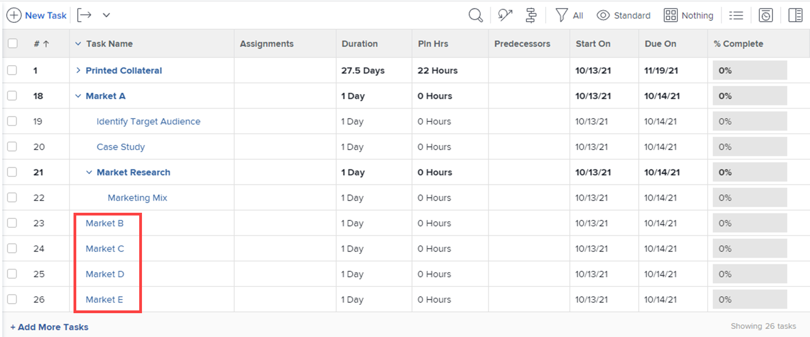

# Administrar un proyecto en la vista de Agile

{{preview-and-fast-release}}

<!--
Required plans, license types, and access

<table style="table-layout:auto"> 
 <col> 
 <col> 
 <tbody> 
  <tr> 
   <td> 
<a href="https://www.workfront.com/plans" target="_blank">Adobe Workfront Plan</a> 
 </td> 
   <td> 
Team, Pro, Business, or Enterprise 
 </td> 
  </tr> 
  <tr> 
   <td> 
Workfront License Type
 </td> 
   <td> 
Review, Work, or Plan 
 </td> 
  </tr> 
   <tr data-mc-conditions="QuicksilverOrClassic.Draft mode"> 
    <td> 
Permissions in the access model
 </td> 
    <td> <li>Edit access and ability to create reports, dashboards, and calendars</li> </td> 
   </tr>
 </tbody> 
</table>
-->

Puede aprovechar la funcionalidad Agile para su proyecto sin los desafíos administrativos que normalmente acompañan a las prácticas Agile (como administrar un registro de asuntos pendientes del equipo o crear iteraciones).

Si desea trabajar en un entorno Agile que utilice un registro de asuntos pendientes del equipo y le permita crear iteraciones a partir de las tareas del registro de asuntos pendientes, siga las instrucciones de [Trabajar en un entorno ágil](../../../agile/work-in-an-agile-environment/work-in-an-agile-environment.md).

## Requisitos de acceso

Debe tener el siguiente acceso para realizar los pasos de este artículo:

<table style="table-layout:auto"> 
 <col> 
 <col> 
 <tbody> 
  <tr> 
   <td role="rowheader">plan Adobe Workfront*</td> 
   <td> 
Cualquiera
 </td> 
  </tr> 
  <tr> 
   <td role="rowheader">Licencia de Adobe Workfront*</td> 
   <td> 
Revisar o superior
 </td> 
  </tr> 
  <tr> 
   <td role="rowheader">Configuraciones de nivel de acceso*</td> 
   <td> 
Edite el acceso a las siguientes áreas:
 
    <ul> 
     <li> 
Proyectos
 </li> 
     <li> 
Informes, paneles y calendarios
 </li> 
     <li> 
Filtros, vistas y agrupaciones
 </li> 
    </ul> 
Nota: Si sigue sin tener acceso, pregunte al administrador de Workfront si ha establecido restricciones adicionales en su nivel de acceso. Para obtener información sobre cómo un administrador de Workfront puede modificar su nivel de acceso, consulte <a href="../../../administration-and-setup/add-users/configure-and-grant-access/create-modify-access-levels.md" class="MCXref xref">Crear o modificar niveles de acceso personalizados</a>.
 </td> 
  </tr> 
  <tr> 
   <td role="rowheader">Permisos de objeto</td> 
   <td> 
Ver permisos del proyecto
 
Para obtener información sobre cómo solicitar acceso adicional, consulte <a href="../../../workfront-basics/grant-and-request-access-to-objects/request-access.md" class="MCXref xref">Solicitud de acceso a objetos </a>.
 </td> 
  </tr> 
 </tbody> 
</table>

&#42;Para saber qué plan, tipo de licencia o acceso tiene, póngase en contacto con su administrador de Workfront.

## Comprender los proyectos de Agile

>[!NOTE]
>
>Esta sección solo se aplica a la vista de Agile heredada, no a la vista de tablero de un proyecto.

* [Funcionalidad Agile en un proyecto](#agile-functionality-in-a-project)
* [Diferencias entre utilizar la vista de Agile en un proyecto y en una iteración](#differences-when-using-the-agile-view-on-a-project-versus-on-an-iteration)

### Funcionalidad Agile en un proyecto {#agile-functionality-in-a-project}

La siguiente funcionalidad Agile está disponible al administrar un proyecto en una vista Agile:

* Estado de finalización\
  Para obtener información más detallada sobre el estado de finalización, consulte [Resumen del estado de finalización de iteraciones](../../../agile/use-scrum-in-an-agile-team/burndown/iteration-completion-status-overview.md).

* Tablero de historias\
  Para obtener información más detallada sobre el guion gráfico, consulte la [Tablero Scrum](../../../agile/use-scrum-in-an-agile-team/scrum-board/scrum-board.md) sección.

Existen algunas diferencias entre utilizar las vistas de Agile en un proyecto y trabajar en un entorno Agile puro (con trabajos pendientes e iteraciones). Para obtener más información, consulte [Diferencias entre utilizar la vista de Agile en un proyecto y en una iteración](#differences-when-using-the-agile-view-on-a-project-versus-on-an-iteration) en este artículo.

### Diferencias entre utilizar la vista de Agile en un proyecto y en una iteración {#differences-when-using-the-agile-view-on-a-project-versus-on-an-iteration}

* [Las tareas y subtareas siguen diferentes reglas de visualización en el guion gráfico](#tasks-and-subtasks-follow-different-display-rules-on-the-story-board)
* [No se utilizan registros de pendientes e iteraciones](#backlogs-and-iterations-are-not-used)
* [El orden de las tareas se mantiene en la vista de Agile y no se puede reordenar](#task-order-is-maintained-in-the-agile-view-and-cannot-be-reordered)
* [Las tareas se miden solamente en horas planificadas](#tasks-are-measured-only-in-planned-hours)
* [No se utiliza el equipo Agile](#the-agile-team-is-not-used)
* [Cada usuario del proyecto puede ver el proyecto en una vista diferente de Agile](#each-user-on-the-project-can-view-the-project-in-a-different-agile-view)

#### Las tareas y subtareas siguen diferentes reglas de visualización en el guion gráfico {#tasks-and-subtasks-follow-different-display-rules-on-the-story-board}

* Las tareas que no tienen una tarea principal ni una subtarea se muestran siempre como una tarjeta de artículo único en el guion gráfico.\
  Por ejemplo, estas tareas aparecen de la siguiente manera en la vista de la lista de proyectos:

   Estas tareas aparecen de la siguiente manera en la vista Agile del proyecto:

  

* Las tareas principales que tienen subtareas siempre se muestran en la variable **Historias** del guion gráfico. Las subtareas se muestran en la barra de tareas de la tarea principal.\
  Por ejemplo, estas tareas aparecen de la siguiente manera en la vista de la lista de proyectos:

  \
  Estas tareas aparecen de la siguiente manera en la vista Agile del proyecto:

  

* Las subtareas de segundo nivel (subtareas de subtareas) se muestran como una tarjeta gris que se bloquea en la tarea principal inmediata.
* Las subtareas de tercer nivel (subtareas de subtareas de subtareas) nunca se muestran en el tablero de historias.

#### No se utilizan registros de pendientes e iteraciones {#backlogs-and-iterations-are-not-used}

Cuando se visualiza un proyecto en una vista Agile, no se utilizan los siguientes componentes Agile:

* **Registro de pendientes:** No se utiliza ningún registro de pendientes porque todas las tareas del proyecto se muestran automáticamente como historias.
* **Iteraciones:** En lugar de crear iteraciones para definir las fechas en que se realizará el trabajo, los días designados actualmente en la escala de tiempo del proyecto se convierten en días laborables.

#### El orden de las tareas se mantiene en la vista de Agile y no se puede reordenar {#task-order-is-maintained-in-the-agile-view-and-cannot-be-reordered}

El orden en que aparecen las tareas en un proyecto se mantiene cuando se ve el proyecto en un panel de historias Agile.

No se pueden reordenar las tareas del proyecto al verlo en una vista Agile. Dado que modificar el orden de las tareas puede afectar a otras tareas que pueden tener dependencias, debe ver el proyecto en una vista estándar para poder modificar el orden de las tareas.

#### Las tareas se miden solamente en horas planificadas {#tasks-are-measured-only-in-planned-hours}

Las tareas de un proyecto siempre se miden en horas planificadas.

En una iteración, las tareas (historias) se pueden medir en horas o puntos.

#### No se utiliza el equipo Agile {#the-agile-team-is-not-used}

Debido a que los equipos Agile completan el trabajo en las iteraciones que se les asignan, los equipos Agile no se utilizan al ver un proyecto en una vista Agile.

En su lugar, los usuarios del proyecto se convertirán esencialmente en el equipo Agile de ese proyecto.

#### Cada usuario del proyecto puede ver el proyecto en una vista diferente de Agile {#each-user-on-the-project-can-view-the-project-in-a-different-agile-view}

A diferencia de una iteración Agile, los usuarios de un proyecto pueden personalizar la vista Agile por sí mismos, mientras que otros usuarios utilizan una vista Agile diferente.

En una iteración Agile, la información disponible en el panel de historias Agile (como las columnas de estado disponibles) se determina en el nivel de equipo.

Para obtener información sobre cómo personalizar una vista Agile, consulte [Creación o personalización de una vista de Agile](../../../reports-and-dashboards/reports/reporting-elements/views-overview.md#customizing-an-agile-view) in [Información general sobre vistas en Adobe Workfront](../../../reports-and-dashboards/reports/reporting-elements/views-overview.md).

## Ver un proyecto en la vista de Agile

1. Vaya al proyecto que desee ver en una vista Agile, en la lista de tareas o en la lista de problemas.
1. Haga clic en **Tablero** icono .

   La vista de tablero del proyecto se muestra de forma predeterminada.

   

   <!--(Legacy agile view only) If you previously viewed the project in a custom agile view, the project is displayed in that view rather than in the default agile view.-->

1. (Opcional) Haga clic en **Configurar** para definir las opciones de las columnas y las tarjetas.

   Para obtener más información, consulte [Administrar columnas del tablero](/help/quicksilver/agile/get-started-with-boards/manage-board-columns.md) y [Personalizar los campos que se muestran en una tarjeta](/help/quicksilver/agile/get-started-with-boards/customize-fields-on-card.md). Tenga en cuenta que no puede definir directivas de columna en la vista de tablero de un proyecto.

1. (Opcional) Haga clic en **Usar Agile heredado** para utilizar la vista heredada de agile en lugar de la vista de tablero.

1. (Opcional: solo vista Agile heredada) Si ha creado una vista Agile personalizada, o si otro usuario ha creado una vista Agile personalizada y la ha compartido con usted, puede verla en lugar de la vista Agile predeterminada.

   Haga clic en **Ver** menú desplegable y, a continuación, haga clic en la vista de agile personalizada que desee ver.

   La vista Agile personalizada se utilizará la próxima vez que haga clic en **Agile** icono.

   Para obtener información sobre cómo crear una nueva vista Agile, consulte [Creación y personalización de vistas de Agile](#create-and-customize-agile-views).

   El proyecto se muestra en la vista Agile personalizada.

1. (Condicional: solo vista Agile heredada) Si las tareas del proyecto utilizan estados que no sean &quot;Nuevo&quot;, &quot;En curso&quot; o &quot;Completado&quot; (los estados predeterminados de la vista Agile), debe agregar los estados adicionales a la vista Agile para que se muestren todas las tareas de esos estados.

   Si las tareas están en un estado que no se muestra en el panel de historias Agile, la tarea en sí no se muestra en el panel de historias Agile (sin embargo, el porcentaje completado de estas tareas sigue contribuyendo al porcentaje completado de cualquier tarea principal y al porcentaje completado del proyecto general).

   Para agregar estados a la vista Agile, cree una nueva vista Agile o personalice una vista Agile existente, tal como se describe en la sección &quot;Crear o personalizar una vista Agile&quot; del artículo [Información general sobre vistas en Adobe Workfront](../../../reports-and-dashboards/reports/reporting-elements/views-overview.md).

1. (Opcional) Para volver a la vista de lista, haga clic en **Lista** icono.

## Creación y personalización de vistas de Agile {#create-and-customize-agile-views}

>[!NOTE]
>
>Esta sección solo se aplica a la vista de Agile heredada, no a la vista de tablero de un proyecto.

Al igual que con las vistas estándar en Workfront, puede personalizar las vistas Agile existentes o crear nuevas vistas Agile desde cero. A diferencia de las vistas estándar, no puede crear nuevas vistas de Agile basadas en las vistas de Agile existentes.

Para obtener más información sobre la creación y personalización de vistas de Agile, consulte la sección &quot;Crear o personalizar una vista de Agile&quot; en el artículo [Información general sobre vistas en Adobe Workfront](../../../reports-and-dashboards/reports/reporting-elements/views-overview.md).

## Compartir una vista de Agile existente

>[!NOTE]
>
>Esta sección solo se aplica a la vista de Agile heredada, no a la vista de tablero de un proyecto.

Para obtener información sobre cómo compartir una vista Agile, consulte [Compartir un filtro, una vista o una agrupación](../../../reports-and-dashboards/reports/reporting-elements/share-filter-view-grouping.md).

## Eliminar una vista de Agile existente

>[!NOTE]
>
>Esta sección solo se aplica a la vista de Agile heredada, no a la vista de tablero de un proyecto.

Para obtener información sobre cómo eliminar una vista, consulte la sección &quot;Eliminar una vista&quot; en el artículo [Información general sobre vistas en Adobe Workfront](../../../reports-and-dashboards/reports/reporting-elements/views-overview.md).
