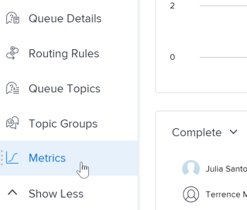

# Resumen de las métricas del proyecto

Las métricas de proyecto proporcionan una vista general en formato de gráfico sobre el rendimiento de un proyecto.

## Requisitos de acceso

<table style="table-layout:auto"> 
 <col> 
 <col> 
 <tbody> 
  <tr> 
   <td role="rowheader">plan de Workfront*</td> 
   <td> 
Cualquiera
 </td> 
  </tr> 
  <tr> 
   <td role="rowheader">Licencia de Workfront*</td> 
   <td> 
Revisar o superior 
 </td> 
  </tr> 
  <tr> 
   <td role="rowheader">Nivel de acceso*</td> 
   <td> 
Ver acceso a Proyectos
 
<b>NOTA</b>

Si todavía no tiene acceso, pregunte a su administrador de Workfront si establece restricciones adicionales en su nivel de acceso. Para obtener información sobre el acceso a los proyectos, consulte <a href="../../../administration-and-setup/add-users/configure-and-grant-access/grant-access-projects.md" class="MCXref xref">Concesión de acceso a proyectos</a>. Para obtener información sobre cómo un administrador de Workfront puede cambiar su nivel de acceso, consulte <a href="../../../administration-and-setup/add-users/configure-and-grant-access/create-modify-access-levels.md" class="MCXref xref">Crear o modificar niveles de acceso personalizados</a>. 
 </td>
</tr> 
  <tr> 
   <td role="rowheader">Permisos de objeto</td> 
   <td> 
Ver permisos de un proyecto
 
 Para obtener información sobre los permisos del proyecto, consulte <a href="../../../workfront-basics/grant-and-request-access-to-objects/share-a-project.md" class="MCXref xref">Uso compartido de un proyecto en Adobe Workfront</a>.
 
Para obtener información sobre la solicitud de acceso adicional, consulte <a href="../../../workfront-basics/grant-and-request-access-to-objects/request-access.md" class="MCXref xref">Solicitar acceso a objetos </a>.
 </td> 
  </tr> 
 </tbody> 
</table>

*Para saber qué plan, tipo de licencia o acceso tiene, póngase en contacto con el administrador de Workfront.

## Requisitos previos

Para acceder al área Métricas desde el panel izquierdo de un proyecto, debe:

* Habilite la opción Métricas del panel izquierdo en el área Proyectos de la plantilla de diseño.

   Para obtener información sobre cómo un administrador de Workfront o un administrador de grupos puede personalizar el panel izquierdo con una plantilla de diseño, consulte [Personalización del panel izquierdo mediante una plantilla de diseño](../../../administration-and-setup/customize-workfront/use-layout-templates/customize-left-panel.md).

## Descripción general del área Métricas del proyecto

Las métricas de proyecto proporcionan una visualización de lo que está sucediendo en un proyecto, lo que permite evaluar rápidamente las necesidades y el estado de un proyecto.

En el área Métricas , puede ver el estado general de un proyecto, así como:

* Donde el trabajo está activo o estancado
* ¿Quién tiene asignados elementos de trabajo abiertos?
* Detalles sobre tareas o problemas que están atrasados o próximos a la fecha de finalización planeada

También puede profundizar en cada gráfico para ver más detenidamente las tareas o los problemas de una categoría específica.

Para obtener más información sobre estas tareas o problemas, consulte [Ver detalles de métricas](#view-metrics-details).

>[!TIP]
>
>Para ver las métricas de un nivel superior de un grupo de proyectos dentro de un programa, portafolio, etc., vaya al área Análisis mejorado .\
>Para obtener más información sobre el análisis mejorado, consulte [Resumen de análisis mejorado](../../../enhanced-analytics/enhanced-analytics-overview.md).

## KPI de proyecto

Los indicadores de rendimiento clave (KPI) se muestran en la parte superior del área Métrica .

Estos KPI se dividen en las siguientes categorías:

| Tareas completadas | **Tareas completadas** muestra el número de tareas en estado Complete . Este número también incluye tareas que tienen un estado personalizado igual a Complete. |
|---|---|
| Tareas incompletas | **Tareas incompletas** muestra el número de tareas que no están en estado Completo o Cerrado o que coincide con Completado. |
| Tareas atrasadas | **Tareas atrasadas** muestra el número de tareas que han pasado la fecha de finalización planeada y que no están en estado completo o cerrado o que coincide con Complete o Closed. |
| Tareas totales | **Tareas totales** muestra el número total de tareas del proyecto. |

>[!TIP]
>
>Para mostrar una lista de elementos de trabajo para un KPI específico, haga clic en ese KPI. En esa lista, puede hacer clic en un elemento de trabajo específico para ver más detalles en una nueva ficha.\
>\
>Para obtener más información, consulte [Ver detalles de métricas](#view-metrics-details).

## Gráfico de barras de problemas o tareas

En el gráfico de barras que aparece debajo de los KPI del proyecto, puede ver el estado o la prioridad de los elementos de trabajo del proyecto. La vista de tareas está seleccionada de forma predeterminada.

Cuando el estado está seleccionado en este gráfico, puede ver todos los estados de las tareas o problemas en un proyecto. Cada estado se agrupa en una barra del gráfico. En este gráfico se muestran todos los estados predeterminados del sistema y los estados personalizados.

Cuando se selecciona la prioridad en este gráfico, puede ver todas las prioridades de tareas o problemas en un proyecto.

>[!TIP]
>
>Para mostrar una lista de elementos de trabajo con un estado o prioridad específicos, haga clic en una barra del gráfico. En esa lista, puede hacer clic en un elemento de trabajo específico para ver más detalles en una nueva ficha.\
>\
>Para obtener más información, consulte [Ver detalles de métricas](#view-metrics-details).

## Gráfico circular

El gráfico circular situado debajo de los KPI del proyecto le permite observar la proporción de elementos de trabajo completados frente a elementos de trabajo incompletos en un proyecto.

En el menú desplegable situado encima del gráfico, puede seleccionar:

| Todas las tareas | Selección **tasks** muestra el número total de tareas del proyecto, así como la relación entre las tareas completadas y las incompletas. |
|---|---|
| Todos los problemas | Selección **problemas** muestra el número total de problemas en el proyecto, así como la relación entre los problemas completados e incompletos. |

>[!TIP]
>
>Para mostrar una lista de elementos de trabajo completados o incompletos, haga clic en esa sección en el gráfico circular. En esa lista, puede hacer clic en un elemento de trabajo específico para ver más detalles en una nueva ficha.\
>\
>Para obtener más información, consulte [Ver detalles de métricas](#view-metrics-details).

## Gráfico de barras asignado

El gráfico de barras de usuario asignado muestra la cantidad de tareas asignadas a cada persona del proyecto. Este número varía en función de la categoría que seleccione en el menú desplegable.

Puede elegir consultar las asignaciones de tareas de un proyecto en las siguientes categorías:

| Finalizado | Selección **Completar** muestra el número de tareas asignadas a cada usuario que se han completado. |
|---|---|
| Incompleto | Selección **Incompleto** muestra el número de tareas asignadas a cada usuario que aún no se han completado. |
| Próximamente | Selección **Próximos** muestra el número de tareas asignadas a cada usuario que aún no ha alcanzado la fecha de inicio planeada. |
| Vencido sin pagar | Selección **Vencido** muestra el número de tareas asignadas a cada usuario que han pasado la fecha de finalización planeada y que aún no se han completado. |

>[!TIP]
>
>Para mostrar una lista de elementos de trabajo de la categoría seleccionada que están asignados a un usuario específico, haga clic en la barra situada junto al nombre del usuario en el gráfico. En esa lista, puede hacer clic en un elemento de trabajo específico para ver más detalles en una nueva ficha.\
>\
>Para obtener más información, consulte [Ver detalles de métricas](#view-metrics-details).

## Ver detalles de métricas {#view-metrics-details}

Puede interactuar con los gráficos del área Métricas para ver diferentes aspectos de un gráfico o ver más de cerca las tareas y los problemas dentro de un gráfico.

1. Vaya al proyecto para el que desee ver las métricas.
1. En el panel izquierdo, haga clic en **Mostrar más** para mostrar más secciones, haga clic en **Métricas**.\
   Los gráficos del área Métrica muestran información de las tareas de forma predeterminada.\
   

1. (Condicional) Si aparece una flecha desplegable en un gráfico, haga clic en el botón **Flecha desplegable** icono  en el gráfico y seleccione la opción que desee en el menú .\
   Para obtener más información sobre las opciones que aparecen en los menús de cada gráfico, consulte la sección correspondiente anterior.

1. (Opcional) Para ver más detenidamente las tareas o los problemas de cualquier métrica en la página, haga lo siguiente:

   1. Haga clic en el elemento (como tareas asignadas a un usuario específico, problemas con una prioridad alta o todas las tareas atrasadas) para el que desee ver los detalles.

      Se muestra una lista de tareas o problemas.

      

   1. Utilice las flechas de la parte inferior de la lista para localizar la tarea o el problema que desee ver.

      O

      Seleccione un número específico para mostrar las tareas o los problemas en una página específica.

      

   1. Seleccione una tarea o un problema para ver más detalles.

      La tarea o el problema se abre en una nueva pestaña.

1. (Opcional) Para exportar el tablero de métricas del proyecto a un archivo .png , haga clic en el **Exportar** icono y, a continuación, seleccione **Exportar como PNG** en el menú desplegable.

   >[!TIP]
   >
   >Al exportar el tablero, el archivo exportado solo incluye lo que se muestra actualmente en la ventanilla. Para incluir ciertas cosas en el archivo exportado, es posible que tenga que desplazarse hacia arriba o hacia abajo en la página o ajustar la configuración de zoom del explorador.
