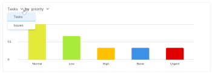

# Comprender las métricas del proyecto

Las métricas del proyecto proporcionan una vista general en formato de gráfico sobre el rendimiento de un proyecto.

## Requisitos de acceso

+++ Expanda para ver los requisitos de acceso para la funcionalidad en este artículo. 

<table style="table-layout:auto"> 
 <col> 
 <col> 
 <tbody> 
  <tr> 
   <td role="rowheader">Paquete de Adobe Workfront</td> 
   <td> 
Cualquiera
 </td> 
  </tr> 
  <tr> 
   <td role="rowheader">Licencia de Adobe Workfront</td> 
   <td> 
Ligero o superior

   
Revisión o superior
 </td> 
  </tr> 
  <tr> 
   <td role="rowheader">Configuraciones de nivel de acceso</td> 
   <td> 
Ver acceso a proyectos
  </td> 
  </tr> 
  <tr> 
   <td role="rowheader">Permisos de objeto</td> 
   <td> 
Ver permisos de un proyecto
 </td> 
  </tr> 
 </tbody> 
</table>

*Para obtener más información, consulte [Requisitos de acceso en la documentación de Workfront](/help/quicksilver/administration-and-setup/add-users/access-levels-and-object-permissions/access-level-requirements-in-documentation.md).

+++

<!--Old:

<table style="table-layout:auto"> 
 <col> 
 <col> 
 <tbody> 
  <tr> 
   <td role="rowheader">Workfront plan</td> 
   <td> 
Any
 </td> 
  </tr> 
  <tr> 
   <td role="rowheader">Workfront license*</td> 
   <td> 
New: Light or higher 

   
Current: Review or higher 
 </td> 
  </tr> 
  <tr> 
   <td role="rowheader">Access level configuration</td> 
   <td> 
View access to Projects
  </td> 
  </tr> 
  <tr> 
   <td role="rowheader">Object permissions</td> 
   <td> 
View permissions to a project
 </td> 
  </tr> 
 </tbody> 
</table>-->

## Requisitos previos

Para acceder al área Métricas desde el panel izquierdo de un proyecto, debe:

* Tener habilitada la opción Métricas del panel de la izquierda, en el área Proyectos de la plantilla de diseño.

  Para obtener información sobre cómo un administrador de Workfront o un administrador de grupos puede personalizar el panel izquierdo con una plantilla de diseño, consulte [Personalizar el panel izquierdo con una plantilla de diseño](../../../administration-and-setup/customize-workfront/use-layout-templates/customize-left-panel.md).

## Información general del área Métricas del proyecto

Las métricas del proyecto le proporcionan una visualización de lo que está sucediendo en un proyecto, lo que le permite evaluar rápidamente las necesidades y el estado de un proyecto. 

En el área Métricas, puede ver el estado general de un proyecto, así como:

* Dónde el trabajo está activo o paralizado
* Quién tiene elementos de trabajo abiertos asignados
* Detalles sobre tareas o problemas que han vencido o que están cerca de la fecha planificada de finalización

También puede explorar en profundidad cada gráfico para ver con más detalle las tareas o problemas de una categoría específica.

Para obtener más información sobre cómo ver estas tareas o problemas, consulte [Ver detalles de métricas](#view-metrics-details).

<!--this was deprecated: 
>[!TIP]
>
>To see metrics at a higher level for a group of projects within a program, portfolio, etc., navigate to the Enhanced analytics area.  
>To learn more about Enhanced analytics, see [Enhanced analytics overview](../../../enhanced-analytics/enhanced-analytics-overview.md).-->

## KPI de proyecto

Los indicadores clave de rendimiento (KPI) se muestran en la parte superior del área Métricas.

Estos KPI se dividen en las siguientes categorías:

| Tareas completadas | **Tareas completadas** muestra el número de tareas en estado Completado. Este número también incluye las tareas con un estado personalizado que equivale a Completado. |
|---|---|
| Tareas incompletas | **Tareas incompletas** muestra el número de tareas que no se encuentran en estado Completado o Cerrado, o un estado equivalente a Completado. |
| Tareas vencidas | **Tareas vencidas** muestra el número de tareas que han pasado la Fecha planificada de finalización y no están en estado Completado ni Cerrado, o tienen un estado equivalente a Completado o Cerrado. |
| Tareas totales | **Tareas totales** muestra el número total de tareas del proyecto. |

>[!TIP]
>
>Para mostrar una lista de elementos de trabajo para un KPI específico, haga clic en ese KPI. En esa lista, puede hacer clic en un elemento de trabajo específico para ver más detalles en una pestaña nueva.\
>\
>Para obtener más información, consulte [Ver detalles de métricas](#view-metrics-details).

## Gráfico de barras de tareas o problemas

En el gráfico de barras que aparece debajo de los KPI del proyecto, puede ver el estado o la prioridad de los elementos de trabajo del proyecto. La vista de tareas está seleccionada de forma predeterminada.

Cuando se selecciona el estado en este gráfico, puede ver todos los estados de las tareas o problemas de un proyecto. Cada estado se agrupa en una barra del gráfico. En este gráfico se muestran todos los estados del sistema, los predeterminados y los personalizados.

Cuando se selecciona la prioridad en este gráfico, puede ver todas las prioridades de las tareas o problemas de un proyecto.

>[!TIP]
>
>Para mostrar una lista de elementos de trabajo con un estado o prioridad específicos, haga clic en una barra del gráfico. En esa lista, puede hacer clic en un elemento de trabajo específico para ver más detalles en una pestaña nueva.\
>\
>Para obtener más información, consulte [Ver detalles de métricas](#view-metrics-details).

## Gráfico de anillo

El gráfico de anillo situado debajo de los KPI del proyecto le permite ver la relación de elementos de trabajo completados frente a elementos de trabajo incompletos en un proyecto.

En el menú desplegable situado encima del gráfico, puede seleccionar:

| Todas las tareas | Al seleccionar **tareas**, se muestra el número total de tareas del proyecto, así como la relación entre las tareas completadas y las incompletas. |
|---|---|
| Todos los problemas | Al seleccionar **problemas**, se muestra el número total de problemas del proyecto, así como la relación entre los problemas completados y los incompletos. |

>[!TIP]
>
>Para mostrar una lista de los elementos de trabajo completados o incompletos, haga clic en esa sección del gráfico de anillo. En esa lista, puede hacer clic en un elemento de trabajo específico para ver más detalles en una pestaña nueva.\
>\
>Para obtener más información, consulte [Ver detalles de métricas](#view-metrics-details).

## Gráfico de barras de usuario asignado

El gráfico de barras de usuarios asignados muestra el número de tareas asignadas a cada persona del proyecto. Este número varía en función de la categoría que seleccione en el menú desplegable.

Puede elegir ver las asignaciones de tareas de un proyecto en las siguientes categorías:

| Completar | Al seleccionar **Completado** se muestra el número de tareas asignadas a cada usuario que se han completado. |
|---|---|
| Incompletas | Al seleccionar **Incompleto** se muestra el número de tareas asignadas a cada usuario que aún no se han completado. |
| Próximamente | Al seleccionar **Próximamente** se muestra el número de tareas asignadas a cada usuario que aún no han alcanzado la fecha de inicio planificada. |
| Vencido sin pagar | Al seleccionar **Vencido** se muestra el número de tareas asignadas a cada usuario que han pasado la fecha planificada de finalización y que aún no se han completado. |

>[!TIP]
>
>Para mostrar una lista de los elementos de trabajo de la categoría seleccionada que están asignados a un usuario específico, haga clic en la barra situada junto al nombre del usuario en el gráfico. En esa lista, puede hacer clic en un elemento de trabajo específico para ver más detalles en una pestaña nueva.\
>\
>Para obtener más información, consulte [Ver detalles de métricas](#view-metrics-details).

## Ver detalles de métricas {#view-metrics-details}

Puede interactuar con los gráficos en el área Métricas para ver diferentes aspectos de un gráfico o ver con más detalle las tareas y problemas incluidos en un gráfico.

1. Vaya al proyecto cuyas métricas desee ver.
1. En el panel izquierdo, haga clic en **Métricas**.\
   Los gráficos del área Métricas muestran información sobre las tareas de forma predeterminada.\
   

1. (Condicional) Si aparece una flecha desplegable en un gráfico, haga clic en el icono **flecha desplegable**  del gráfico y seleccione la opción que desee en el menú.\
   Para obtener información sobre las opciones que aparecen en los menús de cada gráfico, consulte la sección correspondiente más arriba.

1. (Opcional) Para examinar con más detalle las tareas o problemas de cualquier métrica de la página, haga lo siguiente:

   1. Haga clic en el elemento (como las tareas asignadas a un usuario específico, los problemas con prioridad alta o todas las tareas vencidas) cuyos detalles desee ver.

      Se muestra una lista de tareas o problemas.

      

   1. Utilice las flechas de la parte inferior de la lista para localizar la tarea o el problema que desea ver.

      O

      Seleccione un número específico para ver las tareas o problemas de una página específica.

      

   1. Seleccione una tarea o problema para ver más detalles.

      La tarea o el problema se abre en una nueva pestaña.

1. (Opcional) Para exportar el panel de métricas del proyecto a un archivo .png, haga clic en el icono **Exportar**  y, a continuación, seleccione **Exportar como PNG** en el menú desplegable.

   >[!TIP]
   >
   >Al exportar el panel de control, el archivo exportado incluye solo lo que se muestra actualmente en la vista general. Para incluir determinados elementos en el archivo exportado, es posible que tenga que desplazarse hacia arriba o hacia abajo de la página o ajustar la configuración del Zoom del explorador.
