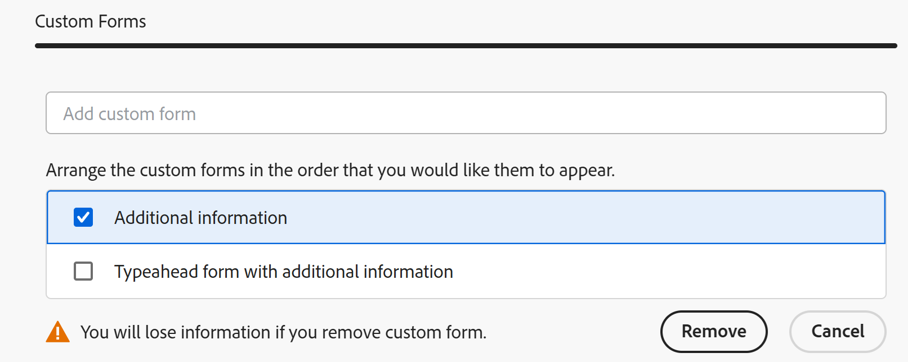

# Guardar un proyecto como plantilla

<!--Audited: 6/2025-->

<!--

(NOTE: Keep this the way it is in the Managing Projects area because the functionality in the UI is "Save as template" at the project level, so users see that in the UI; there is another article that this links to which is more in depth (step-by-step). This functionality needs to stay in both projects AND templates areas.)

-->

<!--

The highlighted information on this page refers to functionality not yet generally available. It is available only in the Preview environment for all customers. The same features will also be available in the Production environment for all customers after a week from the Preview release.     

For more information, see [Interface modernization](/help/quicksilver/product-announcements/product-releases/interface-modernization/interface-modernization.md). 

-->

Si decide que un proyecto se va a repetir en algún momento futuro, puede crear una plantilla a partir de ese proyecto existente. En adelante, puede volver a utilizar la plantilla para crear proyectos futuros que puedan contener información similar o que puedan compartir la misma cronología o asignaciones con el proyecto existente.

## Requisitos de acceso

+++ Expanda para ver los requisitos de acceso para la funcionalidad en este artículo. 

<table style="table-layout:auto"> 
 <col> 
 <col> 
 <tbody> 
  <tr> 
   <td role="rowheader">Paquete de Adobe Workfront</td> 
   <td> 
Cualquiera
 </td> 
  </tr> 
  <tr> 
   <td role="rowheader">Licencia de Adobe Workfront</td> 
   <td> 
Estándar

   
Plan
 
   </td> 
  </tr> 
  <tr> 
   <td role="rowheader">Configuraciones de nivel de acceso</td> 
   <td> 
Acceso de edición a las plantillas
 /td&gt; 
  </tr> 
  <tr> 
   <td role="rowheader">Permisos de objeto</td> 
   <td> 
Permisos Ver o superiores para un proyecto 
 
Los permisos de administración se obtienen en la plantilla después de guardar el proyecto como plantilla
 </td> 
  </tr> 
 </tbody> 
</table>

Para obtener más información, consulte [Requisitos de acceso en la documentación de Workfront](/help/quicksilver/administration-and-setup/add-users/access-levels-and-object-permissions/access-level-requirements-in-documentation.md).

+++

<!--Old:

<table style="table-layout:auto"> 
 <col> 
 <col> 
 <tbody> 
  <tr> 
   <td role="rowheader">Adobe Workfront plan</td> 
   <td> 
Any 
 </td> 
  </tr> 
  <tr> 
   <td role="rowheader">Adobe Workfront license*</td> 
   <td> 
New: Standard 

   Or 
   
Current: Plan 
 
   </td> 
  </tr> 
  <tr> 
   <td role="rowheader">Access level configurations</td> 
   <td> 
Edit access to Templates
 /td> 
  </tr> 
  <tr> 
   <td role="rowheader">Object permissions</td> 
   <td> 
View or higher permissions to a project 
 
You obtain Manage permissions to the template after you save the project as a template
 </td> 
  </tr> 
 </tbody> 
</table>-->

## Guardar un proyecto como plantilla

<!--
Saving a project as a template differs in the Production and the Preview environments. 

### Save a project as a template in the Production environment

1. Go to the project that you want to save as a template. 
1. Click the **More** menu , then **Save as Template**. 
1. Specify the following information for the template:

   <table style="table-layout:auto"> 
    <col> 
    <col> 
    <tbody> 
     <tr> 
      <td role="rowheader">Name</td> 
      <td>Specify a name for the template.</td> 
     </tr> 
     <tr> 
      <td role="rowheader">Description</td> 
      <td>Provide a description for the template.</td> 
     </tr> 
     <tr> 
      <td role="rowheader">Is Active</td> 
      <td> 
Select from the following options:
 
       <ul> 
        <li> 
<strong>Yes</strong>: Other users can find the template and attach it to projects.
 </li> 
        <li><strong>No</strong>: Other users cannot find the template and cannot attach it to projects.</li> 
       </ul> </td> 
     </tr> 
     <tr> 
      <td role="rowheader">Custom Forms</td> 
      <td>Use the drop-down list to select any custom forms to attach to the template. If any custom forms have already been associated with the project, all of the data fields from those custom forms are displayed. You can include up to 10 custom forms on a single template.</td> 
     </tr> 
    </tbody> 
   </table>

1. Click **Manage Forms** to remove or reorder the forms. For information about how to remove and reorder custom forms on the template, see [Custom forms](../../../administration-and-setup/customize-workfront/create-manage-custom-forms/create-and-manage-custom-forms.md).

   

1. Click **Next Step.**
1. In the **Options** section, select the checkbox beside any information you want to clear from the template.

   

1. Click **Next Step.**
1. In the **Exclude** section, select any tasks that you want to exclude from the project.

   

1. Click **Finish and Save Template.**

   Your template now appears in the list of available templates and can either be attached to an existing project or used to create a new one.

### Save a project as a template in the Preview environment

-->

1. Vaya al proyecto que desee guardar como plantilla.
1. Haga clic en el icono **Más** del menú  a la derecha del nombre del proyecto en el encabezado y, a continuación, **Guardar como plantilla**.
1. En la sección **Guardar como plantilla**, especifique la siguiente información para la plantilla:

   <table style="table-layout:auto"> 
    <col> 
    <col> 
    <tbody> 
     <tr> 
      <td role="rowheader">Nombre de plantilla</td> 
      <td>Especifique un nombre para la plantilla.</td> 
     </tr> 
     <tr> 
      <td role="rowheader">Descripción</td> 
      <td>Proporcione una descripción para la plantilla.</td> 
     </tr> 
     <tr> 
      <td role="rowheader">Activo</td> 
      <td> 
Seleccione entre las siguientes opciones:
 
       <ul> 
        <li> 
<strong>Sí</strong>: otros usuarios pueden encontrar la plantilla y adjuntarla a proyectos.
 </li> 
        <li><strong>No</strong>: otros usuarios no pueden encontrar la plantilla ni adjuntarla a proyectos.</li> 
       </ul> </td> 
     </tr> 
     <tr> 
      <td role="rowheader">Formularios personalizados</td> 
      <td>Utilice la lista desplegable para seleccionar cualquier formulario personalizado que desee adjuntar a la plantilla. Si ya se han asociado formularios personalizados al proyecto, se muestran todos los campos de datos de esos formularios personalizados. Puede incluir hasta 10 formularios personalizados en una misma plantilla.</td> 
     </tr> 
    </tbody> 
   </table>

1. Haga clic en **Forms personalizado** en el panel izquierdo para quitar o reordenar los formularios.

   Para reordenar los formularios, arrástrelos y suéltelos en el orden correcto.
Para quitar un formulario, selecciónelo y haga clic en **Quitar**. Haga clic en **Cancelar** para quitar los formularios seleccionados.

   

1. Actualice la información en los formularios personalizados adjuntos si es necesario. La información se transferirá a la plantilla.

1. Haga clic en **Opciones** en el panel izquierdo y, a continuación, active la casilla de verificación situada junto a la información que desee transferir a la plantilla. Los elementos no seleccionados no se transfieren a la plantilla. De forma predeterminada, todas las opciones no están seleccionadas.

   

1. Haga clic en **Excluir** en el panel izquierdo y, a continuación, seleccione las tareas que desee excluir del proyecto. De forma predeterminada, todas las tareas no están seleccionadas.

   

1. Haga clic en **Finalizar y guardar plantilla** en la esquina superior derecha de la pantalla.

   La plantilla ahora aparece en la lista de plantillas disponibles y se puede adjuntar a un proyecto existente o utilizarse para crear uno nuevo.

