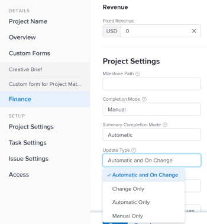

# Seleccionar el tipo de actualización del proyecto

Al seleccionar un Tipo de actualización para un proyecto, puede controlar la frecuencia con la que los cambios realizados en la cronología del proyecto se guardan en las tareas principales o en el proyecto.

Cuando se actualiza la cronología del proyecto, se vuelve a calcular en función de los cambios realizados en el proyecto, sus tareas o los cambios realizados en otro proyecto del que depende la cronología.

Por ejemplo, los siguientes cambios en las tareas del déclencheur del proyecto pueden actualizar la cronología del proyecto:

* Actualizar las fechas de las tareas
* Cambiar relaciones de predecesoras de tareas
* Cambie las relaciones principal-secundario, añadiendo o quitando asignaciones además de cambiar la restricción de tarea o el tipo de duración.

## Requisitos de acceso

+++ Expanda para ver los requisitos de acceso para la funcionalidad en este artículo. 

<table style="table-layout:auto"> 
 <col> 
 <col> 
 <tbody> 
  <tr> 
   <td role="rowheader">Paquete de Adobe Workfront</td> 
   <td> 
Cualquiera
 </td> 
  </tr> 
  <tr> 
   <td role="rowheader">Licencia de Adobe Workfront</td> 
   <td>
Estándar
 
   
Plan
 </td> 
  </tr> 
  <tr> 
   <td role="rowheader">Configuraciones de nivel de acceso</td> 
   <td> 
Acceso de edición a proyectos
 </td> 
  </tr> 
  <tr> 
   <td role="rowheader">Permisos de objeto</td> 
   <td> 
Administración de permisos en un proyecto
 </td> 
  </tr> 
 </tbody> 
</table>

Para obtener más información, consulte [Requisitos de acceso en la documentación de Workfront](/help/quicksilver/administration-and-setup/add-users/access-levels-and-object-permissions/access-level-requirements-in-documentation.md).

+++

## Actualizar el tipo de actualización de un proyecto

Cuando se actualizan las tareas, sus objetos principales (tareas principales o el proyecto) se actualizan en el momento indicado por el Tipo de actualización.  Para especificar un Tipo de actualización para el proyecto:

1. Vaya al proyecto cuyo tipo de actualización desea especificar.
1. Haga clic en el menú Más  junto al nombre del proyecto y, a continuación, haga clic en **Editar** .

1. Haga clic en **Proyecto** **Configuración**.

   

1. En el campo **Tipo de actualización**, seleccione si desea que Workfront calcule la cronología del proyecto automáticamente a diario, cuando haya un cambio o si desea que el administrador ddel proyecto la calcule manualmente.

   Seleccione entre las opciones de la lista siguiente.

   >[!IMPORTANT]
   >
   >Si la cronología de un proyecto supera los 15 años, Workfront no calcula la cronología automáticamente o al cambiar. El tipo de actualización de un proyecto de más de 15 años siempre es manual.

   * **Automático y al cambiar:** Esta es la configuración predeterminada. La cronología del proyecto se actualiza cada vez que se produce un cambio en el proyecto o en otro proyecto del que depende la cronología. La cronología del proyecto también se actualiza cada noche.\
     Esta es la configuración recomendada, ya que garantiza que la cronología del proyecto siempre esté actualizada.

     Al actualizar una tarea o el proyecto y activar un recálculo de la cronología, se muestran inmediatamente todas las fechas disponibles, lo que le permite continuar trabajando. En proyectos con más de 100 tareas, las fechas que requieren cálculos más largos se atenúan.

     

     Esto indica que el recálculo aún no ha finalizado y que las fechas están sujetas a cambios.

   * **Solo cambio:** La escala de tiempo del proyecto se actualiza cada vez que se produce un cambio en el proyecto o en otro proyecto del que depende la escala de tiempo; no se producen actualizaciones programadas.\
     Es posible que desee seleccionar esta opción si le preocupa el rendimiento del sistema y si los cambios rara vez se producen en el proyecto o en otros proyectos de los que depende la escala de tiempo.

   * **Solo automático:** La escala de tiempo del proyecto se actualiza cada noche; no se actualiza inmediatamente después de realizar los cambios.\
     Es posible que desee seleccionar esta opción si le preocupa el rendimiento del sistema y si se producen muchos cambios cada día en el proyecto o en otros proyectos de los que depende la cronología.

     >[!NOTE]
     >
     >Un proyecto no se recalcula automáticamente cada noche si se encuentra en estado de Planificación. Solo se recalcula al cambiar.

   * **Solo manual:** La escala de tiempo del proyecto solo se actualiza cuando selecciona la opción **Volver a calcular escalas de tiempo**, tal como se describe en la sección &quot;Recalculación manual&quot; del artículo [Volver a calcular escalas de tiempo del proyecto](../../../manage-work/projects/manage-projects/recalculate-project-timeline.md).\
     Es posible que desee seleccionar esta opción si realiza muchos cambios en el proyecto al mismo tiempo y desea que el cálculo de la escala de tiempo se produzca después de realizar todos los cambios (en lugar de después de cada cambio individual).

1. Haga clic en **Guardar**.
