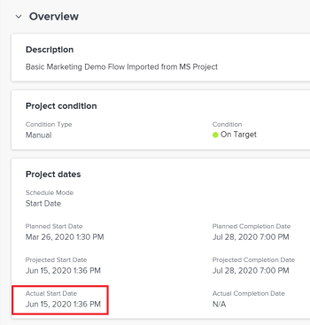

# Información general sobre la fecha real de inicio del proyecto

Los proyectos, las tareas y los problemas tienen una fecha de inicio real en Adobe Workfront. En el caso de las tareas y los problemas, es la fecha en la que se han marcado como En curso. En el caso de los proyectos, es la fecha en la que la primera tarea del proyecto se marca como En curso o que se ha completado.

## Requisitos de acceso

+++ Expanda para ver los requisitos de acceso para la funcionalidad en este artículo. 

<table style="table-layout:auto"> 
 <col> 
 <col> 
 <tbody> 
  <tr> 
   <td role="rowheader">Paquete de Adobe Workfront</td> 
   <td> 
Cualquiera
 </td> 
  </tr> 
  <tr> 
   <td role="rowheader">Licencia de Adobe Workfront</td> 
   <td>
Ligero o superior
 
   
Revisión o superior
 </td> 
  </tr> 
  <tr> 
   <td role="rowheader">Configuraciones de nivel de acceso</td> 
   <td> 
Acceso de visualización o superior a los proyectos
  </td> 
  </tr> 
  <tr> 
   <td role="rowheader">Permisos de objeto</td> 
   <td> 
Permisos Ver o superiores para un proyecto
  </td> 
  </tr> 
 </tbody> 
</table>

Para obtener más información, consulte [Requisitos de acceso en la documentación de Workfront](/help/quicksilver/administration-and-setup/add-users/access-levels-and-object-permissions/access-level-requirements-in-documentation.md).

+++

<!--Old:

<table style="table-layout:auto"> 
 <col> 
 <col> 
 <tbody> 
  <tr> 
   <td role="rowheader">Adobe Workfront plan*</td> 
   <td> 
Any
 </td> 
  </tr> 
  <tr> 
   <td role="rowheader">Adobe Workfront license*</td> 
   <td> 
Review or higher
 </td> 
  </tr> 
  <tr> 
   <td role="rowheader">Access level configurations*</td> 
   <td> 
View or higher access to Projects
 
Note: If you still don't have access, ask your Workfront administrator if they set additional restrictions in your access level. For information on how a Workfront administrator can modify your access level, see <a href="../../../administration-and-setup/add-users/configure-and-grant-access/create-modify-access-levels.md" class="MCXref xref">Create or modify custom access levels</a>.
 </td> 
  </tr> 
  <tr> 
   <td role="rowheader">Object permissions</td> 
   <td> 
View or higher permissions to a project
 
For information on requesting additional access, see <a href="../../../workfront-basics/grant-and-request-access-to-objects/request-access.md" class="MCXref xref">Request access to objects </a>.
 </td> 
  </tr> 
 </tbody> 
</table>-->

## Consideraciones sobre las fechas de inicio reales en Workfront

* La fecha de inicio real se encuentra en la sección Detalles de proyectos, tareas y problemas.
* La fecha real de inicio de un proyecto, tarea o problema no se rellena al crear estos elementos.
* La fecha real de inicio se rellena cuando el trabajo comienza realmente en el proyecto, tarea o problema.
* La Fecha real de inicio no aparece en la ficha Detalles del proyecto si el trabajo en el proyecto aún no ha comenzado.

  La Fecha real de inicio se muestra en blanco en las fichas Detalles de tarea y Detalles del problema si el trabajo aún no ha comenzado en ellas.

* Puede modificar manualmente la fecha de inicio real de una tarea o un problema, pero no puede modificar la fecha de inicio real de un proyecto.

## Consideraciones sobre las fechas de inicio reales de los proyectos

* Workfront establece automáticamente la fecha real de un proyecto cuando se produce cualquiera de las siguientes situaciones:

   * Una persona asignada a una tarea cambia el estado de una tarea de *Nuevo* a cualquier otro estado que no sea igual a *Nuevo*.

   * Una persona asignada a una tarea cambia el porcentaje completado de una tarea.

     >[!IMPORTANT]
     >
     >La fecha real de inicio del proyecto no se completa cuando el proyecto se marca como Actual. El trabajo real debe comenzar en las tareas del proyecto antes de que se rellene la Fecha real de inicio del proyecto.

     En estos casos, la fecha de inicio real del proyecto se establece en la fecha y la hora en que se produjeron estas acciones para la primera tarea del proyecto. Esto indica que el proyecto comenzó realmente en esta fecha y a esta hora.

## Buscar la fecha real de inicio de un proyecto

Puede localizar la fecha real de inicio de un proyecto en las áreas siguientes:

* En la sección Detalles de un proyecto.
* En un informe o vista de proyecto, cuando se agrega la fecha de inicio real del objeto Proyecto en el informe.

  Para obtener información sobre la creación de informes, consulte el artículo [Crear un informe personalizado](../../../reports-and-dashboards/reports/creating-and-managing-reports/create-custom-report.md).

Para localizar la fecha de inicio real en la sección Detalles del proyecto:

{{step1-to-projects}}

1. Haga clic en el proyecto cuya fecha de inicio real desea ver.
1. Haga clic en **Detalles del proyecto** en el panel izquierdo y, a continuación, vaya a la sección **Información general**.

   La fecha de inicio real se muestra junto con otras fechas del proyecto.

   

