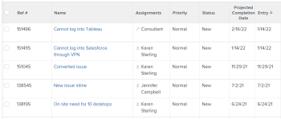

# Información general sobre la fecha proyectada de finalización de proyectos, tareas y problemas

<!-- Audited: 11/2025 -->

La fecha proyectada de finalización es un indicador calculado en tiempo real de cuándo se completará el proyecto, la tarea o el problema. Cuando el proyecto, tarea o problema se marca como Completado, la fecha proyectada de finalización cambia a la fecha real de finalización.

En las secciones siguientes se describe cómo se determina la fecha proyectada de finalización de los proyectos, las tareas y los problemas, y cómo localizarla.

## Requisitos de acceso

+++ Expanda para ver los requisitos de acceso para la funcionalidad en este artículo. 

<table style="table-layout:auto"> 
 <col> 
 <col> 
 <tbody> 
  <tr> 
   <td role="rowheader">paquete de Adobe Workfront</td> 
   <td> 
Cualquiera
 </td> 
  </tr> 
  <tr> 
   <td role="rowheader">Licencia de Adobe Workfront</td> 
   <td> 
   <ul><li>
Colaborador o superior para ver la fecha proyectada de finalización en un informe
</li> <li>
Una licencia estándar para crear un informe
</li> </ul>
   O
   <ul><li>
Revisión o superior para ver la fecha proyectada de finalización en un informe
</li> 
   <li>
Una licencia Plan para crear un informe
 </li></ul>
      </td> 
  </tr> 
  <tr> 
   <td role="rowheader">Nivel de acceso</td> 
   <td> 
Acceso de visualización o superior a los proyectos
 
Editar el acceso a Informes, Tableros y Calendarios para crear un informe
 
Editar el acceso a filtros, vistas y agrupaciones para crear un informe o modificar una vista de lista
  </td> 
  </tr> 
  <tr> 
   <td role="rowheader">Permisos de objeto</td> 
   <td> 
Permisos Ver o superiores para un proyecto
 </td> 
  </tr> 
 </tbody> 
</table>

Para obtener más información, consulte [Requisitos de acceso en la documentación de Workfront](/help/quicksilver/administration-and-setup/add-users/access-levels-and-object-permissions/access-level-requirements-in-documentation.md).

+++

## Cómo determina Adobe Workfront la fecha proyectada de finalización

La fecha proyectada de finalización es un campo calculado y no se puede cambiar manualmente.

Los criterios utilizados para determinar la fecha proyectada de finalización difieren según el objeto que visualice:

* **Proyectos:** la fecha proyectada de finalización de los proyectos es igual a la fecha proyectada de finalización de la última tarea del proyecto.

  Por ejemplo, un porcentaje completado superior aproxima la fecha completada proyectada de la tarea al día actual. Si el estado de la tarea es Nuevo y la fecha planificada de finalización de la tarea está próxima o ha pasado, la fecha proyectada de finalización se desplaza hacia más adelante.

* **Tareas:** la fecha proyectada de finalización de las tareas se determina según los siguientes criterios:

   * **Actualizaciones de progreso realizadas en la tarea por la persona asignada a la tarea:** las actualizaciones de progreso incluyen cambios en el porcentaje completado y en el estado de la tarea.
   * **Fecha de confirmación:** si el usuario asignado a la tarea especifica una fecha de confirmación, la fecha proyectada de finalización cambiará para coincidir con la fecha de confirmación.

     Para obtener más información sobre las fechas de confirmación, consulte el artículo [Información general sobre la fecha de confirmación](../../../manage-work/projects/updating-work-in-a-project/overview-of-commit-dates.md).

   * **Predecesoras:** si no hay retrasos en las tareas predecesoras, la fecha proyectada de finalización debe coincidir con la fecha planificada de finalización. A medida que se producen retrasos, las tareas dependientes muestran una fecha proyectada de finalización mayor que la fecha planificada de finalización.

     Para obtener más información sobre la fecha planificada de finalización de las tareas, consulte [Información general sobre la fecha planificada de finalización de la tarea](../../../manage-work/tasks/task-information/task-planned-completion-date.md).

  >[!IMPORTANT]
  >
  >Cuando la predecesora de una tarea tiene una fecha real de finalización, las tareas dependientes reciben una fecha proyectada de finalización tal como se describe en el siguiente escenario:
  >
  >
  >Si el proyecto tiene la Tarea A, la Tarea B y la Tarea C, y la Tarea B es la sucesora de la Tarea A, la Tarea C es la sucesora de la Tarea B y se añade una fecha de finalización real a la Tarea A, la fecha proyectada de finalización se vuelve a calcular automáticamente para la Tarea B (siempre que el **Tipo de actualización** del proyecto esté establecido en Automático y al cambiar), pero no se volverá a calcular para la Tarea C. Actualmente, Workfront calcula la fecha proyectada de finalización de las tareas que están un nivel por encima o por debajo de la Tarea actualizada, por cuestiones de rendimiento.

* **Problemas:** la fecha proyectada de finalización del problema se establece inicialmente para que coincida con la fecha planificada de finalización del problema.

  Si la persona asignada al problema especifica una fecha de confirmación, tanto la fecha de finalización prevista como la fecha planificada de finalización cambian para coincidir con la fecha de confirmación.

  Para obtener más información sobre las fechas de confirmación, consulte el artículo [Información general sobre la fecha de confirmación](../../../manage-work/projects/updating-work-in-a-project/overview-of-commit-dates.md).

## Ver la fecha proyectada de finalización

En los informes puede ver la fecha proyectada de finalización de proyectos, tareas y problemas. Puede ver la fecha proyectada de finalización de proyectos y tareas en otras áreas de Workfront.

### Ver la fecha proyectada de finalización de un proyecto {#view-the-projected-completion-date-of-a-project}

1. Vaya al proyecto en el que desea ver la fecha proyectada de finalización.
1. Haga clic en **Detalles del proyecto** en el panel izquierdo.
1. Busque el campo **Fecha proyectada de finalización** en la sección **Información general** > **Fechas del proyecto**.

### Visualización de la fecha proyectada de finalización de una tarea {#view-the-projected-completion-date-of-a-task}

1. Vaya a la tarea en la que desea ver la Fecha proyectada de finalización.
1. Haga clic en **Detalles de la tarea** en el panel de la izquierda.
1. Busque el campo **Fecha proyectada de finalización** en la sección **Información general** > **Fechas y restricciones de la tarea**.

### Visualización de la fecha proyectada de finalización de un problema {#view-the-projected-completion-date-of-an-issue}

La fecha proyectada de finalización de los problemas solo se puede ver en el informe de problemas o en la vista de lista. La creación de una vista de lista es similar a crear la vista en un informe.

Para crear un informe de problemas que incluya la fecha proyectada de finalización:

1. Cree un informe de problemas, tal como se describe en el artículo [Crear un informe personalizado](../../../reports-and-dashboards/reports/creating-and-managing-reports/create-custom-report.md).
1. Seleccione la pestaña **Columnas (Vista)**.
1. Haga clic en **Añadir columna** y empiece a escribir **Fecha proyectada de finalización** en el campo **Mostrar en esta columna:**.

1. Selecciónelo cuando aparezca en la lista, bajo el objeto **Problema**.
1. Haga clic en **Guardar + Cerrar**.

   

   Se ha rellenado la columna **Fecha proyectada de finalización** del informe.

