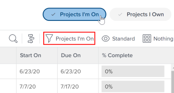

# Información general sobre el equipo del proyecto

<!-- Audited: 6/2025 -->

Un equipo de proyecto consta de usuarios que están asociados a un proyecto en cierta capacidad. Los usuarios enumerados en la sección Personas de un proyecto conforman el equipo del proyecto. Por ejemplo, los usuarios asignados para trabajar en el proyecto o el propietario del proyecto forman parte del equipo del proyecto.

Los siguientes usuarios de una plantilla de proyecto forman parte del futuro equipo de proyecto una vez creado el proyecto con la plantilla:

* Usuarios asignados para trabajar (tareas y problemas) en la plantilla.
* El propietario o patrocinador de la plantilla.

Los usuarios que forman parte del futuro equipo del proyecto en una plantilla se muestran en la sección Personas de la plantilla.

## Miembros del equipo del proyecto

Puede asignar usuarios a un equipo del proyecto manualmente o automáticamente. Para obtener más información, vea la sección Agregar usuarios a un equipo del proyecto en el artículo [Administrar el equipo del proyecto](../../../manage-work/projects/planning-a-project/manage-project-team.md).

Cuando agregue usuarios manualmente al equipo del proyecto, recibirán permisos de vista para el proyecto, así como para las tareas, problemas y documentos del proyecto.

## Notificaciones a los miembros del equipo del proyecto

Según las notificaciones de correo electrónico que habilite el administrador de Adobe Workfront, se notificarán a los usuarios de un equipo de proyecto las distintas acciones de un proyecto.

Para obtener más información, consulte los siguientes artículos:

* [Tipos de notificaciones de eventos](/help/quicksilver/administration-and-setup/manage-workfront/emails/event-notifications-available-in-wf.md)

* [Configurar notificaciones de los eventos para todos los usuarios del sistema](../../../administration-and-setup/manage-workfront/emails/configure-event-notifications-for-everyone-in-the-system.md)

>[!NOTE]
>
>Asegúrese de mantener actualizados los miembros del equipo del proyecto para evitar enviar notificaciones a los usuarios que no necesitan información sobre un proyecto.

## Aprobaciones basadas en funciones

Para utilizar aprobaciones basadas en funciones en un proyecto, los usuarios deben estar asignados al equipo del proyecto y tener la función de trabajo correcta asignada en su perfil de usuario.

Consulte los siguientes artículos para obtener información sobre cómo añadir un usuario al equipo del proyecto y cómo asignarle una función de trabajo:

* [Administrar el equipo del proyecto](../../../manage-work/projects/planning-a-project/manage-project-team.md)
* [Editar el perfil de un usuario](../../../administration-and-setup/add-users/create-and-manage-users/edit-a-users-profile.md)

Si no desea que el usuario esté en el equipo del proyecto para las aprobaciones basadas en roles, puede controlarlo en la configuración de aprobación. Para obtener más información, consulte [Configuración de la aprobación global](../../../administration-and-setup/customize-workfront/configure-approval-milestone-processes/establish-approval-settings.md).

## Filtro Proyectos en los que participo

Si un usuario aparece en la lista del área Personas de un proyecto, ese proyecto aparece cuando aplica el filtro Proyectos en los que participo en una lista de proyectos o un informe de proyecto.

Puede ver si el filtro Proyectos en los que participo está seleccionado en el encabezado del área Proyectos. Puede aplicarlo desde el panel Filtros o desde el encabezado.

>[!NOTE]
>
>Si usted es el creador de un proyecto, el proyecto permanece en la lista Proyectos en los que participo, incluso si su nombre no aparece en el área Personas del proyecto o si su nombre se ha eliminado de esa lista.
