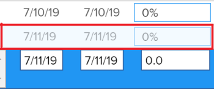

# Información general sobre los tipos de actualización de un proyecto

El tipo de actualización de un proyecto indica cómo calcula Adobe Workfront la escala de tiempo de un proyecto. Los cambios en el plan del proyecto pueden activar cambios en la escala de tiempo del proyecto. La escala de tiempo del proyecto debe recalcularse automática o manualmente para garantizar que esté actualizado con estos cambios.

Para obtener información sobre cómo recalcular la escala de tiempo del proyecto, consulte [Recalcular las escalas de tiempo del proyecto](../../../manage-work/projects/manage-projects/recalculate-project-timeline.md).

## Tipos de actualización de proyecto

Existen cuatro tipos de actualización para un proyecto, en función de cuándo desee que Workfront recalcule la escala de tiempo del proyecto. Elija un tipo de actualización de la lista siguiente.

Para obtener información sobre cómo actualizar el tipo de actualización del proyecto, consulte [Seleccionar el tipo de actualización del proyecto](../../../manage-work/projects/manage-projects/select-project-update-type.md).

>[!IMPORTANT]
>
>Si la cronología de un proyecto supera los 15 años, Workfront no calcula la cronología automáticamente o al cambiar. El tipo de actualización de un proyecto de más de 15 años siempre es manual.

* **Automático y al cambiar:** Esta es la configuración predeterminada. La cronología del proyecto se actualiza cada vez que se produce un cambio en el proyecto o en otro proyecto del que depende la cronología. La cronología del proyecto también se actualiza cada noche.\
  Esta es la configuración recomendada, ya que garantiza que la cronología del proyecto siempre esté actualizada.

  Al actualizar una tarea o el proyecto y activar un recálculo de la cronología, se muestran inmediatamente todas las fechas disponibles, lo que le permite continuar trabajando. En proyectos con más de 100 tareas, las fechas que requieren cálculos más largos se atenúan.

  

  Esto indica que el recálculo aún no ha finalizado y que las fechas están sujetas a cambios.

* **Solo cambio:** La escala de tiempo del proyecto se actualiza cada vez que se produce un cambio en el proyecto o en otro proyecto del que depende la escala de tiempo; no se producen actualizaciones programadas.\
  Es posible que desee seleccionar esta opción si le preocupa el rendimiento del sistema y si los cambios rara vez se producen en el proyecto o en otros proyectos de los que depende la escala de tiempo.

* **Solo automático:** La escala de tiempo del proyecto se actualiza cada noche; no se actualiza inmediatamente después de realizar los cambios.\
  Es posible que desee seleccionar esta opción si le preocupa el rendimiento del sistema y si se producen muchos cambios cada día en el proyecto o en otros proyectos de los que depende la cronología.

  >[!NOTE]
  >
  >Un proyecto no se recalcula automáticamente cada noche si se encuentra en estado de Planificación. Solo se recalcula al cambiar.

* **Solo manual:** La escala de tiempo del proyecto solo se actualiza cuando selecciona la opción **Volver a calcular escalas de tiempo**, tal como se describe en la sección &quot;Recalculación manual&quot; del artículo [Volver a calcular escalas de tiempo del proyecto](../../../manage-work/projects/manage-projects/recalculate-project-timeline.md).\
  Es posible que desee seleccionar esta opción si realiza muchos cambios en el proyecto al mismo tiempo y desea que el cálculo de la escala de tiempo se produzca después de realizar todos los cambios (en lugar de después de cada cambio individual).
