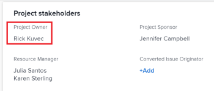
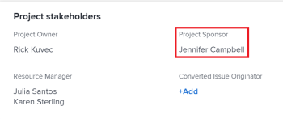

# Actualizar propietarios y patrocinadores de proyectos

<!--Audited: 07/2024-->

Al crear un proyecto en Adobe Workfront, se establece automáticamente como Propietario del proyecto. Puede actualizar este campo con otro usuario. También puede actualizar el campo Patrocinador de proyecto de un proyecto.

Para obtener información acerca de los propietarios y patrocinadores de proyectos, consulte [Información general sobre los propietarios y patrocinadores de proyectos](../../../manage-work/projects/planning-a-project/project-owners-and-sponsors.md).

>[!TIP]
>
>Puede identificar a un propietario y a un patrocinador para una plantilla. Cuando crea un proyecto a partir de esa plantilla, el propietario de la plantilla se convierte en el propietario del proyecto y el patrocinador de la plantilla se convierte en el patrocinador del proyecto.
>
>Si la plantilla no tiene un Propietario, el usuario que crea el proyecto a partir de la plantilla se convierte en el Propietario del proyecto.
>
>Para obtener información sobre cómo editar plantillas, consulte [Editar plantillas del proyecto](../../../manage-work/projects/create-and-manage-templates/edit-templates.md).

## Requisitos de acceso

+++ Expanda para ver los requisitos de acceso para la funcionalidad en este artículo. 

<table style="table-layout:auto"> 
 <col> 
 <col> 
 <tbody> 
  <tr> 
   <td role="rowheader">Paquete de Adobe Workfront</td> 
   <td> 
Cualquiera
 
  
 </td> 
  </tr> 
  <tr> 
   <td role="rowheader">Licencia de Adobe Workfront</td> 
   <td>
Estándar
 
   
Plan
 </td> 
  </tr> 
  <tr> 
   <td role="rowheader">Configuraciones de nivel de acceso</td> 
   <td> 
Acceso de edición a proyectos
 </td> 
  </tr> 
  <tr> 
   <td role="rowheader">Permisos de objeto</td> 
   <td> 
Edición de permisos en un proyecto
 </td> 
  </tr> 
 </tbody> 
</table>

Para obtener más información, consulte [Requisitos de acceso en la documentación de Workfront](/help/quicksilver/administration-and-setup/add-users/access-levels-and-object-permissions/access-level-requirements-in-documentation.md).

+++

<!--
Old:

<table style="table-layout:auto"> 
 <col> 
 <col> 
 <tbody> 
  <tr> 
   <td role="rowheader">Adobe Workfront plan</td> 
   <td> 
Any
 
  
 </td> 
  </tr> 
  <tr> 
   <td role="rowheader">Adobe Workfront license*</td> 
   <td>
New: Standard
 
   
Current: Plan 
 </td> 
  </tr> 
  <tr> 
   <td role="rowheader">Access level configurations*</td> 
   <td> 
Edit access to Projects
 </td> 
  </tr> 
  <tr> 
   <td role="rowheader">Object permissions</td> 
   <td> 
Edit permissions to a project
 </td> 
  </tr> 
 </tbody> 
</table>
-->

## Actualizar el propietario del proyecto de un proyecto

Cuando se añade un usuario como Propietario del proyecto de un proyecto, Workfront le otorga automáticamente permisos para ver el proyecto.

1. Vaya al proyecto que desee actualizar.
1. Haga clic en **Detalles del proyecto** en el panel de navegación izquierdo.
1. Haga clic en el icono **Editar**  en la esquina superior derecha del área de Detalles del proyecto y, a continuación, haga clic en **Información general**.

1. Especifique el nombre de un usuario para el campo **Propietario del Proyecto**.

   Solo los usuarios activos pueden especificarse como Propietarios del proyecto.

1. Haga clic en **Guardar cambios**.

   El Propietario del proyecto se actualiza en el encabezado del proyecto y en el área Detalles del proyecto.

   

## Actualizar el Patrocinador del Proyecto de un proyecto.

Cuando añada un usuario como patrocinador del proyecto de un proyecto, Workfront le otorga automáticamente permisos para ver el proyecto.

>[!TIP]
>
>Si el usuario que añadir como patrocinador del proyecto es administrador del sistema, no se añadirá a la lista de uso compartido del proyecto.

1. Vaya al proyecto que desee actualizar.
1. Haga clic en **Detalles del proyecto** en el panel de navegación izquierdo.
1. Haga clic en el icono **Editar**  en la esquina superior derecha del área de Detalles del proyecto y, a continuación, haga clic en **Información general**.

1. Especifique el nombre de un usuario para el campo **Patrocinador de proyecto**.

   Solo los usuarios activos pueden ser especificados como patrocinadores del proyecto.

1. Haga clic en **Guardar cambios**.

   El patrocinador del proyecto se actualiza en el área de Detalles del proyecto.

   
