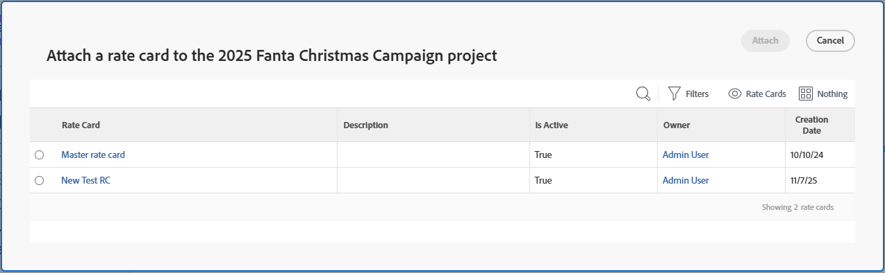

# Adjuntar una tarjeta de tarifas a un proyecto

Las tarjetas de tarifas almacenan varias tarifas de facturación por rol, según los atributos. Por ejemplo, podría tener una función de Designer con sede en París para la Agencia A, otra Designer con sede en París para la Agencia B y una tercera Designer con sede en Nueva York no asignada a una agencia, cada una con diferentes tarifas de facturación. Sin embargo, los atributos no son necesarios para las funciones del puesto en una tarjeta de tasas. Los atributos sirven como herramientas para establecer tasas más granulares. Una tarifa de facturación en una tarjeta de tarifas también puede ser efectiva por fecha, de manera que la tarifa comience y termine en fechas especificadas.

Al adjuntar una tarjeta de tarifas a un proyecto, se agregan al proyecto todas las funciones y sus tarifas de facturación asociadas.

>[!NOTE]
>
>Al adjuntar una tarjeta de tarifas, se anulan las tarifas de facturación de la tarjeta de tarifas existentes en el proyecto. Las anulaciones de tarifas de facturación que se agregaron directamente al proyecto no se eliminan.

Para obtener información sobre cómo crear tarjetas de tarifas, consulte [Administrar tarjetas de tarifas](/help/quicksilver/administration-and-setup/manage-enterprise-operations/manage-rate-cards.md).

Para obtener información general sobre cómo anular las tarifas de facturación de roles de trabajo para los proyectos y calcular los ingresos del proyecto, consulte [Información general sobre cómo anular las tarifas de facturación y calcular los ingresos en un proyecto](/help/quicksilver/manage-work/projects/project-finances/override-role-billing-rates-and-calculate-project-revenue.md).

## Requisitos de acceso

+++ Expanda para ver los requisitos de acceso para la funcionalidad en este artículo.

<table style="table-layout:auto"> 
 <col> 
 <col> 
 <tbody> 
  <tr> 
   <td>Paquete de Adobe Workfront</td> 
   <td>Workflow Ultimate</td> 
  </tr> 
  <tr> 
   <td>Licencia de Adobe Workfront</td> 
   <td>Estándar</td> 
  </tr> 
  <tr> 
   <td>Configuraciones de nivel de acceso</td> 
   <td>Editar acceso a Proyectos, Datos financieros y Tarjetas de tarifas</td> 
  </tr> 
  <tr> 
   <td>Permisos de objeto</td> 
   <td>Administre permisos al proyecto con permisos para Editar tarifas de facturación</td> 
  </tr> 
 </tbody> 
</table>

Para obtener más información, consulte [Requisitos de acceso en la documentación de Workfront](/help/quicksilver/administration-and-setup/add-users/access-levels-and-object-permissions/access-level-requirements-in-documentation.md).

+++

## Adjuntar una tarjeta de tarifas a un proyecto

1. Vaya al proyecto.
1. Haga clic en **Tarifas** en el panel izquierdo y luego seleccione **Facturación**.
1. Haga clic en **Añadir tarifa de facturación > Adjuntar una tarjeta de tarifas**.

   Se abre el cuadro **Adjuntar una tarjeta de tarifa**. Puede buscar una tarjeta de tarifa en la lista.

   

   >[!NOTE]
   >
   >El Grupo y la Empresa de las tarjetas de tarifas se utilizan como filtros en esta lista. Como los proyectos también incluyen campos de Grupo y Compañía, Workfront utiliza estos valores para reducir la lista de tarjetas de tarifa disponibles a las relevantes para el contexto del proyecto y no a todas las tarjetas de tarifa en el sistema.
   >
   >No es necesario que la coincidencia sea exacta. Las tarjetas de tarifas con valores de Grupo y/o Compañía en blanco pueden seguir apareciendo según la configuración de Grupo/Compañía del proyecto. Por ejemplo, si un proyecto tiene seleccionado un Grupo pero la Empresa está en blanco, puede ver tarjetas de tarifa asociadas con ese Grupo incluso si la Empresa de la tarjeta de tarifa es diferente o está en blanco.

1. Seleccione la tarjeta de tarifas que se añadirá al proyecto y haga clic en **Adjuntar**.

   La tarjeta de tarifas y todas las tarifas de su función se añaden a la lista de tarifas de facturación.

   

## Quitar una tarjeta de tarifa de un proyecto

Al eliminar una tarjeta de tarifas de un proyecto, se eliminan todas sus tarifas de funciones. No puede eliminar una tarifa individual del proyecto que provenga de una tarjeta de tarifas.

Las anulaciones de tarifas de facturación para usuarios o roles de trabajo que se agregaron directamente al proyecto se pueden eliminar sin eliminar toda la tarjeta de tarifas.

1. Vaya al proyecto.
1. Haga clic en **Tarifas** en el panel izquierdo y luego seleccione **Facturación**.
1. Haga clic en el icono **Quitar** .
1. Haz clic en **Confirmar** en el mensaje de confirmación para eliminar la tarjeta de tarifas.

