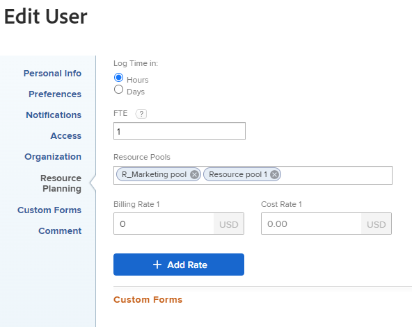

# Resumen de facturación e ingresos

<!-- Audited: 1/2024 -->

{{highlighted-preview}}

Como jefe de proyecto, puede utilizar las tarifas de facturación para capturar los ingresos de sus proyectos.

Este artículo describe el seguimiento de los ingresos de los proyectos. Los ingresos se calculan de forma diferente en el Informe de utilización. Para obtener información sobre los cálculos de ingresos en el Informe de utilización, consulte [Ver información de utilización de recursos](../../../resource-mgmt/resource-utilization/view-utilization-information.md).

## Resumen de tarifas de facturación

Tenga en cuenta lo siguiente al trabajar con tarifas de facturación:

* Necesita una licencia estándar o de planificación con acceso de edición de datos financieros para gestionar las tarifas de facturación.\
  Para obtener más información sobre la concesión de acceso a datos financieros, consulte [Concesión de acceso a los datos financieros](../../../administration-and-setup/add-users/configure-and-grant-access/grant-access-financial.md).

* Las tarifas de facturación son cantidades de ingresos por unidad de trabajo asociada con roles de trabajo o usuarios.

  Multiplicar las tasas por las horas invertidas en el trabajo genera ingresos para sus proyectos.

* Después de establecer las tarifas de facturación, puede rastrear los ingresos creando registros de facturación para registrar lo que se ha facturado y lo que no se ha facturado.

  >[!TIP]
  >
  >Cuando marca un registro de facturación como Facturado, nunca se puede editar. Esto es importante cuando las tarifas varían y desea bloquear la información de ingresos y gastos en el proyecto. Añadirlo a un registro de facturación y marcarlo como Facturado impide que se actualice cuando se actualizan las tarifas en su sistema.

  Para obtener más información sobre la creación de registros de facturación, consulte el artículo [Crear registros de facturación](../../../manage-work/projects/project-finances/create-billing-records.md).

* Puede crear tarifas de facturación para usuarios, roles o puede tener una tarifa de facturación única para un proyecto o tarea.

>[!IMPORTANT]
>
>Las tarifas que calculan los ingresos pertenecen al usuario que registra la hora o a sus roles.

* [Tarifas de facturación del usuario](#user-billing-rates)
* [Tarifas de facturación del rol](#job-role-billing-rates)
* [Tarifas de facturación fijas para proyectos o tareas](#fixed-billing-rates-for-projects-or-tasks)
* [Anular tarifas de facturación](#override-billing-rates)

### Tarifas de facturación del usuario {#user-billing-rates}

Como administrador de usuarios, cuando crea un usuario, puede asociarlo a tarifas de facturación con fecha en vigor especificando valores para los campos Facturación por hora y las fechas de las tarifas.

Para obtener más información sobre la creación de usuarios, consulte el artículo [Adición de usuarios](../../../administration-and-setup/add-users/create-and-manage-users/add-users.md).

### Tarifas de facturación del rol {#job-role-billing-rates}

Como administrador de Adobe Workfront, al crear un rol, puede asociarlo a tarifas de facturación con fecha en vigor especificando valores para los campos Facturación por hora y las fechas de las tarifas.

Puede definir el valor de una tasa de facturación de rol mediante la Moneda base del sistema Workfront o utilizando otra moneda personalizada.

Para obtener más información sobre la creación de funciones y la anulación de su moneda, consulte el artículo [Crear y administrar roles](../../../administration-and-setup/set-up-workfront/organizational-setup/create-manage-job-roles.md).

### Tarifas de facturación fijas para proyectos o tareas {#fixed-billing-rates-for-projects-or-tasks}

Además de las tarifas por hora de usuario y rol, también puede tener las siguientes tarifas de facturación fijas:

* Importe fijo para tipo de ingresos fijos por hora
* Importe fijo para tipo de ingresos de ingresos fijos

Para obtener más información sobre cómo se utilizan las tarifas de facturación fijas para calcular los ingresos, consulte [Visión General de Tipos de Ingresos de Tareas](#overview-of-task-revenue-types).

### Anular tarifas de facturación {#override-billing-rates}

>[!IMPORTANT]
>
>Puede anular las tarifas de facturación asociadas con los roles del puesto. No puede anular las tarifas de facturación del usuario ni las tarifas fijas.

Puede anular las tarifas de facturación de funciones para:

* Una compañía específica

  Para obtener más información sobre la creación de tarifas de facturación de funciones específicas de una compañía, consulte [Crear y editar compañías](../../../administration-and-setup/set-up-workfront/organizational-setup/create-and-edit-companies.md).

* Un proyecto específico

  Para obtener más información sobre la creación de tarifas de facturación de funciones específicas de un proyecto, consulte el artículo [Resumen de anulación de Tarifas de facturación de rol y cálculo de ingresos en un proyecto](../../../manage-work/projects/project-finances/override-role-billing-rates-and-calculate-project-revenue.md).

## Seguimiento de importes de ingresos

Workfront puede rastrear automáticamente los ingresos planificados cuando se crean tareas en función de las horas planificadas de las tareas.

También puede rastrear automáticamente los ingresos reales cuando se registran horas reales en las tareas, problemas y en el proyecto.

En la tabla siguiente se muestran los tipos de ingresos asociados a tareas, problemas y proyectos.

<table style="table-layout:auto"> 
 <col> 
 <col> 
 <tbody> 
  <tr> 
   <td role="rowheader">Ingresos planificados</td> 
   <td> 
Para las tareas, estos son los ingresos asociados con las horas planificadas de las tareas. Las horas planificadas de todas las tareas se acumulan en las horas planificadas del proyecto para contribuir al cálculo de las horas planificadas para el proyecto. 
 
Para obtener más información sobre las horas planificadas en Workfront, consulte <a href="../../../manage-work/tasks/task-information/planned-hours.md" class="MCXref xref">Resumen de horas planificadas</a>. 
 <ul><li>
Workfront calcula los ingresos planificados para las tareas mediante esta fórmula:

   
<code>Task Planned Revenue = Planned Hours * Billing hourly rate</code>
 
<strong>NOTA</strong>  La tarifa por hora de facturación de la fórmula tiene en cuenta cualquier cambio de tarifa con fecha en vigor.
 </li><li>
Workfront calcula los ingresos planificados para los proyectos mediante la siguiente fórmula:
 
<code>Project Planned Revenue = SUM (All tasks Planned Revenue) + Fixed Revenue</code>

   
<b>NOTA</b>

Los ingresos planificados del proyecto que se muestran en el área de Detalles del proyecto y en los informes del proyecto difieren de los ingresos planificados que se muestran en el informe Utilización. 
</li></ul> 
Los ingresos planificados en el área de Detalles del proyecto reflejan los ingresos de la tarea asociados con las horas planificadas de la tarea, así como los ingresos fijos del proyecto. Los ingresos planificados en el informe Utilización muestran los ingresos planificados asociados únicamente a las horas planificadas de las asignaciones de tareas del proyecto. 
 
     
Example: </b>"> 
      
Si el proyecto tiene 1 tarea con 10 horas, asignada a un consultor con una tasa horaria de 20 dólares y el proyecto tiene 100 dólares de ingresos fijos, el informe Utilización muestra 200 dólares para los ingresos planificados (los ingresos planificados asociados con las horas de la tarea). La sección Detalles del proyecto muestra 300 $ (los ingresos planificados de la tarea y los ingresos fijos del proyecto). 
 
     
 
 
Los ingresos planificados para la tarea se calculan usando las tarifas por hora de facturación de los usuarios o los roles asignados a las tareas. El tipo de ingresos de las tareas influye en la tasa (usuario o función) que se utiliza para calcular los ingresos planificados. Para obtener más información, consulte las secciones siguientes de este artículo:
 
    <ul> 
     <li> 
<a href="#overview-of-task-revenue-types" class="MCXref xref">Visión General de Tipos de Ingresos de Tareas</a> 
 </li> 
     <li> 
<a href="#revenue-calculations-for-tasks-based-on-user-and-role-assignments" class="MCXref xref">Cálculos de ingresos para tareas basados en asignaciones de usuarios y roles</a> 
 </li> 
    </ul> 
Para obtener información sobre los cálculos de ingresos planificados en el informe Utilización, consulte <a href="../../../resource-mgmt/resource-utilization/view-utilization-information.md" class="MCXref xref">Ver información de utilización de recursos</a>. 
 </td> 
  </tr> 
  <tr> 
   <td role="rowheader">Ingresos reales*</td> 
   <td> 
Ingresos asociados con las horas reales de las tareas, problemas y proyectos. 
 
Por lo general, Workfront calcula los ingresos reales mediante esta fórmula:
 
<code>Actual Revenue = Actual Hours * Billing rate</code> 
 
<strong>NOTA</strong>  La tarifa por hora de facturación de la fórmula tiene en cuenta cualquier cambio de tarifa con fecha en vigor.
 
Para obtener información sobre los cálculos de ingresos reales en el informe Utilización, consulte <a href="../../../resource-mgmt/resource-utilization/view-utilization-information.md" class="MCXref xref">Ver información de utilización de recursos</a>. 
 
<b>SUGERENCIA</b>

No puede ver los ingresos reales en el nivel de problema, pero los ingresos asociados con las horas reales en los problemas contribuyen a los ingresos reales del proyecto. 
 </td>
</tr> 
 </tbody> 
</table>

*Para las horas reales, las tarifas del usuario siempre hacen referencia al usuario que registra las horas o a las tarifas de sus roles. Para obtener información sobre cuándo Workfront utiliza las tarifas del usuario y cuándo utiliza las tarifas de sus roles, consulte la [Cálculos de ingresos](#revenue-calculations) de este artículo.

<!--Note from the table for Planned Revenue line: 
     
(the note below is duplicated in this article: /Content/Resource Mgmt/Resource utilization/view-utilization-information.htm and in the glossary)

    -->

Por ejemplo, si una tarea con tipo de ingresos por hora de usuario está planificada para tardar dos horas y el usuario asignado tiene una tasa por hora de 30 $ por hora, los ingresos planificados de la tarea son 60 $. Cuando finaliza la tarea, si el usuario registra solo 1,5 horas como el tiempo real empleado para finalizar la tarea, la cantidad de ingresos reales es de 45 $. Si otro usuario que no está asignado a la tarea registra el tiempo, los ingresos reales se calculan en función de las tarifas de facturación de ese usuario.

Puede registrar ingresos de las siguientes maneras:

* Al definir el Tipo de ingresos de sus tareas y asociar los usuarios o roles asignados a los elementos de trabajo con las tarifas de facturación. Calcula los ingresos según la cantidad de horas planificadas o reales de los elementos de trabajo. Puede establecer un límite en la cantidad máxima que se cobra por las tarifas por hora, o no.\
  Para obtener más información sobre cómo especificar el tipo de ingresos de una tarea, consulte el artículo [Editar tareas](../../../manage-work/tasks/manage-tasks/edit-tasks.md).

* Al facturar una tarifa fija de ingresos para tareas o proyectos.\
  Si tiene tareas con ingresos fijos, la cantidad de ingresos fijos se agregará como los ingresos planificados de una tarea o un proyecto, y los ingresos planificados de una tarea estarán disponibles para agregarse a un registro de facturación como ingresos fijos.
* Al establecer una tarifa de ingresos fijos de facturación plana para un proyecto y, a continuación, establecer tarifas por hora para las tareas dentro del proyecto. Workfront agrega las tarifas por hora para las tareas a la tarifa plana del proyecto.\
  Por ejemplo, un mecánico que utilice Workfront podría introducir un coste de piezas como ingresos fijos para el proyecto y, a continuación, facturar por hora el tiempo empleado en reparar un coche. Los ingresos fijos en proyectos o tareas se obtienen al finalizar.

También puede marcar sus tareas como &quot;No facturables&quot;, en cuyo caso no hay ingresos planificados o reales asociados a ellas.

## Visión General de Tipos de Ingresos de Tareas {#overview-of-task-revenue-types}

De forma predeterminada, el tipo de ingresos de todas las tareas nuevas se establece de acuerdo con las preferencias de tareas y problemas especificadas por el administrador de Workfront o del grupo.\
Para obtener más información sobre la definición de las preferencias de tareas y problemas de la instancia de Workfront, consulte el artículo [Configurar las preferencias de tareas y problemas de todo el sistema](../../../administration-and-setup/set-up-workfront/configure-system-defaults/set-task-issue-preferences.md).

El propietario del proyecto puede modificar el tipo de ingresos de las tareas y los ingresos fijos de los proyectos.\
Para obtener más información sobre cómo especificar los ingresos fijos de un proyecto, consulte el artículo [Editar proyectos](../../../manage-work/projects/manage-projects/edit-projects.md).\
Para obtener más información sobre cómo especificar el tipo de ingresos de una tarea, consulte el artículo [Editar tareas](../../../manage-work/tasks/manage-tasks/edit-tasks.md).

Puede aplicar los siguientes tipos de ingresos a sus tareas o proyectos:

<table border="1" cellspacing="15"> 
 <col> 
 <col> 
 <thead> 
  <tr> 
   <th> 
<strong>Tipo de ingresos</strong> 
 </th> 
   <th> 
<strong>Descripción</strong> 
 </th> 
  </tr> 
 </thead> 
 <tbody> 
  <tr> 
   <td> 
Ingresos fijos
 </td> 
   <td> 
Este tipo se puede utilizar con proyectos y tareas. 
 
Al adjuntar una plantilla a un proyecto, los ingresos fijos de la plantilla se añaden a los ingresos fijos del proyecto. Para obtener más información, consulte <a href="../../../manage-work/projects/create-and-manage-templates/attach-template-to-project-overview.md" class="MCXref xref">Información general sobre cómo adjuntar una plantilla a un proyecto</a>. 
 
Para las tareas, independientemente de las asignaciones de tareas, los ingresos de la tarea siempre se calculan utilizando el importe fijo especificado en la tarea. 
 
Los ingresos fijos de las tareas secundarias se acumulan en los ingresos de la tarea principal y, a continuación, en los ingresos del proyecto. Si se define un importe fijo en la tarea principal o en el proyecto, el importe se añadirá a los ingresos planificados resumidos a partir de cualquier tarea secundaria.
 
La cantidad de ingresos fijos en las tareas se puede incluir en un Registro de facturación del proyecto.
 </td> 
  </tr> 
  <tr> 
   <td> 
Usuario por hora
 </td> 
   <td> 
Este tipo solo se puede utilizar para tareas. 
 
La tarifa de facturación que establezca para un usuario específico multiplicada por el número de horas planificadas para esa tarea se convierte en la cantidad de ingresos planificados de la tarea. La tasa de facturación que establezca para un usuario específico multiplicada por el número de horas que el usuario registra en la tarea es la cantidad de ingresos reales de la tarea.  Por ejemplo, cuando crea un usuario y establece 20 $ para su campo Facturación por hora, si el usuario envía 5 horas para una tarea en la plantilla de horas, el importe de facturación real de la tarea es 100 $.

   
Un perfil de usuario puede contener múltiples tarifas de facturación con fechas efectivas. Por ejemplo, la primera tarifa de facturación de usuario de 20 dólares finaliza el 30 de abril de 2023 y la segunda tarifa de facturación de usuario de 25 dólares comienza el 1 de mayo de 2023. Si el usuario envía 2 horas el 28 de abril y 3 horas el 2 de mayo para una tarea, el importe de facturación real de la tarea es de 40 $ + 75 $ = 115 $.

   
<b>SUGERENCIA</b>

Este es el tipo de ingresos predeterminado cuando crea una tarea.
 </td>
</tr> 
  <tr> 
   <td> 
Rol por hora
 </td> 
   <td> 
Este tipo solo se puede utilizar para tareas.
 
Este tipo es similar a Usuario por hora, pero utiliza tasas de rol en lugar de tasas de usuario.
 
<strong>NOTA</strong> Un rol también puede tener múltiples tarifas de facturación con fechas efectivas.
</td> 
  </tr> 
  <tr> 
   <td> 
Usuario por hora con tope
 </td> 
   <td> 
Este tipo solo se puede utilizar para tareas.
 
Las tareas se facturan por hora como en Usuario por hora, pero tienen un importe máximo que puede especificar.  Por ejemplo, si la tasa de facturación de un usuario es de 25 $, pero el importe del límite máximo de la tarea es de 20 $ y el usuario registra una hora, los ingresos reales de la tarea serán de 20 $. 
 </td> 
  </tr> 
  <tr> 
   <td> 
Rol por hora con tope
 </td> 
   <td> 
Este tipo solo se puede utilizar para tareas.
 
Este tipo es similar a Usuario por hora con tope, pero utiliza tasas de rol en lugar de tasas de usuario. 
 </td> 
  </tr> 
  <tr> 
   <td> 
Usuario por hora más fijos
 </td> 
   <td> 
Este tipo solo se puede utilizar para tareas. 
 
Las tareas se facturan por hora como en Usuario por hora, pero tienen una cantidad fija que puede añadir a la tasa de usuario. El importe fijo especificado en la tarea se puede incluir en los registros de facturación del proyecto. El importe fijo no se multiplica por las horas de la tarea. Solo lo hace la tarifa de facturación del usuario. 
 </td> 
  </tr> 
  <tr> 
   <td> 
Rol por hora más fijos
 </td> 
   <td> 
Este tipo solo se puede utilizar para tareas. 
 
Las tareas se facturan por hora como en el Rol por hora, pero tienen una cantidad fija adicional que puede agregar a la tasa de rol. El importe fijo especificado en la tarea se puede incluir en los registros de facturación del proyecto. El importe fijo no se multiplica por las horas de la tarea. Solo la tasa de facturación de la función de trabajo lo hace. 
 </td> 
  </tr> 
  <tr> 
   <td> 
Fijo por hora
 </td> 
   <td> 
Este tipo solo se puede utilizar para tareas.
 
El importe fijo o de límite que se establece para la tarea multiplicado por el número de horas ingresadas en la tarea (independientemente del usuario o sus roles) es el importe de facturación.
 </td> 
  </tr> 
  <tr> 
   <td> 
No facturable
 </td> 
   <td> 
Este tipo solo se puede utilizar para tareas.
 
Este tipo de ingresos no afecta a los ingresos. 
 
Si un objeto principal tiene esta configuración, las tareas secundarias con un tipo de facturación seguirán aplicándose normalmente.
 
Cuando un usuario sin acceso a datos financieros o un usuario sin permisos financieros en una plantilla crea un proyecto a partir de esa plantilla, este es el tipo de ingresos predeterminado para las tareas del proyecto.
 
Para obtener información sobre el acceso a los datos financieros, consulte el artículo <a href="../../../administration-and-setup/add-users/configure-and-grant-access/grant-access-financial.md" class="MCXref xref">Concesión de acceso a los datos financieros</a>. Para obtener información sobre los permisos financieros en objetos, consulte el artículo <a href="../../../workfront-basics/grant-and-request-access-to-objects/sharing-permissions-on-objects-overview.md" class="MCXref xref">Información general sobre los permisos de uso compartido en objetos</a>. Para obtener información sobre la creación de proyectos a partir de plantillas, consulte el artículo <a href="../../../manage-work/projects/create-projects/create-project-from-template.md" class="MCXref xref">Creación de un proyecto con una plantilla</a>. 
 </td> 
  </tr> 
 </tbody> 
</table>

## Visión General de Ingresos para Tareas Principales

Si cambia una tarea independiente con información de facturación en una tarea principal, la nueva tarea principal conserva toda la información de facturación que se le haya aplicado anteriormente, junto con las horas aplicadas anteriormente. Cualquier información de facturación proveniente de las horas registradas en las tareas secundarias se acumulará como Ingresos reales a la nueva tarea principal.

Los ingresos planificados de las tareas secundarias también se acumulan en la tarea principal.

## Resumen de ingresos por problemas

Los problemas no tienen importes de ingresos planificados o reales, pero pueden tener un costo real.

Si registra horas para un problema y utiliza un tipo de hora marcado como &quot;Contar como ingresos&quot;, Workfront calcula una cantidad de coste real según la tasa del usuario que inicia sesión en ese momento. Este número se agrega al costo real del proyecto. Las horas también se pueden incluir en un registro de facturación.

Para obtener más información sobre el seguimiento de costes, consulte el artículo [Seguimiento de costes](../../../manage-work/projects/project-finances/track-costs.md).

Para obtener más información sobre los tipos de horas, consulte el artículo [Administrar tipos de horas](../../../administration-and-setup/set-up-workfront/configure-timesheets-schedules/hour-types.md).

## Cálculos de ingresos

* [Cálculos de ingresos para tareas basados en asignaciones de usuarios y roles](#revenue-calculations-for-tasks-based-on-user-and-role-assignments)

### Cálculos de ingresos para tareas basados en asignaciones de usuarios y roles {#revenue-calculations-for-tasks-based-on-user-and-role-assignments}

Al calcular los ingresos de una tarea, tenga en cuenta lo siguiente:

* Si un usuario o un rol muestra una tasa de 0,00 $, Workfront la lee como una cantidad válida y multiplicará esta cantidad por el número de horas de la tarea para calcular los ingresos. Si no desea mostrar ingresos para sus tareas, asegúrese de que el campo de la tarifa de facturación de su usuario o función de trabajo esté vacío.
* Cuando se aplican tarifas de facturación de rol, Workfront utiliza la tasa de anulación en el nivel de proyecto, en lugar de la tasa de facturación para ese rol definida en el nivel de sistema cada vez que hay una tasa de anulación en el proyecto.
* En el caso de los ingresos reales, si el usuario o el rol tienen varias tarifas de facturación con fechas en vigor, los ingresos de la tarea son la suma de los ingresos de cada período de tiempo en el que el usuario ha registrado el tiempo. Los ingresos planificados se basan en las horas planificadas para los períodos de tiempo.
* En el caso de varias personas asignadas a una tarea, se aplicarán los escenarios descritos a continuación para cada persona asignada.

Existe una jerarquía cuya tasa se utiliza en los cálculos de ingresos según las asignaciones de tareas.

Si el administrador de Workfront ha activado la **Asignar roles a entradas de horas manualmente** Cuando se establece en el área Preferencias de horas y hojas de horas y el usuario registra el tiempo en el proyecto y selecciona una función diferente para asociarla a esta hora, los ingresos reales de la tarea o proyecto siempre se calculan en función de la función asociada con la entrada de horas. Para obtener información sobre cómo habilitar el registro del tiempo de un rol específico, consulte el artículo [Configurar preferencias de horas y hojas de horas](../../../administration-and-setup/set-up-workfront/configure-timesheets-schedules/timesheet-and-hour-preferences.md).

Existen los siguientes escenarios al calcular los ingresos de la tarea según el tipo de ingresos y la naturaleza de la asignación de la tarea:

* **El tipo de ingresos de la tarea es Usuario por hora**

  <table style="table-layout:auto"> 
   <col> 
   <col> 
   <col> 
   <col> 
   <tbody> 
    <tr> 
     <td role="rowheader">Tarifa de facturación por hora</td> 
     <td>Sin asignación</td> 
     <td>Asignación de usuarios</td> 
     <td>Asignación de rol</td> 
    </tr> 
    <tr> 
     <td role="rowheader">Tarifa de facturación por hora para ingresos planificados</td> 
     <td>0,00 USD</td> 
     <td> Si un usuario tiene una tasa de facturación en su perfil, esa tasa se utiliza para calcular los ingresos planificados. De lo contrario, se utiliza la tasa de facturación del sistema de su rol principal.  
<b>NOTA</b>  El usuario puede asignarse a la tarea con uno de sus roles de trabajo secundarios, pero la tasa del rol principal se utiliza aquí en su lugar.

Si la función del usuario ha cambiado durante la asignación, se aplican las tasas correctas cuando se vuelven a calcular las finanzas del proyecto.
</td> 
     <td>
Si se adjunta una tarjeta de tarifas al proyecto, los ingresos planificados se calculan en función del rol de la tarjeta de tarifas.
 
Las tarifas de facturación se pueden anular en el nivel de proyecto.
</td> 
    </tr> 
    <tr> 
     <td role="rowheader">Tarifa de facturación por hora para ingresos reales</td> 
     <td>Si el usuario que registra las horas tiene una tasa de facturación en su perfil, se utiliza esa tasa. 
      Cuando se registra el tiempo de un usuario o rol que tiene una asignación específica de la ubicación en las asignaciones avanzadas, se utiliza la tasa de la ubicación.
      De lo contrario, se utiliza la tasa de facturación de su rol principal. Si no hay ninguna tasa de facturación asociada con el usuario o su función principal, los ingresos reales son de 0,00 $.  
<b>NOTA</b>

  Solo se tienen en cuenta para el cálculo las tasas asociadas con el registro de horas por parte del usuario, incluso cuando se asigna otro usuario a la tarea.
</td>
  <td>Si el usuario que registra las horas tiene una tasa de facturación en su perfil, se utiliza esa tasa.  Cuando se registra el tiempo de un usuario o rol que tiene una asignación específica de la ubicación en las asignaciones avanzadas, se utiliza la tasa de la ubicación. De lo contrario, se utiliza la tasa de facturación de su rol principal. Si no hay ninguna tasa de facturación asociada con el usuario o su función principal, los ingresos reales son de 0,00 $.  
<b>NOTA</b>

  Solo se tienen en cuenta para el cálculo las tasas asociadas con el registro de horas por parte del usuario, incluso cuando se asigna otro usuario a la tarea.
</td>
  <td>Si el usuario que registra las horas tiene una tasa de facturación en su perfil, se utiliza esa tasa. De lo contrario, se utiliza la tasa de facturación de su rol principal. 
<b>NOTA</b>

  Si el usuario que registra el tiempo no tiene asociada una tasa de facturación y no tiene un rol o una tasa de facturación para su rol, se utiliza la tasa de la función asociada con la tarea. Si no hay ninguna tarifa de facturación para este rol, los ingresos son de 0,00 $
</td>
  </tr> 
   </tbody> 
  </table>

* **El tipo de ingresos de la tarea es Rol por hora**

  <table style="table-layout:auto"> 
   <col> 
   <col> 
   <col> 
   <col> 
   <tbody> 
    <tr> 
     <td role="rowheader">Tarifa de facturación por hora</td> 
     <td>Sin asignación</td> 
     <td>Asignación de usuarios</td> 
     <td>Asignación de rol</td> 
    </tr> 
    <tr> 
     <td role="rowheader">Tarifa de facturación por hora para ingresos planificados</td> 
     <td>0,00 USD</td> 
     <td>
Workfront observa la función que cumple el usuario en la tarea para calcular los ingresos planificados.  Si el usuario no está asociado con ningún rol en la tarea, los ingresos son de 0,00 $.
 
<strong>NOTA</strong> Si la función del usuario ha cambiado durante la asignación, se aplican las tasas correctas cuando se vuelven a calcular las finanzas del proyecto.
 </td> 
     <td>
Si se adjunta una tarjeta de tarifas al proyecto, los ingresos planificados se calculan en función del rol de la tarjeta de tarifas.
 
Las tarifas de facturación se pueden anular en el nivel de proyecto.
</td> 
    </tr> 
    <tr> 
     <td role="rowheader">Tarifa de facturación por hora para ingresos reales</td> 
     <td>Workfront utiliza la tasa de facturación de la función de trabajo principal del usuario que registra la hora.  Cuando se registra el tiempo de un usuario o rol que tiene una asignación específica de la ubicación en las asignaciones avanzadas, se utiliza la tasa de la ubicación.  Si el usuario que registra la hora no tiene ningún rol asociado, o si el rol principal no tiene tarifa de facturación, los ingresos reales son de 0,00 $. </td> 
     <td> Si el usuario que registra la hora está asignado a la tarea, la tasa de facturación de la función asociada con el usuario en la tarea se utiliza para calcular los ingresos reales.  Cuando se registra el tiempo de un usuario o rol que tiene una asignación específica de la ubicación en las asignaciones avanzadas, se utiliza la tasa de la ubicación.  De lo contrario, se utiliza la tasa de facturación de su rol principal. Si el usuario no tiene ningún rol principal o si su rol principal no tiene tarifa de facturación, los ingresos reales son de 0,00 $. </td> 
     <td>Si uno de los roles del usuario que registra el tiempo se asigna a la tarea, se utiliza esa tasa de rol. Si la función de trabajo asignada a la tarea no está asociada con el usuario que registra la hora, se utiliza la tasa de facturación de la función principal del usuario para calcular los ingresos reales. Si el usuario no tiene una función de trabajo o no hay ninguna tasa asociada a su función de trabajo principal, se utiliza la tasa de la función de trabajo asignada a la tarea. </td> 
    </tr> 
   </tbody> 
  </table>

<!--

Ideal table but does not come across Markdown

<table style="table-layout:auto">
<col>
<col>
<col>
<col>
<col>
<col>
<col>
<tbody>
<tr>
<td colspan="3">Revenue Type = User Hourly</td>
<td colspan="4">Revenue Type = Role Hourly</td>
</tr>
<tr>
<td> 
 
 </td>
<td> 
<strong>No Assignment</strong> 
 </td>
<td> 
<strong>User Assignment</strong> 
 </td>
<td> 
<strong>Job Role Assignment</strong> 
 </td>
<td> 
<strong>No Assignment</strong> 
 </td>
<td> 
<strong>User Assignment</strong> 
 </td>
<td> 
<strong>Job Role Assignment</strong> 
 </td>
</tr>
<tr>
<td> 
<strong>Billing per hour rate for Planned Revenue</strong> 
 </td>
<td> 
$0.00
 </td>
<td> 
 If a user has a billing rate in their profile, then that rate is used to calculate Planned Revenue. Otherwise, the system billing rate of their primary job role is used.  <note type="note">
The user can be assigned to the task with one of their secondary job roles, but the rate of the primary job role is used here instead.
</note>
 </td>
<td> 
 The system billing rate of the job role assigned to the task is used to calculate Planned Revenue. 
 </td>
<td> 
$0.00
 </td>
<td> 
Workfront looks at the job role that the user fulfills on the task to calculate the Planned Revenue.  If the user is not associated with any role on the task, the Revenue is $0.00. 
 </td>
<td> 
The billing rate of the job role assigned to the task is used to calculate Planned Revenue. 
 
 
 
 
 </td>
</tr>
<tr>
<td> 
<strong>Billing per hour rate for Actual Revenue</strong> 
 </td>
<td colspan="2"> 
If the user logging the hours has a billing rate in their profile, that rate is used.  Otherwise, the billing rate of their primary job role is used. If there is no billing rate associated with the user or their primary role, the Actual Revenue is $0.00.  <note type="note">
Only the rates associated with the user logging the time are taken into account for the calculation, even when another user is assigned to the task.
</note>
 </td>
<td> If the user logging the hours has a billing rate in their profile, that rate is used. Otherwise, the billing rate of their primary job role is used. <note type="note">
If the user logging time has no billing rate associated with them, and they do not have a job role or a billing rate for their job role, then the rate from the job role associated with the task is used. If there is no billing rate for this role, the revenue is $0.00
</note></td>
<td> 
Workfront uses the billing rate of the primary job role of the user logging the time.  If the user logging the time has no job role associated with them, or if the primary job role has no billing rate, the Actual Revenue is $0.00. 
 </td>
<td> 
 If the user logging the time is assigned to the task, the billing rate of the job role associated with the user on the task is used to calculate the Actual Revenue. Otherwise, the billing rate of their primary job role is used. If the user has no primary job role or if their primary job role has no billing rate, the Actual Revenue is $0.00. 
 </td>
<td> 
If one of the job roles of the user logging the time is assigned to the task, that job role rate is used. If the job role assigned to the task is not associated with the user logging the time, then the billing rate of the primary role of the user is used to calculate the Actual Revenue. If the user does not have a job role or there is no rate associated with their primary job role, then the rate of the job role assigned to the task is used. 
 </td>
</tr>
</tbody>
</table>

-->

### Cálculos de ingresos para proyectos

Puede realizar un seguimiento de los siguientes tipos de ingresos para proyectos:

* Los ingresos planificados para un proyecto se calculan mediante la siguiente fórmula:

  `Project Planned Revenue = SUM(Task Planned Revenue)+ Fixed Revenue`

  Para obtener información sobre cómo se calculan los ingresos planificados para la tarea, consulte la [Cálculos de ingresos para tareas basados en asignaciones de usuarios y roles](#revenue-calculations-for-tasks-based-on-user-and-role-assignments) de este artículo.

* Los ingresos reales de un proyecto se calculan mediante la fórmula siguiente:

  `Project Actual Revenue = SUM (Task Actual Revenue) + (Hours logged for the project x User Billing per Hour Rate) + SUM (Hours logged for the issues x User Billing per Hour rate)`

Para obtener información sobre cómo se calculan los ingresos reales de la tarea, consulte la [Cálculos de ingresos para tareas basados en asignaciones de usuarios y roles](#revenue-calculations-for-tasks-based-on-user-and-role-assignments) de este artículo.

Para los ingresos reales asociados con las horas registradas directamente en el proyecto o los problemas, Workfront utiliza la tarifa de facturación del usuario que registra el tiempo en el proyecto. Si el usuario no tiene ninguna tarifa de facturación asociada a su perfil, Workfront utiliza la tarifa de facturación de su rol principal. Si ambas tasas son cero, los ingresos reales asociados con las horas registradas en el proyecto o los problemas son cero.
