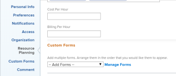

# Información general sobre facturación e ingresos

Como administrador de proyectos, puede utilizar las tasas de facturación para capturar los ingresos de sus proyectos.

En este artículo se describe el seguimiento de los ingresos de los proyectos. Los ingresos se calculan de forma diferente en el Informe de uso. Para obtener información sobre los cálculos de ingresos en el Informe de uso, consulte [Ver información de utilización de recursos](../../../resource-mgmt/resource-utilization/view-utilization-information.md).

## Información general sobre las tasas de facturación

Tenga en cuenta lo siguiente cuando trabaje con tasas de facturación:

* Necesita una licencia de plan con acceso de edición a datos financieros para administrar las tasas de facturación.\
   Para obtener más información sobre la concesión de acceso a datos financieros, consulte [Concesión de acceso a datos financieros](../../../administration-and-setup/add-users/configure-and-grant-access/grant-access-financial.md).

* Las tasas de facturación son cantidades de ingresos por unidad de trabajo asociadas con funciones de trabajo o usuarios.

   Al multiplicar las tasas por las horas dedicadas al trabajo, se generan ingresos para los proyectos.

* Después de establecer las tasas de facturación, puede realizar un seguimiento de los ingresos creando registros de facturación para registrar lo que se ha facturado y lo que no se ha facturado.

   >[!TIP]
   >
   >Cuando marca un registro de facturación como Facturado, nunca se puede editar. Esto es importante cuando las tasas varían y desea bloquear la información de ingresos y gastos del proyecto. Añadirlo a un registro de facturación y marcarlo como Facturado impide que se actualice cuando las tasas se actualicen en el sistema.

   Para obtener más información sobre la creación de registros de facturación, consulte el artículo [Crear registros de facturación](../../../manage-work/projects/project-finances/create-billing-records.md).

* Puede crear tasas de facturación para usuarios, funciones de trabajo o puede tener una tasa de facturación única para un proyecto o tarea.

>[!IMPORTANT]
>
>Las tasas que calculan los ingresos pertenecen al usuario que está registrando la hora o a sus funciones de trabajo.

* [Tasas de facturación del usuario](#user-billing-rates)
* [Tasas de Facturación de Función de Trabajo](#job-role-billing-rates)
* [Tasas de facturación fijas para proyectos o tareas](#fixed-billing-rates-for-projects-or-tasks)
* [Anular tasas de facturación](#override-billing-rates)

### Tasas de facturación del usuario {#user-billing-rates}

Como administrador de usuario, al crear un usuario, puede asociarlo con una tasa de facturación especificando un valor para el campo Facturación por hora en su perfil.\
Para obtener más información sobre la creación de usuarios, consulte el artículo [Agregar usuarios](../../../administration-and-setup/add-users/create-and-manage-users/add-users.md)



### Tasas de Facturación de Función de Trabajo {#job-role-billing-rates}

Como administrador de Adobe Workfront, al crear una función de trabajo, puede asociarla con una tasa de facturación especificando un valor para el campo Facturación/ Hora.

Puede definir el valor de una tasa de facturación de funciones de trabajo utilizando la moneda base del sistema Workfront o utilizando otra moneda personalizada.

Para obtener más información sobre la creación de funciones de trabajo y la anulación de su moneda, consulte el artículo [Crear y administrar funciones de trabajo](../../../administration-and-setup/set-up-workfront/organizational-setup/create-manage-job-roles.md)


### Tasas de facturación fijas para proyectos o tareas {#fixed-billing-rates-for-projects-or-tasks}

Además de las tasas horarias de usuarios y funciones de trabajo, también puede tener las siguientes tasas de facturación fijas:

* Importe fijo para el tipo de ingresos por hora fijo
* Importe fijo para el tipo de ingresos fijos

Para obtener más información sobre cómo se utilizan las tasas de facturación fijas para calcular los ingresos, consulte [Descripción general de los tipos de ingresos de la tarea](#overview-of-task-revenue-types).

### Anular tasas de facturación {#override-billing-rates}

>[!IMPORTANT]
>
>Puede anular las tasas de facturación asociadas a las funciones de trabajo. No puede anular las tasas de facturación del usuario o las tasas fijas.

Puede anular las tasas de facturación de funciones de trabajo para:

* Una empresa específica

   Para obtener más información sobre la creación de tasas de facturación de funciones de trabajo específicas de una empresa, consulte [Crear y editar empresas](../../../administration-and-setup/set-up-workfront/organizational-setup/create-and-edit-companies.md).

* Un proyecto específico

   Para obtener más información sobre la creación de tasas de facturación de funciones de trabajo específicas de un proyecto, consulte el artículo [Información general sobre la anulación de la función de trabajo Tasas de facturación y el cálculo de ingresos en un proyecto](../../../manage-work/projects/project-finances/override-role-billing-rates-and-calculate-project-revenue.md).

## Seguimiento de cantidades de ingresos

Workfront puede rastrear automáticamente los ingresos planeados cuando se crean tareas en función de las horas planificadas de las tareas.

También puede rastrear automáticamente los ingresos reales cuando las horas reales se registran en las tareas, problemas y en el proyecto.

La tabla siguiente muestra los tipos de ingresos asociados con tareas, problemas y proyectos.

<table style="table-layout:auto"> 
 <col> 
 <col> 
 <tbody> 
  <tr> 
   <td role="rowheader">Ingresos planificados</td> 
   <td> <p>Para las tareas, estos son los ingresos asociados con las horas planificadas de las tareas. Las horas previstas de todas las tareas se resumen en las horas previstas del proyecto para contribuir al cálculo de las horas previstas del proyecto. </p> <p>Para obtener más información sobre las horas programadas en Workfront, consulte <a href="../../../manage-work/tasks/task-information/planned-hours.md" class="MCXref xref">Información general sobre las horas planificadas</a>. </p> <p>Workfront calcula los ingresos previstos para tareas y proyectos mediante las siguientes fórmulas:</p> <p><code>Task Planned Revenue = Planned Hours * Billing hourly rate</code> </p> <p><code>Project Planned Revenue = SUM (All tasks Planned Revenue) + Fixed Revenue</code> </p> 
   <p><b>NOTA</b>

<p>Los ingresos planeados del proyecto que se muestran en el área Detalles del proyecto y en los informes del proyecto difieren de los ingresos planeados que se muestran en el informe Utilización. </p> <p>Los ingresos planeados del área Detalles del proyecto reflejan los ingresos de la tarea asociados con la tarea Horario planificado, así como los ingresos fijos del proyecto. En el Informe de uso, los ingresos planeados muestran los ingresos planeados asociados únicamente con las horas planificadas de las asignaciones de tareas del proyecto. </p> 
     <div class="example" data-mc-autonum="<b>Example: </b>"> 
      <p>Si el proyecto tiene una tarea con 10 horas, asignada a un consultor con una tasa de 20 dólares por hora y el proyecto tiene 100 dólares de ingresos fijos, el informe de utilización muestra 200 dólares para ingresos planificados (los ingresos previstos asociados con las horas de la tarea). La sección Detalles del proyecto muestra 300 $ (los ingresos previstos de la tarea y los ingresos fijos del proyecto). </p> 
     </div> </p> <p>Los ingresos planificados de tareas se calculan mediante la tasa de facturación por hora de los usuarios o las funciones de trabajo asignadas a las tareas. El tipo de ingresos de las tareas influye en la tasa (usuario o función) que se utiliza para calcular los ingresos planeados. Para obtener más información, consulte las secciones siguientes de este artículo:</p> 
    <ul> 
     <li> <p><a href="#overview-of-task-revenue-types" class="MCXref xref">Descripción general de los tipos de ingresos de la tarea</a> </p> </li> 
     <li> <p><a href="#revenue-calculations-for-tasks-based-on-user-and-role-assignments" class="MCXref xref">Cálculos de ingresos para tareas basadas en asignaciones de Usuario y Función</a> </p> </li> 
    </ul> <p>Para obtener información sobre los cálculos de Ingresos planificados en el informe Utilización, consulte <a href="../../../resource-mgmt/resource-utilization/view-utilization-information.md" class="MCXref xref">Ver información de utilización de recursos </a>. </p> </td> 
  </tr> 
  <tr> 
   <td role="rowheader">Ingresos reales*</td> 
   <td> <p>Asociado con las horas reales de tareas, problemas y proyectos. </p> <p>Por lo general, Workfront calcula los ingresos reales mediante esta fórmula:</p> <p><code>Actual Revenue = Actual Hours * Billing rate</code> </p> <p>Para obtener información sobre los cálculos de ingresos reales en el Informe de uso, consulte <a href="../../../resource-mgmt/resource-utilization/view-utilization-information.md" class="MCXref xref">Ver información de utilización de recursos </a>. </p> <p><b>SUGERENCIA</b>

No puede ver los ingresos reales en el nivel de problema, pero los ingresos asociados con las horas reales en los problemas contribuyen a los ingresos reales del proyecto. </p> </td>
</tr> 
 </tbody> 
</table>

*En el caso de las horas reales, las tasas del usuario siempre se refieren al usuario que registra las horas o a las tasas de sus funciones de trabajo. Para obtener información sobre cuándo Workfront utiliza las tasas de usuarios y cuándo utiliza las tasas de sus funciones de trabajo, consulte la [Cálculos de ingresos](#revenue-calculations) en este artículo.

<!--Note from the table for Planned Revenue line: 
     <p data-mc-conditions="QuicksilverOrClassic.Draft mode">(the note below is duplicated in this article: /Content/Resource Mgmt/Resource utilization/view-utilization-information.htm and in the glossary)</p>
    -->

Por ejemplo, si una tarea con Tipo de ingresos por hora de usuario está planificada para llevar a cabo dos horas y el usuario asignado tiene una tasa por hora de 30 dólares por hora, los ingresos previstos de la tarea serán de 60 dólares. Cuando finaliza la tarea, si el usuario registra solo 1,5 horas como el tiempo real empleado para finalizar la tarea, el importe de los ingresos reales es de 45 dólares. Si otro usuario que no está asignado a la tarea registra la hora, los ingresos reales se calculan en función de las tasas de facturación de ese usuario.

Puede registrar los ingresos de las siguientes maneras:

* Al definir el tipo de ingresos de las tareas y asociar usuarios o funciones asignados a elementos de trabajo con tasas de facturación. Esto calcula los ingresos según la cantidad de horas planificadas o reales en los elementos de trabajo. Puede establecer un límite en la cantidad máxima que se cobra por tasas por hora, o no.\
   Para obtener más información sobre cómo especificar el tipo de ingresos de una tarea, consulte el artículo [Editar tareas](../../../manage-work/tasks/manage-tasks/edit-tasks.md).

* Mediante la facturación de una tasa fija de ingresos fijos para tareas o proyectos.\
   Si tiene tareas con ingresos fijos, el importe de ingresos fijos se agregará como ingresos planeados de una tarea o un proyecto, y los ingresos planeados de una tarea estarán disponibles para agregarse a un registro de facturación como ingresos fijos.
* Estableciendo una tasa de ingresos fijos fijos para un proyecto y, a continuación, estableciendo tasas horarias para las tareas dentro del proyecto. Workfront agrega las tasas horarias para las tareas a la tasa fija del proyecto.\
   Por ejemplo, un mecánico que utilice Workfront podría introducir un coste para las piezas como ingresos fijos para el proyecto y, a continuación, facturar por hora el tiempo empleado en corregir un coche. Los ingresos fijos de proyectos o tareas se realizan al completarse.

También puede marcar las tareas como &quot;No facturable&quot;, en cuyo caso no hay ingresos planeados o reales asociados a ellas.

## Descripción general de los tipos de ingresos de la tarea {#overview-of-task-revenue-types}

De forma predeterminada, el tipo de ingresos de todas las tareas nuevas se establece según las preferencias de tarea y problema especificadas por el administrador de Workfront o del grupo.\
Para obtener más información sobre la definición de la tarea y las preferencias de problema para la instancia de Workfront, consulte el artículo [Configurar las preferencias de problemas y tareas de todo el sistema](../../../administration-and-setup/set-up-workfront/configure-system-defaults/set-task-issue-preferences.md).

El propietario del proyecto puede modificar el tipo de ingresos de las tareas y los ingresos fijos de los proyectos.\
Para obtener más información sobre cómo especificar los ingresos fijos de un proyecto, consulte el artículo [Editar proyectos](../../../manage-work/projects/manage-projects/edit-projects.md).\
Para obtener más información sobre cómo especificar el tipo de ingresos de una tarea, consulte el artículo [Editar tareas](../../../manage-work/tasks/manage-tasks/edit-tasks.md).

Puede aplicar los siguientes tipos de ingresos a sus tareas o proyectos:

<table border="1" cellspacing="15"> 
 <col> 
 <col> 
 <thead> 
  <tr> 
   <th> <p><strong>Tipo de ingresos</strong> </p> </th> 
   <th> <p><strong>Descripción</strong> </p> </th> 
  </tr> 
 </thead> 
 <tbody> 
  <tr> 
   <td> <p>Ingresos fijos</p> </td> 
   <td> <p>Este tipo se puede utilizar con proyectos y tareas. </p> <p>Al adjuntar una plantilla a un proyecto, los ingresos fijos de la plantilla se añaden a los ingresos fijos del proyecto. Para obtener más información, consulte <a href="../../../manage-work/projects/create-and-manage-templates/attach-template-to-project-overview.md" class="MCXref xref">Descripción general de cómo adjuntar una plantilla a un proyecto</a>. </p> <p>Para las tareas, independientemente de las asignaciones de tareas, los ingresos de la tarea siempre se calculan utilizando el importe fijo especificado en la tarea. </p> <p>Las tareas Ingresos fijos procedentes de elementos secundarios se resumen en los ingresos de la tarea principal y, a continuación, en los ingresos del proyecto. Si se define una cantidad fija en la tarea principal o en el proyecto, la cantidad se agrega a los ingresos planificados resumidos de cualquier tarea secundaria.</p> <p>La cantidad de ingresos fijos en las tareas se puede incluir en un registro de facturación del proyecto.</p> </td> 
  </tr> 
  <tr> 
   <td> <p>Usuario por hora</p> </td> 
   <td> <p>Este tipo solo se puede utilizar para tareas. </p> <p>La tasa de facturación definida para un usuario específico multiplicada por el número de horas planificadas para esa tarea se convierte en el importe de ingresos planificados de la tarea. La tasa de facturación definida para un usuario específico multiplicada por el número de horas que el usuario inicia sesión en la tarea es la cantidad de ingresos reales de la tarea. <br>Por ejemplo, cuando crea un usuario y configura 20 $ para su campo Facturación por hora , si el usuario envía 5 horas para una tarea en el parte de horas, el importe real de facturación de la tarea es 100 $.</p> <p><b>SUGERENCIA</b>

Este es el tipo de ingresos predeterminado al crear una tarea.</p> </td>
</tr> 
  <tr> 
   <td> <p>Rol por hora</p> </td> 
   <td> <p>Este tipo solo se puede utilizar para tareas.</p> <p>Este tipo es similar a Usuario por hora pero utiliza tasas de rol de trabajo en lugar de tasas de usuario.</p> </td> 
  </tr> 
  <tr> 
   <td> <p>Usuario por hora con tapa</p> </td> 
   <td> <p>Este tipo solo se puede utilizar para tareas.</p> <p>Las tareas se facturan por hora como en Usuario por hora, pero tienen un límite máximo que puede especificar. <br>Por ejemplo, si la tasa de facturación de un usuario es de 25 $, pero el importe máximo de la tarea es de 20 $ y el usuario registra una hora, los ingresos reales de la tarea son de 20 $. </p> </td> 
  </tr> 
  <tr> 
   <td> <p>Función por hora con límite</p> </td> 
   <td> <p>Este tipo solo se puede utilizar para tareas.</p> <p>Este tipo es similar a Usuario por hora con límite pero utiliza tasas de función de trabajo en lugar de tasas de usuario. </p> </td> 
  </tr> 
  <tr> 
   <td> <p>Usuario por hora más fijos</p> </td> 
   <td> <p>Este tipo solo se puede utilizar para tareas. </p> <p>Las tareas se facturan por hora como en la ficha Usuario por hora, pero tienen una cantidad fija que puede agregar a la tasa de usuario. El importe fijo especificado en la tarea se puede incluir en los registros de facturación del proyecto. La cantidad fija no se multiplica por las horas de la tarea. Solo la tasa de facturación del usuario lo hace. </p> </td> 
  </tr> 
  <tr> 
   <td> <p>Rol por hora más fijos</p> </td> 
   <td> <p>Este tipo solo se puede utilizar para tareas. </p> <p>Las tareas se facturan por hora como en Función por hora, pero tienen una cantidad fija adicional que puede agregar a la tasa de funciones. El importe fijo especificado en la tarea se puede incluir en los registros de facturación del proyecto. La cantidad fija no se multiplica por las horas de la tarea. Solo la tasa de facturación de la función de trabajo lo hace. </p> </td> 
  </tr> 
  <tr> 
   <td> <p>Fijo por hora</p> </td> 
   <td> <p>Este tipo solo se puede utilizar para tareas.</p> <p>El límite o la cantidad fija que ha establecido para la tarea multiplicado por el número de horas introducidas en la tarea (independientemente del usuario o sus funciones de trabajo) es la cantidad de facturación.</p> </td> 
  </tr> 
  <tr> 
   <td> <p>No facturable</p> </td> 
   <td> <p>Este tipo solo se puede utilizar para tareas.</p> <p>Este tipo de ingresos no afecta a los ingresos. </p> <p>Si un objeto principal tiene esta configuración, las tareas secundarias con un tipo de facturación se seguirán aplicando normalmente.</p> <p>Cuando un usuario sin acceso a datos financieros o un usuario sin permisos financieros en una plantilla crea un proyecto a partir de esa plantilla, este es el tipo de ingresos predeterminado para las tareas del proyecto.</p> <p>Para obtener información sobre el acceso a los datos financieros, consulte el artículo <a href="../../../administration-and-setup/add-users/configure-and-grant-access/grant-access-financial.md" class="MCXref xref">Concesión de acceso a datos financieros</a>.<br>Para obtener información sobre los permisos financieros en objetos, consulte el artículo <a href="../../../workfront-basics/grant-and-request-access-to-objects/sharing-permissions-on-objects-overview.md" class="MCXref xref">Información general sobre cómo compartir permisos en objetos</a>.<br>Para obtener información sobre la creación de proyectos a partir de plantillas, consulte el artículo <a href="../../../manage-work/projects/create-projects/create-project-from-template.md" class="MCXref xref">Creación de un proyecto mediante una plantilla</a>. </p> </td> 
  </tr> 
 </tbody> 
</table>

## Resumen de ingresos para tareas principales

Si se cambia una tarea independiente con información de facturación en una tarea principal, la nueva tarea principal conserva la información de facturación que se le haya aplicado anteriormente, junto con las horas aplicadas anteriormente. Cualquier información de facturación proveniente de horas registradas en las tareas secundarias se resumirá como Ingresos reales en la nueva tarea principal.

Los ingresos planeados de las tareas secundarias también se resumen en la tarea principal.

## Resumen de ingresos por problemas

Los problemas no tienen importes de ingresos planeados o reales, pero pueden tener costo real.

Si registra las horas de un problema y utiliza un tipo de hora marcado como &quot;Contar como ingresos&quot;, Workfront calcula una cantidad de costo real según la tasa del usuario que está iniciando sesión en el tiempo. Este número se agrega al costo real del proyecto. Las horas también se pueden incluir en un registro de facturación.

Para obtener más información sobre el seguimiento de costes, consulte el artículo [Seguimiento de costes](../../../manage-work/projects/project-finances/track-costs.md).

Para obtener más información sobre los tipos de hora, consulte el artículo [Administrar tipos de hora](../../../administration-and-setup/set-up-workfront/configure-timesheets-schedules/hour-types.md).

## Cálculos de ingresos

* [Cálculos de ingresos para tareas basadas en asignaciones de Usuario y Función](#revenue-calculations-for-tasks-based-on-user-and-role-assignments)

### Cálculos de ingresos para tareas basadas en asignaciones de Usuario y Función {#revenue-calculations-for-tasks-based-on-user-and-role-assignments}

Al calcular los ingresos de una tarea, tenga en cuenta lo siguiente:

* Si un usuario o una función de trabajo muestra una tasa de 0,00 $, Workfront lo lee como una cantidad válida y multiplica esta cantidad por el número de horas en la tarea para calcular los ingresos. Si no desea mostrar ningún ingreso para sus tareas, asegúrese de que el campo de la tasa de facturación del usuario o del rol de trabajo esté vacío.
* Cuando se aplican las tasas de facturación de funciones de trabajo, Workfront utiliza la tasa de anulación en el nivel de proyecto, en lugar de la tasa de facturación para esa función definida en el nivel del sistema cada vez que hay una tasa de anulación en el proyecto.
* En el caso de que haya varios cesionarios en las tareas, los escenarios descritos a continuación se aplican a cada cesionario.

Hay una jerarquía de la cual la tasa se utiliza en los cálculos de ingresos en función de las asignaciones de tareas.

Si el administrador de Workfront ha habilitado la variable **Asignar roles de trabajo a las entradas de hora manualmente** en el área Preferencias de hojas de horas y horas , y el usuario que inicia sesión en el proyecto selecciona una función diferente para asociarla a esta hora, los ingresos reales de la tarea o proyecto siempre calculan en función de la función asociada a la entrada de hora. Para obtener información sobre cómo habilitar el tiempo de registro para una función de trabajo específica, consulte el artículo [Preferencias de horario y hora](../../../administration-and-setup/set-up-workfront/configure-timesheets-schedules/timesheet-and-hour-preferences.md).

Los siguientes escenarios existen al calcular los ingresos de la tarea en función del tipo de ingresos y la naturaleza de la asignación de la tarea:

* **El tipo de ingresos de la tarea es Usuario cada hora**

   <table style="table-layout:auto"> 
   <col> 
   <col> 
   <col> 
   <col> 
   <tbody> 
    <tr> 
     <td role="rowheader">Tasa de facturación por hora</td> 
     <td>Sin asignación</td> 
     <td>Asignación de usuarios</td> 
     <td>Asignación de rol de trabajo</td> 
    </tr> 
    <tr> 
     <td role="rowheader">Tasa de facturación por hora para ingresos planificados</td> 
     <td>$0.00</td> 
     <td> Si un usuario tiene una tasa de facturación en su perfil, esa tasa se utiliza para calcular los ingresos planeados. De lo contrario, se utiliza la tasa de facturación del sistema de su función principal de trabajo. <br><p><b>NOTA</b>  El usuario puede asignarse a la tarea con una de sus funciones de trabajo secundarias, pero la tasa de la función de trabajo principal se utiliza aquí en su lugar.</p></td> 
     <td>La tasa de facturación del sistema de la función de trabajo asignada a la tarea se utiliza para calcular los ingresos planeados. </td> 
    </tr> 
    <tr> 
     <td role="rowheader">Tasa de facturación por hora para ingresos reales</td> 
     <td>Si el usuario que registra las horas tiene una tasa de facturación en su perfil, se utiliza esa tasa. <br>De lo contrario, se utiliza la tasa de facturación de su función de trabajo principal. Si no hay ninguna tasa de facturación asociada al usuario o a su función principal, los ingresos reales son 0,00 $. <br><p><b>NOTA</b>

   Para el cálculo solo se tienen en cuenta las tasas asociadas con el usuario que registra el tiempo, incluso cuando se asigna a la tarea otro usuario.</p></td>
   <td>Si el usuario que registra las horas tiene una tasa de facturación en su perfil, se utiliza esa tasa. <br>De lo contrario, se utiliza la tasa de facturación de su función de trabajo principal. Si no hay ninguna tasa de facturación asociada al usuario o a su función principal, los ingresos reales son 0,00 $. <br><p><b>NOTA</b>

   Para el cálculo solo se tienen en cuenta las tasas asociadas con el usuario que registra el tiempo, incluso cuando se asigna a la tarea otro usuario.</p></td>
   <td>Si el usuario que registra las horas tiene una tasa de facturación en su perfil, se utiliza esa tasa. De lo contrario, se utiliza la tasa de facturación de su función de trabajo principal.<br><p><b>NOTA</b>

   Si el tiempo de registro del usuario no tiene asociada ninguna tasa de facturación y no tiene una función de trabajo o una tasa de facturación para su función de trabajo, se utiliza la tasa de la función de trabajo asociada a la tarea. Si no hay tasa de facturación para esta función, los ingresos son de 0,00 $</p></td>
   </tr> 
   </tbody> 
  </table>

* **El tipo de ingresos de la tarea es Función por hora**

   <table style="table-layout:auto"> 
   <col> 
   <col> 
   <col> 
   <col> 
   <tbody> 
    <tr> 
     <td role="rowheader">Tasa de facturación por hora</td> 
     <td>Sin asignación</td> 
     <td>Asignación de usuarios</td> 
     <td>Asignación de rol de trabajo</td> 
    </tr> 
    <tr> 
     <td role="rowheader">Tasa de facturación por hora para ingresos planificados</td> 
     <td>$0.00</td> 
     <td>Workfront examina la función de trabajo que el usuario cumple en la tarea para calcular los ingresos planeados. <br>Si el usuario no está asociado a ninguna función de la tarea, los ingresos son 0,00 $. </td> 
     <td>La tasa de facturación de la función de trabajo asignada a la tarea se utiliza para calcular los ingresos planeados.</td> 
    </tr> 
    <tr> 
     <td role="rowheader">Tasa de facturación por hora para ingresos reales</td> 
     <td>Workfront utiliza la tasa de facturación de la función de trabajo principal del usuario que registra la hora. <br>Si el usuario que registra la hora no tiene ninguna función de trabajo asociada con ellos o si la función de trabajo principal no tiene tasa de facturación, los ingresos reales son 0,00 $. </td> 
     <td> Si el usuario que registra la hora se asigna a la tarea, la tasa de facturación de la función de trabajo asociada al usuario en la tarea se utiliza para calcular los ingresos reales. De lo contrario, se utiliza la tasa de facturación de su función de trabajo principal. Si el usuario no tiene una función de trabajo principal o si su función de trabajo principal no tiene tasa de facturación, los ingresos reales son 0,00 $. </td> 
     <td>Si una de las funciones de trabajo del usuario que registra el tiempo se asigna a la tarea, se utiliza esa tasa de función de trabajo. Si la función de trabajo asignada a la tarea no está asociada con el usuario que registra la hora, se utiliza la tasa de facturación de la función principal del usuario para calcular los ingresos reales. Si el usuario no tiene una función de trabajo o no hay ninguna tasa asociada a su función de trabajo principal, se utiliza la tasa de la función de trabajo asignada a la tarea. </td> 
    </tr> 
   </tbody> 
  </table>

<!--
<div data-mc-conditions="QuicksilverOrClassic.Draft mode">
<p>Ideal table but does not come across Markdown</p>
<table style="table-layout:auto">
<col>
<col>
<col>
<col>
<col>
<col>
<col>
<tbody>
<tr>
<td colspan="3">Revenue Type = User Hourly</td>
<td colspan="4">Revenue Type = Role Hourly</td>
</tr>
<tr>
<td> <p> </p> </td>
<td> <p><strong>No Assignment</strong> </p> </td>
<td> <p><strong>User Assignment</strong> </p> </td>
<td> <p><strong>Job Role Assignment</strong> </p> </td>
<td> <p><strong>No Assignment</strong> </p> </td>
<td> <p><strong>User Assignment</strong> </p> </td>
<td> <p><strong>Job Role Assignment</strong> </p> </td>
</tr>
<tr>
<td> <p><strong>Billing per hour rate for Planned Revenue</strong> </p> </td>
<td> <p>$0.00</p> </td>
<td> <p> If a user has a billing rate in their profile, then that rate is used to calculate Planned Revenue. Otherwise, the system billing rate of their primary job role is used. <br><note type="note">
The user can be assigned to the task with one of their secondary job roles, but the rate of the primary job role is used here instead.
</note></p> </td>
<td> <p> The system billing rate of the job role assigned to the task is used to calculate Planned Revenue. </p> </td>
<td> <p>$0.00</p> </td>
<td> <p>Workfront looks at the job role that the user fulfills on the task to calculate the Planned Revenue. <br>If the user is not associated with any role on the task, the Revenue is $0.00. </p> </td>
<td> <p>The billing rate of the job role assigned to the task is used to calculate Planned Revenue. </p> <p> </p> <p> </p> </td>
</tr>
<tr>
<td> <p><strong>Billing per hour rate for Actual Revenue</strong> </p> </td>
<td colspan="2"> <p>If the user logging the hours has a billing rate in their profile, that rate is used. <br>Otherwise, the billing rate of their primary job role is used. If there is no billing rate associated with the user or their primary role, the Actual Revenue is $0.00. <br><note type="note">
Only the rates associated with the user logging the time are taken into account for the calculation, even when another user is assigned to the task.
</note></p> </td>
<td> If the user logging the hours has a billing rate in their profile, that rate is used. Otherwise, the billing rate of their primary job role is used.<br><note type="note">
If the user logging time has no billing rate associated with them, and they do not have a job role or a billing rate for their job role, then the rate from the job role associated with the task is used. If there is no billing rate for this role, the revenue is $0.00
</note></td>
<td> <p>Workfront uses the billing rate of the primary job role of the user logging the time. <br>If the user logging the time has no job role associated with them, or if the primary job role has no billing rate, the Actual Revenue is $0.00. </p> </td>
<td> <p> If the user logging the time is assigned to the task, the billing rate of the job role associated with the user on the task is used to calculate the Actual Revenue. Otherwise, the billing rate of their primary job role is used. If the user has no primary job role or if their primary job role has no billing rate, the Actual Revenue is $0.00. </p> </td>
<td> <p>If one of the job roles of the user logging the time is assigned to the task, that job role rate is used. If the job role assigned to the task is not associated with the user logging the time, then the billing rate of the primary role of the user is used to calculate the Actual Revenue. If the user does not have a job role or there is no rate associated with their primary job role, then the rate of the job role assigned to the task is used. </p> </td>
</tr>
</tbody>
</table>
</div>
-->

### Cálculos de ingresos para proyectos

Puede realizar el seguimiento de los siguientes tipos de ingresos para proyectos:

* Los ingresos planeados para un proyecto se calculan mediante la fórmula siguiente:

   ```
   Project Planned Revenue = SUM(Task Planned Revenue)+ Fixed Revenue
   ```

   Para obtener información sobre cómo se calculan los ingresos planificados de la tarea, consulte la [Cálculos de ingresos para tareas basadas en asignaciones de Usuario y Función](#revenue-calculations-for-tasks-based-on-user-and-role-assignments) en este artículo.

* Los ingresos reales de un proyecto se calculan mediante la fórmula siguiente:

   ```
   Project Actual Revenue = SUM (Task Actual Revenue) + (Hours logged for the project x User Billing per Hour Rate) + SUM (Hours logged for the issues x User Billing per Hour rate)
   ```

Para obtener información sobre cómo se calculan los ingresos reales de la tarea, consulte la [Cálculos de ingresos para tareas basadas en asignaciones de Usuario y Función](#revenue-calculations-for-tasks-based-on-user-and-role-assignments) en este artículo.

Para los ingresos reales asociados con las horas registradas directamente en el proyecto o los problemas, Workfront utiliza la tasa de facturación del usuario que registra la hora en el proyecto. Si el usuario no tiene asociada ninguna tasa de facturación a su perfil, Workfront utiliza la tasa de facturación de su función de trabajo principal. Si ambas tasas son cero, los ingresos reales asociados con las horas registradas en el proyecto o los problemas son cero.
