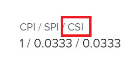

# Calcular el índice de rendimiento de programación de costes (CSI)

<!-- Audited: 6/2025 -->

<!--

(NOTE: Linked to the product. Do not change link.) 

-->

## Información general sobre el índice de rendimiento de programación de costes (CSI)

El índice de rendimiento de programación de costes (CSI) es un cálculo automático que combina el índice de rendimiento de costes (CPI) y el índice de rendimiento de programación (SPI) en una métrica general que equilibra el coste y la programación. Al multiplicar estos valores juntos, una sola métrica puede explicar una programación prolongada con un presupuesto más bajo o viceversa. Los gestores de proyectos pueden utilizarlo para determinar el estado general de los proyectos o las tareas cuando se sacrifica el coste para impulsar la programación a mitad del proyecto.

>[!TIP]
>
>Adobe Workfront calcula el CSI tanto para las tareas como para los proyectos, pero no para los problemas.

Puede beneficiarse de la información proporcionada por esta métrica solo si existen los siguientes escenarios en su organización:

* Los usuarios están registrando el tiempo del trabajo que completan. Esto calcula el CSI en función de las horas.
* Los usuarios o las funciones del puesto tienen asociadas tarifas de coste por hora. Esto calcula el CSI en función de los costes.

## Cómo calcula Workfront el índice de rendimiento de programación de costes (CSI)

Workfront calcula el índice de rendimiento de costes (CSI) de un proyecto o tarea con la fórmula siguiente:

`CSI = CPI x SPI`

Para obtener más información sobre el CPI, consulte el artículo [Calcular el índice de rendimiento de costes (CPI)](../../../manage-work/projects/project-finances/calculate-cpi.md).

Para obtener más información sobre el SPI, consulte el artículo [Calcular el índice de rendimiento de programación (SPI)](../../../manage-work/projects/project-finances/calculate-spi.md).

El CSI tiene los tres valores posibles siguientes:

* 1 = Sigue el plan general
* \>1 = Combinación de programación por debajo del presupuesto
* &lt;1 = Combinación de programación por encima del presupuesto

## Localizar el índice de rendimiento de programación de costes (CSI)

>[!CAUTION]
>
>Debe tener acceso a Ver datos financieros en el nivel de acceso y permisos para Ver el proyecto o la tarea para ver el valor CSI de un proyecto o tarea.

Puede localizar el CSI en las siguientes áreas de Workfront:

* Área Finanzas en la sección Detalles del proyecto.
* Área Finanzas en la sección Detalles de la tarea.
* Una vista de proyecto o de tarea.
* Informe de proyecto o tarea.
