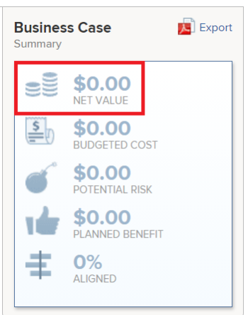

# Calcular valor neto

El valor neto de un proyecto es el valor total esperado del proyecto después de calcular su beneficio y eliminar los costes.

## Información general del valor neto del proyecto

Adobe Workfront calcula el valor neto de un proyecto mediante la fórmula siguiente:

```
Project Net Value = Planned Benefit - Budgeted Cost - Potential Risk Cost
```

Los campos siguientes pueden afectar al valor neto de un proyecto:

* **Beneficio planificado**: Se trata de una entrada manual especificada por el propietario del proyecto al completar el área de **Información del proyecto** del caso empresarial.\
  Para obtener más información sobre el beneficio planificado de un proyecto, consulte la sección [Información del proyecto](../../../manage-work/projects/define-a-business-case/areas-of-business-case.md#project-info) en el artículo [Información general sobre las áreas del caso comercial](../../../manage-work/projects/define-a-business-case/areas-of-business-case.md).

* **Coste presupuestado**: este es el coste total asociado con el proyecto que se estimó al iniciar el proyecto por primera vez.

  El **Coste presupuestado** usa el valor **Coste de mano de obra presupuestado** que se calcula en el área de Presupuestación de recursos del caso empresarial y tiene en cuenta las horas presupuestadas para sus funciones en el Planificador de recursos y la tasa de coste por hora de cada función.\
  El coste presupuestado afecta el **valor neto** del proyecto. Para obtener más información sobre cómo se calcula el coste presupuestado, consulte [Calcular coste presupuestado](../../../manage-work/projects/project-finances/budgeted-cost.md).

* **Coste potencial de riesgos**: es el coste asociado con cualquier riesgo del proyecto, tal como se define en el caso empresarial o en la ficha Riesgos del proyecto.\
  Para obtener más información acerca del cálculo del coste potencial de riesgos de un proyecto, consulte el artículo [Calcular el coste potencial de riesgos](../../../manage-work/projects/project-finances/potential-risk-cost.md).

   

## Busque el valor neto del proyecto

Puede encontrar el valor neto de un proyecto en las siguientes áreas de Workfront:

* En el área Resumen del caso empresarial del caso empresarial \
  Para obtener más información acerca del área Resumen de caso empresarial, consulte la sección “Explicación del resumen de caso empresarial” en el artículo [Crear un caso empresarial para un proyecto](../../../manage-work/projects/define-a-business-case/create-business-case.md) [Crear un caso empresarial para un proyecto](../../../manage-work/projects/define-a-business-case/create-business-case.md).

  

* En el Optimizador de portafolios si el proyecto está asociado a un portafolios

  >[!TIP]
  >
  >El total de todos los valores netos del proyecto es el valor neto del portafolios.

  Para obtener más información sobre el Optimizador de portafolios, consulte [Información general del Optimizador de portafolios](../../../manage-work/portfolios/portfolio-optimizer/portfolio-optimizer-overview.md).

* En el campo Valor neto del proyecto de las siguientes listas e informes:

   * Proyecto
   * Tarea
   * Problema
   * Proyecto (Datos financieros)

  Para obtener más información acerca de cómo crear un informe, consulte el artículo [Crear un informe personalizado](../../../reports-and-dashboards/reports/creating-and-managing-reports/create-custom-report.md).
