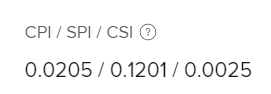

# Calcular el índice de rendimiento de programación (SPI)

<!--
<p data-mc-conditions="QuicksilverOrClassic.Draft mode">(NOTE: Linked to the product. Do not change link.)</p>
-->

El Índice de rendimiento del horario (SPI) describe la relación entre la programación planificada y la programación real. Adobe Workfront calcula el SPI en los niveles de proyecto y tarea. Los gestores de proyecto revisan esta métrica para identificar si las tareas o los proyectos están realizando un seguimiento con antelación o retraso respecto a la programación.

## Requisitos de acceso

+++ Expanda para ver los requisitos de acceso para la funcionalidad en este artículo.

<table style="table-layout:auto"> 
 <col> 
 <col> 
 <tbody> 
  <tr> 
   <td>Paquete de Adobe Workfront</td> 
   <td>Cualquiera</td> 
  </tr> 
  <tr> 
   <td>Licencia de Adobe Workfront</td> 
   <td>
   <p>Ligero o superior</p>
   <p>Revisión o superior</p></td>  
  </tr> 
  <tr> 
   <td>Configuraciones de nivel de acceso</td> 
   <td>Ver el acceso a proyectos y datos financieros</td> 
  </tr> 
  <tr> 
   <td>Permisos de objeto</td> 
   <td>Ver o permisos superiores del proyecto con permisos para Ver finanzas generales</td> 
  </tr> 
 </tbody> 
</table>

Para obtener más información, consulte [Requisitos de acceso en la documentación de Workfront](/help/quicksilver/administration-and-setup/add-users/access-levels-and-object-permissions/access-level-requirements-in-documentation.md).

+++

## Resumen del índice de rendimiento del horario (SPI)

* [Lo que muestra el valor SPI](#what-the-spi-value-shows)
* [Cálculo del SPI en Workfront](#how-workfront-calculates-spi)

### Lo que muestra el valor SPI {#what-the-spi-value-shows}

Los jefes de proyecto entienden que un valor de SPI de 1 significa que el proyecto está planificado o programado.  Los valores mayores que 1 indican que un proyecto va por delante de la programación y los valores menores que 1 significan que un proyecto está por detrás de la programación.  Cuanto más se aleje de 1, mayor será la desviación con respecto al plan.

| **Valor SPI** | **Indicación de &quot;según lo programado&quot;** |
|---|---|
| 1 | En plan o según lo programado |
| > 1 (mayor que 1) | Adelantado a lo programado |
| &lt; 1 (menos de 1) | Retrasado de programación |

{style="table-layout:auto"}

### Cálculo del SPI en Workfront  {#how-workfront-calculates-spi}

Workfront calcula el SPI mediante la fórmula siguiente:

```
SPI = (Total Planned Hours x % Complete) / Planned Hours Scheduled to Date*
```

*&#42;Si las horas planificadas están programadas para la fecha = 0, SPI = 1*.

El horario de horas planificado hasta la fecha se calcula en el minuto en que se realizan los cálculos. Muestra la cantidad de horas planificadas hasta la fecha actual. Se puede recalcular automáticamente cuando cambie los datos financieros para que sean precisos. No hay ningún campo en Workfront que indique este valor.

Por ejemplo, si tiene un proyecto con una tarea y esta tiene 10 horas planificadas y una duración de 10 días, el horario de horas planificadas hasta la fecha del quinto día es 5.

## Localizar SPI en un proyecto o tarea

1. Vaya al proyecto o tarea donde desee ver la SPI.
1. Dependiendo de si desea ver la SPI en un proyecto o una tarea, realice una de las siguientes acciones:

   1. Haga clic en **Detalles del proyecto** en el panel izquierdo y, a continuación, vea el área de **Finanzas**.

   1. Haga clic en **Detalles de la tarea** en el panel izquierdo y luego vea el área de **Finanzas**.

      

1. Busque el campo **CPI/ SPI/ CSI**.
